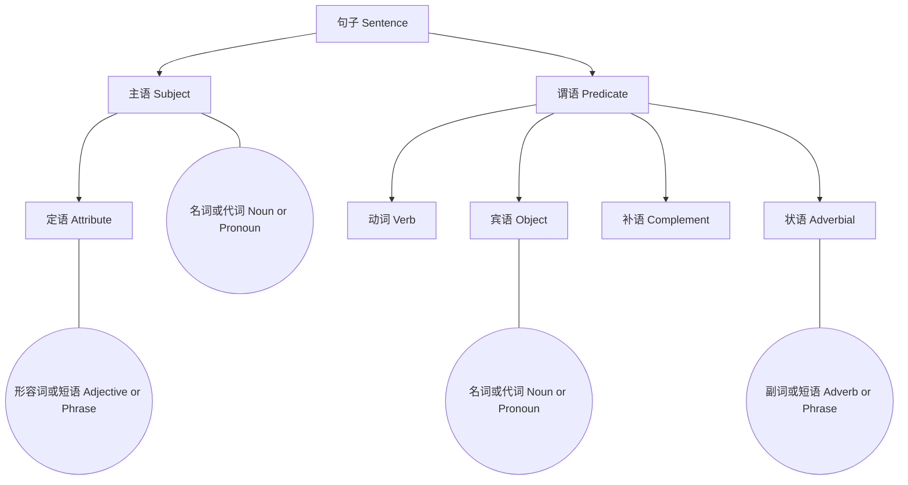
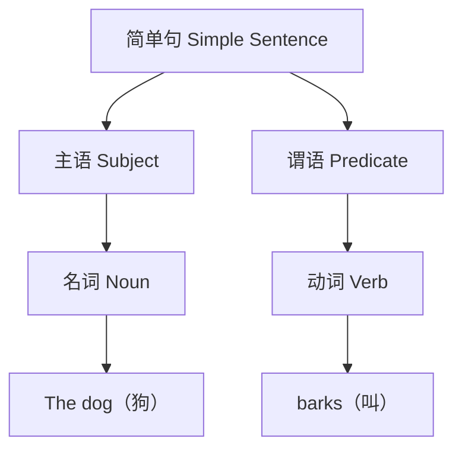
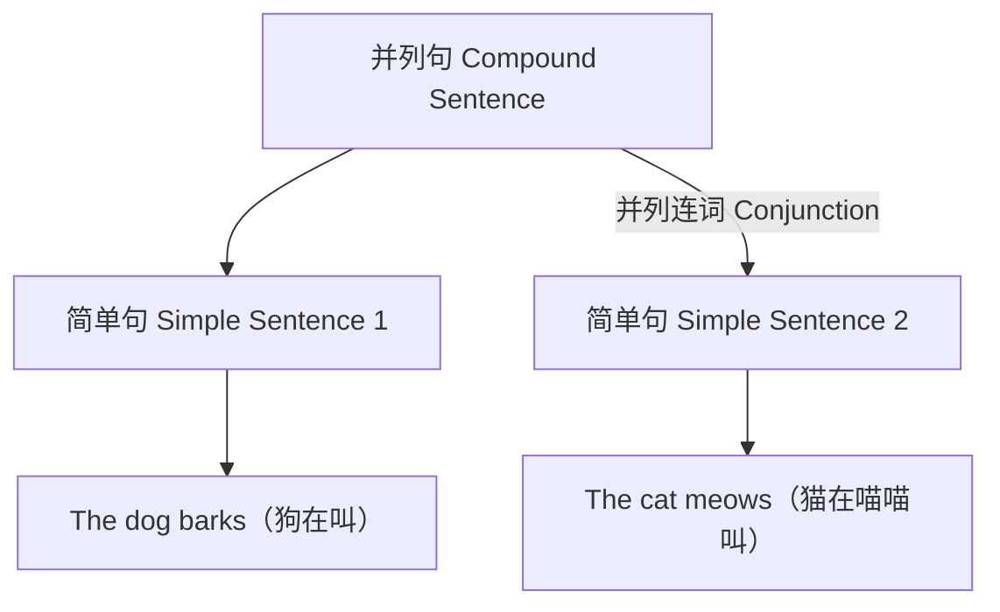
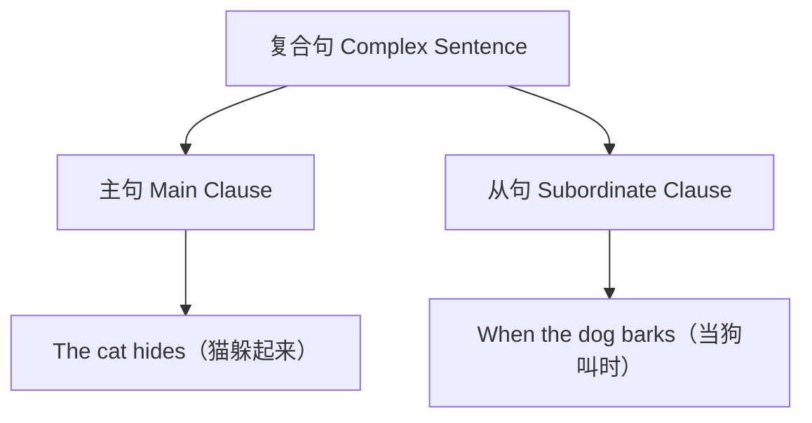
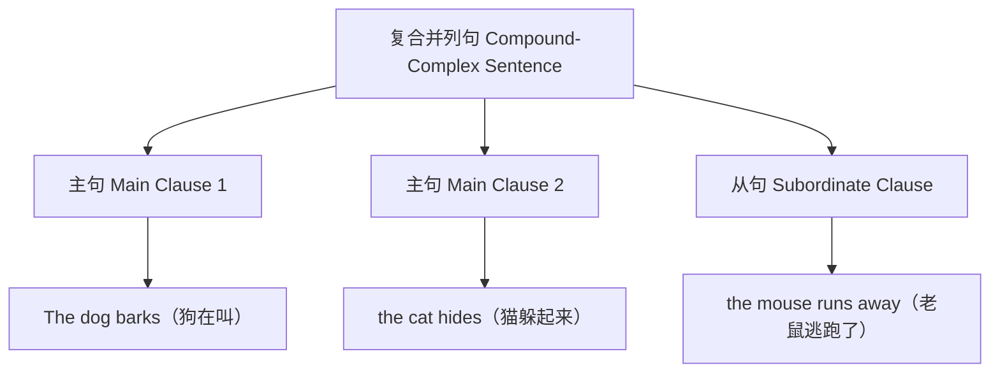
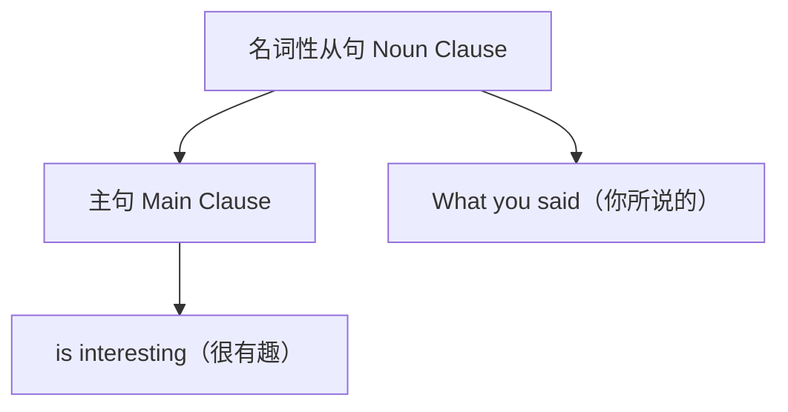
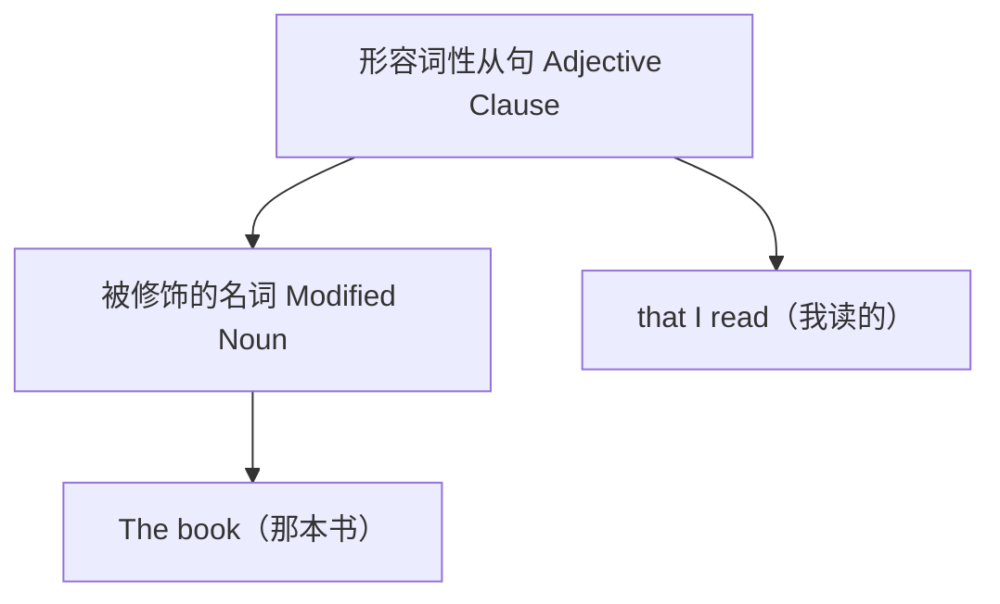
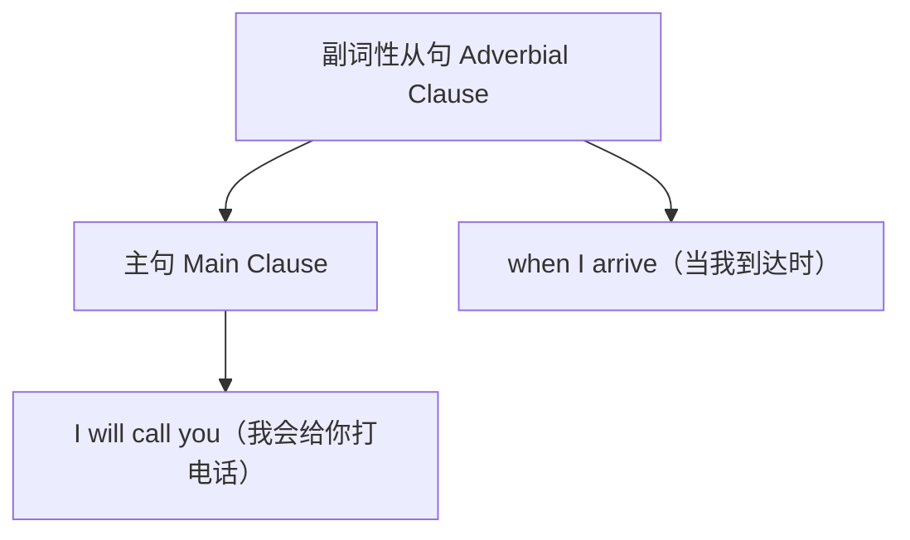

## 词性（Parts Of Speech）

| 词性 (Parts of Speech) | 简拼 (Abbreviation) | 定义 (Definition)                        | 功能 (Function)                                  | 例子 (Example)         |
| ---------------------- | ------------------- | ---------------------------------------- | ------------------------------------------------ | ---------------------- |
| 名词 (Nouns)           | n.                  | 表示人、地点、事物或概念。               | 作为主语或宾语。                                 | book, China, happiness |
| 动词 (Verbs)           | v.                  | 描述动作、状态或发生的事件。             | 构成句子的谓语，表示行为或状态。                 | run, think, is, have   |
| 形容词 (Adjectives)    | adj.                | 用来描述或修饰名词。                     | 位于名词前，提供额外信息，如大小、颜色、形状等。 | beautiful, tall, red   |
| 副词 (Adverbs)         | adv.                | 用来修饰动词、形容词或其他副词。         | 提供如何、何时、何地、何种程度等信息。           | quickly, very, well    |
| 代词 (Pronouns)        | pron.               | 用来替代名词，避免重复。                 | 替代具体的名词。                                 | she, they, it, ours    |
| 介词 (Prepositions)    | prep.               | 表示事物之间的关系，常与名词或代词组合。 | 形成介词短语，表示时间、地点、方向、原因等。     | in, on, at, from       |
| 连词 (Conjunctions)    | conj.               | 用来连接单词、短语或句子。               | 连接句子成分，表示逻辑关系。                     | and, but, because, if  |
| 感叹词 (Interjections) | int.                | 用来表达强烈的情感或反应。               | 独立于句子结构，表达情感。                       | wow, ouch, hey         |

### 名词（Nouns, n.）

- 定义：表示人、地点、事物或概念。
- 例子：在句子“**Tom** loves **coffee**.”（**汤姆**喜欢**咖啡**。）中，“Tom”和“coffee”都是名词，分别指一个人和一种饮料。

### 动词（Verbs, v.）

- 定义：描述动作、状态或发生的事件。
- 例子：“She **runs** every morning.”（她每天早上都去**跑步**。）这里，“runs”是动词，描述了她的动作。

### 形容词（Adjectives, adj.）

- 定义：用来描述或修饰名词。
- 例子：“The **beautiful** scenery.”（**美丽的**风景。）“beautiful”是形容词，修饰名词“scenery”。

### 副词（Adverbs, adv.）

- 定义：用来修饰动词、形容词或其他副词。
- 例子：“He speaks **very** clearly.”（他说话**非常**清楚。）这里，“very”是副词，用来加强“clearly”这个副词。

### 代词（Pronouns, pron.）

- 定义：用来替代名词，避免重复。
- 例子：“**She** is a writer.”（**她**是一名作家。）“She”代替了某个具体的女性名词。

### 介词（Prepositions, prep.）

- 定义：表示事物之间的关系，常与名词或代词组合。
- 例子：“The book **on** the table.”（桌子上的书。）“on”是介词，表示书和桌子之间的空间关系。

### 连词（Conjunctions, conj.）

- 定义：用来连接单词、短语或句子。
- 例子：“I like tea **and** coffee.”（我喜欢茶**和**咖啡。）“and”是连词，用来连接“tea”和“coffee”这两个词。

### 感叹词（Interjections, int.）

- 定义：用来表达强烈的情感或反应。
- 例子：“**Wow**! This is amazing!”（**哇**！这太神奇了！）“Wow”是感叹词，表达了惊讶的情感。

## 句子成分（Elements Of a Sentence）

| 成分 (Element)      | 定义 (Definition)                                            | 功能 (Function)                            | 例子 (Example)                                               |
| ------------------- | ------------------------------------------------------------ | ------------------------------------------ | ------------------------------------------------------------ |
| 主语 (Subject)      | 句子谈论的主体，通常是名词或代词。                           | 表明句子是关于谁或什么的。                 | “**The cat** sleeps.”（**猫**在睡觉。）                      |
| 谓语 (Predicate)    | 描述主语的动作或状态，通常包含动词。                         | 说明主语做了什么或如何。                   | “The cat **sleeps**.”（猫**在睡觉**。）                      |
| 宾语 (Object)       | 动作的接受者，通常跟在动词后面。                             | 接受动作或与动作有关。                     | “She likes **music**.”（她喜欢**音乐**。）                   |
| 定语 (Attribute)    | 修饰或描述名词的词或短语。                                   | 描述或限定名词。                           | “The **red** apple.”（**红色的**苹果。）                     |
| 状语 (Adverbial)    | 提供关于动作发生的时间、地点、方式或原因的信息。             | 修饰动词、形容词或整个句子。               | “He sings **loudly**.”（他**大声地**唱歌。）                 |
| 补语 (Complement)   | 提供关于主语或宾语的额外信息。                               | 完成、解释或补充主语或宾语。               | “He is **a teacher**.”（他是**一名教师**。）                 |
| 同位语 (Appositive) | 通常紧跟在名词后面，对名词进行解释或补充。                   | 详细说明或强调前面的名词。                 | “My brother **Tom** is a teacher.”（我的兄弟**汤姆**是一名教师。） |
| 表语 (Predicative)  | 位于系动词（如 be, become, seem 等）之后，用于对主语进行说明或补充。 | 对主语进行补充说明，说明主语的性质或状态。 | “The sky becomes **dark**.”（天空变得**暗淡**。）            |

## 句子结构（Sentence Structure）

### 基本句型（Basic Sentence Structures）

#### 简单句（Simple Sentences）

简单句包含一个主语和一个谓语，表达一个完整的思想。

> `"The dog barks."`（狗在叫。）

#### 并列句（Compound Sentences）

并列句由两个或更多的简单句通过并列连词（如 and, but）连接。

> `"The dog barks, and the cat meows."`（狗在叫，而猫在喵喵叫。）

#### 复合句（Complex Sentences）

复合句包含一个主句和至少一个从句。

> `"When the dog barks, the cat hides."`（当狗叫时，猫就躲起来。）

#### 复合并列句（Compound-Complex Sentences）

复合并列句包含至少两个主句和至少一个从句。

> `"The dog barks, the cat hides, and the mouse runs away."`（狗在叫，猫躲起来，老鼠逃跑了。）

### 从句类型（Types Of Clauses）

| 句型类型                       | 定义                                     | 能否独立存在 | 类型                                 |
| ------------------------------ | ---------------------------------------- | ------------ | ------------------------------------ |
| **主句（Main Clause）**        | 能够独立存在，表达完整的意思。           | 是           | -                                    |
| **从句（Subordinate Clause）** | 不能独立存在，依赖主句来表达完整的意思。 | 否           | 名词性从句、形容词性从句、副词性从句 |

#### 名词性从句（Noun Clauses）

名词性从句（Noun Clauses）在句子中充当名词的角色。

> `"What you said is interesting."`（你所说的很有趣。）

#### 形容词性从句（Adjective Clauses）

形容词性从句（Adjective Clauses）在句子中充当形容词的角色，通常跟随并修饰名词。

> `"The book that I read was fascinating."`（我读的那本书很吸引人。）

#### 副词性从句（Adverbial Clauses）

副词性从句（Adverbial Clauses）在句子中充当副词的角色，说明时间、地点、原因等。

> `"I will call you when I arrive."`（我到达时会给你打电话。）

### 特殊语句

#### 感叹句（Exclamatory Sentences）

感叹句用来表达强烈的感情或情绪，如惊讶、兴奋、快乐等。

> `"What a beautiful day!"`（多么美丽的一天啊！）

#### 祈使句（Imperative Sentences）

祈使句用来发出命令、请求或建议。

> `"Please close the door."`（请关门。）

#### 疑问句（Interrogative Sentences）

疑问句用来提问或询问信息。

> `"Are you coming to the party?"`（你会来参加派对吗？）

#### 倒装句（Inverted Sentences）

倒装句中，主语和谓语的正常顺序被颠倒或改变。

> `"Rarely have I seen such bravery."`（我很少见到这样的勇敢。）

#### 省略句（Elliptical Sentences）

省略句中省略了某些成分，但意思仍然清晰。

> `"I can play piano, and she can too."`（我会弹钢琴，她也会。）

#### 条件句（Conditional Sentences）

条件句表达假设的情况及其可能的结果。

> `"If it rains, we will stay home."`（如果下雨，我们就待在家里。）

### 语序（Word Order）

- 定义：标准的英语语序是主语 - 谓语 - 宾语（SVO）。
- 例子：`"She (S) loves (V) music (O)."`（她喜欢音乐。）

## 时态和语态（Tenses And Voice）

| 时态               | 结构                       | 用途                                     | 例子                                               |
| ------------------ | -------------------------- | ---------------------------------------- | -------------------------------------------------- |
| **现在简单时**     | do/does + 基本形式         | 表达习惯性动作、普遍真理                 | She writes every day.                              |
| **现在进行时**     | am/is/are + 现在分词       | 表达正在进行的动作                       | She is writing a letter now.                       |
| **现在完成时**     | have/has + 过去分词        | 表达过去发生的动作对现在的影响           | She has written a letter.                          |
| **现在完成进行时** | have/has + been + 现在分词 | 表达从过去开始持续到现在的动作           | She has been writing a letter.                     |
| **过去简单时**     | did + 基本形式             | 表达过去某一具体时间的动作或状态         | She wrote a letter yesterday.                      |
| **过去进行时**     | was/were + 现在分词        | 表达过去某一时刻正在进行的动作           | She was writing a letter when I called.            |
| **过去完成时**     | had + 过去分词             | 表达在过去某一动作之前已经完成的动作     | She had written the letter by then.                |
| **过去完成进行时** | had + been + 现在分词      | 表达在过去某一时间点之前开始并持续的动作 | She had been writing a letter for an hour.         |
| **将来简单时**     | will + 基本形式            | 表达将来的动作或状态                     | She will write a letter tomorrow.                  |
| **将来进行时**     | will be + 现在分词         | 表达将来某一时刻正在进行的动作           | She will be writing a letter at 8 PM.              |
| **将来完成时**     | will have + 过去分词       | 表达在将来某一时间点之前已经完成的动作   | She will have written the letter by noon.          |
| **将来完成进行时** | will have been + 现在分词  | 表达在将来某一时间点之前开始并持续的动作 | She will have been writing a letter for two hours. |

### 语态

| 语态         | 结构                                 | 用途             | 例子                        |
| ------------ | ------------------------------------ | ---------------- | --------------------------- |
| **主动语态** | 主语 + 动词 + 宾语                   | 表达主语执行动作 | She writes a letter.        |
| **被动语态** | 主语 + be动词 + 过去分词 + 由...进行 | 表达主语接受动作 | A letter is written by her. |

## 直接与间接引语（Direct And Indirect Speech）

直接引语和间接引语是英语中报告他人话语的两种方式，它们在使用时有明显的区别和转换规则。

### 直接引语（Direct Speech）

- **定义**：原样引用说话人的原话，通常放在引号内。
- **用法**：用于报告说话人的具体言辞，保留原话的时态、人称和地点时间指示词。
- **例子：**She said, "I am writing a letter."

### 间接引语（Indirect Speech）

- **定义**：转述说话人的话，不使用引号，并根据上下文调整时态、人称和指示词。
- **用法**：用于报告说话内容的概述，需要根据主句的时态对从句的时态进行相应调整。
- **转换规则：**
  - 时态后移（直接引语的现在时变为间接引语的过去时，过去时变为过去完成时等）。
  - 人称调整（根据上下文将第一人称转换为第三人称，第二人称根据情况转换）。
  - 指示词调整（如“today”变为“that day”，“now”变为“then”等）。
- **例子：**
  - Direct: He said, "I will visit Paris tomorrow."
  - Indirect: He said that he would visit Paris the next day.

## 条件句（Conditional Sentences）

条件句用于表达一个条件以及该条件的结果。它们主要分为四种类型，每种类型用于表达不同程度的可能性。

### 零条件句（Zero Conditional）

- **用途**：表达普遍真理或自然规律。
- **结构**：if + 现在简单时, 现在简单时。
- **例子**：If water reaches 100 degrees Celsius, it boils.

### 第一条件句（First Conditional）

- **用途**：表达将来可能发生的情况及其结果。
- **结构**：if + 现在简单时, 将来简单时（will + 动词原形）。
- **例子**：If it rains tomorrow, we will cancel the trip.

### 第二条件句（Second Conditional）

- **用途**：表达不太可能发生的假设情况及其假设结果。
- **结构**：if + 过去简单时, would + 动词原形。
- **例子**：If I were a millionaire, I would buy a mansion.

### 第三条件句（Third Conditional）

- **用途**：表达过去未发生的假设情况及其假设结果。
- **结构**：if + 过去完成时, would have + 过去分词。
- **例子**：If I had studied harder, I would have passed the exam.
