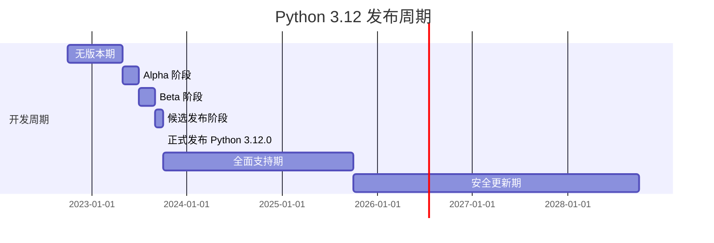

Python 作为一门历史悠久的编程语言，起初角色定位于 Liunx 下的脚本语言。最初作为 Linux 下的脚本语言诞生。随着时间推移，Python 不断引入新特性，逐步演变成一种功能强大、用途广泛的语言。目前被广泛应用于数据科学、Web 应用开发等多个领域。

特别是自 2019 年 6 月起，Python 采用了 PEP 602——Python 的年度发布周期。从 Python 3.9 开始，这个策略规定了 Python 版本的发布计划，确保每年 10 月发布新的特性版本。每个版本的开发周期长达 17 个月，包括无版本、Alpha、Beta 和候选发布阶段。此外，Python 版本将获得两年的全面支持，包括错误修复，随后是三年的安全修复。



但是目前在 Python 项目部署方面，依然还面临着许多问题和挑战，如环境一致性、依赖管理、版本控制、跨平台部署、性能优化、安全性、自动化部署、配置管理、离线部署、容器和虚拟化、资源管理和监控、文档和支持等等等。差点一口气顺不下来哈哈哈 ~

目前我的主要策略是遵循 DevSecOps 原则，实现标准化和流程化部署。

## 仓库分支

1. **主分支**（`main` 或 `master`）：用于稳定版本的代码和产品发布。
2. **开发分支**：从主分支分出，用于日常开发和测试工作。
3. **依赖分支**：从开发分支分出，专门管理和更新项目依赖。
4. **功能分支**：从开发分支分出，用于开发新功能或修复错误。
5. **发布分支**：从主分支分出，用于新版本的准备和发布。
6. **文档分支**：专注于文档编写和更新，建议与发布分支合并。

## 开发环境

项目开发应基于项目需求和目标平台选择适当的 Python 版本，并根据需求评审更新。同时利用 `pyenv` 可灵活管理 Python 版本，而 `Pipenv` 则用于依赖管理，其 `Pipfile` 和 `Pipfile.lock` 确保依赖在所有环境中的一致性。同时，使用 Git 作为版本控制系统，保持代码的组织和可追溯性。此外，尤其是**依赖更新应通过专门的依赖分支来管理。**

## 测试环境

**测试环境的构建应尽可能模拟生产环境，以确保测试的有效性。**使用如 GitHub Actions 或 Jenkins 的自动化工具可以自动执行单元测试、集成测试等。同时，引入代码审查工具，如 SonarQube，进行静态代码分析，有助于发现代码质量问题和安全漏洞。测试环境中的配置管理应与生产环境保持一致，例如通过环境变量或使用 Ansible 工具进行配置管理。

## 构建部署

在部署方面，根据是否联网和部署形式（源代码或二进制），可以采取不同的策略：


### 联网环境 & 源代码部署

在联网环境中进行源代码部署时，使用 Github、GitLab 等版本控制系统（VCS）配合持续集成/持续部署（CI/CD）工具（如 GitHub Actions、GitLab CI/CD）是一种高效的方法。这些工具可以自动化测试、构建和部署过程，从而提高部署效率和减少人为错误。

同时，为了确保环境和依赖的一致性，可以采用 `Pipenv` 和 `Pyenv`。`Pipenv` 提供了项目依赖的清晰定义和锁定机制，而 `Pyenv` 允许在同一系统中安装和使用多个 Python 版本，非常适合处理多项目环境。此外，可以集成静态代码分析和代码质量检测工具，如 SonarQube，以提高代码质量和安全性。

### 无网环境 & 源代码部署

在无网环境下，虽然可以使用 `Pipenv`、`Pyenv` 等工具来管理 Python 版本和依赖，但无法直接从外部源下载依赖。因此，关键步骤是提**前准备好所有必需的依赖包**。这可以通过在联网环境中预先下载所有依赖并将其存储在一个本地仓库（如 `PyPI` 目录）中来实现。

此外，还可以构建一个 Python 独立版本，并将 Python 解释器与应用程序一起打包，确保环境的一致性。为此，可创建一个包含所有依赖的可执行文件。这种方法有助于减少环境差异和部署复杂性。

DemoProject 项目结构参考：

```
DemoProject
├── ProjectSrc
├── Script
├── PyPI
└── Python3.10
```

- ProjectSrc：项目代码
- Script：项目运行脚本
- PyPI：项目依赖包
- Python3.10：独立版本 Python

### 联网环境 & 二进制部署

二进制部署在联网环境下提供了更多的灵活性和可扩展性。使用 Docker 和 Kubernetes 可以实现应用程序的容器化，从而简化部署过程、增加应用程序的可移植性和可伸缩性。容器化还使得应用程序在不同环境之间的迁移变得更加容易，同时提供了隔离和安全性。

此外，可以利用现代化的部署策略，如蓝绿部署、金丝雀发布和灰度发布。这些策略通过逐渐引入新版本的方式来减少风险，允许在完全部署之前监控应用程序的表现并回滚至旧版本（如有必要）。

### 无网环境 & 二进制部署

在无网环境中，二进制部署通常依赖于将应用程序及其所有依赖打包成单个可执行文件。可以使用 PyInstaller 等工具来创建独立的二进制文件，这样就不需要在目标系统上单独安装 Python 或依赖包。

另外，针对特定的操作系统，可以考虑将应用程序打包成 APT (.deb) 包或 YUM (.rpm) 包。这种方法适合于在特定类型的 Linux 发行版上部署应用程序，可以利用操作系统的包管理器来处理依赖和升级。

## 运维监控

部署后的监控和维护同样重要。使用如 Prometheus 和 Grafana 的工具组合可以有效进行性能监控，帮助及时发现和解决问题，保证系统的稳定运行。业内拥有多种一体化运维监控系统及开源软件，可以根据具体需求进行统一化安装配置管理。

## 日志管理

ELK 堆栈是一种流行的日志管理解决方案，由 Elasticsearch、Logstash 和 Kibana 三个组件组成。

- Elasticsearch 作为核心，提供高效的数据存储、搜索和分析能力。
- Logstash 负责日志数据的收集和处理，可以从多种来源获取数据，并转换后传输到 Elasticsearch。
- Kibana 作为这套系统的前端界面，提供数据的实时可视化和分析功能。

这套组合因其出色的灵活性和扩展性，适合用于各种规模的项目，帮助组织有效管理和分析大量日志数据，提升系统性能和安全性，同时支持更好的业务决策。
