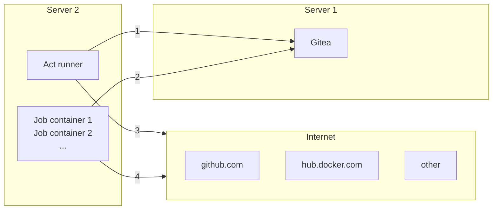

## 前言

Gitea 是一个轻量级的 DevOps 平台软件。从开发计划到产品成型的整个软件生命周期，它都能够高效而轻松地帮助团队和开发者，实现包括 Git 托管、代码审查、团队协作、软件包注册和 CI/CD 等功能。它与 GitHub、Bitbucket 和 GitLab 等 [比较](https://docs.gitea.com/zh-cn/installation/comparison) 类似。

Gitea 的主要目标是创建一个**极易安装，运行非常快速，安装和使用体验良好的自建 Git 服务**。通常我把 Gitea 称为 GitHub 的青春版，但一直以来它缺少 CI/CD 功能，因此一直只被用作代码托管的中转站。

Gitea 最初是从 [Gogs](http://gogs.io/) 分支而来，有关分支原因的详细信息可以在 [这里](https://blog.gitea.com/welcome-to-gitea/) 找到。然而，自从 Gogs 分叉后，Gitea 的社区壮大，但对内置 CI/CD 的需求也在不断增加。终于在 2020 年 11 月 13 日，南开大学软件学院的毕业生肖伦文（ *Lunny* ）提出了 [#13539](https://github.com/go-gitea/gitea/issues/13539) 提案：

> *An internal CI/CD system compatible with Github actions workflow yaml syntax, action yaml syntax and most action plugins.*

经过社区长达两年的不懈努力，从 Gitea 1.19 版本开始，Gitea Actions 已经成为内置的 CI/CD 解决方案（需要手动启用）。然后又经过两个版本的迭代，从 1.21.0 版本开始，默认情况下启用了 Actions。总体而言，Gitea Actions 与 [GitHub Actions](https://github.com/features/actions) 相似且兼容，它的名称也受到了 GitHub Actions 的启发，可以简单地将 Gitea Actions 视为 GitHub Actions 的子集。尽管 Gitea Actions 旨在与 GitHub Actions 兼容，但它们之间仍存在一些 [差异](https://docs.gitea.com/zh-cn/usage/actions/comparison)。

与其他 CI/CD 解决方案一样，Gitea 不会自行运行 Job，而是将 Job 委托给 Runner。Gitea Actions 的 Runner 被称为 act runner，它是一个独立的程序，使用 Go 语言编写。它是基于 nektos/act 的一个软分叉，而 `nektos/act` 是一个开源工具，用于在本地模拟 GitHub Actions 工作流程。

如果您非常熟悉 GitHub Actions，几乎可以无缝迁移到 Gitea Actions。我想分享这篇文章主要是因为互联网上相关经验贴子较少，同时分享一些我的心得体会。

## 基本概念

- **工作流（Workflows）**：在两者中，工作流是自动化过程的定义，描述了一系列任务（如构建、测试和部署应用）的执行方式。
- **事件（Events）**：工作流可以由各种事件触发，如代码推送、拉取请求、定时事件等。
- **作业（Jobs）**：作业是工作流中运行的一系列步骤。作业可以并行运行或按顺序运行。
- **步骤（Steps）**：步骤是作业中的单个任务，可以执行脚本命令或者使用特定的动作（actions）。
- **动作（Actions）**：动作是在步骤中执行的独立任务，可以是内置的、来自市场的，或者是自定义的。
- **变量与密钥（Variables & Secrets）**：可以设置环境变量来管理配置和共享数据。
- **缓存（Caching）**：缓存依赖项和其他常用资源可以帮助加快构建和部署过程。
- **日志与监控（Logging & Monitoring）**：可以提供详细的执行日志，帮助监控和调试工作流。

## 环境配置

- [Gitea 安装](https://docs.gitea.com/zh-cn/category/installation)

- [Gitea Actions 的 Runner 部署](https://docs.gitea.com/zh-cn/usage/actions/act-runner)

*由于 Gitea 提供了非常丰富的文档，所以我就不一一赘述了 ~*

在实际体验中，将 Gitea 和 Act Runner 部署在一台 1 核心 2GB 的云服务器也是可以的。Act Runner 的日常运行仅占用约 30MB 左右的内存。不过每个 Runner 的具体资源消耗取决于仓库中的工作流脚本。

此外，您还可以将 Gitea 部署在公网服务器上，将 Act Runner 部署在本地服务器上。即使是一台二手服务器，只要满足以下网络架构要求，都可以使用。

### 网络架构



使用 Gitea Actions 只需要确保 Runner 能够连接到 Gitea 实例。**互联网访问是可选的**，但如果没有互联网访问，将需要额外的工作。换句话说，当 Runner 能够自行查询互联网时，它的工作效果最好，但您不需要将其暴露给互联网（无论是单向还是双向）。

## 工作流脚本

### 要求

- 默认情况下，Gitea 需要手动启用 Actions，也可以 [手动配置默认启用](https://docs.gitea.com/zh-cn/usage/actions/faq#为什么默认情况下不启用actions) Actions 单元以适用于所有新仓库。
- Gitea Actions 需要一个以 `.yaml` 扩展名的文件，放在存储库的 `.gitea/workflows/` 目录中，例如 `.gitea/workflows/demo.yaml`。

### 示例

```yaml
name: Gitea Actions Demo
run-name: ${{ gitea.actor }} is testing out Gitea Actions 🚀
on: [push]

jobs:
  Explore-Gitea-Actions:
    runs-on: ubuntu-latest
    steps:
      - run: echo "🎉 The job was automatically triggered by a ${{ gitea.event_name }} event."
      - run: echo "🐧 This job is now running on a ${{ runner.os }} server hosted by Gitea!"
      - run: echo "🔎 The name of your branch is ${{ gitea.ref }} and your repository is ${{ gitea.repository }}."
      - name: Check out repository code
        uses: actions/checkout@v3
      - run: echo "💡 The ${{ gitea.repository }} repository has been cloned to the runner."
      - run: echo "🖥️ The workflow is now ready to test your code on the runner."
      - name: List files in the repository
        run: |
          ls ${{ gitea.workspace }}
      - run: echo "🍏 This job's status is ${{ job.status }}."
```

### 语法

目前 Gitea 官方尚未提供 Actions 语法的标准文档，但官方建议直接参考 [GitHub Actions 工作流语法](https://docs.github.com/en/actions/using-workflows/workflow-syntax-for-github-actions)。

### 变量

**目前 Gitea 支持在用户、组织和仓库级别创建变量，变量的可见性级别取决于它们的创建位置。**

- 用户级别：适用于用户所有仓库的 Actions。
- 组织级别：适用于组织内所有用户仓库的 Actions。
- 仓库级别：适用于仓库内所有 Actions。

变量名称有特定的命名规则，例如只能包含字母、数字字符和下划线，不能以数字开头，不能以 `GITHUB_` 和 `GITEA_` 开头，并且必须是唯一的。创建后，变量会自动填充到 `vars` 和 `secrets` 上下文中，并可在工作流中使用。

变量的语法为 `${{ vars.xxx }}` 和 `${{ secrets.xxx }}`。

## 进阶功能

### 指定 Act 运行 Runner

如果你有多个 Act 节点，希望将某个工作流程运行在特定的 Runner 上，你可以在不同的 Runner 上分配不同的标签（可在 Runner 管理面板编辑标签），例如，你可以创建两个 Runner，分别标记为 `linux_runner` 和 `windows_runner`。

```yaml
jobs:
  My-Gitea-Actions:
    runs-on: linux_runner
    runs-on: windows_runner
```

### 复用 Github 的脚本

在编写步骤配置时，通常会引用其他人编写的脚本，例如：

```yaml
- name: Login to DockerHub
  uses: docker/login-action@v2

- name: Login to DockerHub
  uses: my_custom/other-action@v2
```

然而，对于 Gitea Actions，默认情况下在 `1.19` 之前，它会尝试访问 [Gitea.com](https://gitea.com/) 这个代码托管仓库，因此，如果脚本位于 GitHub 上，它将无法下载脚本内容。而在 `1.20` 及以后版本中，默认会访问 [GitHub.com](https://github.com/)。

因此，如果在下载脚本时遇到问题，建议明确指定脚本地址，例如：

```yaml
- name: Login to DockerHub
  uses: https://github.com/my_custom/other-action@v2
```

或者通过修改 Gitea 的 `app.ini` 配置，将下载源指定为相应的仓库：

```ini
[actions]
# 1.19 可直接填写任意url如：https://github.com
# 1.20起，不填默认从 github，填self表示从自建仓库下载
DEFAULT_ACTIONS_URL = self
```

### 使用 Docker 等工具

在 GitHub Actions 中，默认工作环境可以直接使用 Docker 命令，但在 Gitea Actions 中无法运行，因为 `gitea act_runner` 默认运行在 `node:16-bullseye` 镜像上，不支持 Docker 命令。这个问题在 [Gitea act_runner issue](https://gitea.com/gitea/act_runner/issues/63#issuecomment-733637) 中有详细讨论。

因为 Act Runner 可以部署在本地服务器上，因此最简单有效的解决方法是通过 SSH 直接操作本地主机。

## 心得体会

DevOps 平台软件繁多，但轻量级的 DevOps 平台软件却寥寥无几。虽然 GitHub 也支持自托管的 Runner，但它的可访问性受限。GitLab 则过于重量级。

目前 Gitea 官方社区表示 Gitea Actions 仍然在开发中，因此可能存在一些错误和缺失的功能。 并且在稳定版本（v1.20 或更高版本）之前可能会进行一些重大的更改。

总而言之，Gitea 的 Actions 为开发者提供了一种实用的解决方案，特别适用于日常使用场景。值得一试！

本文借鉴了 seepine 博主在 Gitea 系列文章中的部分内容，不过请注意，seepine 博主的文章撰写于 2023 年 3 月份，主要现在 Gitea 已经更新了。

- [Gitea - 搭建属于自己的代码仓库](https://seepine.com/git/gitea/starter/)
- [Gitea Actions 搭建](https://seepine.com/git/gitea/actions/)
- [Gitea Actions 构建 SpringBoot Docker镜像](https://seepine.com/git/gitea/actions/springboot/)
- [Gitea Actions 构建 Quarkus native Docker镜像](https://seepine.com/git/gitea/actions/quarkus/)
- [Gitea Actions 构建 Vue Docker 镜像](https://seepine.com/git/gitea/actions/vue/)
