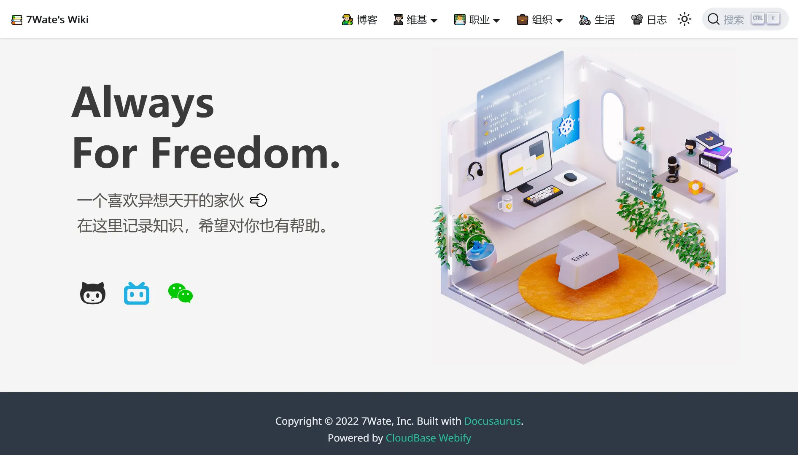

# 7Wate Knowledge Base

> Always For Freedom. A guy who likes to think outside the box 💨

I record knowledge here and hope it can be helpful to you.



## Table of Contents

```markdown
markdownCopy codeWiki
├─ Blog
├─ Wiki
│    ├─ Basic Introduction
│    ├─ Programming Languages
│    ├─ Data Structures and Algorithms
│    ├─ Computer Organization
│    ├─ Computer Networks
│    ├─ Operating Systems
│    ├─ Database Systems
│    ├─ Computer System Security
│    ├─ Software Engineering
│    └─ Compiler Design
├─ Career
│    ├─ Job Seeking
│    ├─ DevOps Engineer
│    └─ Information Security Engineer
├─ Organizations
│    ├─ Open Source Communities
│    ├─ Modern Enterprises
│    └─ National Governments
├─ Life
└─ Log
```

## Branches

```markdown
markdownCopy codeMain Main Branch
├─ dev Development Branch
└─ phone Mobile Branch
```

## CI&CD

- `build.yml`: Automatically build the static website from the main branch and deploy it to the html branch.

- `algolia.yml`: Automatically crawl and push to Algolia at 02:00 every Wednesday.
    1. Set the `ALGOLIA_ADMIN_API_KEY` and `ALGOLIA_APP_ID` repository environment keys. For the specific steps to obtain the key, please read [Building Excellent Personal Wiki with Docusaurus](https://blog.7wate.com/?p=75).
    2. Modify the `start_urls` and `sitemap_urls` values in the `.github\workflows\docsearch.json` directory to correspond to the website.

## Contribution

Welcome to fork and contribute, and provide guidance and correction. 👊

## License

- All **original code** is licensed under the [GPL-3.0](http://www.thebigfly.com/gnu/FDLv1.3/) license, and **original non-code content** is licensed under the [Attribution-ShareAlike 4.0 International](http://creativecommons.org/licenses/by-sa/4.0/) license.
- All **referenced third-party** content is for academic use only. Copyright and ownership of the content belong to the original authors. If there is any infringement, please [contact us by email](mailto:admin@7wate.com) for deletion.
- **Docusaurus** is [MIT licensed](https://github.com/facebook/docusaurus/blob/main/LICENSE).

## Acknowledgments

Thanks to the selfless contributions of third-party original authors!

Thanks to the maintenance and development of the Docusaurus project!