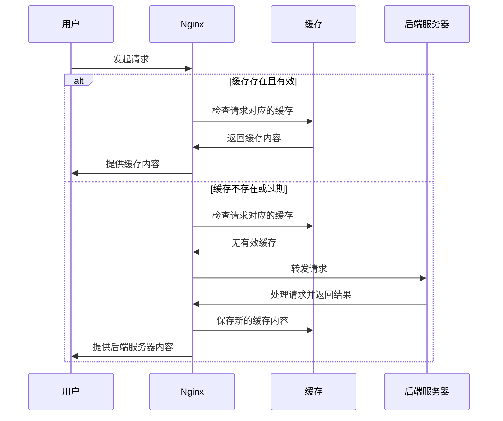

Nginx，作为一种高效的 Web 服务器和反向代理服务，提供了一系列功能以优化和加速内容的交付。其中，内容缓存是其核心功能之一，它能显著提升网站的响应速度和后端服务的效率。

## 缓存基础

### 缓存是什么

缓存是一种存储技术，它保存数据副本以便快速访问。在 Web 环境中，缓存可以是页面、图片、文件等内容，存储在服务器或客户端。当用户再次请求相同的内容时，系统可以直接从缓存中提取，避免了重复的数据检索或计算过程，从而加快了交付速度。

### 缓存能解决的问题

- **减轻服务器负担：** 通过缓存常请求的内容，减少对后端服务器的请求次数。
- **提高响应速度：** 缓存的内容直接从内存或快速存储中提供，比从后端服务器处理和传输要快得多。
- **提升用户体验：** 快速加载的页面和资源提升了用户的浏览体验。

## Nginx 缓存原理

当用户首次请求网站的某个页面时，Nginx 会将请求转发到后端服务器（例如你的网站应用）。后端服务器处理请求后，将页面内容等资源返回给 Nginx，Nginx 再将这些内容发送给用户。在这个过程中，Nginx 会将收到的内容保存在缓存中。

当另一个用户请求同一个页面时，Nginx 会检查缓存。如果找到了之前保存的内容，并且内容还没有过期，Nginx 就会直接从缓存中取出内容发送给用户，而不是再次请求后端服务器。这样大大减少了处理时间和服务器负载。

Nginx 不是随意缓存所有内容，它通过一套规则来确定哪些内容应该被缓存，哪些不应该。这套规则可以非常灵活，你可以指定根据页面类型、用户的某些行为，甚至特定时间和日期来缓存内容。

缓存的内容并不是永远有效的。有时候网站内容会更新，如果用户还是接收到旧的缓存内容，那就会出现问题。因此，Nginx 允许设置缓存的有效期，一旦超过这个期限，缓存的内容就会被认为是过时的，Nginx 会从后端服务器获取最新的内容，并更新缓存。



## Nginx 缓存配置

### 1. 配置缓存区域

首先，你需要在 Nginx 配置文件中定义一个或多个缓存区域：

```nginx
http {
    proxy_cache_path /path/to/cache levels=1:2 keys_zone=my_cache:10m max_size=1g inactive=60m use_temp_path=off;
}
```

| 配置指令           | 描述                                                         |
| ------------------ | ------------------------------------------------------------ |
| `proxy_cache_path` | 指定缓存的存储路径，定义了缓存文件存放的文件系统路径。       |
| `levels`           | 定义缓存目录的层级，用于创建多级目录结构来存储缓存文件。     |
| `keys_zone`        | 定义缓存区域的名称和大小，为缓存键和元数据分配内存。         |
| `max_size`         | 缓存可以占用的最大磁盘空间，限制缓存目录可以使用的最大空间大小。 |
| `inactive`         | 在此时间内未被访问的缓存内容将被删除，用于清理长时间未访问的缓存。 |
| `use_temp_path`    | 是否使用临时路径存储缓存内容，控制是否先写入临时文件再移动到缓存路径。 |

### 2. 启用缓存

在适当的位置块中，启用缓存并指定缓存区域：

```nginx
location / {
    proxy_cache my_cache;
    proxy_pass http://my_backend;
}
```

| 配置指令                 | 描述                                                         |
| ------------------------ | ------------------------------------------------------------ |
| `proxy_cache`            | 在 location 块中使用，指定该位置的请求应使用哪个缓存区域。     |
| `proxy_cache_key`        | 定义如何为请求生成缓存键，通常包含请求的元素如 URL、请求方法等。 |
| `proxy_cache_valid`      | 设置不同 HTTP 状态码的响应的缓存有效期。                       |
| `proxy_cache_use_stale`  | 允许在后端服务器不可用时提供过期的缓存内容。                 |
| `proxy_ignore_headers`   | 指示 Nginx 忽略后端服务器发送的某些 HTTP 头，常用于控制缓存。    |
| `proxy_cache_lock`       | 在处理缓存项时防止对同一个资源的并发请求，只让第一个请求查询后端并缓存，其他请求等待。 |
| `proxy_cache_bypass`     | 设置条件，在满足条件时请求将绕过缓存直接转发给后端服务器。   |
| `proxy_no_cache`         | 设置条件，在满足条件时不对响应进行缓存。                     |
| `proxy_cache_revalidate` | 每次请求都会验证缓存内容的新鲜度，适用于需要高度一致性的场景。 |
| `proxy_cache_min_uses`   | 指定一个响应在被缓存前需要被请求的最小次数，适用于控制不经常访问的内容的缓存。 |
| `proxy_cache_methods`    | 指定哪些请求方法的响应应该被缓存，默认是 GET 和 HEAD。          |

### 示例配置

```nginx
http {
    # 定义缓存存储路径及相关参数
    proxy_cache_path /path/to/cache levels=1:2 keys_zone=my_cache:10m max_size=1g inactive=60m use_temp_path=off;

    server {
        listen 80;

        location / {
            # 指定使用哪个缓存区域
            proxy_cache my_cache;
            
            # 定义缓存键
            proxy_cache_key "$scheme$request_method$host$request_uri";

            # 设置缓存有效期
            proxy_cache_valid 200 302 10m;
            proxy_cache_valid 404 1m;

            # 使用陈旧的缓存响应
            proxy_cache_use_stale error timeout updating http_500 http_502 http_503 http_504;

            # 忽略后端的Cache-Control和Expires头
            proxy_ignore_headers Cache-Control Expires;

            # 防止对同一个资源的并发请求
            proxy_cache_lock on;

            # 当特定条件满足时绕过缓存
            proxy_cache_bypass $http_cache_control;

            # 当特定条件满足时不缓存响应
            proxy_no_cache $http_pragma;

            # 验证缓存内容的新鲜度
            proxy_cache_revalidate on;

            # 指定一个响应在被缓存前需要被请求的最小次数
            proxy_cache_min_uses 3;

            # 指定哪些请求方法的响应应该被缓存
            proxy_cache_methods GET HEAD POST;

            # 转发请求到后端服务器
            proxy_pass http://my_backend;
            
            # 添加自定义头部以监控缓存状态
            add_header X-Cache-Status $upstream_cache_status;
        }
    }
}
```

## 浏览器缓存控制配置

合理的浏览器缓存策略可以减少服务器负载、减少网络延迟、加快页面加载速度，并节省用户的数据使用量。浏览器缓存主要通过 HTTP 响应头来控制，以下是一些最常用的 HTTP 缓存控制头：

- **Cache-Control**：这是最重要的缓存控制头。它允许指定多种指令来控制资源的缓存策略，例如 `max-age`、`no-cache`、`no-store`、`must-revalidate` 等。
- **Expires**：一个日期/时间值，告诉浏览器在这个时间点之前可以直接从缓存读取资源，而不需要去服务器检查。
- **ETag**：资源的唯一标识符。浏览器可以通过发送带有 `If-None-Match` 的请求来检查 ETag，判断资源是否已更改。
- **Last-Modified**：表示资源最后修改的日期和时间。浏览器可以通过发送带有 `If-Modified-Since` 的请求来检查资源是否已更改。

### Cache-Control

现代应用倾向于使用 `Cache-Control` 头，因为它提供了更多的灵活性和控制。以下是一些常用的指令：

```nginx
# 应用中不会改变的文件，通常可以再发送响应头前添加积极缓存
location ~* \.(js|css|png|jpg|gif)$ {
    add_header  Cache-Control public,max-age=31536000;
}

# 禁止缓存
location ~* \.(js|css|png|jpg|gif)$ {
    add_header  Cache-Control no-store,no-cache,must-revalidate;
}
```

| 配置选项                           | 描述                                                         |
| ---------------------------------- | ------------------------------------------------------------ |
| `no-store`                         | 指示请求或响应中的信息不能被缓存到任何地方。此设置适用于包含敏感信息的数据。 |
| `no-cache`                         | 缓存不应该存储未经验证的响应。即使有缓存，每次请求都需要向源服务器进行验证。 |
| `public`                           | 表示任何响应都可以被缓存，即使是通常不可缓存的内容，如经过身份验证的响应。 |
| `private`                          | 响应是为单个用户私有的，不能由共享缓存存储，但可以由私有缓存存储。比如，用户的个人信息页。 |
| `max-age=<seconds>`                | 指定资源可以在本地缓存存储并被重用的最长时间（以秒为单位）。 |
| `s-maxage=<seconds>`               | 类似于 `max-age`，但它仅适用于共享缓存（如 CDN）。覆盖 `max-age` 或者 `Expires` 头，但仅在共享缓存中。 |
| `must-revalidate`                  | 一旦资源过期（即超过 `max-age`），在使用旧的资源之前，缓存必须去服务器验证。对于某些需要保持最新的资源很有用。 |
| `proxy-revalidate`                 | 与 `must-revalidate` 类似，但它仅适用于共享缓存。              |
| `immutable`                        | 指示响应体不会随时间改变。在资源的缓存有效期内，浏览器不需要为了验证资源的新鲜度而发送条件请求。 |
| `stale-while-revalidate=<seconds>` | 表示客户端愿意接受超过 `max-age` 时间的响应，同时在后台异步检查新鲜度。 |
| `stale-if-error=<seconds>`         | 表示如果源服务器在指定的时间内出错（如服务器宕机），客户端愿意接受一个过期的响应。 |

### Expires

`Expires` 头是 HTTP/1.0 的遗留特性，但在 HTTP/1.1 中仍被广泛支持和使用。它用于指定资源的过期时间，告诉浏览器在这个时间点之前可以直接从本地缓存获取资源，而不必去服务器再次请求。一旦过了这个时间，浏览器会向服务器发送请求以检查资源是否有更新。**尽管 `Cache-Control` 的 `max-age` 指令通常优先于 `Expires`，但在一些老旧的浏览器中，可能仍然需要设置此项。**

```nginx
server {
    listen 80;

    location /images/ {
        root /path/to/images;
        expires max;
    }

    location /css/ {
        root /path/to/css;
        expires 30d;
    }

    location /js/ {
        root /path/to/js;
        expires 24h;
    }
}
```

| 时间单位 | 描述 | 示例           | 说明                                               |
| -------- | ---- | -------------- | -------------------------------------------------- |
| `max`    | 未来 | `expires max;` | 通常被解释为将资源的过期时间设置远在未来的时间点。 |
| `y`      | 年   | `expires 1y;`  | 表示资源应在一年后过期。                           |
| `M`      | 月   | `expires 1M;`  | 表示资源应在一个月后过期。                         |
| `w`      | 周   | `expires 1w;`  | 表示资源应在一周后过期。                           |
| `d`      | 天   | `expires 30d;` | 表示资源应在 30 天后过期。                           |
| `h`      | 小时 | `expires 24h;` | 表示资源应在 24 小时后过期。                         |
| `m`      | 分钟 | `expires 45m;` | 表示资源应在 45 分钟后过期。                         |
| `s`      | 秒   | `expires 30s;` | 表示资源应在 30 秒后过期。                           |

### Last-Modified

`Last-Modified` 头表示资源最后被修改的时间。它是一个日期/时间戳，告诉浏览器资源最后一次更改的时间。Nginx 默认会为静态文件发送 `Last-Modified` 头。如果你的资源是静态文件，比如图片、CSS 或 JavaScript 文件，通常你不需要做任何特别的配置。

当浏览器第一次请求一个资源时，服务器响应中会包含 `Last-Modified` 头。浏览器在下次请求相同资源时，会发送一个 `If-Modified-Since` 头，其值为之前收到的 `Last-Modified` 日期。

如果服务器发现资源自那以后没有被修改，它会返回一个 304 Not Modified 状态码，而不是资源内容，告诉浏览器可以安全地使用缓存的版本。

但是，如果你需要确保这个行为是打开的，可以确保 `http` 块中有以下指令：

```nginx
http {
    server {
        location / {
            root /path/to/your/files;
            add_header Last-Modified $date_gmt;
        }
    }
}
```

### ETag

`ETag`（实体标签）提供了一种资源的唯一标识符，通常是一个散列值或版本号。与 `Last-Modified` 相比，它可以更精确地判断资源是否变化。当浏览器第一次请求一个资源时，如果服务器配置了 ETag，响应中会包含一个 ETag 头。浏览器在后续请求相同资源时会发送一个 `If-None-Match` 头，其值为之前收到的 ETag 值。

如果服务器发现 ETag 匹配（即资源未更改），它会返回一个 304 Not Modified 状态码，告诉浏览器可以安全地使用缓存的版本。

Nginx 不会默认发送 ETag 头，你需要使用第三方模块或自定义配置。以下是一个示例配置，使用 Nginx 的 `ngx_http_headers_module` 模块来添加 ETag。

```nginx
http {
    server {
        location / {
            root /path/to/your/files;
            etag on;  # 开启ETag
        }
    }
}
```

## Gzip 压缩配置

`gzip` 是一种数据格式和文件压缩程序，使用 Lempel-Ziv 编码（LZ77）和 32 位循环冗余校验。当 Web 服务器启用了 `gzip` 压缩时，它会在发送文件到浏览器之前先将其压缩。支持 `gzip` 的浏览器会在 HTTP 请求头中包含 `Accept-Encoding: gzip`，表示它可以接收 `gzip` 压缩的内容。服务器响应这些请求时，会添加 `Content-Encoding: gzip` 头部，并发送压缩后的内容。

- **减少文件大小**：通常可以减少 70% 左右的文件大小，从而减少网络传输时间。
- **提高加载速度**：较小的文件可以更快地下载和解析，提升用户体验。
- **节省带宽资源**：对于网站运营者来说，减少数据传输可以降低带宽成本。

### Nginx 中配置 Gzip 压缩

在 Nginx 中启用 `gzip` 压缩相对简单。以下是一些基本的配置指令：

```nginx
http {
    gzip on;
    gzip_buffers 16 8k;
    gzip_comp_level 5;
    gzip_min_length 256;
    gzip_http_version 1.1;
    gzip_proxied any;
    gzip_types text/plain text/css application/json application/javascript text/xml application/xml application/xml+rss text/javascript;
    gzip_vary on;
}
```

| 指令                | 描述                                                         | 默认值/示例  |
| ------------------- | ------------------------------------------------------------ | ------------ |
| `gzip`              | 启用或禁用 gzip 压缩。                                         | `on` / `off` |
| `gzip_buffers`      | 设置用于压缩的缓冲区数量和大小。                             | `16 8k`      |
| `gzip_comp_level`   | 设置 gzip 压缩级别，范围是 1（最快）到 9（最优）。较高的压缩级别可以提供更好的压缩率，但会消耗更多 CPU 资源。 | `1`          |
| `gzip_disable`      | 禁用 gzip 压缩的浏览器正则匹配。用于兼容不支持 gzip 的老旧浏览器。 | `"msie6"`    |
| `gzip_min_length`   | 设置触发压缩的最小响应体大小。较小的文件可能不值得压缩。     | `20` 字节    |
| `gzip_http_version` | 设置启用压缩的最低 HTTP 协议版本。                             | `1.1`        |
| `gzip_proxied`      | 设置在何种代理请求情况下应用压缩。                           | `off`        |
| `gzip_types`        | 设置哪些 MIME 类型应该被压缩。通常包括文本文件如 HTML, CSS, JavaScript 等。 | `text/html`  |
| `gzip_vary`         | 启用或禁用根据请求头中的 `Accept-Encoding` 发送 `Vary: Accept-Encoding` 响应头。 | `off`        |

### Gzip 压缩适合哪些内容

- **文本文件**：HTML、CSS、JavaScript、XML 和 JSON 等文本文件通常能获得很好的压缩效果。
- **API 响应**：对 JSON 或 XML 格式的 API 响应进行压缩，能加快移动应用或 Web 服务的响应速度。

### 注意事项

- **不要压缩已经压缩过的文件**：对于 JPEG、PNG、MP3 和 PDF 等已经压缩过的文件，再次压缩不仅效果不佳，甚至可能使文件变大。
- **考虑 CPU 资源**：虽然 `gzip` 压缩可以减少带宽使用，但它会增加服务器端的 CPU 负担。在负载较高的服务器上，应合理设置压缩级别。
- **客户端支持**：几乎所有现代浏览器都支持 `gzip`，但在配置服务器时仍需考虑兼容性问题。

## 高级缓存策略

### 缓存预热

缓存预热是指在缓存启动后，系统自动访问特定的 URL 列表以填充缓存的过程。这确保了当真实用户请求到达时，他们需要的内容已经在缓存中可用，从而避免了冷启动时的延迟。

### 内容无效化

内容无效化是指在内容更新或变得不再有效时，有选择性地移除或更新缓存中的这些内容。这可以通过设置适当的缓存过期策略或使用 API 调用来手动清除特定的缓存项来实现。

### 智能缓存层

根据内容的类型和访问频率，智能缓存层可以自动决定将内容缓存在哪个层级（内存、SSD、HDD 等）。对于经常访问的热门内容，应优先存储在速度更快的存储中。

## 缓存调试与优化

### 缓存命中率优化

- **精细化缓存键**：调整 `proxy_cache_key`，确保相似请求共享缓存，不同请求分开缓存，提高缓存利用率。
- **使用缓存分级**：对不同类型或大小的内容使用不同的缓存策略，可以更细致地控制缓存行为，提高命中率。

### 动态与静态内容的处理

- **使用微缓存**：对动态内容使用极短时间的缓存（例如 1 秒），可以在不牺牲实时性的情况下减轻后端负载。
- **内容分发网络（CDN）**：将静态内容部署到 CDN 可以加速全球访问速度，并减轻主服务器的压力。

### 安全性和隔离

- **用户敏感数据处理**：确保不会将含有用户敏感信息的动态内容错误地缓存。
- **缓存隔离**：为不同的应用或网站配置独立的缓存区域，避免缓存污染和数据泄露。

### 资源优化

- **最小化资源**：在服务器端压缩和最小化 CSS、JS 等文件，可以减少传输的数据量。
- **有效的图片格式**：使用 WebP 等现代图片格式替代传统格式，可以在不牺牲质量的前提下大幅减少图片大小。

### 监控和调试

通过分析 Nginx 的访问和错误日志，可以获取关于缓存行为的宝贵信息。

```nginx
log_format cache '*** $remote_addr - $upstream_cache_status [$time_local] '
                 '"$request" $status $body_bytes_sent '
                 '"$http_referer" "$http_user_agent"';
access_log /var/log/nginx/access.log cache;
```

- **缓存状态码：** Nginx 在响应头中提供了 `X-Cache-Status`，表示缓存命中、未命中或过期等状态。

## 配置示例

```nginx
http {
    # 开启gzip压缩
    gzip on;
    # 设置最小压缩长度为1000字节，小于此大小的文件不进行压缩
    gzip_min_length 1000;
    # 设置gzip缓冲区大小
    gzip_buffers 4 32k;
    # 指定哪些MIME类型的响应应该被压缩
    gzip_types text/plain application/x-javascript text/css application/xml;
    # 当浏览器支持gzip压缩时，添加Vary: Accept-Encoding头
    gzip_vary on;
    # 设置gzip压缩级别，范围是1（最快）到9（最优），推荐6作为一个平衡点
    gzip_comp_level 6;

    # 设置缓存路径，缓存键区域名，内存大小，缓存最大磁盘空间，缓存过期时间和临时路径使用
    proxy_cache_path /path/to/cache levels=1:2 keys_zone=my_cache:10m max_size=1g inactive=60m use_temp_path=off;

    server {
        listen 80;
        server_name example.com;

        # 静态内容的浏览器缓存配置
        location ~* \.(jpg|jpeg|png|gif|ico|css|js)$ {
            # 设置静态资源的过期时间为30天
            expires 30d;
            # 关闭访问日志记录
            access_log off;
            # 设置Cache-Control头，使浏览器和中间缓存服务器都可以缓存内容
            add_header Cache-Control "public";
        }

        # 动态内容的缓存和浏览器缓存配置
        location / {
            # 代理传递到后端服务器
            proxy_pass http://my_backend;
            # 启用缓存区域
            proxy_cache my_cache;
            # 对缓存内容进行验证，确保内容是最新的
            proxy_cache_revalidate on;
            # 设置资源在被缓存前需要被请求的最小次数
            proxy_cache_min_uses 3;
            # 当后端服务器错误时，使用过期的缓存内容
            proxy_cache_use_stale error timeout updating http_500 http_502 http_503 http_504;
            # 防止多个相同的请求同时更新缓存
            proxy_cache_lock on;

            # 为动态内容设置Cache-Control头，指示浏览器和代理服务器应该如何缓存内容
            add_header Cache-Control "public, must-revalidate, proxy-revalidate";

            # 启用gzip压缩
            gzip on;
            # 允许对代理的响应进行gzip压缩
            gzip_proxied any;
            # 指定哪些MIME类型的响应应该被压缩
            gzip_types text/plain text/css application/json application/javascript text/xml application/xml application/xml+rss text/javascript;
        }
    }
}
```
