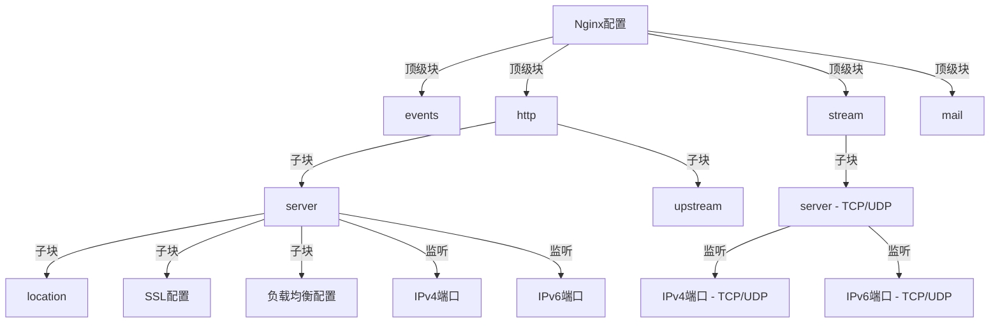

## 安装使用

- **Linux**：在大多数 Linux 发行版中，可以通过包管理器（如 APT、YUM）来安装 Nginx。对于希望有更细粒度控制的高级用户，可以选择从源代码编译安装。
- **Windows**：可从 Nginx 官方网站下载预编译的 Windows 版本进行安装。
- **MacOS**：通常通过包管理器如 Homebrew 来安装。

### 主要目录和文件

| 路径                                                         | 类型          | 描述                                        |
| ------------------------------------------------------------ | ------------- | ------------------------------------------- |
| `/etc/nginx/`, `/etc/nginx/conf.d`, `/etc/nginx/nginx.conf`  | 目录/配置文件 | 存放 Nginx 的主要配置文件。                 |
| `/etc/nginx/conf.d/default.conf`                             | 配置文件      | 默认的服务器配置文件。                      |
| `/etc/logrotate.d/nginx`                                     | 配置文件      | 用于 logrotate 服务的日志轮转配置。         |
| `/etc/nginx/{fastcgi_params, scgi_params, uwsgi_params}`     | 配置文件      | 特定于 cgi 的配置文件。                     |
| `/etc/nginx/{koi-utf, koi-win, win-utf}`                     | 配置文件      | 编码映射转换文件。                          |
| `/etc/nginx/mime.types`                                      | 配置文件      | 定义 HTTP Content-Type 与文件扩展名的映射。 |
| `/etc/sysconfig/nginx`, `/etc/sysconfig/nginx-debug`         | 配置文件      | 配置系统守护进程管理器。                    |
| `/usr/lib/systemd/system/{nginx.service, nginx-debug.service}` | 配置文件      | Systemd 服务文件，用于管理 Nginx 服务。     |
| `/etc/nginx/modules`, `/usr/lib64/nginx/modules`             | 目录          | 存放 Nginx 模块的目录。                     |
| `/usr/sbin/{nginx, nginx-debug}`                             | 命令          | Nginx 服务的可执行文件。                    |
| `/usr/share/doc/nginx-1.12.2`, `/usr/share/man/man8/nginx.8.gz` | 文件/目录     | 包含 Nginx 的手册和帮助文件。               |
| `/var/cache/nginx`                                           | 目录          | Nginx 的缓存目录。                          |
| `/var/log/nginx`                                             | 目录          | 存放 Nginx 日志的目录。                     |
| `/usr/share/nginx/html/{404.html, 50x.html, index.html}`     | 文件          | Nginx 默认的静态资源文件。                  |

Nginx 及其模块的工作方式由配置文件决定。默认情况下，配置文件名为 `nginx.conf`，通常位于 `/etc/nginx/` 或其子目录中。

### 使用和管理

| 功能                | 命令                           | 描述                                            |
| ------------------- | ------------------------------ | ----------------------------------------------- |
| 启动 Nginx          | `sudo systemctl start nginx`   | 在 Linux 系统上启动 Nginx 服务。                |
| 停止 Nginx（快速）  | `sudo nginx -s stop`           | 立即终止 Nginx 服务。                           |
| 停止 Nginx（优雅）  | `sudo nginx -s quit`           | 等待当前处理的请求结束后再终止 Nginx 服务。     |
| 重新加载配置        | `sudo nginx -s reload`         | 在不中断服务的情况下重新加载配置文件。          |
| 测试配置文件        | `sudo nginx -t`                | 测试 Nginx 配置文件的语法正确性。               |
| 查看 Nginx 版本     | `nginx -v`                     | 显示已安装的 Nginx 版本。                       |
| 查看 Nginx 编译选项 | `nginx -V`                     | 显示 Nginx 编译选项和配置参数。                 |
| 重启 Nginx          | `sudo systemctl restart nginx` | 在 Linux 系统上重启 Nginx 服务。                |
| 启用 Nginx 开机自启 | `sudo systemctl enable nginx`  | 设置 Nginx 在系统启动时自动启动（仅限 Linux）。 |
| 禁用 Nginx 开机自启 | `sudo systemctl disable nginx` | 禁止 Nginx 在系统启动时自动启动（仅限 Linux）。 |

*注意：如果您的系统开启了防火墙，可能需要配置防火墙规则来允许访问 Nginx 服务的端口。*

## 基础配置

Nginx 的配置文件通常位于 `/etc/nginx/nginx.conf`。它包含几个关键部分：

- **events 块**：配置与 Nginx 服务器及客户端网络连接相关的参数。
- **http 块**：定义全局 HTTP 服务器配置，例如文件类型、日志格式、默认文件类型等。
    - **server 块**：定义虚拟主机及其行为，例如监听的端口和服务器名称。
    - **location 块**：根据请求的 URI 匹配并定义处理特定类型请求的行为。
- **mail 块**（可选）：配置邮件代理服务，如 SMTP、IMAP 和 POP3。
- **stream 块**（可选）：为非 HTTP 协议（例如 TCP 和 UDP）提供配置。

### 层级

```nginx
main (1)          # Nginx 的全局配置，适用于所有的服务器和连接
├── events (1)    # 配置影响 Nginx 服务器或与用户的网络连接的参数
├── http (1)      # 用于配置代理、缓存、日志等绝大多数功能和第三方模块，只能定义一个 http 块
│   ├── server (多个)  # 配置虚拟主机的相关参数，一个 http 块中可以有多个 server 块
│   │   └── location (多个)  # 配置请求路由和各种页面处理情况，每个 server 块可以包含多个 location 块
│   └── ...       # 可配置多个 server 块
├── mail (1)      # 配置邮件服务（可选）
└── stream (1)    # 配置流处理（可选）
```



### 语法

- 配置文件由指令与指令块构成。
- 每条指令以分号（`;`）结尾，指令与参数间以空格符号分隔。
- 指令块以大括号（`{}`）将多条指令组织在一起。
- `include` 语句允许组合多个配置文件以提升可维护性。
- 通过 `#` 符号添加注释，提高可读性。
- 通过 `$` 符号使用变量。
- 部分指令的参数支持正则表达式，例如常用的 location 指令。

#### 简单指令

简单指令由名称和参数组成，中间**用空格分开，并以分号结束。**

```nginx
#简单指令
root /data/www;
```

#### 块级指令

块级指令结构类似于简单指令，但末尾不是分号，而是用大括号 `{}` 包裹的额外指令集合。如果一个块级指令中包含其他指令，则 - 配置文件由指令与指令块构成。

- 每条指令以分号（`;`）结尾，指令与参数间以空格符号分隔。
- 指令块以大括号（`{}`）将多条指令组织在一起。
- `include` 语句允许组合多个配置文件以提升可维护性。
- 通过 `#` 符号添加注释，提高可读性。
- 通过 `$` 符号使用变量。
- 部分指令的参数支持正则表达式，例如常用的 location 指令。它被称为一个上下文（例如：events、http、server 和 location）。

```nginx
# 块级指令示例
http {
  server {
    listen 80;
    server_name example.com;
    access_log /path/to/log/example.access.log;
    root /path/to/root;

    location ~ \.php$ {
      fastcgi_pass 127.0.0.1:9000;
    }
  }
}
```

### 匹配规则

`location` 指令用于匹配请求 URI，忽略查询参数，可以使用字符串或正则表达式。

```nginx
location [ = | ~ | ~* | ^~ | 空] uri {
  ……
}
```

- `=`：精确匹配。
- `^~`：前缀匹配，如果匹配成功，不再进行后续正则匹配。
- `~`：区分大小写的正则匹配。
- `~*`：不区分大小写的正则匹配。
- `空`：无修饰符的匹配，匹配以 uri 开头的字符串。

#### 匹配优先级

| 优先级 | 类型               | 描述                                     | 修饰符                                  |
| ------ | ------------------ | ---------------------------------------- | --------------------------------------- |
| 1      | 精确匹配           | 完全匹配整个 URI                         | `=`                                     |
| 2      | 最长非正则前缀匹配 | 匹配最长的前缀字符串，但不包括正则表达式 | `^~`                                    |
| 3      | 正则表达式匹配     | 按定义顺序匹配正则表达式                 | `~` (区分大小写) 或 `~*` (不区分大小写) |
| 4      | 普通匹配           | 匹配以指定字符串开始的 URI               | 无修饰符                                |

请注意以下几点：

- **精确匹配**（`=`）具有最高优先级。如果找到匹配项，则立即处理请求并停止搜索。
- **最长非正则前缀匹配**（`^~`）在没有精确匹配时使用，并且如果找到匹配项，将不会检查后续的正则表达式。
- **正则表达式匹配**（`~` 或 `~*`）根据它们在配置文件中出现的顺序进行匹配。第一个成功匹配的正则表达式将停止搜索。
- **普通匹配**（无修饰符）具有最低的优先级。如果以上所有类型都没有匹配，将使用这个匹配规则。

#### 匹配过程示例

```nginx
server {
    listen 80;
    server_name example.com;

    # 精确匹配
    location = /exact {
        # 处理 /exact 精确请求
    }

    # 最长非正则前缀匹配
    location ^~ /static/ {
        # 处理以 /static/ 开头的请求
    }

    # 正则表达式匹配
    location ~ \.php$ {
        # 处理以 .php 结尾的请求
    }

    # 普通匹配
    location / {
        # 处理所有其他请求
    }
}
```


在这个配置和流程图中：

- **精确匹配**：Nginx 首先尝试精确匹配 location `= /exact`。
- **最长非正则前缀匹配**：如果精确匹配失败，Nginx 尝试最长非正则前缀匹配 location `^~ /static/`。
- **正则表达式匹配**：如果最长非正则前缀匹配失败，Nginx 接着尝试正则表达式匹配 location `~ \.php$`。
- **普通匹配**：如果所有正则表达式都不匹配，Nginx 最后尝试无修饰符的普通匹配 location `/`。
- **处理请求**：根据匹配的类型，Nginx 将处理相应的请求。
- **无法处理请求**：如果所有类型的匹配都失败，请求无法被处理。

### 全局变量

Nginx 提供了多种内置变量，可以在配置的任何地方使用。以下是一些常见的 Nginx 全局变量及其描述：

#### HTTP 相关变量

| 变量                 | 描述                                                         |
| -------------------- | ------------------------------------------------------------ |
| `$host`              | 请求行中的 Host，如果有 Host 请求头，则用其值替换掉请求行中的主机名。如果请求中没有 Host 行和 Host 请求头，则等于请求匹配的 server 名称。值为小写，不包含端口。 |
| `$uri`               | 请求中的当前 URI，不包括 `?` 后面的请求参数，它可以通过内部重定向或使用 index 指令进行修改。 |
| `$document_uri`      | 当前请求在 root 指令中指定的值，与 `$uri` 相同，存在于历史问题中。 |
| `$request_uri`       | 完整的原始请求 URL，包括 URI 和参数，无法修改。              |
| `$scheme`            | 请求模式，如 http 或 https。                                 |
| `$request`           | 原始的 URL 请求，包含方法和协议版本。                        |
| `$request_method`    | 客户端请求类型，如 GET、POST。                               |
| `$request_length`    | 所有请求内容的大小，包括请求行、头部、包体等。               |
| `$request_body`      | 请求中的包体，当使用反向代理并设定用内存暂存包体时有效。     |
| `$request_body_file` | 临时存放请求包体的文件，可以通过特定指令强制所有包体存入文件。 |
| `$remote_user`       | 由 HTTP Basic Authentication 协议传入的用户名。              |
| `$args`              | 请求中的参数，可以被修改。                                   |
| `$arg_PARAMETER`     | GET 请求中特定参数 PARAMETER 的值。                          |
| `$is_args`           | 如果请求有参数则为 "?"，否则为空字符串。                     |
| `$query_string`      | 与 `$args` 相同，表示请求的查询字符串。                      |
| `$content_length`    | 请求头中的 Content-Length 字段值。                           |
| `$content_type`      | 请求头中的 Content-Type 字段值。                             |
| `$http_HEADER`       | 特定 HTTP 请求头的内容，HEADER 需转为小写，破折号变为下划线。 |
| `$http_user_agent`   | 客户端的 user-agent 信息。                                   |
| `$http_cookie`       | 客户端的 cookie 信息。                                       |
| `$cookie_COOKIE`     | 获取特定 cookie 的值。                                       |

#### TCP 相关变量

| 变量                   | 描述                                                         |
| ---------------------- | ------------------------------------------------------------ |
| `$binary_remote_addr`  | 客户端地址的整型格式，对于 IPv4 是 4 字节，对于 IPv6 是 16 字节。 |
| `$remote_addr`         | 客户端的 IP 地址。                                           |
| `$remote_port`         | 客户端的端口。                                               |
| `$connection`          | 递增的连接序号。                                             |
| `$connection_requests` | 当前连接上执行过的请求数，对 keepalive 连接有意义。          |
| `$proxy_protocol_addr` | 如果使用了 proxy_protocol 协议，则返回协议中的地址（原始用户的地址），否则返回空。 |
| `$proxy_protocol_port` | 如果使用了 proxy_protocol 协议，则返回协议中的端口（原始用户的端口），否则返回空。 |
| `$server_addr`         | 服务器端地址。                                               |
| `$server_port`         | 服务器端端口。                                               |
| `$server_protocol`     | 服务器端协议，例如 HTTP/1.1。                                |
| `$TCP_INFO`            | TCP 内核层参数，包括各种 TCP 信息。                          |

#### Nginx 处理请求过程中产生的变量

| 变量                  | 描述                                                         |
| --------------------- | ------------------------------------------------------------ |
| `$request_time`       | 请求处理到现在的耗时，单位为秒，精确到毫秒。                 |
| `$server_name`        | 匹配上请求的 server_name 值。                                |
| `$https`              | 如果开启了 TLS/SSL，则返回 on，否则返回空。                  |
| `$request_completion` | 若请求处理完则返回 OK，否则返回空。                          |
| `$request_id`         | 以 16 进制输出的请求标识 id，共含有 16 个字节，随机生成。    |
| `$request_filename`   | 待访问文件的完整路径。                                       |
| `$document_root`      | 由 URI 和 root/alias 规则生成的文件夹路径。                  |
| `$realpath_root`      | 将 document_root 中的软链接等换成真实路径。                  |
| `$limit_rate`         | 客户端响应时的速度上限，单位为每秒字节数。可以通过 `set` 指令修改。 |

#### 发送 HTTP 响应时相关的变量

| 变量                 | 描述                                                       |
| -------------------- | ---------------------------------------------------------- |
| `$sent_http_HEADER`  | HTTP 响应头中的内容，HEADER 需转为小写，破折号变为下划线。 |
| `$status`            | HTTP 响应状态。                                            |
| `$body_bytes_sent`   | 传送页面的字节数，即响应中 body 包体的长度。               |
| `$bytes_sent`        | 全部 HTTP 响应的长度。                                     |
| `$sent_trailer_名字` | 把响应结尾内容里的值返回。                                 |

#### Nginx 系统变量

| 变量             | 描述                                                         |
| ---------------- | ------------------------------------------------------------ |
| `$time_local`    | 以本地时间标准输出的当前时间。                               |
| `$time_iso8601`  | 使用 ISO 8601 标准输出的当前时间。                           |
| `$nginx_version` | 当前运行的 Nginx 版本号。                                    |
| `$pid`           | 所属 worker 进程的 id。                                      |
| `$pipe`          | 如果使用了管道则返回 p，否则返回 `.`。                       |
| `$hostname`      | 所在服务器的主机名，与 hostname 命令输出一致。               |
| `$msec`          | 从 1970 年 1 月 1 日到现在的时间，单位为秒，小数点后精确到毫秒。 |

Nginx 的配置文件使用的是一门微型的编程语言，其中变量存放的是字符串类型的值。使用 `$` 符号来表示变量，并且在引用时需要带上 `$` 前缀。特殊情况下，如变量名紧跟字符时，使用特殊语法来消除歧义。如果需要输出 `$` 符号本身，则可以使用特定方法，如上述 `geo $dollar` 示例所示。

### 模块化配置

在 Nginx 配置中，`include` 指令允许您包含其他配置文件或片段，实现配置的模块化和简化管理。以下是如何有效使用 `include` 指令的步骤和示例：

1. **定义共享配置文件**：首先，创建一个新的配置文件来存储可重复使用的配置片段。例如，您可以创建 `/etc/nginx/shared_config.conf` 并在其中定义通用的 `server` 块、`location` 块或其他配置指令。

    示例 `shared_config.conf` 内容：

    ```nginx
    server {
        listen 80;
        server_name example.com;
        location / {
            root /var/www/html;
            index index.html;
        }
    }
    ```

2. **在主配置文件中包含共享配置**：在您的主 Nginx 配置文件（通常是 `/etc/nginx/nginx.conf`）中，使用 `include` 指令引入共享配置文件。这可以在 `http` 块或 `server` 块内进行，取决于您的具体需求。

    在 `http` 块内包含共享配置：

    ```nginx
    http {
        include /etc/nginx/shared_config.conf;
        # 其他 http 块配置...
    }
    ```

    或者，在 `server` 块内包含共享配置：

    ```nginx
    server {
        # 其他 server 块配置...
        include /etc/nginx/shared_config.conf;
    }
    ```

3. **重新加载或重启 Nginx**：为了使新的配置生效，您需要重新加载或重启 Nginx。通常，可以使用以下命令来重新加载配置：

    ```shell
    sudo nginx -s reload
    ```

通过使用 `include` 指令，您可以将常用配置抽象成独立的文件，简化主配置文件的复杂度，并提高配置的可维护性。此方法尤其适用于需要在多个虚拟主机或环境之间共享配置的场景。

## 完整示例

```nginx
user  nginx;                                 # 定义Nginx运行的用户
worker_processes  auto;                      # 工作进程数，建议设置为CPU核心数，auto表示自动检测
error_log  /var/log/nginx/error.log warn;    # 错误日志文件的位置和记录级别
pid        /var/run/nginx.pid;               # 存储Nginx主进程ID的文件位置

events {
    worker_connections  1024;  # 单个工作进程的最大连接数
    multi_accept on;           # 设置为on表示一个工作进程可以同时接受多个新连接
    use epoll;                 # 使用epoll事件模型，这是在Linux上的一种高效的事件处理机制
}

http {
    include       mime.types;  # 包含MIME类型设置
    default_type  application/octet-stream;

    # 日志格式定义，包括自定义变量
    log_format  main  '$remote_addr - $remote_user [$time_local] "$request" '
                      '$status $body_bytes_sent "$http_referer" '
                      '"$http_user_agent" "$http_x_forwarded_for"';

    # 应用自定义日志格式
    access_log  /var/log/nginx/access.log  main;
    
    # 文件传输优化
    sendfile        on;   # 开启高效文件传输模式
    tcp_nopush     on;    # 开启防止网络拥塞的优化
    tcp_nodelay    on;    # 开启不延迟发送数据的优化

    # 保持长连接的超时时间
    keepalive_timeout  65;

    # SSL 配置
    ssl_certificate     /path/to/cert.pem;
    ssl_certificate_key /path/to/cert.key;
    ssl_protocols       TLSv1.2 TLSv1.3;
    ssl_ciphers         HIGH:!aNULL:!MD5;

    # 服务器定义
    server {
        listen       80;          # 监听IPv4端口
        listen       [::]:80;     # 监听IPv6端口

        server_name  localhost;   # 服务器名称

        # 根目录和索引文件设置
        location / {
            root   /usr/share/nginx/html;  # 网站根目录
            index  index.html index.htm;   # 默认页面
        }

        # 负载均衡配置
        location /load_balanced_app {
            proxy_pass http://my_load_balancer;  # 反向代理到负载均衡器
        }

        # SSL 服务端配置
        listen 443 ssl;
        ssl_certificate /path/to/ssl/cert.pem;
        ssl_certificate_key /path/to/ssl/key.pem;
    }

    # 负载均衡器定义
    upstream my_load_balancer {
        server backend1.example.com;
        server backend2.example.com;
        server backend3.example.com;
    }
}

stream {
    # TCP/UDP流设置（示例）
    server {
        listen 12345;
        proxy_pass backend.example.com:12345;
    }

    # IPv6 TCP/UDP 代理
    server {
        listen [::]:12345;
        proxy_pass backend.example.com:12345;
    }
}

mail {
    # 邮件服务设置（示例）
    server_name mail.example.com;
    auth_http   localhost/auth_http;
}
```
