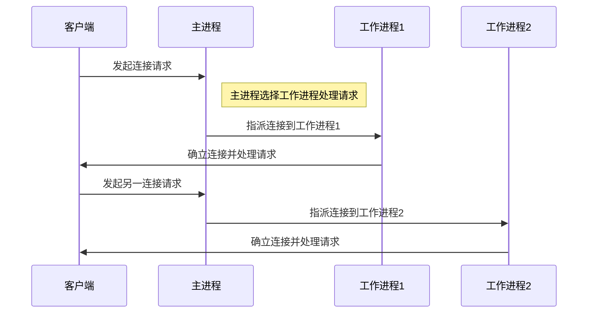
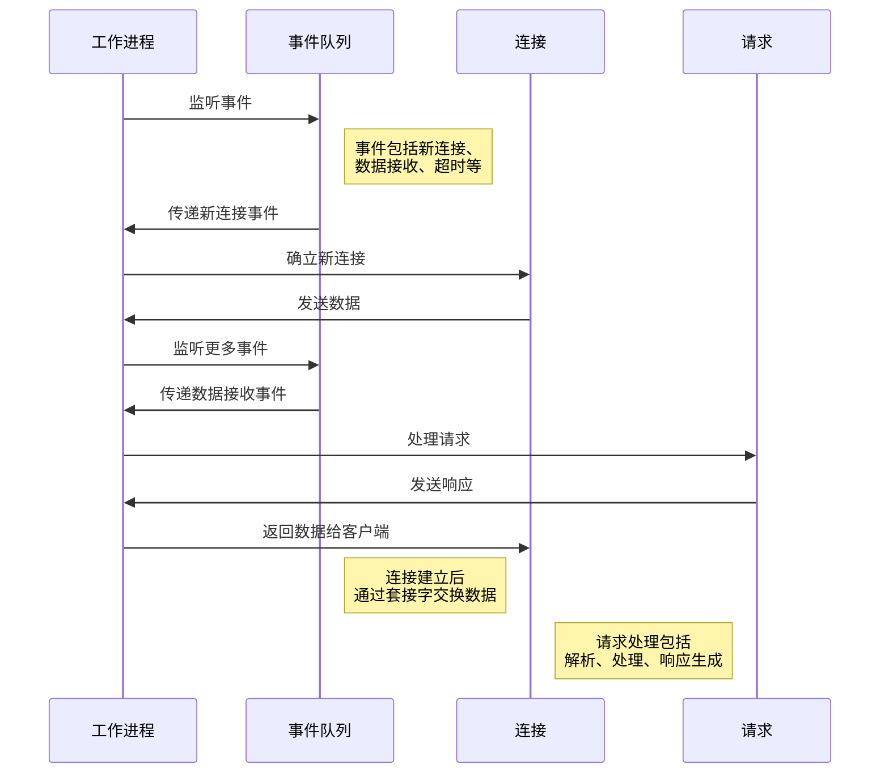

## 概述

Nginx（发音为“Engine-X”）是一款开源的高性能 HTTP 和反向代理服务器，同时也充当了 IMAP/POP3 代理服务器的角色。Nginx 的诞生旨在解决 C10k 问题，即同时处理 10,000 个客户端连接的挑战。由俄罗斯的程序员 Igor Sysoev 于 2004 年首次发布，自那时起，Nginx 凭借其卓越的稳定性、丰富的功能集、简单的配置文件和卓越的性能，迅速赢得了广泛的用户赞誉。

**Nginx 的设计理念着重于高效利用资源，采用异步、事件驱动的体系架构来处理大量并发连接。**与传统的同步、多线程或多进程服务器模型不同，Nginx 的非阻塞方式使其在高并发环境中表现出色，尤其在服务静态内容、执行负载均衡和处理反向代理请求等方面表现突出。

Nginx 的发展历程可以追溯到 2002 年，于 2004 年 10 月 4 日首次发布版本 0.1.0。从 2005 年开始，Nginx 不断发展壮大，支持了 Windows 系统，逐渐趋于稳定。重要的里程碑包括 2011 年发布的 1.0 版本，它引入了上游 keepalive HTTP 长链接。此后，Nginx 还支持了诸如 websocket、TFO 等协议，提供了 thread pool 和 stream 四层反向代理等功能，同时也支持了 reuseport 特性和 HTTP2 协议。在 2016 年，Nginx 还引入了动态模块的支持，而在 2018 年则加入了对 TLSv1.3 的支持。

Nginx 长久以其开源、高性能、高可靠性以及支持热部署而闻名。它几乎可以实现 7x24 小时不间断运行，即使运行数月也不需要重新启动。此外，Nginx 还支持动态模块，使得功能扩展变得更加灵活。总之 Nginx 是一款性能卓越、资源消耗低廉的 Web 服务器，而且易于配置和使用。

## 主要特性

### 高并发处理

- **事件驱动架构**：Nginx 采用非阻塞、事件驱动的方式处理请求，允许单个工作进程处理数千个并发连接，这使得 Nginx 在高并发环境下表现出色。

### 反向代理与负载均衡

- **反向代理支持**：Nginx 可以作为反向代理服务器，将请求转发到后端服务器，支持负载均衡、缓存静态和动态内容、SSL 终端等功能。
- **负载均衡算法**：提供多种负载均衡方法，包括轮询、权重、IP 哈希等。

### 高度可配置

- **灵活的配置语法**：Nginx 的配置文件清晰、灵活，可以精细地控制到每个请求的处理方式，易于理解和修改。
- **模块化设计**：提供丰富的模块，如 HTTP、mail、stream 等，并支持第三方模块扩展，使功能高度可定制。

### 性能优化

- **高效的静态内容服务**：对于静态资源，Nginx 可以直接从内核缓存中提供文件，减少磁盘 IO 操作。
- **缓存机制**：Nginx 提供强大的缓存功能，可以缓存来自后端服务器的内容，减少重复请求的处理时间。

### 安全特性

- **SSL/TLS 支持**：可以为 HTTP 服务提供 SSL/TLS 加密，保护数据传输安全。
- **限制与认证**：支持基于 IP、密码的访问控制，以及限制请求频率等安全功能。

### 高度可扩展

- **第三方模块**：Nginx 支持第三方模块的扩展，允许添加自定义功能和特性，以满足特定需求。
- **动态模块加载**：可以在运行时动态加载和卸载模块，无需重新编译 Nginx，提高了灵活性和可扩展性。

### 日志与监控

- **丰富的日志记录**：Nginx 可以记录详细的访问日志，包括客户端信息、请求时间、响应代码等，有助于分析和监控。
- **实时性能监控**：支持实时性能监控工具，如 stub_status 模块，可以查看当前服务器状态和性能指标，帮助及时发现问题。

### 热部署与高可用

- **热部署支持**：Nginx 允许在不中断现有连接的情况下重新加载配置文件或更新软件版本，确保连续性。
- **高可用性架构**：通过配置主备服务器或使用专业的高可用方案，可以实现 Nginx 的高可用性，防止单点故障。

## 基本概念

如果要理解 Nginx，首先需要掌握**它采用的是多进程（单线程）+ 多路 IO 复用模型。**这一特性使得 Nginx 成为一个并发事件驱动的服务器。

### 工作模式

**Nginx 使用单一的主进程（master process）和多个工作进程（worker processes）来处理连接。**这种多进程模型有效地分担了负载，并充分利用了多核服务器的性能。

**Nginx 启动成功后，在 Linux 系统中存在两个进程：一个主进程和多个工作进程。**主进程负责管理工作进程，包括接收外部信号、向工作进程发送信号以及监控工作进程的运行状态。如果工作进程异常退出，主进程会自动重新启动新的工作进程，确保持续的服务。

#### 主进程

主进程（master process）是 Nginx 的核心管理组件之一。它的主要职责是协调、监控和管理多个工作进程（worker processes），以确保 Nginx 服务器的正常运行。以下是主进程的关键功能和特点：

1. **进程管理**：主进程负责启动、停止和管理工作进程。它会在服务器启动时创建工作进程，并在需要时重新启动它们，以应对异常情况或配置更改。
2. **接收外部信号**：主进程监听外部信号，这些信号可以是管理员通过命令行发送的，用于控制 Nginx 的行为。例如，`nginx -s reload` 命令会发送 SIGHUP 信号，通知主进程重新加载配置文件，而不中断现有连接。
3. **工作进程监控**：主进程会监控工作进程的运行状态。如果某个工作进程异常退出，主进程会感知到并启动新的工作进程来替代它，以确保服务的连续性。
4. **配置文件加载**：主进程负责最初加载和解析配置文件。它会读取配置文件中的配置项，并将其传递给工作进程，以确保所有进程都使用相同的配置信息。
5. **核心功能不处理请求**：与工作进程不同，主进程不处理客户端请求，它主要负责协调和管理工作进程的活动。因此，主进程通常只有一个线程，不会阻塞在处理请求上。
6. **单一进程**：通常情况下，每个 Nginx 实例只有一个主进程。这个主进程是整个服务器的控制中心，确保工作进程的协同工作，同时也负责与管理员进行通信。

#### 工作进程

工作进程（worker process）是 Nginx 中的关键组件之一，它的主要任务是处理客户端请求并与后端服务进行通信。以下是工作进程的关键功能和特点：

1. **并发请求处理**：每个工作进程独立处理客户端的请求。Nginx 的多进程模型允许多个工作进程同时运行，每个进程都可以处理数千个并发连接，从而实现高并发性能。
2. **事件驱动模型**：工作进程使用事件驱动模型来处理请求。它们不会阻塞在等待一个连接的输入或输出上，而是能够同时处理多个连接的事件，包括接收请求、发送响应、读取数据和写入数据等。
3. **请求分发**：主进程将客户端的请求分发给工作进程。工作进程之间通过竞争的方式来处理任务，获得任务的工作进程会将请求传递给后端的服务，例如 Tomcat、Node.js 或其他应用程序，用于请求转发、反向代理、访问数据库等任务。
4. **热部署**：Nginx 支持热部署，这意味着可以在不中断现有连接的情况下重新加载配置文件或更新软件版本。工作进程可以在不停机的情况下被重新启动，从而保持服务的连续性。
5. **独立运行**：每个工作进程都是独立的进程，它们不共享内存空间。这意味着如果其中一个工作进程出现问题，不会影响其他工作进程的运行，从而提高了服务器的稳定性。
6. **节省资源**：工作进程的数量通常设置为服务器的 CPU 核数，以充分利用系统资源。由于每个工作进程只有一个主线程，它们可以将一个 CPU 的性能发挥到极致，同时减少了不必要的上下文切换。

#### 交互图

### 事件驱动模型

Nginx 的事件驱动模型是其高性能和高并发处理的关键。这个模型使得 Nginx 能够同时处理大量的并发连接，并且在高负载下表现出色。以下是事件驱动模型的关键特点和原理：

1. **非阻塞操作**：在事件驱动模型中，工作进程不会阻塞在等待连接的输入或输出操作上。这意味着工作进程可以同时处理多个连接，并在等待某个连接的数据时继续处理其他连接的事件，而不会停顿等待。
2. **异步处理**：处理请求的各个阶段，如接收请求、处理请求、发送响应，可以异步进行。这使得工作进程能够高效地在不同的请求之间切换，而不必等待前一个请求完全处理完毕。
3. **事件监听**：工作进程不断监听事件，这些事件包括新的连接请求、已连接套接字上有数据可读、已连接套接字上有数据可写等。当这些事件发生时，工作进程会非阻塞地响应并执行相应的处理操作。
4. **多路复用技术**：Nginx 使用多路复用技术（如 epoll、kqueue、select 等，具体取决于操作系统）来有效地管理和处理大量的连接。这些技术允许 Nginx 一次性监听多个事件，而不是为每个连接创建一个线程或进程，从而减少了资源开销。
5. **事件驱动循环**：工作进程在事件驱动循环中等待事件的发生，一旦事件发生，它们会调用相应的处理函数来处理事件。这种循环机制允许 Nginx 高效地响应各种类型的事件，包括新连接的到达、请求的到达、响应的发送等。

### 模块化管理

Nginx 的模块化管理机制是其设计的关键特点之一，它允许将功能按模块化的方式组织和扩展，使得 Nginx 可以轻松地适应不同的需求和场景。以下是模块化管理机制的关键特点和作用：

1. **内部结构**：Nginx 的内部结构由核心部分和一系列功能模块组成。这种划分使每个模块的功能相对简单，便于开发和维护。核心部分提供了基本的服务器功能，而功能模块则提供了特定的功能，如 HTTP、mail、stream 等。
2. **模块独立性**：Nginx 的模块是相互独立的，它们之间低耦合高内聚。这意味着每个模块可以独立开发、测试和维护，而不会影响其他模块的正常运行。这种设计使得 Nginx 的扩展和定制变得更加灵活和可控。
3. **模块的丰富性**：Nginx 提供了丰富的标准模块，涵盖了各种常见的服务器功能，包括 HTTP、mail、stream、负载均衡、缓存、访问控制、压缩等。这些标准模块可以根据需要动态启用或禁用，以构建具有特定功能的 Nginx 实例。
4. **第三方模块**：除了标准模块，Nginx 还支持第三方模块的扩展。这些第三方模块由社区或第三方开发者提供，可以用于实现各种定制化的功能和需求。通过第三方模块，Nginx 可以在不改变核心代码的情况下实现额外的功能。
5. **配置管理**：Nginx 的配置文件采用了模块化的设计，每个模块可以定义自己的配置块和指令。这使得配置文件清晰、灵活，可以精细地控制每个请求的处理方式。管理员可以根据需要启用或禁用特定模块，并根据业务需求进行配置。

## 系统模块

- 核心模块：nginx 最基本最核心的服务，如进程管理、权限控制、日志记录；
- 标准 HTTP 模块：Nginx 服务器的标准 HTTP 功能；
- 可选 HTTP 模块：处理特殊的 HTTP 请求；
- 邮件服务模块：邮件服务；
- 第三方模块：作为扩展，完成特殊功能

### 核心模块

| 模块       | 作用                                             |
| ---------- | ------------------------------------------------ |
| ngx_core   | 提供核心服务，包括进程管理、权限控制、日志记录等 |
| ngx_errlog | 记录错误日志                                     |
| ngx_conf   | 处理配置文件                                     |
| ngx_events | 处理事件循环                                     |
| ngx_http   | 支持 HTTP 服务                                   |
| ngx_mail   | 支持邮件服务                                     |
| ngx_stream | 支持流媒体服务                                   |
| ngx_regex  | 支持正则表达式                                   |

### 标准 HTTP 模块

| 模块                         | 作用                                     |
| ---------------------------- | ---------------------------------------- |
| ngx_http_core                | 配置端口、URI 分析，服务器响应错误处理等 |
| ngx_http_log                 | 自定义 access 日志                       |
| ngx_http_upstream            | 负载均衡和代理                           |
| ngx_http_status              | 提供服务器状态信息                       |
| ngx_http_autoindex           | 自动生成目录列表                         |
| ngx_http_index               | 处理请求的默认页面                       |
| ngx_http_auth_basic          | 基于 HTTP 的身份认证                     |
| ngx_http_access              | 基于 IP 地址的访问控制                   |
| ngx_http_limit_conn          | 限制连接速率                             |
| ngx_http_geo                 | 根据客户端 IP 创建变量                   |
| ngx_http_map                 | 创建键值对变量                           |
| ngx_http_rewrite             | 重定向请求                               |
| ngx_http_proxy               | 支持 HTTP 代理                           |
| ngx_http_fastcgi             | 支持 FastCGI                             |
| ngx_http_uwsgi               | 支持 uWSGI                               |
| ngx_http_memcached           | 支持 Memcached                           |
| ngx_http_empty_gif           | 生成 1x1 的透明 GIF 图片                 |
| ngx_http_browser             | 解析 User-Agent 头部信息                 |
| ngx_http_charset             | 指定网页编码                             |
| ngx_http_headers_filter      | 设置 HTTP 响应头                         |
| ngx_http_upstream_ip_hash    | 使用 IP 哈希进行负载均衡                 |
| ngx_http_upstream_least_conn | 使用最少连接数进行负载均衡               |
| ngx_http_upstream_keepalive  | 保持连接的模块                           |
| ngx_http_write_filter        | 写过滤器                                 |
| ngx_http_header_filter       | 头部过滤器                               |
| ngx_http_chunked_filter      | 分块过滤器                               |
| ngx_http_range_header        | 处理范围请求                             |
| ngx_http_gzip_filter         | Gzip 压缩过滤器                          |
| ngx_http_postpone_filter     | 延迟响应过滤器                           |
| ngx_http_ssi_filter          | SSI 过滤器                               |
| ngx_http_charset_filter      | 字符集过滤器                             |
| ngx_http_userid_filter       | 用户 ID 过滤器                           |
| ngx_http_copy_filter         | 复制过滤器                               |
| ngx_http_range_body_filter   | 范围请求体过滤器                         |
| ngx_http_not_modified_filter | 未修改响应过滤器                         |

### 可选 HTTP 模块

| 模块                  | 作用                                                 |
| --------------------- | ---------------------------------------------------- |
| ngx_http_addition     | 在响应页面开始或结尾添加文本信息                     |
| ngx_http_degradation  | 在低内存情况下处理请求并返回适当的错误码             |
| ngx_http_perl         | 支持 Perl 脚本处理 HTTP 请求                         |
| ngx_http_flv          | 支持 Flash 多媒体信息按流传输                        |
| ngx_http_geoip        | 解析客户端请求的地理位置信息                         |
| ngx_http_perftools    | 性能工具支持，用于性能分析                           |
| ngx_http_gzip         | 响应内容压缩                                         |
| ngx_http_gzip_static  | 使用预压缩的文件代替一般文件响应客户端请求           |
| ngx_http_image_filter | 处理图片尺寸和旋转方向的模块                         |
| ngx_http_mp4          | 处理多媒体信息按流传输，通常与 ngx_http_flv 一起使用 |
| ngx_http_random_index | 随机选择目录下的文件作为索引页                       |
| ngx_http_secure_link  | 支持请求链接的有效性检查                             |
| ngx_http_ssl          | 支持 HTTPS                                           |
| ngx_http_stub_status  | 提供服务器状态监控信息                               |
| ngx_http_sub_module   | 替换响应中的文本信息                                 |
| ngx_http_dav          | 支持 HTTP 和 WebDAV 协议中的文件操作                 |
| ngx_http_xslt         | 使用 XSLT 转换 XML 响应信息                          |

### 代理模块

| 模块名称                              | 用途                                        |
| ------------------------------------- | ------------------------------------------- |
| ngx_stream_core_module                | 处理 TCP/UDP 服务的核心功能                 |
| ngx_stream_ssl_module                 | 支持 SSL/TLS 加密通信                       |
| ngx_stream_proxy_module               | 支持 TCP/UDP 代理功能                       |
| ngx_stream_upstream_module            | 定义一组服务器，用于 TCP/UDP 负载均衡和代理 |
| ngx_stream_limit_conn_module          | 限制来自客户端的连接速率                    |
| ngx_stream_geo_module                 | 根据客户端 IP 地址创建变量                  |
| ngx_stream_map_module                 | 创建键值对变量                              |
| ngx_stream_split_clients_module       | 分流请求到不同的后端服务器                  |
| ngx_stream_return_module              | 用于修改响应的状态码和内容                  |
| ngx_stream_upstream_ip_hash_module    | 使用 IP 哈希进行负载均衡                    |
| ngx_stream_upstream_least_conn_module | 使用最少连接进行负载均衡                    |
| ngx_stream_upstream_keepalive_module  | 保持与后端服务器的长连接                    |
| ngx_stream_access_module              | 基于 IP 地址的访问控制                      |
| ngx_stream_realip_module              | 修改客户端 IP 地址的配置                    |
| ngx_stream_block_module               | 阻塞指定 IP 地址范围的连接                  |
| ngx_stream_hash_module                | 使用哈希分配请求到后端服务器                |
| ngx_stream_limit_req_module           | 限制请求的速率和并发连接数                  |
| ngx_stream_log_module                 | 自定义日志记录                              |
| ngx_stream_lua_module                 | 支持使用 Lua 脚本处理 TCP/UDP 请求          |

### 邮件服务

| 模块                  | 作用                                   |
| --------------------- | -------------------------------------- |
| ngx_mail_core         | 处理邮件服务的核心功能                 |
| ngx_mail_pop3         | 支持 POP3 协议的邮件服务               |
| ngx_mail_imap         | 支持 IMAP 协议的邮件服务               |
| ngx_mail_smtp         | 支持 SMTP 协议的邮件服务               |
| ngx_mail_auth_http    | 通过 HTTP 进行邮件服务的认证           |
| ngx_mail_proxy        | 支持邮件服务的代理功能                 |
| ngx_mail_ssl          | 支持邮件服务的 SSL 加密                |

### 第三方模块

| 模块                  | 作用                                   |
| --------------------- | -------------------------------------- |
| echo-nginx-module     | 支持在 Nginx 配置文件中执行 Shell 命令 |
| memc-nginx-module     | 支持 memcached 缓存                    |
| rds-json-nginx-module | 支持处理 JSON 数据                     |
| lua-nginx-module      | 支持 Lua 脚本处理请求                  |

## 发行版本

Nginx 的不同发行版本满足了各种用户需求，从稳定性到高级功能，以下是各个版本的特点和获取方式：

| 版本              | 特点                                       | 获取方式                                                     |
| ----------------- | ------------------------------------------ | ------------------------------------------------------------ |
| Nginx Mainline    | 包含最新功能和改进，但不够稳定（单数版本） | [nginx.org](https://nginx.org/)                              |
| Nginx Stable      | 经过严格测试，稳定可靠（双数版本）         | [nginx.org](https://nginx.org/)                              |
| Nginx Open Source | 免费、开源，适合基本需求                   | [nginx.org](https://nginx.org/)                              |
| Nginx Plus        | 商业版，提供高级功能和支持                 | 需要订阅，详细信息可在 [nginx.com](https://www.nginx.com/) 获取 |
| OpenResty         | 基于 Nginx 的增强版本，使用 Lua 语言进行开发   | [开源版](http://openresty.org/)，[商业版](https://openresty.com/) |

## 产品对比

| 特性/性能         | Apache                                      | Nginx                                        |
| ----------------- | ------------------------------------------- | -------------------------------------------- |
| **架构**          | 多进程/多线程模型                           | 事件驱动模型                                 |
| **并发处理**      | 预先生成线程/进程处理请求，适合低至中等并发 | 单线程处理多个请求，高并发性能优异           |
| **性能**          | 动态内容处理优秀，静态内容相对较慢          | 静态内容处理极快，动态内容需要与其他应用配合 |
| **内存与 CPU 效率** | 较高的内存和 CPU 消耗                         | 更低的内存和 CPU 消耗                          |
| **配置**          | .htaccess 文件提供灵活的目录级配置           | 集中式配置，更易于维护但初学者可能觉得复杂   |
| **模块**          | 丰富的模块，灵活性高                        | 丰富的模块，但安装和配置较为复杂             |
| **负载均衡**      | 模块较少，通常需要额外软件支持              | 内置支持，且配置简单强大                     |
| **文件描述符**    | 每个连接一个文件描述符                      | 一个工作进程处理多个连接，减少文件描述符消耗 |
| **安全**          | 稳健的模块和社区支持，但配置不当可能有风险  | 较低的历史漏洞记录，配置较为安全             |
| **可靠性**        | 长期稳定，广泛应用                          | 高并发下更稳定，但相对较新                   |
| **社区与文档**    | 庞大的社区，丰富的文档资源                  | 社区活跃，文档日渐完善                       |
| **适用场景**      | 适合动态重的应用，需要灵活的配置            | 静态内容、高并发和反向代理优势显著           |

## 使用场景

以下是 Nginx 主流使用场景和优势：

| 使用场景                | 描述                                                         | 优势                                                  |
| ----------------------- | ------------------------------------------------------------ | ----------------------------------------------------- |
| **静态内容的 Web 服务器** | 直接向用户提供静态资源，如图片、HTML、CSS 和 JavaScript 文件。  | **高效处理静态内容**：快速响应，支持高并发连接。      |
| **反向代理与负载均衡**  | 将用户的请求代理到内部的一个或多个服务器，并将结果返回给用户。 | **提高可扩展性和可用性**：实现请求的分发和负载均衡。  |
| **动态内容的缓存**      | 缓存后端服务器的动态内容，如通过 FastCGI 为 PHP 应用提供的内容。 | **减少后端负载**：提高响应速度和整体性能。            |
| **前端性能优化**        | 通过压缩、缓存优化等手段改善前端资源的加载速度。             | **改善用户体验**：提高页面加载速度。                  |
| **安全网关**            | 提供 SSL/TLS 加密，实现安全的数据传输。                        | **确保传输安全**：防止中间人攻击等安全威胁。          |
| **API 网关**             | 管理和控制对后端服务的 API 调用。                              | **统一 API 管理**：支持请求路由、身份验证、限流等功能。 |
