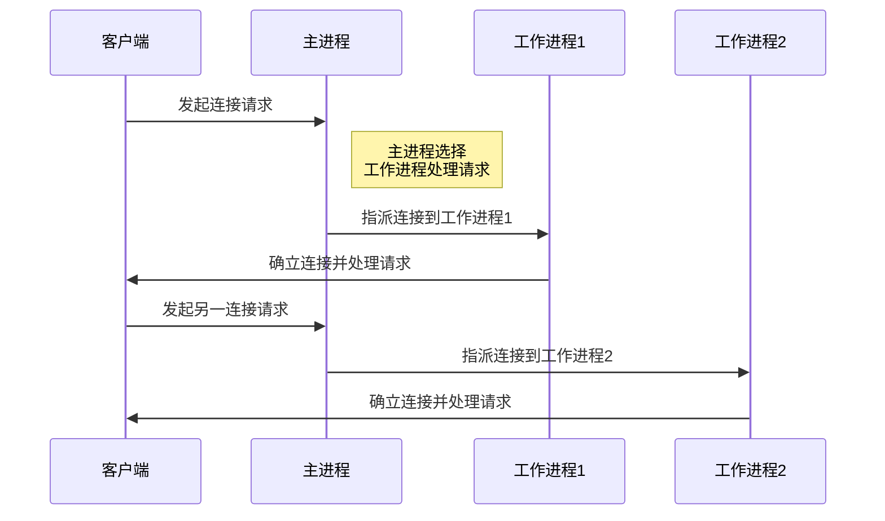
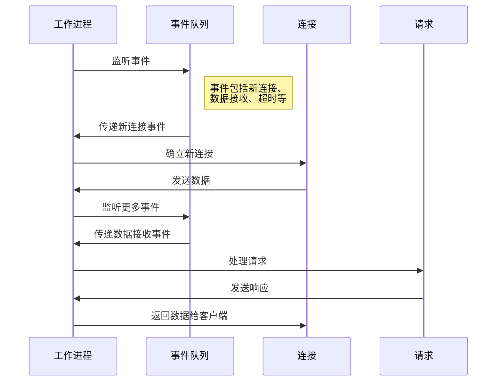
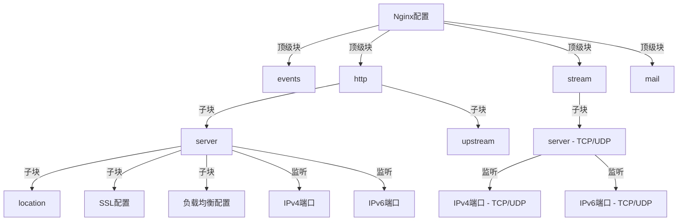

## 概述

Nginx（发音为“Engine-X”）是一个开源的高性能 HTTP 和反向代理服务器，以及一个 IMAP/POP3 代理服务器。Nginx 由俄罗斯的程序员 Igor Sysoev 为解决 C10k 问题（即同时处理 10,000 个客户端连接的问题）而设计，并于 2004 年首次公开发布。自那时起，它因其高稳定性、丰富的功能集、简单的配置文件以及低资源消耗而广受欢迎。

Nginx 的设计理念是使用尽可能少的资源，通过异步、事件驱动的架构处理大量并发连接。与传统的同步、多线程或多进程服务器模型不同，Nginx 的非阻塞方式使其在高并发环境下表现出色，尤其是在服务静态内容、执行负载均衡和处理反向代理请求时。

## 主要特性

### 高并发处理

- **事件驱动架构**：Nginx 采用非阻塞、事件驱动的方式处理请求，允许单个工作进程处理数千个并发连接，这使得 Nginx 在高并发环境下表现出色。

### 反向代理与负载均衡

- **反向代理支持**：Nginx 可以作为反向代理服务器，将请求转发到后端服务器，支持负载均衡、缓存静态和动态内容、SSL 终端等功能。
- **负载均衡算法**：提供多种负载均衡方法，包括轮询、权重、IP 哈希等。

### 高度可配置

- **灵活的配置语法**：Nginx 的配置文件清晰、灵活，可以精细地控制到每个请求的处理方式，易于理解和修改。
- **模块化设计**：提供丰富的模块，如 HTTP、mail、stream 等，并支持第三方模块扩展，使功能高度可定制。

### 性能优化

- **高效的静态内容服务**：对于静态资源，Nginx 可以直接从内核缓存中提供文件，减少磁盘 IO 操作。
- **缓存机制**：Nginx 提供强大的缓存功能，可以缓存来自后端服务器的内容，减少重复请求的处理时间。

### 安全特性

- **SSL/TLS 支持**：可以为 HTTP 服务提供 SSL/TLS 加密，保护数据传输安全。
- **限制与认证**：支持基于 IP、密码的访问控制，以及限制请求频率等安全功能。

## 基本概念

### 处理连接的方式

Nginx 使用单一的主进程 (master process) 和多个工作进程 (worker processes) 来处理连接。这种多进程模型可以有效地分摊负载并充分利用多核心服务器的能力。

- **主进程**：负责读取和评估配置文件，管理工作进程。
- **工作进程**：处理实际的客户端请求。每个工作进程都是独立的，它们接收主进程分配的任务并独立完成。



### 事件驱动模型

事件驱动模型是 Nginx 性能高效的核心。在这种模型中，工作进程不断地监听事件，如连接请求、接收数据或发送数据。当这些事件发生时，工作进程会非阻塞地响应并处理它们，这意味着每个工作进程能同时处理多个连接。

- **非阻塞**：工作进程在等待一个连接的输入/输出时，可以转而处理其他连接的事件。
- **异步**：处理请求的各个阶段（如接收请求、处理请求、发送响应）可以不连续进行。



## 产品对比

| 特性/性能         | Apache                                      | Nginx                                        |
| ----------------- | ------------------------------------------- | -------------------------------------------- |
| **架构**          | 多进程/多线程模型                           | 事件驱动模型                                 |
| **并发处理**      | 预先生成线程/进程处理请求，适合低至中等并发 | 单线程处理多个请求，高并发性能优异           |
| **性能**          | 动态内容处理优秀，静态内容相对较慢          | 静态内容处理极快，动态内容需要与其他应用配合 |
| **内存与 CPU 效率** | 较高的内存和 CPU 消耗                         | 更低的内存和 CPU 消耗                          |
| **配置**          | .htaccess 文件提供灵活的目录级配置           | 集中式配置，更易于维护但初学者可能觉得复杂   |
| **模块**          | 丰富的模块，灵活性高                        | 丰富的模块，但安装和配置较为复杂             |
| **负载均衡**      | 模块较少，通常需要额外软件支持              | 内置支持，且配置简单强大                     |
| **文件描述符**    | 每个连接一个文件描述符                      | 一个工作进程处理多个连接，减少文件描述符消耗 |
| **安全**          | 稳健的模块和社区支持，但配置不当可能有风险  | 较低的历史漏洞记录，配置较为安全             |
| **可靠性**        | 长期稳定，广泛应用                          | 高并发下更稳定，但相对较新                   |
| **社区与文档**    | 庞大的社区，丰富的文档资源                  | 社区活跃，文档日渐完善                       |
| **适用场景**      | 适合动态重的应用，需要灵活的配置            | 静态内容、高并发和反向代理优势显著           |

## 使用场景

以下是 Nginx 主流使用场景和优势：

| 使用场景                | 描述                                                         | 优势                                                  |
| ----------------------- | ------------------------------------------------------------ | ----------------------------------------------------- |
| **静态内容的 Web 服务器** | 直接向用户提供静态资源，如图片、HTML、CSS 和 JavaScript 文件。  | **高效处理静态内容**：快速响应，支持高并发连接。      |
| **反向代理与负载均衡**  | 将用户的请求代理到内部的一个或多个服务器，并将结果返回给用户。 | **提高可扩展性和可用性**：实现请求的分发和负载均衡。  |
| **动态内容的缓存**      | 缓存后端服务器的动态内容，如通过 FastCGI 为 PHP 应用提供的内容。 | **减少后端负载**：提高响应速度和整体性能。            |
| **前端性能优化**        | 通过压缩、缓存优化等手段改善前端资源的加载速度。             | **改善用户体验**：提高页面加载速度。                  |
| **安全网关**            | 提供 SSL/TLS 加密，实现安全的数据传输。                        | **确保传输安全**：防止中间人攻击等安全威胁。          |
| **API 网关**             | 管理和控制对后端服务的 API 调用。                              | **统一 API 管理**：支持请求路由、身份验证、限流等功能。 |

## 安装使用

- **Linux**：大多数 Linux 发行版都可以通过包管理器（APT、YUM 等）安装 Nginx。对于更高级的用户，也可以从源代码编译以更好地控制安装。
- **Windows**：可以从 Nginx 官方网站下载预编译的 Windows 版本。
- **MacOS**：通常通过 Homebrew 等包管理器安装。

| 功能                  | 命令                           | 描述                                             |
| --------------------- | ------------------------------ | ------------------------------------------------ |
| 启动 Nginx             | `sudo systemctl start nginx`   | 用于 Linux 系统启动 Nginx 服务。                     |
| 停止 Nginx（快速停止） | `sudo nginx -s stop`           | 立即终止 Nginx 服务。                              |
| 停止 Nginx（优雅停止） | `sudo nginx -s quit`           | 等待当前处理的请求结束后终止 Nginx 服务。          |
| 重新加载配置          | `sudo nginx -s reload`         | 在不停止服务的情况下重新加载配置文件。           |
| 测试配置文件          | `sudo nginx -t`                | 测试 Nginx 配置文件的语法正确性。                  |
| 查看 Nginx 版本         | `nginx -v`                     | 显示安装的 Nginx 版本。                            |
| 查看 Nginx 编译选项     | `nginx -V`                     | 显示 Nginx 的编译选项和配置参数。                  |
| 重启 Nginx             | `sudo systemctl restart nginx` | 用于 Linux 系统，停止再启动 Nginx 服务。             |
| 启用 Nginx 自动启动     | `sudo systemctl enable nginx`  | 设置 Nginx 在系统启动时自动启动（仅限 Linux 系统）。 |
| 禁用 Nginx 自动启动     | `sudo systemctl disable nginx` | 禁止 Nginx 在系统启动时自动启动（仅限 Linux 系统）。 |

## 基础配置

Nginx 的配置文件通常位于 `/etc/nginx/nginx.conf`。关键部分包括：

- **events 块**：配置影响 Nginx 服务器或与客户端网络连接相关的参数。
- **http 块**：定义 HTTP 服务器全局配置，如文件类型、日志格式、默认文件类型等。
    - **server 块**：定义虚拟主机及其行为，如监听的端口和服务器名。
    - **location 块**：基于请求的 URI 进行匹配，并定义处理特定类型请求的行为。
- **mail 块**（可选）：为邮件代理服务提供配置，如 SMTP、IMAP 和 POP3。
- **stream 块**（可选）：为非 HTTP 协议（如 TCP 和 UDP）提供配置。

| 块        | 允许的数量 |
| --------- | ---------- |
| `events`  | 1          |
| `http`    | 1          |
| `mail`    | 1          |
| `stream`  | 1          |
| `include` | 多个       |
| 自定义块  | 根据需要   |

### 层级

```nginx
# 全局设置
events { ... }
http {
    # HTTP全局设置
    ...

    server {
        # 服务器特定设置
        ...

        location / {
            # 处理特定请求的行为
            ...
        }

        location /images/ {
            # 另一个请求处理例子
            ...
        }

        # 其他location块...
    }

    server {
        # 另一个服务器配置
        ...
    }

    # 其他server块...
}

# 邮件服务配置（可选）
mail { ... }

# 流处理配置（可选）
stream { ... }
```



### 模块

在 Nginx 配置文件中，`include` 指令用于包含其他配置文件或片段。这使得配置文件更加模块化和易于管理。以下是使用 `include` 指令的示例：

假设您有一个主要的 Nginx 配置文件，通常是位于 `/etc/nginx/nginx.conf`，并且您希望将一些共享的配置片段包含到这个文件中。

1. 创建一个新的配置文件，例如 `/etc/nginx/shared_config.conf`，并在其中定义共享的配置。这可以包括一些常用的 `server` 块、`location` 块或其他指令。

    例如，`shared_config.conf` 可以包含以下内容：

    ```nginx
    server {
        listen 80;
        server_name example.com;
        location / {
            root /var/www/html;
            index index.html;
        }
    }
    ```

2. 在主要的 Nginx 配置文件 `nginx.conf` 中使用 `include` 指令来引入上述的共享配置文件。在 `http` 块内或其他适当的位置添加如下行：

    ```nginx
    http {
        include /etc/nginx/shared_config.conf;
        # 其他 http 块配置
    }
    ```

    或者，如果要在 `server` 块中包含配置，可以在 `server` 块内部使用 `include` 指令：

    ```nginx
    server {
        # 其他 server 块配置
        include /etc/nginx/shared_config.conf;
    }
    ```

3. 重新加载或重启 Nginx 服务器，以使配置生效。

    通常可以使用以下命令重新加载配置：

    ```shell
    sudo nginx -s reload
    ```

这样可以将共享的配置块存储在单独的文件中，并在需要的位置使用 `include` 指令引入，从而更好地组织和管理您的 Nginx 配置文件。这对于在多个虚拟主机之间共享配置或维护模块化的配置非常有用。

### 示例

```nginx
user  nginx;  # 定义Nginx运行的用户
worker_processes  auto;  # 工作进程数，建议设置为CPU核心数，auto表示自动检测
error_log  /var/log/nginx/error.log warn;  # 错误日志文件的位置和记录级别
pid        /var/run/nginx.pid;  # 存储Nginx主进程ID的文件位置

events {
    worker_connections  1024;  # 单个工作进程的最大连接数
    multi_accept on;  # 设置为on表示一个工作进程可以同时接受多个新连接
    use epoll;  # 使用epoll事件模型，这是在Linux上的一种高效的事件处理机制
}

http {
    include       mime.types;  # 包含MIME类型设置
    default_type  application/octet-stream;

    # 日志格式定义
    log_format  main  '$remote_addr - $remote_user [$time_local] "$request" '
                      '$status $body_bytes_sent "$http_referer" '
                      '"$http_user_agent" "$http_x_forwarded_for"';

    # 访问日志路径
    access_log  /var/log/nginx/access.log  main;
    
    # 文件传输优化
    sendfile        on;  # 开启高效文件传输模式
    tcp_nopush     on;  # 开启防止网络拥塞的优化
    tcp_nodelay    on;  # 开启不延迟发送数据的优化

    # 保持长连接的超时时间
    keepalive_timeout  65;

    # SSL 配置
    ssl_certificate     /path/to/cert.pem;
    ssl_certificate_key /path/to/cert.key;
    ssl_protocols       TLSv1.2 TLSv1.3;
    ssl_ciphers         HIGH:!aNULL:!MD5;

    # 服务器定义
    server {
        listen       80;   # 监听IPv4端口
        listen       [::]:80;  # 监听IPv6端口

        server_name  localhost;  # 服务器名称

        # 根目录和索引文件设置
        location / {
            root   /usr/share/nginx/html;  # 网站根目录
            index  index.html index.htm;  # 默认页面
        }

        # 负载均衡配置
        location /load_balanced_app {
            proxy_pass http://my_load_balancer;  # 反向代理到负载均衡器
        }

        # SSL 服务端配置
        listen 443 ssl;
        ssl_certificate /path/to/ssl/cert.pem;
        ssl_certificate_key /path/to/ssl/key.pem;
    }

    # 负载均衡器定义
    upstream my_load_balancer {
        server backend1.example.com;
        server backend2.example.com;
        server backend3.example.com;
    }
}

stream {
    # TCP/UDP流设置（示例）
    server {
        listen 12345;
        proxy_pass backend.example.com:12345;
    }

    # IPv6 TCP/UDP 代理
    server {
        listen [::]:12345;
        proxy_pass backend.example.com:12345;
    }
}

mail {
    # 邮件服务设置（示例）
    server_name mail.example.com;
    auth_http   localhost/auth_http;
}
```
