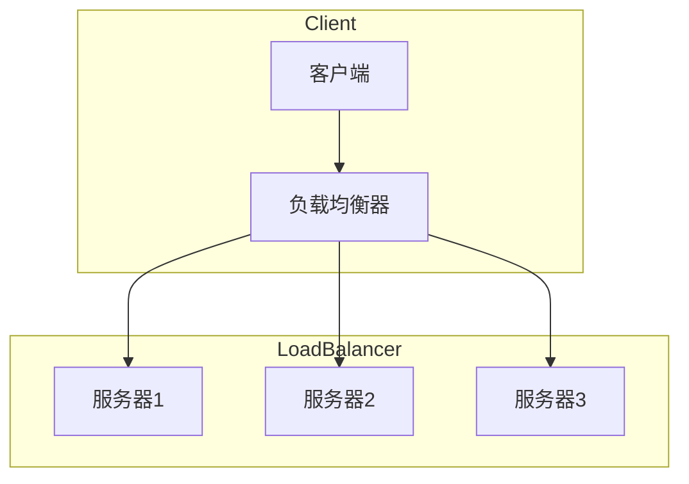

## 基础理论

### 负载均衡是什么？

> 负载均衡是现代高可用、高性能网站架构的核心组件。

负载均衡（Server Load Balancer，简称 SLB）是一种网络负载均衡服务，它在多个服务器（通常称为后端服务器）之间分配网络或应用程序流量。这样做的目的是优化资源使用，最大化吞吐量，最小化响应时间，并确保高可用性。



### 负载均衡的重要性

- **可靠性**：如果一个服务器失败，负载均衡器可以将流量重定向到健康的服务器，确保服务的持续性。
- **可扩展性**：随着需求的增加，可以轻松地添加更多的服务器来处理增加的流量。
- **性能**：通过分配请求，确保没有单个服务器承受过多的负载。
- **灵活性**：负载均衡器可以动态地添加或删除服务器，以应对不同的负载需求。

### 负载均衡的方法

- **轮询（Round Robin）**：每个请求按顺序轮流分配到不同的服务器。这种方法简单且易于实现，**适用于服务器性能大致相同的场景。**

    ```mermaid
    sequenceDiagram
        participant Client
        participant LoadBalancer
        participant Server1
        participant Server2
    
        Client->>LoadBalancer: 发送请求
        LoadBalancer->>Server1: 将请求转发给Server1
        Server1->>LoadBalancer: 处理请求并响应
        LoadBalancer->>Client: 将Server1的响应返回给Client
    
        Client->>LoadBalancer: 发送请求
        LoadBalancer->>Server2: 将请求转发给Server2
        Server2->>LoadBalancer: 处理请求并响应
        LoadBalancer->>Client: 将Server2的响应返回给Client
    
        Note right of LoadBalancer: 下一轮请求会轮询到Server1
    
    ```

- **最少连接（Least Connections）**：新的请求会被发送到连接数最少的服务器。这种方法**适用于处理长时间运行的连接或会话。**

    ```mermaid
    sequenceDiagram
        participant Client
        participant LoadBalancer
        participant Server1
        participant Server2
        participant Server3
    
        Client->>LoadBalancer: 发送请求
        LoadBalancer->>Server1: 将请求转发给Server1
        Server1->>LoadBalancer: 处理请求并响应
        LoadBalancer->>Client: 将Server1的响应返回给Client
    
        Client->>LoadBalancer: 发送请求
        LoadBalancer->>Server2: 将请求转发给Server2
        Server2->>LoadBalancer: 处理请求并响应
        LoadBalancer->>Client: 将Server2的响应返回给Client
    
        Client->>LoadBalancer: 发送请求
        LoadBalancer->>Server3: 将请求转发给Server3
        Server3->>LoadBalancer: 处理请求并响应
        LoadBalancer->>Client: 将Server3的响应返回给Client
    
        Client->>LoadBalancer: 发送请求
        LoadBalancer->>Server1: 将请求转发给Server1（因为Server1连接数最少）
        Server1->>LoadBalancer: 处理请求并响应
        LoadBalancer->>Client: 将Server1的响应返回给Client
    
        Note right of LoadBalancer: 使用最小连接数策略
    ```

- **哈希（Hash）**：根据请求的参数（如客户端 IP 地址、URL、Cookie 等）Hash 决定将请求发送到哪个服务器，**确保来自同一客户端的请求总是被发送到同一服务器**。这种方法有助于实现会话持久性，适用于需要维持用户状态的应用。

    ```mermaid
    sequenceDiagram
        participant Client
        participant LoadBalancer
        participant Server1
        participant Server2
        participant Server3
    
        Client->>LoadBalancer: 发送请求
        LoadBalancer->>Server1: 根据客户端IP哈希值选择Server1
        Server1->>LoadBalancer: 处理请求并响应
        LoadBalancer->>Client: 将Server1的响应返回给Client
    
        Client->>LoadBalancer: 发送请求
        LoadBalancer->>Server2: 根据客户端IP哈希值选择Server2
        Server2->>LoadBalancer: 处理请求并响应
        LoadBalancer->>Client: 将Server2的响应返回给Client
    
        Client->>LoadBalancer: 发送请求
        LoadBalancer->>Server3: 根据客户端IP哈希值选择Server3
        Server3->>LoadBalancer: 处理请求并响应
        LoadBalancer->>Client: 将Server3的响应返回给Client
    
        Note right of LoadBalancer: 使用IP哈希策略
    
    ```

## Nginx 负载均衡

Nginx 是一个轻量级的 Web 服务器/反向代理服务器及电子邮件（IMAP/POP3）代理服务器，并在一个 BSD-like 协议下发行。由于其高性能、稳定性、丰富的功能集、简单的配置以及低资源消耗，Nginx 在全球范围内被广泛使用，包括知名的大型网站和服务。

**在 Nginx 中，负载均衡通常可以分为两大类：七层（HTTP ）负载均衡和四层（TCP/UDP）负载均衡。**每种类型都有其特定的用途和配置方法。

### 七层（HTTP ）负载均衡

七层负载均衡操作于应用层，直接处理消息内容。它主要处理基于 TCP 的流量，如 HTTP。通过分析消息内容（例如 URL 或 cookie），进行更精细的路由决策。Nginx 提供了以下关键特性：

- **灵活的负载均衡算法**：包括轮询、最少连接和 IP 哈希等。
- **健康检查**：周期性地检查后端服务器的健康状态，确保流量仅被路由到健康的服务器。Nginx Plus 版本提供更高级的健康检查功能，包括被动和主动健康检查。
- **SSL 终止**：在负载均衡器层面处理 SSL 连接，有效减轻后端服务器的加密和解密负担。
- **会话持久性**：通过特定的策略（如 cookie 或 IP 哈希）保持用户会话与同一后端服务器的连接。
- **动态内容处理**：能够根据请求路径（URI）或请求头等条件将流量智能地路由到不同的应用或服务。
- **高级缓存功能**：提供高效的缓存机制，减少后端服务器的压力并加快内容的响应速度。

#### 配置示例

```nginx
http {
    upstream myapp {
        server backend1.example.com;
        server backend2.example.com;
        server backend3.example.com;
    }

    server {
        listen 80;

        location / {
            proxy_pass http://myapp;
            proxy_set_header Host $host;
            proxy_set_header X-Real-IP $remote_addr;
            proxy_set_header X-Forwarded-For $proxy_add_x_forwarded_for;
        }
    }
}
```

在这个配置中，所有到达端口 80 的 HTTP 请求都会被转发到 `myapp` 这个上游服务器组，Nginx 将会轮询 `backend1`、`backend2`、和 `backend3` 服务器。

### 四层（TCP/UDP）负载均衡

Nginx 在作为四层负载均衡器时，处理非 HTTP 流量，如数据库连接、邮件服务或其他自定义 TCP/UDP 协议。这一功能自 Nginx 1.9.0 版本起被引入，后续版本中增加了对 UDP 的支持。

四层负载均衡器在 OSI 网络模型的传输层上操作，直接处理网络数据包。不同于应用层的七层负载均衡，四层负载均衡通过转发 TCP/UDP 流量，提供高效率和高可用性的服务。

- **通用性**：支持所有基于 TCP 或 UDP 的协议。
- **流量透传**：直接传递 TCP/UDP 流量，保持数据的原始状态。
- **简单的健康检查**：通过检查 TCP 端口是否能接受连接来判断后端服务的健康状态。
- **SSL/TLS 穿透**：实现 SSL/TLS 穿透，即直接将加密的流量转发给后端的 SSL/TLS 终点。
- **高效率**：因为不需要处理复杂的应用层内容，所以转发效率高于七层负载均衡。

#### 配置示例

```nginx
stream {
    upstream myapp_tcp {
        server backend1.example.com:1234;
        server backend2.example.com:1234;
    }

    server {
        listen 1234;
		
        proxy_pass myapp_tcp;
    }
}
```

### 内置策略

#### 轮询

**默认策略**，按时间顺序逐一分配到不同的后端服务器，如果后端服务挂了，能自动剔除。

```nginx
upstream backend {
  server 127.0.0.1:3000;
  server 127.0.0.1:3001;
}
```

#### 加权轮询

与轮询相似，但可以指定权重，`weight` 值越大，分配到的访问几率越高。

```nginx
upstream backend {
  server 127.0.0.1:3000 weight=2;
  server 127.0.0.1:3001 weight=1;
}
```

#### 关键值 Hash

自定义 key（如 IP 地址、请求头、cookie 等）作为 hash 的依据，决定请求应该转发到哪个服务器。

```nginx
upstream backend {
  hash $remote_addr;  # 使用客户端IP地址作为hash键值
  server 127.0.0.1:3000;
  server 127.0.0.1:3001;
}
```

#### ip_hash

每个请求按访问 IP 的 hash 结果分配，可以解决动态网页 session 共享问题。

```nginx
upstream backend {
  ip_hash;
  server 127.0.0.1:3000;
  server 127.0.0.1:3001;
}
```

#### least_conn

最少连接数策略，那个机器连接数少就分配到那个机器，适用于处理长时间运行的连接。

```nginx
upstream backend {
  least_conn;
  server 127.0.0.1:3000;
  server 127.0.0.1:3001;
}
```

### 配置选项

| 配置选项     | 描述                                             | 语句示例                                                     |
| ------------ | ------------------------------------------------ | ------------------------------------------------------------ |
| backup       | 标记服务器为备份服务器，仅在主服务器不可用时使用 | `upstream backend { server server1; server server2 backup; }` |
| down         | 标记服务器为永久离线状态                         | `upstream backend { server server1 down; server server2; }`  |
| max_fails    | 允许请求失败的次数，默认为 1                      | `upstream backend { server server1 max_fails=3 fail_timeout=30s; }` |
| fail_timeout | 经过 max_fails 失败后，服务暂停的时间              | 同上，通常与 max_fails 一起配置                                |
| weight       | 设置服务器的权重，默认为 1                        | `upstream backend { server server1 weight=2; server server2; }` |
| max_conns    | 限制最大的接收的连接数                           | `upstream backend { server server1 max_conns=100; }`         |

### 常见示例

```nginx
# 基本的加权和备份服务器配置
upstream backend {
  server 127.0.0.1:3000 weight=3;
  server 127.0.0.1:3001 weight=2;
  server 127.0.0.1:3002 backup;  # 备份服务器
}

# 组合健康检查和备份
# 当它们连续失败超过max_fails次后，在fail_timeout时间内被认为是不可用的。
upstream backend {
  server 127.0.0.1:3000 max_fails=2 fail_timeout=30s;
  server 127.0.0.1:3001 max_fails=2 fail_timeout=30s;
  server 127.0.0.1:3002 backup;  # 备份服务器
}

# 使用权重、连接数限制和离线状态
upstream backend {
  server 127.0.0.1:3000 weight=3 max_conns=100;
  server 127.0.0.1:3001 weight=2 max_conns=150;
  server 127.0.0.1:3002 down;  # 暂时离线的服务器
}

# 综合使用所有配置
upstream backend {
  server 127.0.0.1:3000 weight=3 max_fails=2 fail_timeout=30s max_conns=100;
  server 127.0.0.1:3001 weight=2 max_fails=2 fail_timeout=30s max_conns=150;
  server 127.0.0.1:3002 backup;  # 备份服务器
}
```
