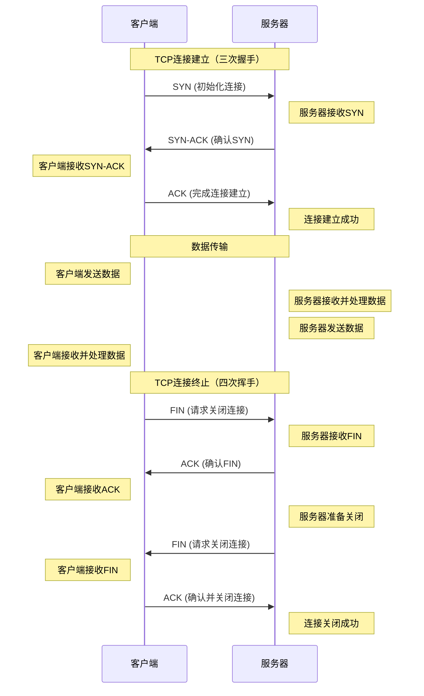

## 概述

TCP（传输控制协议）始于 1970 年代，由 Vint Cerf 和 Bob Kahn 两位 DARPA（美国国防高级研究计划局）的科学家共同开发。TCP 作为互联网协议套件的核心部分，最初是为了在网络节点之间分享资源而设计的，采用了分组交换技术。

最初的 TCP 协议在 1974 年由 Vint Cerf、Yogen Dalal 和 Carl Sunshine 提出，并于 1974 年底公布了 RFC 675 文件，这是 TCP 的首次正式规范。TCP 最早是作为一个统一的传输控制程序出现的，后来被分解为模块化的架构，形成了 TCP 和 IP 两个独立的协议。这一过程最终演变成了非正式称呼的 TCP/IP 模型。

TCP/IP 在 1983 年被采纳为 ARPANET（互联网的前身）的协议标准，标志着 TCP/IP 正式成为互联网的基础。2004 年，Vint Cerf 和 Bob Kahn 因其在 TCP/IP 上的基础性工作而获得了图灵奖。

**TCP 作为一种面向连接的协议，其建立连接的过程采用了三次握手机制，确保了连接的可靠性。** 它还实现了重传和错误检测机制，提高了数据传输的可靠性。与此同时，TCP 也提供了网络拥塞避免的机制。TCP 头部通常包含 20 字节大小，用于连接和数据传输的控制信息，后面可以跟随最多 40 字节的额外信息。

随着互联网的发展，TCP 经历了多次更新和改进，以适应不断变化的网络环境和需求。总的来说，TCP 作为互联网的关键部分，对计算机网络的发展历史产生了深远的影响

TCP（传输控制协议）是一种面向连接的、可靠的、基于字节流的传输层通信协议，广泛用于互联网上的数据传输。以下是对 TCP 协议的系统全面讲解：

## TCP 核心特性

- **面向连接：** TCP 是一种面向连接的协议，意味着在数据开始传输之前，必须先在发送方和接收方之间建立一个稳定的连接。
- **可靠性：** TCP 提供可靠的数据传输服务。这是通过序列号、确认应答、数据重传以及校验和机制来实现的。如果数据在传输过程中丢失或出错，TCP 将重新发送这些数据。
- **流量控制：** TCP 使用滑动窗口机制进行流量控制，以防止网络拥堵。这确保了发送方不会超过接收方处理能力的速度发送数据。
- **拥塞控制：** TCP 实现了拥塞控制算法（如慢启动、拥塞避免、快速恢复和快速重传），以应对网络中的拥塞情况。这些机制有助于动态调整数据传输速率，以避免网络过载。
- **三次握手机制：** TCP 连接的建立采用三次握手机制（SYN，SYN-ACK，ACK），确保双方都准备好进行数据传输。
- **四次挥手断开连接：** TCP 连接的终止是通过四次挥手过程来实现的，确保双方都已完成数据传输并同意关闭连接。
- **有序传输：** TCP 保证数据按照发送的顺序到达接收端。如果接收到的数据片段不是按顺序的，TCP 将重新排序，以确保数据的正确顺序。
- **端到端通信：** TCP 提供端到端的通信。每个 TCP 连接唯一地被定义为包含源 IP 地址、源端口、目的 IP 地址和目的端口的四元组。

## TCP 连接建立和终止

### TCP 连接建立（三次握手）

1. **SYN（同步）**：
    1. **客户端**发送一个 SYN（同步）数据包到服务器，并在数据包中指定客户端的初始序列号（ISN）。这个序列号是随机生成的，用于标识传输的数据段。
    2. 这表示客户端希望建立连接，并开始序列号计数。
2. **SYN-ACK（同步确认）**：
    1. **服务器**接收到 SYN 数据包后，回复一个 SYN-ACK 数据包。这个数据包同时承载着服务器的初始序列号，以及对客户端 SYN 的确认。
    2. 服务器的确认号是客户端序列号加一，表示服务器已经准备好接收客户端从该序列号开始的数据。
3. **ACK（确认）**：
    1. **客户端**收到 SYN-ACK 后，发送一个 ACK 数据包给服务器。这个 ACK 数据包包含客户端对服务器 SYN-ACK 的确认。
    2. 客户端的确认号是服务器序列号加一，表示客户端已准备好接收服务器从该序列号开始的数据。
    3. 此时，连接建立完成，双方可以开始数据传输。

### TCP 连接终止（四次挥手）

1. **FIN（结束）**：
    1. 当**客户端**完成数据发送后，它发送一个带有 FIN 标志的数据包给服务器，表明客户端已经没有数据要发送了，并希望关闭连接。
2. **ACK（确认）**：
    1. **服务器**收到 FIN 后，发送一个 ACK 数据包给客户端，确认已经收到客户端的结束请求。
    2. 服务器此时可能还有数据需要发送给客户端。
3. **服务器的 FIN**：
    1. 一旦**服务器**也完成了数据发送，它同样发送一个带有 FIN 标志的数据包给客户端，表示希望终止连接。
4. **客户端的 ACK**：
    1. **客户端**接收服务器的 FIN 后，发送 ACK 来确认收到服务器的结束请求。
    2. 在发送最后一个 ACK 后，客户端会进入 TIME_WAIT 状态，持续一段时间以确保服务器收到了 ACK，防止网络延迟造成的数据包丢失。

## TCP 头部结构

| 字段名称     | 大小（位） | 描述                                                         |
| ------------ | ---------- | ------------------------------------------------------------ |
| 源端口       | 16         | 标识发送方的端口号。                                         |
| 目的端口     | 16         | 标识接收方的端口号。                                         |
| 序列号       | 32         | 数据段的序列号，用于保证数据的顺序传输。                     |
| 确认号       | 32         | 确认接收到的数据，通常是期望收到的下一个数据段的序列号。     |
| 数据偏移     | 4          | 指示 TCP 头部的长度，以便确定数据内容的起始位置。              |
| 保留         | 6          | 为将来使用保留的位，目前必须设置为 0。                        |
| 标志位       | 6          | 包含多个控制标志，如 SYN、ACK、FIN 等，用于控制 TCP 的状态。     |
| 窗口大小     | 16         | 控制发送方的数据量，用于流量控制。                           |
| 校验和       | 16         | 用于错误检测的校验和。                                       |
| 紧急指针     | 16         | 当 URG 标志位为 1 时，标识紧急数据的结束位置。                   |
| 选项（可选） | 可变       | 可选字段，用于不同的扩展功能，如最大报文段长度（MSS）、窗口扩大因子等。 |
| 填充         | 可变       | 确保 TCP 头部长度是 32 位字的整数倍，仅在必要时添加。            |

| 标志位 | 名称       | 描述                                                         |
| ------ | ---------- | ------------------------------------------------------------ |
| URG    | 紧急指针   | 当设置为 1 时，表示紧急指针字段有效。通常用于传输紧急数据。    |
| ACK    | 确认应答   | 当设置为 1 时，表示确认号字段有效。几乎所有的 TCP 包除了最初的 SYN 包都会设置这个标志。 |
| PSH    | 推送函数   | 当设置为 1 时，建议接收方应尽快将这个报文段交给应用层，而不是等缓冲区满了再发送。 |
| RST    | 复位       | 当设置为 1 时，表示连接中出现严重错误（如因主机崩溃或其他原因），必须释放连接，然后重新建立传输。 |
| SYN    | 同步序列号 | 在连接建立时用来同步序列号。当一个端点希望建立连接时，SYN 标志被设置为 1。 |
| FIN    | 结束       | 当设置为 1 时，表示发送端没有数据再发送，即希望结束连接。      |

## 数据传输

- **序列号和确认号**：序列号用于标识从 TCP 源端向目的端发送的数据字节流的每一个字节，确保数据的有序传递。确认号用于确认收到的数据，并且请求下一个预期的序列号，从而实现对丢失数据的重传。
- **数据分段和重组**：TCP 将较大的数据块分割成更小的段进行传输，这样做可以提高网络的效率和可靠性。接收端负责将这些小段按照序列号重新组装成原始数据。
- **可靠传输机制**：TCP 通过使用校验和、序列号、确认应答以及超时重传等机制，确保数据完整性和可靠性。

## 流量控制

- **滑动窗口机制**：滑动窗口是一种流量控制技术，它允许发送方根据接收方的处理能力和缓冲区大小调整其发送速率，从而避免接收方被过量数据淹没。
- **窗口更新**：TCP 通过不断调整窗口大小（即可发送或接收的数据量）来适应网络条件和接收端的处理能力。
- **阻塞控制**：在接收端缓冲区满时，它会通过设置窗口大小为零来通知发送端停止发送数据，直到缓冲区有足够的空间再次接收数据。

## 拥塞控制

- **慢启动和拥塞避免**：TCP 通过慢启动算法开始传输过程，逐渐增加拥塞窗口的大小来探测网络容量。当达到一个阈值后，便转换到拥塞避免阶段，这时窗口的增长会变得更加保守。
- **快速重传和快速恢复**：在发生丢包时，TCP 通过快速重传机制重新发送丢失的包，而不是等待超时重传计时器的到期。快速恢复算法则是在检测到丢包后调整拥塞窗口和阈值，以快速恢复正常的传输速率。
- **拥塞窗口**：拥塞窗口大小是根据网络的拥塞程度动态调整的，以控制在任一时刻发送到网络上的数据量，从而减少整体网络的拥塞。

## TCP 与 UDP 的比较

| 特性/协议          | TCP                              | UDP                                |
| ------------------ | -------------------------------- | ---------------------------------- |
| **类型**           | 面向连接的协议                   | 无连接的协议                       |
| **可靠性**         | 可靠（保证数据正确传输）         | 不可靠（无法保证数据的正确传输）   |
| **连接建立**       | 需要三次握手建立连接             | 无需建立连接，直接发送数据         |
| **速度/效率**      | 相对较慢，因为要求确认和错误恢复 | 较快，适用于对实时性要求高的应用   |
| **数据传输方式**   | 字节流                           | 数据报                             |
| **顺序传递保证**   | 是（保证数据按顺序到达）         | 否                                 |
| **拥塞控制**       | 有（如慢启动、拥塞避免）         | 无                                 |
| **流量控制**       | 有（使用滑动窗口机制）           | 无                                 |
| **头部开销**       | 较大（20 字节最小）               | 较小（8 字节最小）                  |
| **用途示例**       | 网页浏览、文件传输、电子邮件等   | 实时视频会议、在线游戏、语音通话等 |
| **错误检测和修正** | 有（通过序列号和确认应答）       | 有错误检测，但无修正（只有校验和） |
| **数据包排序**     | 自动重新排序乱序到达的数据包     | 不对数据包进行排序                 |
| **实时性**         | 适用于对可靠性要求高的场景       | 适用于对实时性要求高的场景         |

## 应用场景

**TCP 广泛应用于需要可靠数据传输的场景**，如 Web 浏览（HTTP/HTTPS）、文件传输（FTP）、电子邮件（SMTP、IMAP、POP3）等。

TCP 协议的设计使其成为互联网中最可靠的数据传输协议之一，适用于大多数需要高可靠性的网络应用。虽然在某些方面（如实时性和传输效率）可能不如 UDP，但其稳定和可靠的特性使其在网络通信中占有极其重要的地位。
