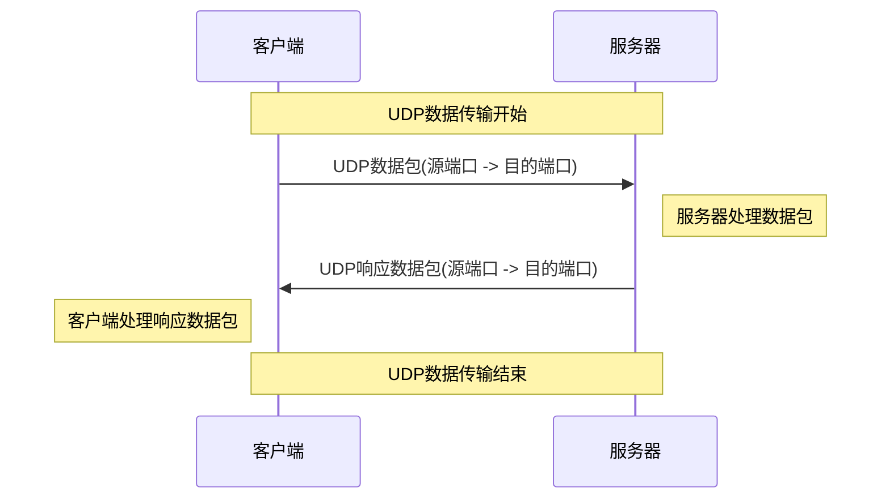

## 概述

UDP（用户数据报协议）是一种无连接的网络协议，由 David P. Reed 设计并于 1980 年在 RFC 768 中首次描述。它是互联网协议套件的一部分，与 TCP 同属于传输层协议，但相较于 TCP，UDP 的设计更为简单，提供更快的数据传输速度。

UDP（用户数据报协议）是一种无连接的网络协议，由 David P. Reed 设计并于 1980 年在 RFC 768 中首次描述。它是互联网协议套件的一部分，与 TCP 同属于传输层协议，但相较于 TCP，UDP 的设计更为简单，提供更快的数据传输速度。

**UDP 的主要特点是它不像 TCP 那样提供可靠性保证。UDP 不进行连接建立，不保证数据包的顺序，也不检测重复或丢失的数据包。**这意味着它能够提供更高效的数据传输服务，尤其适用于那些可以容忍一定数据丢失但对实时性要求较高的应用，如视频会议、实时多人游戏和语音传输。

尽管 UDP 本身在设计上保持不变，但在其基础上开发了许多其他协议来增强功能或满足特定需求，例如 RTP（实时传输协议）和 QUIC（快速 UDP 互联网连接）。后者结合了 TCP 和 UDP 的优点，并增加了加密功能。

在安全性方面，UDP 由于其简单性，可能容易受到网络攻击，如洪水攻击和反射攻击。因此，通常需要额外的安全措施，比如使用防火墙和入侵检测系统来保护基于 UDP 的应用。

总体而言，UDP 由于其低延迟和高效率的特点，在现代互联网通信中仍然扮演着关键角色，并且随着新技术和新应用的发展，它可能会继续演化以适应未来的网络环境和需求。

## UDP 基本特性

- **无连接性**：UDP 是无连接的，意味着在数据传输前不需要建立连接。这减少了建立和维护连接的开销，使得数据传输更为迅速。
- **轻量级协议**：UDP 头部开销小，只有 8 字节，相较于 TCP，这使得 UDP 在网络传输中更高效，特别是对于小数据包的传输。
- **快速传输**：由于无连接和低开销的特点，UDP 能够提供快速的数据传输服务。这对于实时应用（如实时视频流、在线游戏或语音通话）来说非常重要。
- **不保证可靠性**：UDP 不提供数据包的到达确认、顺序保证或重传机制，因此它可能不适合那些需要高可靠性的应用。
- **无流量控制和拥塞控制**：UDP 不进行流量控制和拥塞控制，这意味着在网络条件不佳时，它可能会导致数据丢失。
- **支持广播和多播**：UDP 支持向多个目的地发送数据包，这使得它适用于需要广播或多播功能的应用，如某些类型的网络服务和实时数据传输。
- **错误检测**：尽管 UDP 不保证数据传输的完整性，但它通过校验和提供了基本的错误检测功能，可以识别数据在传输过程中的错误。
- **应用层控制更多**：由于 UDP 本身的功能较少，许多控制机制（如重传策略、数据排序等）需要由应用层实现。这为应用程序开发人员提供了更大的灵活性。

## UDP 头部结构

| 字段名称 | 大小（字节） | 描述                                                         |
| -------- | ------------ | ------------------------------------------------------------ |
| 源端口   | 2            | 表示发送端的端口号。如果发送端是客户端，这通常是一个临时端口。 |
| 目的端口 | 2            | 表示接收端的端口号。这告诉系统哪个应用程序应该接收进来的 UDP 数据包。 |
| 长度     | 2            | 指的是 UDP 头部和数据总共的长度（以字节为单位）。最小值为 8（仅头部）。 |
| 校验和   | 2            | 用于错误检测。它计算整个 UDP 数据包（包括伪头部、头部和数据）的校验和。 |

## 数据传输

## 应用场景

- **实时应用**：例如在线游戏、实时视频会议等，这些应用更注重速度而非数据的绝对完整性。
- **简单查询**：如 DNS 查询通常使用 UDP，因为它需要快速获得响应。
- **广播和多播**：UDP 支持广播和多播传输。

## TCP 与 UDP 的比较

| 特性/协议          | TCP                              | UDP                                |
| ------------------ | -------------------------------- | ---------------------------------- |
| **类型**           | 面向连接的协议                   | 无连接的协议                       |
| **可靠性**         | 可靠（保证数据正确传输）         | 不可靠（无法保证数据的正确传输）   |
| **连接建立**       | 需要三次握手建立连接             | 无需建立连接，直接发送数据         |
| **速度/效率**      | 相对较慢，因为要求确认和错误恢复 | 较快，适用于对实时性要求高的应用   |
| **数据传输方式**   | 字节流                           | 数据报                             |
| **顺序传递保证**   | 是（保证数据按顺序到达）         | 否                                 |
| **拥塞控制**       | 有（如慢启动、拥塞避免）         | 无                                 |
| **流量控制**       | 有（使用滑动窗口机制）           | 无                                 |
| **头部开销**       | 较大（20 字节最小）              | 较小（8 字节最小）                 |
| **用途示例**       | 网页浏览、文件传输、电子邮件等   | 实时视频会议、在线游戏、语音通话等 |
| **错误检测和修正** | 有（通过序列号和确认应答）       | 有错误检测，但无修正（只有校验和） |
| **数据包排序**     | 自动重新排序乱序到达的数据包     | 不对数据包进行排序                 |
| **实时性**         | 适用于对可靠性要求高的场景       | 适用于对实时性要求高的场景         |

## 使用场景和限制

虽然 UDP 提供了更快的数据传输速度，但缺乏 TCP 的许多关键特性，如可靠性和数据顺序保证。因此，在选择 UDP 时，需要考虑应用对数据传输质量的具体要求。

总结来说，UDP 以其简单和高效的特点适用于那些对实时性有较高要求但对数据丢失相对宽容的场景。在设计网络应用或服务时，正确选择 TCP 或 UDP 协议非常关键，这取决于应用的具体需求和特性。
