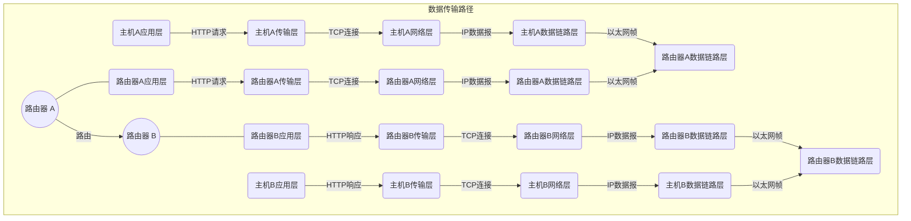

## 网络概述

互联网是一个由全球各种计算机网络相互连接而成的大型网络，可以让人们在任何时间、任何地点连接并交换信息。它是人类历史上最重要的信息革命之一，对人们的生活、工作和学习都产生了深远的影响。

互联网的发展历史可以追溯到 20 世纪 60 年代初，当时美国国防部研究项目 ARPA（高级研究计划署）为了解决军用计算机之间的信息共享问题，开发了一种名为 ARPANET 的计算机网络。在此基础上，随着互联网技术的不断发展，越来越多的计算机网络加入了互联网，并形成了现在的全球互联网。

- 20 世纪 60 年代：美国国防部高级研究计划局（ARPA）开展研究，设计出了一种分组交换网络的方案，称为 ARPANET。
- 20 世纪 70 年代：ARPANET 逐渐扩展到美国各地的大学和研究机构，并且开始出现了电子邮件和文件传输等应用。
- 20 世纪 80 年代：TCP/IP 协议成为互联网的标准协议，互联网的规模进一步扩大，并且开始商业化运营。
- 20 世纪 90 年代：Web 浏览器的出现，使得互联网的应用变得更加易用和普及，互联网的用户数量开始飞速增长。
- 21 世纪以后：互联网的规模继续扩大，出现了移动互联网、云计算、大数据等新技术，互联网的应用也从简单的信息传递演变成了涵盖生活、工作、学习等方方面面的综合性平台。

互联网实现的关键在于互联网协议族（Internet Protocol Suite），通常称为 TCP/IP 协议。TCP/IP 协议提供了一种标准化的方法来在不同的计算机之间进行通信。它由两个协议组成：

- 传输控制协议（TCP）：负责将数据包分解成若干个小数据包，并在接收端重新组装。
- 互联网协议（IP）：负责将数据包从一个网络传输到另一个网络。

在互联网中，每个设备都被分配了一个唯一的 IP 地址，用于标识该设备在网络中的位置。当设备发送数据包时，它会将数据包传送到本地网络上的路由器，然后路由器会根据 IP 地址将数据包传送到目标设备所在的网络上的路由器，直到数据包到达目标设备。

## OSI（开放式系统互联）模型

OSI（开放式系统互联）模型是一个概念性的框架，用于理解和设计网络协议的架构。这个模型由国际标准化组织（ISO）在 1984 年发布，将网络通信分为七个抽象层，每层负责不同的网络功能。下面是对 OSI 七层协议的系统性解释：

### 1. 物理层（Physical Layer）

- **功能**：负责在物理媒介上传输原始的比特流。这涉及到数据的物理连接、电压水平、数据传输速率和物理连接的激活与维护。
- **设备**：例如网线、光纤、中继器、集线器等。

### 2. 数据链路层（Data Link Layer）

- **功能**：在两个相邻节点之间的物理链路上提供可靠的数据传输。它负责帧同步、错误检测和修正、流量控制和帧序列化。
- **设备**：例如网桥、交换机等。

### 3. 网络层（Network Layer）

- **功能**：负责在多个网络之间建立、维护和终止连接。它处理数据包的路由选择和转发。
- **协议**：例如 IP（Internet Protocol）、ICMP（Internet Control Message Protocol）等。

### 4. 传输层（Transport Layer）

- **功能**：为端到端的通信提供服务。它负责数据的分割、传输、错误检测和恢复。
- **协议**：例如 TCP（Transmission Control Protocol）、UDP（User Datagram Protocol）等。

### 5. 会话层（Session Layer）

- **功能**：管理和控制两个网络节点之间的会话连接，负责建立、管理和断开会话。
- **应用**：例如 API、Socket 编程等。

### 6. 表示层（Presentation Layer）

- **功能**：确保从一个节点发送的数据可以被另一个节点的应用层读取和理解。它负责数据格式转换、数据加密和解密、数据压缩等。
- **例子**：ASCII、JPEG、MPEG 等数据格式。

### 7. 应用层（Application Layer）

- **功能**：提供网络服务给最终用户的应用程序。它定义了用于与网络服务交互的各种协议。
- **协议和服务**：例如 HTTP（HyperText Transfer Protocol）、FTP（File Transfer Protocol）、电子邮件、远程登录等。

## 网络协议

| OSI 模型层级            | 功能                                           | 协议/设备             |
| :---------------------- | ---------------------------------------------- | --------------------- |
| 应用层（Application）   | 提供高级服务，例如文件传输、电子邮件和虚拟终端 | HTTP、SMTP、FTP、SSH  |
| 表示层（Presentation）  | 将数据转换为网络标准格式                       | SSL/TLS、JPEG、ASCII  |
| 会话层（Session）       | 管理连接、交换数据                             | NetBIOS、RPC、SSH     |
| 传输层（Transport）     | 提供端到端的可靠数据传输                       | TCP、UDP              |
| 网络层（Network）       | 处理分组在网络中的传输与路由                   | IP、ICMP、OSPF、BGP   |
| 数据链路层（Data Link） | 处理帧在网络中的传输和检错                     | Ethernet、Wi-Fi、HDLC |
| 物理层（Physical）      | 处理比特流在物理媒介中的传输                   | RJ45、Fiber、802.11   |

### 应用层协议

#### SSH

SSH (Secure Shell) 是一种加密的网络协议，用于在不安全的网络上安全地运行命令行 shell。SSH 通常用于远程登录到远程计算机或服务器，并提供文件传输和加密会话功能。

#### FTP

FTP (File Transfer Protocol) 是一种标准的文件传输协议，用于在网络上传输文件。FTP 在 TCP/IP 协议中的传输层上运行，支持两种工作模式：主动模式和被动模式。

#### SMTP

SMTP (Simple Mail Transfer Protocol) 是一种在计算机网络上发送和接收电子邮件的协议。SMTP 定义了电子邮件如何通过网络传输的标准。SMTP 服务器负责接收和发送邮件。

#### HTTP

HTTP (Hypertext Transfer Protocol) 是一种用于在计算机网络上传输超文本文档的协议。HTTP 是万维网的基础协议，支持 Web 浏览器和 Web 服务器之间的通信。

#### DNS

DNS (Domain Name System) 是一种将域名映射到 IP 地址的分布式命名系统。DNS 是在互联网上执行名称解析的基本协议，使用户可以使用易于记忆的域名来访问网络资源。

### 传输层协议

#### TCP

TCP (Transmission Control Protocol) 是一种面向连接的协议，用于在网络上可靠地传输数据。TCP 保证传输的数据的可靠性，使用三次握手来建立连接，四次握手来终止连接。

#### UDP

UDP (User Datagram Protocol) 是一种面向无连接的协议，用于在网络上传输数据包。UDP 不保证数据的可靠性，因此常用于传输实时数据，如音频和视频。

### 网络层协议

#### IPv4

IPv4 (Internet Protocol version 4) 是一种网络层协议，用于在网络上传输数据。IPv4 定义了 IP 地址的格式和分配方式，并为互联网上的每个设备分配唯一的 IP 地址。

#### IPv6

IPv6 (Internet Protocol version 6) 是 IPv4 的下一代协议，用于在网络上传输数据。IPv6 地址长度更长，提供更多的地址空间，并支持更多的协议选项，使网络更加灵活和可扩展。

#### ICMP

ICMP (Internet Control Message Protocol) 是一种在网络上传输控制消息的协议。ICMP 用于发送诊断信息，如 ping 和 traceroute 命令所使用的信息。

### 数据链路层与物理层协议

#### Ethernet

Ethernet 是一种常用的局域网技术，其物理层使用双绞线或光纤传输数据，数据链路层采用 CSMA/CD 技术实现多个设备共享网络资源。Ethernet 还定义了 MAC 地址格式、帧格式等标准，是 TCP/IP 协议族的重要组成部分。

#### Wi-Fi

Wi-Fi 是一种基于无线电波的局域网技术，采用无线信号传输数据，常用于家庭和公共场所的无线网络。Wi-Fi 还定义了各种标准，如 802.11b、802.11g、802.11n 等，以支持不同的无线传输速率和距离要求。

#### Bluetooth

Bluetooth 是一种短距离无线通信技术，通常用于连接手机、平板电脑、耳机、键盘等设备。Bluetooth 定义了自己的物理层和数据链路层协议，使用频段为 2.4GHz。

### 路由协议

#### RIP

RIP（Routing Information Protocol）是一种基于距离向量的内部网关协议（IGP），用于在小型网络中选择最佳路由。RIP 协议采用 Hop Count 作为路径计算标准，当路由表中某个目的地址的距离超过 15 个跳时，该地址将被认为是不可达的。

#### OSPF

OSPF（Open Shortest Path First）是一种基于链路状态的内部网关协议（IGP），用于在大型网络中选择最佳路由。OSPF 协议将网络划分为多个区域，每个区域拥有自己的链路状态数据库（LSDB），可以实现快速收敛和路由分级。

#### BGP

BGP（Border Gateway Protocol）是一种外部网关协议（EGP），用于在不同自治系统之间交换路由信息。BGP 协议可以实现路由的动态学习和选择，支持多路径和路由策略等功能。BGP 是互联网核心路由器之间的主要协议。

#### IS-IS

IS-IS（Intermediate System to Intermediate System）是一种基于链路状态的内部网关协议（IGP），用于在大型网络中选择最佳路由。IS-IS 协议类似于 OSPF 协议，但使用的是双向链路，可以提供更高效的路由选择。IS-IS 协议常用于 ISP 内部网络和数据中心网络。

### 网络设备

网络设备是用于组建计算机网络的硬件。它们用于确保数据在网络中的正确传输，并在不同设备之间建立连接。以下是一些常见的网络设备及其功能：

#### 路由器（Router）

路由器是用于在网络中转发数据包的设备，它根据数据包的目的地和网络的拓扑结构来决定数据包应当沿哪条路径传输。路由器连接多个网络，并在这些网络之间传输数据，从而实现网络互联。此外，路由器还可以执行网络地址转换（NAT）以及其他网络层功能，以确保数据包的安全传输。

#### 交换机（Switch）

交换机用于连接网络中的设备，并在它们之间传输数据。交换机通过存储和转发机制，将数据包发送到目标设备。与集线器相比，交换机具有更高的效率，因为它只将数据包发送到目标设备，而不是广播到所有连接的设备。

#### 无线接入点（Wireless Access Point，WAP）

无线接入点是用于将有线网络扩展到无线网络的设备。WAP 在有线网络与无线网络设备之间建立一个桥接，允许无线设备通过无线信号与有线网络通信。它们通常用于扩展网络覆盖范围，提高无线设备的连接性能。

#### 网络集线器（Hub）

网络集线器是一种基本的网络设备，用于连接多台计算机或其他网络设备。集线器接收来自一个设备的数据包，然后将其广播到所有连接的设备。然而，由于这种广播方式，网络集线器在大型网络中效率较低，容易导致网络拥堵。

#### 网络防火墙（Firewall）

网络防火墙是一种用于保护网络安全的设备，它可以阻止未经授权的访问和数据包的传输。防火墙可以在硬件和软件层面实现，通过检查传入和传出的数据包，确定它们是否符合特定的安全规则。防火墙有助于保护网络中的设备免受恶意软件和攻击的侵害。

#### VPN 网关（VPN Gateway）

VPN 网关是一种用于实现虚拟专用网络（VPN）的设备。它允许远程用户通过加密的通道访问内部网络资源，从而提高数据安全性。VPN 网关可以实现企业内部资源的安全共享，以及保护远程办公用户的数据安全。

### 网络拓扑

- 总线拓扑：所有设备都连接到一条公共总线上，每个设备可以发送和接收数据包，总线会将数据包广播给所有设备。
- 星型拓扑：所有设备都连接到一个集线器或交换机，中心设备负责转发和分配数据包。
- 环型拓扑：所有设备连接成一个环形链路，数据包沿着环形链路进行传输，每个设备负责将数据包从一个端口传递到另一个端口。
- 树型拓扑：将多个星型拓扑连接起来，形成一个树状结构，中心节点可以是一个路由器或交换机，每个子节点连接到中心节点。
- 网状拓扑：所有设备之间都可以直接相互连接，没有中心节点，数据包可以通过多条路径进行传输，具有高度的冗余和可靠性。
- 混合拓扑：不同拓扑结构的组合，如星型 - 总线拓扑、星型 - 环型拓扑等。

## 网络服务

### Web 服务

#### Apache

[Apache](https://httpd.apache.org/)（Apache HTTP Server）是一个开源的 Web 服务器软件。它由 [Apache 软件基金会](https://www.apache.org/) 维护，起源于 1995 年。Apache 支持多种操作系统，如 Linux、Unix、Windows 等。Apache 使用模块化的架构，可以通过安装和配置不同的模块来扩展其功能。

Apache 适用于各种规模的网站和应用；未来方向将继续优化性能，提高安全性，支持新的 Web 技术和标准。

#### Nginx

[Nginx](https://nginx.org/) 是一个轻量级的 Web 服务器、反向代理服务器和电子邮件代理服务器。起源于 2002 年，其设计目标是提供高性能、高并发和低内存占用。Nginx 在处理静态资源、负载均衡和反向代理等方面表现出色。

Nginx 适用于高并发、高流量的网站和应用，以及作为反向代理和负载均衡器。

#### IIS

[IIS](https://www.iis.net/)（Internet Information Services）是微软推出的 Web 服务器软件，起源于 1995 年。IIS 只支持 Windows 操作系统。IIS 支持 ASP.NET、PHP 等多种语言，并且可以通过模块扩展其功能。

IIS 适用于依赖于 Windows 平台和 Microsoft 技术的网站和应用。

### DHCP 服务

#### ISC DHCP

[ISC DHCP](https://www.isc.org/dhcp/)（Internet Systems Consortium Dynamic Host Configuration Protocol）是一款开源的、广泛使用的 DHCP 服务器软件，起源于 1999 年。它支持 IPv4 和 IPv6 地址分配，适用于各种规模的网络环境。

ISC DHCP 适用于需要稳定可靠的 DHCP 服务的企业和数据中心。未来将继续优化性能，提高稳定性和安全性，增加新功能。

#### Dnsmasq

dnsmasq 是一个轻量级的 DHCP 和 DNS 服务软件，起源于 2000 年。它的设计目标是为小型网络提供简单易用的服务。dnsmasq 支持 IPv4 和 IPv6 地址分配，以及 DNS 缓存功能。

dnsmasq 适用于家庭、小型企业和实验室等小型网络环境。未来将继续保持轻量级特点，优化性能，增加新功能。

### DNS 服务

#### BIND

[BIND](https://www.isc.org/bind/)（Berkeley Internet Name Domain）是一款开源的 DNS 服务器软件，起源于 1980 年代。它是目前最广泛使用的 DNS 服务器软件，支持各种操作系统，如 Linux、Unix、Windows 等。

BIND 适用于需要完整功能的 DNS 服务的企业和数据中心。

#### Unbound

[Unbound](https://nlnetlabs.nl/) 是一个开源的、专注于安全和高性能的 DNS 服务器软件，起源于 2004 年。它采用了模块化的设计，支持 DNSSEC 和其他安全相关功能。

Unbound 适用于需要高性能和安全的 DNS 服务的企业和数据中心。

#### PowerDNS

[PowerDNS](https://www.powerdns.com/) 是一个开源的、功能强大的 DNS 服务器软件，起源于 2000 年。它支持多种后端数据库，如 MySQL、PostgreSQL、SQLite 等。PowerDNS 提供了灵活的 API，方便进行二次开发和集成。

PowerDNS 适用于需要与数据库集成、自定义开发和高度可配置的 DNS 服务的企业和数据中心。

### NTP 服务

#### Chrony

[Chrony](https://chrony.tuxfamily.org/) 是一个开源的 NTP（Network Time Protocol）服务器和客户端软件，起源于 1997 年。它具有高度可配置的特点，可以在各种网络环境中提供精确的时间同步服务。

Chrony 适用于需要精确时间同步服务的企业、数据中心和科研机构。

#### NTPd

NTPd（Network Time Protocol daemon）是一款开源的 NTP 服务器和客户端软件，起源于 1985 年。它广泛应用于各种规模的网络环境，支持各种操作系统。

NTPd 适用于各种规模的网络环境，需要可靠的时间同步服务。

### VPN 服务

#### OpenVPN

[OpenVPN](https://openvpn.net/) 是一个开源的 VPN（Virtual Private Network）软件，起源于 2001 年。它基于 SSL/TLS 协议，提供安全稳定的远程访问和站点间连接功能。

OpenVPN 适用于需要安全远程访问和站点间连接的企业和个人用户。

#### IPSec

IPSec（Internet Protocol Security）是一组用于保护 IP 数据包的协议，起源于 1990 年代。IPSec 提供了认证、完整性和加密功能，广泛应用于 VPN 场景。

IPSec 适用于需要安全通信和网络互联的企业和数据中心。

#### WireGuard

[WireGuard](https://www.wireguard.com/) 是一个简单、高性能的 VPN 软件，起源于 2016 年。它使用现代加密技术，具有易于配置和部署的特点。

WireGuard 适用于需要简单易用、高性能 VPN 的企业和个人用户。

### 负载均衡

#### HAProxy

[HAProxy](https://www.haproxy.org/)（High Availability Proxy）是一个开源的、高性能的负载均衡软件，起源于 2000 年。它可以用于分发 TCP 和 HTTP 流量，广泛应用于大型网站和云计算环境。

HAProxy 适用于需要高性能、高可用性负载均衡服务的大型网站和云计算环境。

#### LVS

LVS（Linux Virtual Server）是一个开源的、基于 Linux 内核的负载均衡软件，起源于 1998 年。它支持 TCP 和 UDP 协议，可以用于分发各种网络服务。

LVS 适用于需要高性能、高可用性负载均衡服务的大型网站和数据中心。

### 文件共享服务

#### Samba

[Samba](https://www.samba.org/) 是一个开源的文件共享服务软件，起源于 1992 年。它允许在不同操作系统（如 Linux、Windows 和 macOS）之间共享文件和打印机。

Samba 适用于需要在不同操作系统之间共享文件和打印机的企业和家庭网络环境。

#### NFS

NFS（Network File System）是一种分布式文件系统协议，起源于 1984 年。它允许在 UNIX/Linux 系统之间共享文件。

NFS 适用于需要在 UNIX/Linux 系统之间共享文件的企业和数据中心。

#### SFTP

SFTP（SSH File Transfer Protocol）是一种基于 SSH 协议的文件传输协议，起源于 1990 年代。它提供安全的、加密的文件传输服务。

SFTP 适用于需要安全传输文件的企业和个人用户。

### 邮件服务

#### Postfix

[Postfix](https://www.postfix.org/) 是一个开源的邮件传输代理（MTA），起源于 1997 年。它用于接收、路由和发送电子邮件。

Postfix 适用于需要高性能、可靠的邮件传输服务的企业和数据中心。

#### Sendmail

Sendmail 是一个经典的邮件传输代理（MTA），起源于 1981 年。它用于接收、路由和发送电子邮件。

Sendmail 适用于需要灵活、可定制的邮件传输服务的企业和数据中心。

#### Dovecot

[Dovecot](https://www.dovecot.org/) 是一个开源的邮件传输代理（MTA），起源于 2002 年。它主要用于提供邮件接收和存储服务。

Dovecot 适用于需要高性能、可靠的邮件接收和存储服务的企业和数据中心。

#### Exim

[Exim](https://www.exim.org/) 是一个开源的邮件传输代理（MTA），起源于 1995 年。它用于接收、路由和发送电子邮件。

Exim 适用于需要灵活、可定制的邮件传输服务的企业和数据中心。
