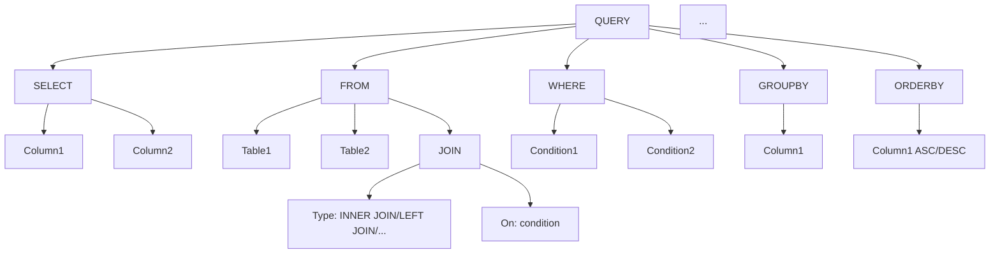

## 概述

SQL（Structured Query Language）是一种用于管理关系型数据库的强大语言。它的历史可以追溯到 1970 年，当时 IBM 的研究员 Edgar F. Codd 发表了论文 A Relational Model of Data for Large Shared Data Banks 中首次提出。最初，SQL 被称为 SEQUEL（Structured English Query Language），后来被简化为 SQL。

SQL 语句根据其功能主要分为四类：DDL、DML、DQL、DCL。

| 分类 | 全拼                       | 说明                                                     |
| :--- | :------------------------- | :------------------------------------------------------- |
| DDL  | Data Definition Language   | 数据定义语言，用来定义数据库对象 (数据库，表，字段)。    |
| DML  | Data Manipulation Language | 数据操作语言，用来对数据库表中的数据进行增删改。         |
| DQL  | Data Query Language        | 数据查询语言，用来查询数据库中表的记录。                 |
| DCL  | Data Control Language      | 数据控制语言，用来创建数据库用户、控制数据库的访问权限。 |

## 语法图



## 数据库操作

### 查询数据库列表

```sql
-- 查询所有数据库
SHOW DATABASES;
```

### 创建和选择数据库

要创建一个新的数据库，使用 `CREATE DATABASE` 语句。如果数据库已经存在，可以使用 `IF NOT EXISTS` 来避免错误。

```sql
-- 创建 my_database 数据库
CREATE DATABASE IF NOT EXISTS my_database DEFAULT CHARSET utf8mb4 COLLATE utf8mb4_general_ci;

-- 选择使用 my_database 数据库
USE my_database;

-- 查询当前数据库
SELECT DATABASE(); -- 输出可能为 my_database
```

### 删除数据库

如果需要删除一个数据库，可以使用 `DROP DATABASE` 语句。请谨慎使用，因为这将永久删除数据库及其数据。

```sql
-- 删除 my_database 数据库
DROP DATABASE IF EXISTS my_database;
```

## 数据表操作

### 数据类型

| 数据类型 | 描述                 | 示例                                                     |
| -------- | -------------------- | -------------------------------------------------------- |
| INT      | 整数                 | `12345`, `-12345`                                        |
| VARCHAR  | 可变长度字符串       | `"Hello"`, `"SQL"`, `"Database"`                         |
| CHAR     | 固定长度字符串       | `CHAR(5)` 可以存储 `"Hello"`                             |
| DATE     | 日期                 | `"2023-09-06"`                                           |
| DATETIME | 日期和时间           | `"2023-09-06 14:45:00"`                                  |
| FLOAT    | 单精度浮点数         | `3.14`, `2.71`                                           |
| DOUBLE   | 双精度浮点数         | `3.14159265359`                                          |
| DECIMAL  | 精确小数，用于金融   | `DECIMAL(5,2)` 可存储范围为 `-999.99` 到 `999.99` 的数字 |
| BLOB     | 二进制数据           | 用于存储图像、音频等                                     |
| TEXT     | 长文本数据           | 用于存储较大的字符串                                     |
| BOOLEAN  | 布尔值               | `TRUE` 或 `FALSE`                                        |
| ENUM     | 枚举，预定义的值集合 | `ENUM('small', 'medium', 'large')`                       |

### 常见约束

| 约束        | 描述         |
| ----------- | ------------ |
| PRIMARY KEY | 主键         |
| FOREIGN KEY | 外键         |
| UNIQUE      | 唯一约束     |
| NOT NULL    | 非空约束     |
| DEFAULT     | 默认值约束   |
| CHECK       | 条件检查约束 |

```sql
-- 1.创建 Users 表
CREATE TABLE Users (
    UserID INT PRIMARY KEY AUTO_INCREMENT,
    Username VARCHAR(50) COMMENT '用户名称',
    Email VARCHAR(100) COMMENT '电子邮件'
) COMMENT '用户信息表';

-- 2.查询 users 表创建语句
SHOW CREATE TABLE Users;

-- 3.查询表结构
DESC Users;

-- 4.查询当前数据库所有表
SHOW TABLES; -- 输出可能包括 users

-- 5.users 表添加 age 字段
ALTER TABLE Users ADD Age INT COMMENT '用户年龄';

-- 6.users 表修改 age 字段数据类型
ALTER TABLE Users MODIFY Age SMALLINT; -- 将年龄字段类型改为 SMALLINT

-- 7.users 表删除 Age 字段
ALTER TABLE Users DROP Age;

-- 8.users 表修改表名 NewUsers
ALTER TABLE Users RENAME TO NewUsers;

-- 9.清空表内容，保留结构
TRUNCATE TABLE NewUsers;

-- 10.删除 NewUsers 表
DROP TABLE IF EXISTS NewUsers;
```

### 查询表结构

要查看表的结构（列、数据类型、约束等），可以使用 `DESC` 命令。

```sql
-- 查询 Users 表结构
DESC Users;
```

### 查询当前数据库中的所有表

使用 `SHOW TABLES;` 命令可以列出当前数据库中的所有表。

```sql
-- 查询当前数据库中的所有表
SHOW TABLES; -- 输出可能包括 Users 表
```

### 修改表结构

可以使用 `ALTER TABLE` 命令来修改表的结构，包括添加、修改和删除列等操作。

```sql
-- 1. 添加列 Age 到 Users 表
ALTER TABLE Users ADD Age INT;

-- 2. 修改列 Age 的数据类型为 SMALLINT
ALTER TABLE Users MODIFY Age SMALLINT;

-- 3. 删除列 Age
ALTER TABLE Users DROP COLUMN Age;
```

### 清空表内容

```sql
-- 清空表内容，保留结构
TRUNCATE TABLE Users;
```

### 删除表

要删除一个表及其数据，可以使用 `DROP TABLE` 命令。

```sql
-- 删除 Users 表
DROP TABLE IF EXISTS Users;
```

## 数据操纵语言（DML）

数据操纵语言（DML）是用于操作数据库中的数据的一组 SQL 命令。与数据定义语言（DDL）不同，**DML 主要用于管理和控制数据库中的数据**，涉及数据的插入、更新和删除操作。

### 插入数据

使用 `INSERT INTO` 命令来插入数据。

```sql
-- 插入完整行数据
INSERT INTO Users (UserID, Username, Email, Age) VALUES (1, 'John Doe', 'johndoe@example.com', 28);

-- 插入部分列数据
INSERT INTO Users (Username, Email) VALUES ('Jane Doe', 'janedoe@example.com');
```

### 更新数据

使用 `UPDATE` 命令来更新数据。

```sql
-- 更新指定行数据
UPDATE Users SET Age = 30 WHERE UserID = 1;

-- 更新整表数据（例如为所有用户年龄加1）
UPDATE Users SET Age = Age + 1;
```

### 删除数据

使用 `DELETE` 命令来删除数据。

```sql
-- 删除指定行数据
DELETE FROM Users WHERE UserID = 1;

-- 删除整表数据（慎用！这将删除所有用户）
DELETE FROM Users;
```

## 数据查询语言（DQL）

数据查询语言（DQL）是用于查询和检索数据库中存储的数据的一组 SQL 命令。DQL 使用户能够访问并操作数据，不会更改数据库中的任何内容，主要涉及数据的检索和显示。

### 基本查询

```sql
-- 1. SELECT - 选择列
SELECT Username, Email FROM Users; -- 选择用户名和电子邮件列

-- 2. FROM - 选择表
SELECT * FROM Users; -- 选择 Users 表的所有列

-- 3. WHERE - 条件过滤
SELECT * FROM Users WHERE Age > 18; -- 选择年龄大于18的记录

-- 4. ORDER BY - 排序结果集
SELECT * FROM Users ORDER BY Age DESC; -- 按年龄降序排列

-- 5. GROUP BY - 对结果集进行分组
SELECT Age, COUNT(*) FROM Users GROUP BY Age; -- 按年龄分组，并统计每个年龄段的用户数

-- 6. HAVING - 对分组后的结果进行过滤
SELECT Age, COUNT(*) FROM Users GROUP BY Age HAVING COUNT(*) > 5; -- 选择用户数大于5的年龄段

```

### 高级查询

```sql
-- JOIN - 连接查询
SELECT Users.Username, Orders.OrderID
FROM Users
JOIN Orders ON Users.UserID = Orders.UserID; -- 连接 Users 和 Orders 表，基于 UserID

-- 子查询 - 嵌套 SELECT 语句
SELECT Username FROM Users WHERE Age = (SELECT MAX(Age) FROM Users); -- 使用子查询来找到年龄最大的用户

-- 聚合函数 - 如 COUNT, SUM, AVG 等
SELECT AVG(Age) FROM Users; -- 计算所有用户的平均年龄

-- 分页查询 - LIMIT, OFFSET
SELECT * FROM Users LIMIT 10 OFFSET 5; -- 查询第6至第15条用户记录
```

## 索引

索引是数据库中的一种特殊的数据结构，**旨在加速查询操作**。通过为表中的一列或多列建立索引，查询操作可以更快地找到数据，而无需逐行扫描整个表。

**优点**:

1. **查询速度**：索引大大提高了查询速度，减少了数据库的查询时间。
2. **数据检索效率**：有了索引，数据的检索变得更加高效。
3. **加速表连接**：在进行 JOIN 操作时，如果涉及到的字段已经被索引，该操作会更加迅速。

**缺点**:

1. **占用空间**：索引虽然可以提高查询速度，但也占据了额外的磁盘空间。
2. **维护成本**：每当有数据插入、更新或删除时，索引也需要进行相应的更新，这可能导致这些操作的速度变慢。

在实际操作中，**索引的使用主要是为了优化查询效率**。当数据表中的数据量较大，或需要频繁查询特定列数据时，使用索引是明智的。那些经常需要排序的列或在 `WHERE` 子句中经常被查询的列，建议创建索引。

然而，对于数据量较小的表，或数据在某列上有大量重复值的表，以及对于经常进行大量的 INSERT、UPDATE 和 DELETE 操作的表，过多的索引可能并不合适，因为维护索引会带来额外的开销。

### 创建索引

```sql
-- 创建名为 idx_Username 的索引，用于 Users 表的 Username 列
CREATE INDEX idx_Username ON Users(Username);
```

### 删除索引

```sql
-- 删除名为 idx_Username 的索引
DROP INDEX idx_Username ON Users;
```

### 索引种类

| **索引种类**                   | **描述**                                       |
| ------------------------------ | ---------------------------------------------- |
| **唯一索引 (UNIQUE INDEX)**    | 确保每行数据在索引列上的值是唯一的。           |
| **主键索引 (PRIMARY INDEX)**   | 唯一索引的一种特殊类型，通常在主键上自动创建。 |
| **全文索引 (FULLTEXT INDEX)**  | 用于在表中执行全文搜索。                       |
| **组合索引 (COMPOSITE INDEX)** | 在两个或多个列上创建的索引。                   |
| **空间索引 (SPATIAL INDEX)**   | 在地理空间数据上创建的索引，例如：经纬度。     |

## 视图

视图是数据库中的一个虚拟表，它的内容由查询定义。不同于普通的表，视图不包含数据，而只保存描述其内容或结构的 SQL 查询。当视图被引用时，其内部的查询被执行，从而产生结果集。视图的主要目的是提供一种机制，使用户可以查看数据的逻辑表示，而不必关心数据的物理存储和实现。

**优点**:

1. **简化复杂查询**: 对于经常被查询的数据，可以使用视图简化查询的复杂性。
2. **安全性**: 通过视图可以限制对数据的访问，只显示某些部分，而不是完整的表。
3. **独立性**: 对于应用程序，使用视图提供了数据的逻辑独立性。原始表的结构发生变化时，不会影响到使用视图的应用程序。

**缺点**:

1. **性能**: 一些视图可能会导致性能下降，特别是当视图基于多个表和复杂查询时。
2. **更新限制**: 不是所有的视图都可以进行更新操作。

### 创建视图

使用 `CREATE VIEW` 命令来创建视图。

```sql
-- 创建名为 TopUsers 的视图，显示 Users 表中年龄最大的用户
CREATE VIEW TopUsers AS SELECT * FROM Users ORDER BY Age DESC LIMIT 5;
```

### 修改视图

要修改视图，可以使用 `ALTER VIEW` 命令。

```sql
-- 修改名为 TopUsers 的视图，更改为显示前10个年龄最大的用户
ALTER VIEW TopUsers AS SELECT * FROM Users ORDER BY Age DESC LIMIT 10;
```

### 删除视图

如果不再需要视图，可以使用 `DROP VIEW` 命令删除它。

```sql
-- 删除名为 TopUsers 的视图
DROP VIEW IF EXISTS TopUsers;
```

## 事务

事务是数据库管理系统中的一个单元操作，由一个以上的相关操作组成。它可以确保被其包含的**数据库操作要么全部成功，要么全部失败，确保数据库的完整性和一致性。**

### ACID

- **原子性 (Atomicity)**: 事务被视为一个单独的单元，它要么完全地执行，要么完全地不执行。
- **一致性 (Consistency)**: 事务确保数据库从一个一致性状态转换到另一个一致性状态。
- **隔离性 (Isolation)**: 在并发环境中，事务的执行不应由其他事务干扰。即一个事务内部的操作及使用的数据对并发的其他事务是隔离的，反之亦然。
- **持久性 (Durability)**: 一旦事务被提交，它对数据库的改变就是永久的，接下来的其他操作或故障不应该对其有任何影响。

事务在数据库管理中扮演了关键的角色，特别是在处理复杂的业务逻辑时，如涉及多个表的插入、更新或删除操作。这确保了**所有相关操作要么全部成功执行，要么全部不执行，从而保障了数据的完整性。**

一个典型的例子是在银行应用中进行的转账操作，其中从一个账户扣款和向另一个账户存款这两个动作都必须成功完成，否则都应该被撤销，以确保资金的准确性。此外，在高并发的环境中，如多用户同时访问数据库，事务还能确保所有用户都能看到一致和准确的数据视图，避免了因并发操作导致的数据不一致性。

### 示例

```sql
-- 开始事务
BEGIN;
......

-- 提交事务
COMMIT;

-- 回滚事务
ROLLBACK;
```

```sql
-- 开始一个新的事务
START TRANSACTION;

-- 扣款操作：从账户A减少100元
UPDATE Accounts SET Balance = Balance - 100 WHERE AccountNumber = 'A';

-- 存款操作：向账户B增加100元
UPDATE Accounts SET Balance = Balance + 100 WHERE AccountNumber = 'B';

-- 如果上述两个操作都成功执行，提交事务
COMMIT;

-- 如果发生错误或需要撤销操作，回滚事务
ROLLBACK;
```

## 数据控制语言（DCL）

数据控制语言（DCL，Data Control Language）是 SQL 的一个子集，主要关注于访问权限和数据的安全性。DCL 提供了设置或撤回用户权限的工具，从而确保只有经授权的用户才能执行特定的活动。

### 用户管理

```sql
-- 1.查询用户
use mysql;
select * from user;

-- 2.创建用户，主机名 % 通配符号
CREATE USER '用户名'@'主机名' IDENTIFIED BY '密码';

-- 3.修改用户密码
ALTER USER '用户名'@'主机名' IDENTIFIED WITH mysql_native_password BY '新密码';

-- 4.删除用户
DROP USER '用户名'@'主机名';
```

### 权限管理

数据库权限的设置应该遵循最小权限原则，即只赋予用户完成其任务所必需的最小权限。同时定期审查用户的权限并作必要的调整，确保数据安全性。

```sql
-- 查询权限：
SHOW GRANTS FOR '用户名'@'主机名';

-- 授予权限：
GRANT 权限列表 ON 数据库名.表名 TO '用户名'@'主机名';
GRANT SELECT, INSERT ON database_name.table_name TO 'username'@'hostname';

-- 撤销权限：
REVOKE 权限列表 ON 数据库名.表名 FROM '用户名'@'主机名';
REVOKE SELECT, INSERT ON database_name.table_name FROM 'username'@'hostname';

-- 注意：
-- 多个权限用逗号分隔
-- 授权时，数据库名和表名可以用 * 进行通配，代表所有
```

| **权限类型** | **描述**                        |
| ------------ | ------------------------------- |
| SELECT       | 允许读取数据                    |
| INSERT       | 允许插入新数据                  |
| UPDATE       | 允许更新现有数据                |
| DELETE       | 允许删除数据                    |
| EXECUTE      | 允许执行存储过程或函数          |
| ALTER        | 允许修改数据库对象 (如表或索引) |
| DROP         | 允许删除数据库对象              |
| CREATE       | 允许创建数据库对象              |
| GRANT OPTION | 允许用户授予权限给其他用户      |
| INDEX        | 允许用户在表上创建索引          |
| REFERENCES   | 允许用户在表上创建外键约束      |

## SQL 函数

SQL 函数提供了处理数据的方便方法，允许我们在查询过程中对数据进行操作和转换。以下是一些常见的 SQL 函数分类及其示例。

### 字符串函数

```sql
-- 合并两个或多个字符串
SELECT CONCAT('Hello', ' World!') AS Result; 

-- 从字符串中提取子字符串
SELECT SUBSTRING('Hello World!', 1, 5) AS ExtractString;

-- 去掉字符串开始或结束处的空白字符
SELECT TRIM('   Hello World!   ') AS TrimmedString;

-- 转换字符串大小写
SELECT UPPER('Hello'), LOWER('WORLD!') AS Result;
```

### 数值函数

```sql
-- 对数字进行四舍五入
SELECT ROUND(123.4567, 2) AS RoundedNumber; 

-- 向下和向上取整
SELECT FLOOR(123.4567) AS FloorValue, CEIL(123.4567) AS CeilValue;
```

### 日期函数

```sql
-- 格式化日期/时间值
SELECT DATE_FORMAT(NOW(), '%Y-%m-%d %H:%i:%s') AS FormattedDate;

-- 返回当前日期和时间
SELECT CURDATE() AS TodayDate, CURTIME() AS CurrentTime;
```

### 转换函数

```sql
-- 将一个数据类型转换为另一个数据类型
SELECT CAST('123' AS INT) AS IntegerType; 

-- 类似于CAST，但提供了更多的格式选项
SELECT CONVERT('123', INT) AS IntegerType;
```
