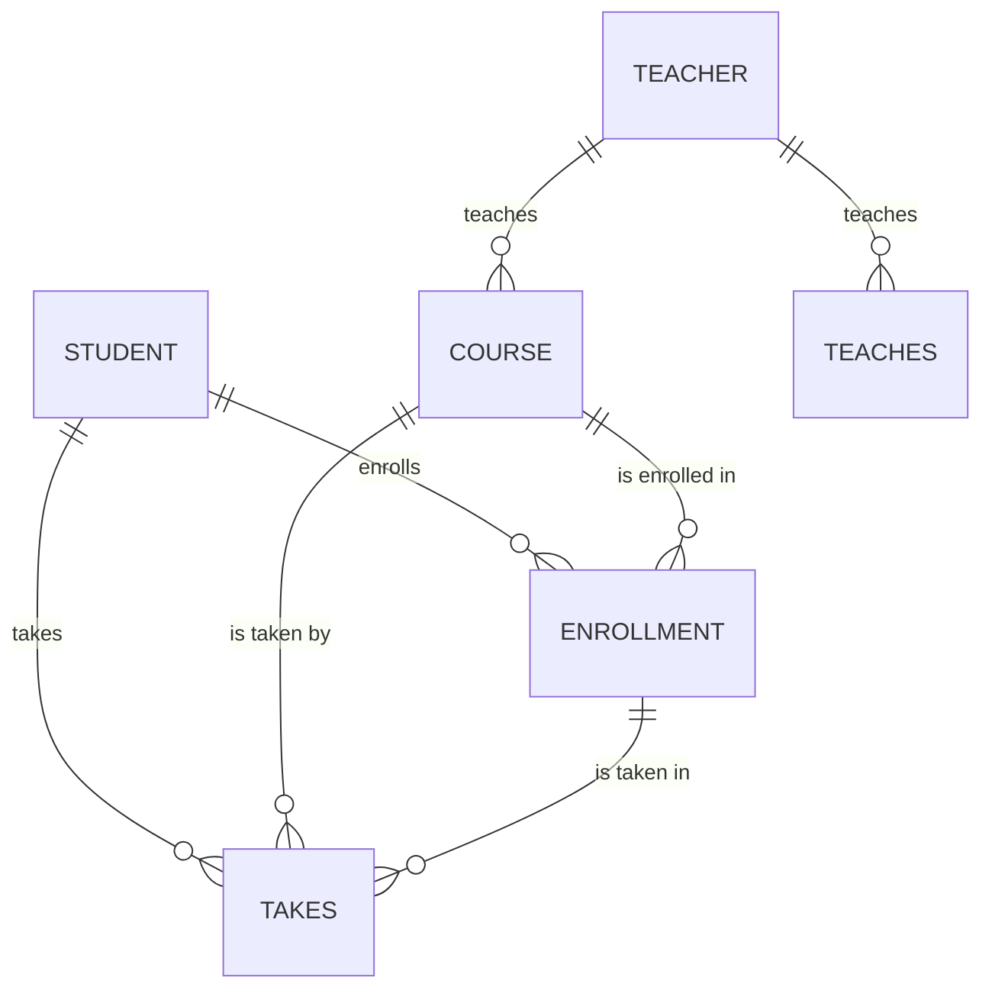

## 关系模型

关系模型是一种理论模型，它用于描述和组织数据库中的数据。这种模型通过使用一系列表格来表示不同实体之间的关系，以及实体的属性。关系模型在数据库管理系统中广泛应用，它提供了一种结构化的方式来存储、管理和查询数据。

### 表的结构

**关系模型的核心组成部分是表（或称为关系）**，每个表都由一系列的行和列组成。

- **行**（也称为记录或元组）：每一行代表数据库中的一个实体。
- **列**（也称为属性）：每一列代表实体的一个属性。
- **键**：一个或多个列被标识为主键，用于唯一地标识每一行。
  - 主键保证每个实体在表中的唯一性。
  - 外键则用于与其他表的主键相连接，建立表与表之间的关系。

### 数据查询语言

关系模型通常使用**结构化查询语言（SQL）**来执行查询和操作数据。SQL 是一种强大的语言，允许用户检索、插入、更新和删除数据。

### 实例示例

以下是一个示例的学生表格，用于说明关系模型的结构：

| 学号（主键） | 姓名 | 年龄 | 专业       |
| ------------ | ---- | ---- | ---------- |
| 1001         | 张三 | 20   | 计算机科学 |
| 1002         | 李四 | 22   | 数学       |
| 1003         | 王五 | 21   | 物理       |

在这个表中：

- 每一行代表一个学生实体，具有唯一的学号。
- 每一列代表学生的属性，如姓名、年龄和专业。

通过这种结构，数据库管理系统可以轻松地存储和检索数据。例如，通过学号，你可以快速地找到特定学生的信息。

## ER 模型

**ER 模型（实体 - 关系模型）用于描述现实世界的关系。**这个模型以图形的形式表示数据的结构，有助于理解和构建复杂的数据结构。让我们通过一个实例来详细了解 ER 模型的各个组成部分。

### 实体

实体表示**可以独立存在的事物。**

- **学生**：每个学生都有姓名、年龄等属性。
- **课程**：每门课程都有课程名、学分等属性。
- **教师**：每个教师都有姓名、专业等属性。

### 关系

关系模型中的关系有三种主要类型，它们描述了实体之间的不同类型的连接和联系。这些关系类型包括：

#### 一对一关系（One-to-One Relationship）

例如，考虑人和身份证之间的关系。每个人可能只有一个身份证号码，而一个身份证号码也只能与一个人相关联。

#### 一对多关系（One-to-Many Relationship）

例如，一个学校的教师和课程之间的关系就是一对多关系。每个教师可以教授多门课程，但每门课程只能由一个教师教授。

#### 多对多关系（Many-to-Many Relationship）

例如，学生和课程之间的关系就是多对多关系。一个学生可以选择多门课程，同时每门课程也可以被多个学生选择。

### 属性

**属性描述实体或关系的特性，为数据提供更多的信息。**属性在数据库中对实体或关系的各个方面进行描述和标识，以便更好地管理和查询数据。

- **学生**：姓名、年龄等。
- **课程**：课程名、学分等。
- **教师**：姓名、专业等。
- **选课**：选课日期等。
- **教授**：授课地点等。

## 数据库规范化

数据库规范化是一种组织数据的技术，目的是减少冗余并避免不必要的复杂性。通过将数据分解成更小、更相关的部分，可以**确保数据库的一致性、完整性和性能优化**。规范化通常遵循一系列范式，每个范式都有特定的规则，有助于确保数据库设计的质量和效率。

### 第一范式（1NF）

**第一范式确保每个列保持原子性，即列中的每个值都是不可分割的单一值。**这有助于消除重复的数据并减少数据冗余。要达到第一范式，确保每个表中的每个列都只包含原子值，而不是包含多个值的列表或数组。

例如，如果我们有一个存储学生和他们选修课程的表格：

| 学生 ID | 姓名 | 选修课程   |
| ------ | ---- | ---------- |
| 1001   | 张三 | 数学, 物理 |
| 1002   | 李四 | 英语, 数学 |

这就违反了第一范式，因为选修课程列包含了多个值。要修正这种情况，可以将每个选修课程拆分成单独的行：

| 学生 ID | 姓名 | 选修课程 |
| ------ | ---- | -------- |
| 1001   | 张三 | 数学     |
| 1001   | 张三 | 物理     |
| 1002   | 李四 | 英语     |
| 1002   | 李四 | 数学     |

### 第二范式（2NF）

**第二范式在满足第一范式的基础上，进一步移除部分依赖。**这意味着非主键列必须完全依赖于整个主键，而不仅仅是主键的一部分。为了达到第二范式，可以将表拆分成多个关联表，确保每个非主键属性只与一个候选键相关。

例如，考虑一个存储订单和订单项的表格：

**订单表：**

| 订单 ID (PK) | 顾客 ID | 订单日期   |
| ----------- | ------ | ---------- |
| 001         | 1001   | 2023-08-01 |
| 002         | 1002   | 2023-08-02 |

**订单项表：**

| 订单 ID (PK, FK) | 产品 ID (PK) | 数量 |
| --------------- | ----------- | ---- |
| 001             | 101         | 2    |
| 001             | 102         | 1    |
| 002             | 101         | 3    |

在这里，虽然订单表满足第一范式，但订单项表中的数量列部分依赖于订单 ID，而订单 ID 是主键的一部分。为了满足第二范式，我们可以将订单项表分为两个表格，一个是订单表，一个是订单项表。

### 第三范式（3NF）

**第三范式在满足第二范式的基础上，进一步移除所有传递依赖。**这意味着表中的每个非主键列都不能依赖于其他非主键列。为了达到第三范式，可以继续拆分表，确保每个非主键列都直接依赖于主键。

例如，考虑一个存储学生选课信息的表格：

**学生课程表：**

| 学生 ID (PK) | 课程 ID (PK) | 学分 | 课程名称 |
| ----------- | ----------- | ---- | -------- |
| 1001        | 101         | 3    | 数学     |
| 1001        | 102         | 4    | 物理     |
| 1002        | 101         | 3    | 数学     |

在这里，课程名称是根据课程 ID 直接得出的，因此存在传递依赖。为了满足第三范式，可以将课程名称拆分到一个独立的课程表中：

**课程表：**

| 课程 ID (PK) | 课程名称 |
| ----------- | -------- |
| 101         | 数学     |
| 102         | 物理     |

**学生课程表：**

| 学生 ID (PK) | 课程 ID (PK) | 学分 |
| ----------- | ----------- | ---- |
| 1001        | 101         | 3    |
| 1001        | 102         | 4    |
| 1002        | 101         | 3    |

这样就消除了学生课程表中的传递依赖，满足了第三范式的要求。

## 数据完整性和安全性

### 数据完整性

**数据完整性是确保数据的准确性、一致性和有效性。**它是数据库设计和管理中的关键概念，以确保数据库中的数据始终保持正确的状态。以下是几个数据完整性的方面：

- **实体完整性**：实体完整性要求每个表都应该有一个主键（唯一标识符），并且主键不允许为空或重复。这可以确保每个实体在数据库中都是唯一的，从而避免数据重复和冗余。
- **引用完整性**：引用完整性是确保外键关系的准确性和一致性。外键是一个表中的列，它引用了另一个表的主键。引用完整性要求外键值必须对应于另一个表中的已存在的主键值，防止数据之间的不一致性。
- **领域完整性**：领域完整性是确保数据值在定义的范围内。例如，一个存储年龄的字段不应该接受负值或过大的值。通过定义合适的数据范围，可以避免无效的数据输入。

### 数据安全性

**数据安全性是保护数据库免受未经授权的访问、修改或泄露。**确保数据安全性对于保护用户隐私和敏感信息至关重要。以下是保障数据安全性的关键措施：

- **用户认证**：用户认证是确认用户身份的过程。用户必须提供凭据（如用户名和密码）才能访问数据库。只有经过身份验证的用户才能执行操作。
- **授权**：授权是定义用户对数据库的访问权限。不同用户可能需要不同级别的权限，如读取、写入或管理员权限。授权可以避免未经授权的访问和潜在的数据泄露。
- **加密**：数据加密是通过将数据转换为不可读的形式，以保护数据的隐私。即使数据被盗，加密的数据也无法被轻易解读。在传输和存储数据时使用加密可以防止中间人攻击和数据泄露。
- **审计和监控**：定期审计数据库的活动和访问，以便发现异常或未经授权的操作。监控数据库的性能和安全性有助于及早发现问题并采取适当的措施。

通过数据完整性和安全性的综合措施，数据库可以在保持数据的准确性和一致性的同时，确保数据不受到未经授权的访问或恶意操作的影响。这有助于建立稳定、可靠且可信赖的数据库系统。
