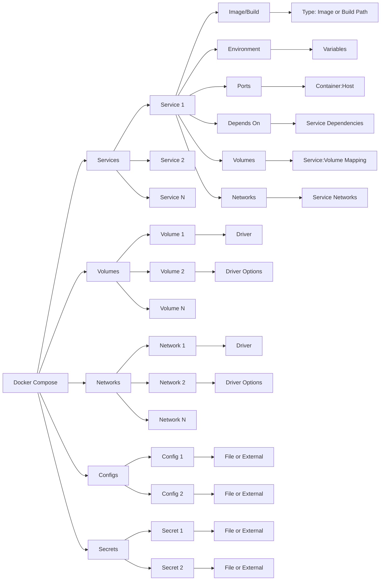

## 概述

Docker Compose 是一种工具，用于定义和运行多容器 Docker 应用程序。通过使用 Compose，你可以使用 YAML 文件来配置你的应用服务。然后，只需一个简单的命令，就能创建并启动你配置中的所有服务。

Docker Compose 允许你使用 YAML 文件来定义多个容器的应用服务，包括网络、卷等其他资源。这种方法可以让你将整个应用的配置集中管理，极大地简化了容器管理过程。

- **简化配置**：使用 YAML 文件定义服务，使得配置过程更加简单明了。
- **一键部署**：多容器应用可以通过一个命令同时启动，无需分别操作每个容器。
- **易于维护和扩展**：服务的更新和扩展可以通过修改配置文件实现，易于管理。

## 安装

Docker Compose 的安装过程取决于你的操作系统。在大多数情况下，它可以作为 Docker Desktop 的一部分自动安装，或者可以单独安装。

### 在 Linux 上安装

```shell
curl -L "https://github.com/docker/compose/releases/download/v2.24.6/docker-compose-linux-x86_64" -o /usr/local/bin/docker-compose
sudo chmod +x /usr/local/bin/docker-compose
```

## 基本命令

| 命令                     | 描述                                                         |
| ------------------------ | ------------------------------------------------------------ |
| `docker-compose up`      | 构建、（重新）创建、启动和连接到服务的容器。使用 `-d` 参数以后台模式运行。 |
| `docker-compose down`    | 停止并移除容器、网络、卷和镜像。                             |
| `docker-compose build`   | 构建或重新构建服务中定义的镜像。                             |
| `docker-compose logs`    | 查看服务的日志输出。                                         |
| `docker-compose pull`    | 拉取服务依赖的镜像。                                         |
| `docker-compose push`    | 将服务镜像推送到 Docker Hub 或其他镜像仓库。                 |
| `docker-compose restart` | 重启服务。                                                   |
| `docker-compose start`   | 启动已经存在的服务容器。                                     |
| `docker-compose stop`    | 停止运行中的容器，不移除它们。                               |
| `docker-compose pause`   | 暂停服务中的容器。                                           |
| `docker-compose unpause` | 恢复服务中已暂停的容器。                                     |
| `docker-compose rm`      | 删除所有（停止状态的）服务容器。                             |
| `docker-compose run`     | 在一个服务上运行一次性命令。                                 |
| `docker-compose exec`    | 在服务的容器中执行命令。                                     |
| `docker-compose scale`   | 设置服务的容器数量。*（注：在 3.x 版本中已被 `docker-compose up --scale` 代替）* |
| `docker-compose config`  | 验证并查看 Compose 文件的配置。                              |
| `docker-compose top`     | 显示运行中的容器的进程。                                     |
| `docker-compose port`    | 打印绑定的公开端口。                                         |
| `docker-compose ps`      | 列出项目中目前的所有容器。                                   |
| `docker-compose version` | 显示 Docker Compose 的版本信息。                             |

如果你想操作特定的一个 Docker Compose 编排，你应该在该编排文件所在的目录下执行相应的 `docker-compose ` 命令，并使用 `-f` 参数指定你的编排文件（如果不是使用默认的 `docker-compose.yml` 文件名）。

## 管理应用

让我们通过一个简单的示例来展示如何使用 Docker Compose 管理多容器应用。

### 示例应用

下面创建一个 `docker-compose.yml` 文件，定义一个简单的 web 应用服务。

#### app.py

```python
from flask import Flask
from redis import Redis

app = Flask(__name__)
redis = Redis(host='redis', port=6379)

@app.route('/')
def hello():
    count = redis.incr('hits')
    return 'Hello World! 该页面已被访问 {} 次。\n'.format(count)

if __name__ == "__main__":
    app.run(host="0.0.0.0", debug=True)
```

#### Dockerfile

```dockerfile
FROM python:3.6-alpine
ADD . /code
WORKDIR /code
RUN pip install redis flask
CMD ["python", "app.py"]
```

#### docker-compose.yml

```yaml
version: '3'
services:

  web:
    build: .
    ports:
     - "5000:5000"

  redis:
    image: "redis:alpine"
```

### 启动应用

使用 `docker-compose up` 命令来启动应用，Docker Compose 会自动启动定义的所有服务。

```shell
docker-compose up -d
```

### 停止应用

当你完成工作后，可以使用 `docker-compose down` 命令来停止并清理应用服务。

```shell
docker-compose down
```

## Compose 文件

Docker Compose 文件是 Docker Compose 的核心，它使用 YAML 文件格式定义了多容器 Docker 应用的所有服务、网络和卷。

### 文件结构

一个基本的 `docker-compose.yml` 文件包含**三个主要部分：services（服务）、networks（网络）和 volumes（卷）。**

下面是一个简单的示例，展示了这些组件如何被定义和关联：

```yaml
version: '3'
services:
  web:
    image: nginx
    ports:
      - "80:80"
    depends_on:
      - db
    networks:
      - backend
  db:
    image: postgres
    environment:
      POSTGRES_PASSWORD: mysecretpassword
    volumes:
      - db-data:/var/lib/postgresql/data
    networks:
      - backend

networks:
  backend:

volumes:
  db-data:
```

#### 服务（Services）

在 `services` 部分，你定义了应用中的各个服务，每个服务可以是一个容器，在上面的例子中，有两个服务：`web` 和 `db`。

- **image**: 指定服务使用的镜像。
- **ports**: 映射端口到宿主机。
- **depends_on**: 表示服务之间的依赖关系。
- **networks**: 指定服务连接的网络。
- **environment**: 设置环境变量。

#### 网络（Networks）

在 `networks` 部分，你可以定义一个或多个网络，服务可以连接到这些网络。在上例中，定义了一个名为 `backend` 的网络，`web` 和 `db` 服务都连接到了这个网络，使得它们可以相互通信。

#### 卷（Volumes）

在 `volumes` 部分，你定义了数据卷用于数据持久化。在上例中，`db-data` 卷被挂载到了 `db` 服务的容器中，用于存储数据库数据。

### 语法



### 关键字

| 配置项                     | 描述                                                         |
| -------------------------- | ------------------------------------------------------------ |
| `build`                    | 定义了构建服务的配置，可以是一个构建上下文的路径，或者一个包含 `context`、`dockerfile` 和 `args` 的对象。 |
| `cap_add`, `cap_drop`      | 添加或删除容器的能力。                                       |
| `cgroup_parent`            | 指定容器的父 cgroup。                                        |
| `command`                  | 覆盖容器的默认命令。                                         |
| `configs`                  | 为服务提供对配置的访问。                                     |
| `container_name`           | 指定自定义容器名称。                                         |
| `credential_spec`          | 配置管理服务帐户的凭据规范。                                 |
| `depends_on`               | 表达服务之间的依赖关系。                                     |
| `deploy`                   | 指定与服务部署和运行相关的配置。                             |
| `devices`                  | 设备映射列表。                                               |
| `dns`, `dns_search`        | 自定义 DNS 服务器和搜索域。                                  |
| `entrypoint`               | 覆盖容器的默认入口点。                                       |
| `env_file`                 | 从文件中加载环境变量。                                       |
| `environment`              | 设置环境变量。                                               |
| `expose`                   | 暴露端口而不发布到宿主机。                                   |
| `external_links`           | 链接到 Docker Compose 外部的容器。                           |
| `extra_hosts`              | 添加主机名映射。                                             |
| `healthcheck`              | 配置容器的健康检查。                                         |
| `image`                    | 指定服务使用的镜像。                                         |
| `init`                     | 使用 Docker 的 init 进程。                                   |
| `labels`                   | 添加标签到容器。                                             |
| `links`                    | 链接到其他服务的容器。                                       |
| `logging`                  | 配置日志记录。                                               |
| `network_mode`             | 网络模式。                                                   |
| `networks`                 | 配置网络。                                                   |
| `pid`                      | PID 模式。                                                   |
| `ports`                    | 发布端口。                                                   |
| `secrets`                  | 配置访问秘密。                                               |
| `security_opt`             | 安全选项。                                                   |
| `stop_grace_period`        | 设置停止前的等待时间。                                       |
| `stop_signal`              | 设置停止容器的信号。                                         |
| `sysctls`                  | 内核参数设置。                                               |
| `tmpfs`                    | 挂载临时文件系统。                                           |
| `ulimits`                  | 用户限制。                                                   |
| `user`                     | 指定运行用户。                                               |
| `userns_mode`              | 用户命名空间模式。                                           |
| `volumes`, `volume_driver` | 配置卷。                                                     |
| `volumes_from`             | 从其他服务或容器挂载卷。                                     |
| `working_dir`              | 工作目录。                                                   |

## 服务配置详解

### 构建选项

如果你不是使用现有的镜像，而是需要构建自定义镜像，可以使用 `build` 选项：

```yaml
version: '3'
services:
  webapp:
    build: ./dir
```

### 环境变量

你可以直接在 `docker-compose.yml` 文件中为服务设置环境变量，或者使用 `.env` 文件来管理：

```yaml
version: '3'
services:
  web:
    image: nginx
    environment:
      - NGINX_PORT=80
```

### 依赖关系

使用 `depends_on` 选项可以定义服务启动的先后顺序：

```yaml
version: '3'
services:
  web:
    image: nginx
    depends_on:
      - db
  db:
    image: postgres
```

### 端口映射

通过 `ports` 选项，可以将容器内的端口映射到宿主机的端口：

```yaml
version: '3'
services:
  web:
    image: nginx
    ports:
      - "80:80"
```

### 环境变量与 .env 文件的使用

管理配置和敏感信息时，推荐使用 `.env` 文件来外部定义环境变量，然后在 `docker-compose.yml` 文件中引用这些变量：

.env 文件：

```env
DB_PASSWORD=mysecretpassword
```

docker-compose.yml 文件：

```yaml
version: '3'
services:
  db:
    image: postgres
    environment:
      POSTGRES_PASSWORD: ${DB_PASSWORD}
```

通过这种方式，你可以避免将敏感信息直接硬编码在 `docker-compose.yml` 文件中，而是将其存储在外部的 `.env` 文件中，这有助于保持你的配置的安全性和灵活性。

## 多容器应用管理

在 Docker Compose 的使用中，管理多容器应用是核心任务之一。这包括了如何定义和运行多容器应用、如何管理容器间的网络连接以及如何实现数据的持久化和共享。

### 定义与运行多容器应用

利用 `docker-compose.yml` 文件，开发者可以定义涵盖多个服务（容器）的完整应用架构，实现一键部署和管理。

考虑到一个典型的三层应用架构，包含前端、后端及数据库层：

```yaml
version: '3.8'
services:
  frontend:
    image: nginx:latest
    ports:
      - "80:80"
    depends_on:
      - backend
    networks:
      - app-network

  backend:
    image: node:14
    environment:
      DB_HOST: db
    ports:
      - "3000:3000"
    depends_on:
      - db
    networks:
      - app-network

  db:
    image: postgres:13
    environment:
      POSTGRES_USER: user
      POSTGRES_PASSWORD: password
    volumes:
      - db-data:/var/lib/postgresql/data
    networks:
      - app-network

volumes:
  db-data:

networks:
  app-network:
```

在这个例子中，我们指定了使用的镜像、环境变量、端口映射、依赖关系、网络和数据卷。通过这样的配置，可以确保应用的各个部分能够正确连接和交互，同时数据也得到了持久化。

### 网络管理

Docker Compose 默认创建一个网络，使得同一 `docker-compose.yml` 文件中定义的所有服务都能够在这个网络中相互通信。然而，复杂应用可能需要更精细的网络配置来满足不同的安全和隔离需求。

自定义网络配置允许服务根据实际需求分配到不同的网络中，实现更细致的网络隔离和通信策略。

```yaml
networks:
  app-network:
    driver: bridge
  internal-network:
    driver: bridge
    internal: true
```

在上述配置中，`app-network` 用于暴露外部可访问的服务（如前端），而 `internal-network` 则用于内部服务间的通信，不对外部暴露，增强了安全性。

### 数据卷与持久化

数据持久化对于任何生产级应用都至关重要，Docker Compose 通过卷（volumes）提供了数据持久化的能力。

```yaml
volumes:
  db-data:
    driver: local
```

这里定义了一个名为 `db-data` 的卷，用于 PostgreSQL 数据库的数据持久化存储。通过指定卷，即使容器重新创建，数据也不会丢失。

Docker Compose 也支持定义卷来实现服务之间的数据共享：

```yaml
services:
  service1:
    volumes:
      - shared-data:/path/to/data
  service2:
    volumes:
      - shared-data:/path/to/data

volumes:
  shared-data:
```

在此配置中，`service1` 和 `service2` 共享了同一个卷 `shared-data`，允许它们访问和修改相同的数据集，这在需要数据共享的应用场景中非常有用。

## 高级功能

Docker Compose 不仅仅是一个多容器部署工具，它还提供了一系列高级功能和最佳实践，帮助开发者和运维人员优化应用配置和管理。本章节将深入探讨服务的健康检查、如何使用 `extends` 特性以及如何通过覆盖文件分离环境配置。

### 服务的健康检查

健康检查是监控服务状态和健康状况的重要手段。通过配置健康检查，Docker 可以自动检测服务是否正常运行。

在 `docker-compose.yml` 文件中，可以为服务配置 `healthcheck` 指令：

```yaml
services:
  web:
    image: my-web-app
    healthcheck:
      test: ["CMD", "curl", "-f", "http://localhost"]
      interval: 30s
      timeout: 10s
      retries: 3
      start_period: 40s
```

这个配置定义了一个健康检查，每 30 秒执行一次 `curl -f http://localhost` 命令来检查 `web` 服务的健康状态，如果命令在 10 秒内没有成功执行（即返回状态码非 0），则认为是一次失败。如果连续 3 次检查失败，则服务被认为是不健康的。

### 扩展与重写服务

`extends` 特性允许在一个服务中重用另一个服务的配置。这对于不同环境下的配置共享非常有用。

假设有一个基础服务配置 `base-service.yml`：

```yaml
version: '3.8'
services:
  app_base:
    image: my-app
    environment:
      - DEBUG=false
```

可以在 `docker-compose.yml` 中扩展这个服务：

```yaml
version: '3.8'
services:
  app:
    extends:
      file: base-service.yml
      service: app_base
    ports:
      - "80:80"
```

通过这种方式，`app` 服务继承了 `app_base` 的所有配置，并添加了端口映射。

### 使用覆盖文件来分离环境配置

Docker Compose 允许使用多个文件来定义项目配置，这使得可以针对不同环境（如开发、测试、生产）使用不同的配置。

基础 `docker-compose.yml` 文件定义了所有环境共有的配置：

```yaml
version: '3.8'
services:
  web:
    image: my-web-app
    environment:
      - LOG_LEVEL=info
```

针对开发环境的 `docker-compose.override.yml`：

```yaml
version: '3.8'
services:
  web:
    environment:
      - DEBUG=true
    volumes:
      - .:/code
```

在生产环境的 `docker-compose.prod.yml`：

```yaml
version: '3.8'
services:
  web:
    ports:
      - "80:80"
    environment:
      - LOG_LEVEL=warning
```

通过指定 `-f` 参数来使用不同的配置文件：

```yaml
docker-compose -f docker-compose.yml -f docker-compose.prod.yml up -d
```

这种方法使得基础配置与环境特定配置分离，便于管理和维护。

## 实战项目

本实战项目将引导你构建一个简单的 Web 应用，该应用包含三个主要组件：前端（使用 Nginx 静态文件服务），后端（一个简单的 Node.js API），以及数据库（PostgreSQL）。此外，我们还将探讨如何调试这些服务并进行基本的性能优化。

### Web 实战项目

#### 项目概述

- **前端**：使用 Nginx 服务静态文件。
- **后端**：Node.js 应用提供 RESTful API。
- **数据库**：PostgreSQL 存储数据。

#### `docker-compose.yml`

```yaml
version: '3.8'
services:
  frontend:
    image: nginx:alpine
    volumes:
      - ./frontend:/usr/share/nginx/html
    ports:
      - "80:80"
    depends_on:
      - backend
    networks:
      - app-network

  backend:
    build:
      context: ./backend
      dockerfile: Dockerfile
    environment:
      DATABASE_URL: postgres://user:password@db:5432/mydb
    ports:
      - "3000:3000"
    depends_on:
      - db
    networks:
      - app-network

  db:
    image: postgres:13
    environment:
      POSTGRES_USER: user
      POSTGRES_PASSWORD: password
      POSTGRES_DB: mydb
    volumes:
      - db-data:/var/lib/postgresql/data
    networks:
      - app-network

volumes:
  db-data:

networks:
  app-network:
```

#### 前端

前端使用 Nginx 静态文件服务。你需要在 `./frontend` 目录下放置你的静态文件（HTML、CSS、JavaScript 文件等）。

#### 后端

后端是一个简单的 Node.js 应用，提供 RESTful API。你需要在 `./backend` 目录下创建一个 `Dockerfile` 和你的 Node.js 应用代码。

`./backend/Dockerfile`

```yaml
FROM node:14-alpine
WORKDIR /app
COPY package*.json ./
RUN npm install
COPY . .
EXPOSE 3000
CMD ["node", "server.js"]
```

#### Node.js 服务器

```javascript
// server.js
const express = require('express');
const app = express();
const PORT = process.env.PORT || 3000;

app.get('/api', (req, res) => {
  res.json({ message: "Hello from the backend!" });
});

app.listen(PORT, () => {
  console.log(`Server is running on port ${PORT}`);
});
```

#### 数据库

使用 PostgreSQL 作为数据库服务。`docker-compose.yml` 文件中已经配置了必要的环境变量。

### 调试与优化

#### 容器日志查看

使用 Docker Compose 查看服务日志的命令：

```yaml
docker-compose logs -f backend
```

这将跟踪并显示后端服务的实时日志输出。

#### 资源监控与性能优化

Docker Desktop 和其他第三方工具如 Portainer 或 cAdvisor 可用于监控容器的资源使用情况。基于监控数据，你可以对服务进行必要的调整，比如调整容器的 CPU 和内存限制：

```yaml
services:
  backend:
    build: ./backend
    mem_limit: 500m
    cpus: '0.5'
```

在 `docker-compose.yml` 文件中，为后端服务设置了内存限制为 500MB，CPU 使用限制为 50%。
