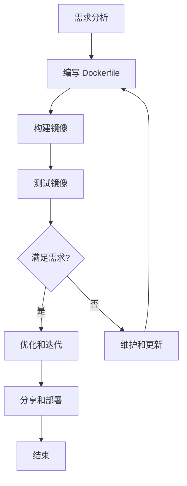

## 概述

Dockerfile 是一个文本文件，包含了一系列指令和参数，用于自动化构建 Docker 镜像。每条指令都会在镜像中创建一个新的层，涵盖了从基础镜像开始、复制文件、运行命令、设置环境变量等多种操作。通过 Dockerfile，可以确保镜像的构建过程是可重复且无差异的，这对于持续集成和持续部署（CI/CD）的实施至关重要。

## Dockerfile

Dockerfile 的开发是一个循环的过程，涉及编写、构建、测试、优化和维护，旨在创建高效、可维护且可重复使用的 Dockerfile，以生成高质量的 Docker 镜像。

以下是 Dockerfile 开发的常规工作流程：



关键步骤：

1. **定义基础镜像**：从一个已有的镜像开始，这是所有后续操作的基础。
2. **执行构建命令**：安装软件包、修改配置文件等。
3. **添加文件和目录**：将所需文件和目录添加到镜像中。
4. **设置工作目录**：为 Dockerfile 中的指令指定工作目录。
5. **配置环境变量**：设定必要的环境变量。
6. **暴露端口**：声明容器监听的端口。
7. **配置启动命令**：设置容器启动时执行的命令。

### 指令

| 指令            | 描述                                                         | 示例                                                 |
| --------------- | ------------------------------------------------------------ | ---------------------------------------------------- |
| **FROM**        | 指定基础镜像，是构建新镜像的起点。                           | `FROM ubuntu:18.04`                                  |
| **RUN**         | 在镜像构建过程中运行命令。                                   | `RUN apt-get update && apt-get install -y nginx`     |
| **CMD**         | 提供容器启动时的默认执行命令。                               | `CMD ["nginx", "-g", "daemon off;"]`                 |
| **ENTRYPOINT**  | 配置容器启动时运行的命令，可以与 CMD 指令配合使用。          | `ENTRYPOINT ["./app"]`                               |
| **COPY**        | 将文件从构建上下文复制到镜像中。                             | `COPY . /app`                                        |
| **ADD**         | 将文件从构建上下文或 URL 复制到镜像中，可自动解压压缩包。      | `ADD http://example.com/big.tar.xz /usr/src/things/` |
| **ENV**         | 设置环境变量。                                               | `ENV MY_VAR=value`                                   |
| **EXPOSE**      | 声明容器运行时监听的端口。                                   | `EXPOSE 80`                                          |
| **VOLUME**      | 创建一个挂载点来持久化数据。                                 | `VOLUME /data`                                       |
| **WORKDIR**     | 为 Dockerfile 中的指令设置工作目录。                         | `WORKDIR /app`                                       |
| **ARG**         | 定义构建时的变量，可以在构建命令中用 `--build-arg` 来覆盖。  | `ARG VERSION=latest`                                 |
| **USER**        | 指定运行容器时的用户名或 UID，以及可选的用户组或 GID。       | `USER www-data`                                      |
| **LABEL**       | 为镜像添加元数据。                                           | `LABEL version="1.0"`                                |
| **ONBUILD**     | 为镜像指定触发器指令，当镜像作为基础镜像时，触发器将在派生镜像中执行。 | `ONBUILD RUN echo 'Doing something...'`              |
| **HEALTHCHECK** | 指定一个命令，用于检查容器是否健康运行。                     | `HEALTHCHECK CMD curl --fail http://localhost:80/    |
| **SHELL**       | 用于覆盖默认的 shell 命令。                                  | `SHELL ["/bin/bash", "-c"]`                          |
| **STOPSIGNAL**  | 设置停止容器时发送的系统调用信号。                           | `STOPSIGNAL SIGTERM`                                 |

### 示例

```dockerfile
# 指定基础镜像
FROM python:3.8

# 设置工作目录
WORKDIR /app

# 复制依赖文件到容器中
COPY requirements.txt ./

# 安装依赖
RUN pip install --no-cache-dir -r requirements.txt

# 将当前目录下的所有文件复制到容器的工作目录中
COPY . .

# 暴露端口
EXPOSE 5000

# 定义容器启动时执行的命令
CMD ["flask", "run", "--host=0.0.0.0"]
```

## 镜像构建

镜像构建是 Docker 使用中的核心概念，它允许用户从一个基础镜像开始，通过一系列步骤添加自定义的层次，最终创建出一个新的镜像。深入了解镜像构建，包括二次构建（多阶段构建）等高级特性，可以帮助你更高效地使用 Docker，优化你的开发和部署流程。

- **Dockerfile**：Dockerfile 是构建 Docker 镜像的蓝图，它包含了一系列的指令，每个指令都会在镜像中创建一个新的层。
- **镜像层**：Docker 镜像是由多个只读层组成的。当你更改镜像并提交这些更改时，你实际上是在基础镜像上添加了一个新层。
- **构建上下文**：构建上下文是指向 Docker 守护进程的一组文件和目录，这些文件和目录用于构建 Docker 镜像。构建上下文的路径可以在 `docker build` 命令中指定。

### 基本构建

使用 `docker build` 命令和 Dockerfile 来构建镜像。在构建过程中，Docker 逐条处理 Dockerfile 中的指令，每条指令都会创建镜像的一个新层。构建完成后，你将获得一个可用于创建容器的镜像。

```shell
docker build -t my_image_name:my_tag .
```

这个命令将使用当前目录中的 Dockerfile 来构建镜像，并将其标记为 `my_image_name:my_tag`。

### 多阶段构建

多阶段构建是 Docker 17.05 版本引入的一个特性，它允许在一个 Dockerfile 中定义多个构建阶段，每个阶段都可以使用不同的基础镜像。多阶段构建的主要优点是减小最终镜像的大小，提高构建效率，避免在最终镜像中包含不必要的文件。

- **定义多个阶段**：可以通过在 Dockerfile 中多次使用 `FROM` 指令来定义多个构建阶段。
- **复制阶段间的文件**：使用 `COPY --from=<stage>` 指令可以从一个阶段复制文件到另一个阶段。

```dockerfile
# 第一阶段：构建阶段
# 使用官方 Python 镜像作为构建镜像的基础
FROM python:3.8-slim as builder

# 设置工作目录
WORKDIR /app

# 将应用依赖复制到容器中
COPY requirements.txt .

# 安装应用依赖
RUN pip install --user -r requirements.txt

# 复制应用代码到容器中
COPY . .

# 第二阶段：运行阶段
# 再次从一个干净的 Python 镜像开始
FROM python:3.8-slim

# 创建一个非 root 用户
RUN useradd -m myuser
USER myuser

# 从构建阶段复制已安装的依赖
COPY --from=builder /root/.local /home/myuser/.local
COPY --from=builder /app /app

# 设置工作目录
WORKDIR /app

# 设置环境变量
ENV PATH=/home/myuser/.local/bin:$PATH

# 暴露应用端口
EXPOSE 5000

# 设置容器启动时执行的命令
CMD ["python", "app.py"]
```

### 优化构建

- **减少层的数量**：合并多个 `RUN` 指令可以减少镜像层的数量，减小镜像大小。
- **使用 `.dockerignore` 文件**：通过定义 `.dockerignore` 文件排除不必要的文件和目录，减少构建上下文的大小，加快构建速度。
- **利用构建缓存**：Docker 会缓存每一层的结果，如果 Dockerfile 中的某一层没有变化，则在构建时会重用这一层的缓存。合理利用构建缓存可以显著提高构建效率。

## 镜像管理

Docker 提供了多种命令来管理本地存储的镜像：

| 命令                                 | 描述                               | 示例                                        |
| ------------------------------------ | ---------------------------------- | ------------------------------------------- |
| `docker images` 或 `docker image ls` | 列出本地所有镜像                   | `docker images`                             |
| `docker rmi <image>`                 | 删除指定的镜像                     | `docker rmi nginx:latest`                   |
| `docker inspect <image>`             | 显示镜像的详细信息                 | `docker inspect ubuntu:18.04`               |
| `docker pull <image>`                | 从远程仓库拉取指定的镜像           | `docker pull python:3.8-slim`               |
| `docker push <image>`                | 将本地镜像推送到远程仓库           | `docker push myusername/myimage:tag`        |
| `docker build -t <tag> .`            | 根据当前目录的 Dockerfile 构建镜像 | `docker build -t myapp:v1 .`                |
| `docker history <image>`             | 查看镜像的构建历史                 | `docker history nginx:latest`               |
| `docker tag <image> <tag>`           | 为镜像添加一个新标签               | `docker tag myimage:latest myimage:v2`      |
| `docker save -o <path> <image>`      | 将镜像保存为 tar 归档文件          | `docker save -o myimage.tar myimage:latest` |
| `docker load -i <path>`              | 从 tar 归档文件中加载镜像          | `docker load -i myimage.tar`                |
| `docker image prune`                 | 删除未被任何容器使用的悬挂镜像     | `docker image prune`                        |
| `docker image rm <image>`            | 删除一个或多个镜像                 | `docker image rm myimage1 myimage2`         |

## 镜像仓库

Docker 镜像仓库扮演着在 Docker 生态系统中极为关键的角色，它们不仅存储和分发容器镜像，还促进了开发和运维工作的协同。这些仓库可以是公开的，也可以是私有的，以满足不同的安全和隐私需求。

Docker Hub 是最广为人知的 Docker 镜像仓库，提供了大量的公共镜像供下载和使用。它支持个人和组织管理镜像，并能与自动化构建和测试流程无缝集成。

对于需要控制镜像访问权限的场景，私有 Docker 仓库是理想的选择。私有仓库可以部署在内部网络中，确保敏感镜像的安全。Docker Registry 是官方提供的开源仓库解决方案，支持本地部署和管理私有镜像。

### 使用 Docker Hub 拉取镜像

从 Docker Hub 或私有仓库拉取镜像是常见操作。使用 `docker pull` 命令可以轻松完成这一任务：

```shell
docker pull my_username/my_image_name:my_tag
```

### 推送镜像到 Docker Hub

#### 1. 创建 Docker Hub 账号

如果你还没有 Docker Hub 的账号，你需要先在 [Docker Hub](https://hub.docker.com/) 上注册一个。

#### 2. 登录到 Docker Hub

在终端或命令行界面，使用 `docker login` 命令登录到你的 Docker Hub 账号。输入你的用户名和密码进行认证。

```
docker login
```

成功登录后，你的认证信息将被保存，以便后续操作无需重复登录。

#### 3. 标记你的镜像

在推送镜像之前，你需要为你的镜像设置一个标签（Tag），这个标签应该包含你的 Docker Hub 用户名、镜像的名字，以及（可选的）标签。

```
docker tag local-image-name:tag your-dockerhub-username/repository-name:tag
```

- `local-image-name:tag` 是你本地镜像的名称和标签。
- `your-dockerhub-username` 是你在 Docker Hub 上的用户名。
- `repository-name` 是你希望在 Docker Hub 上创建的仓库名。
- `tag` 是你给镜像指定的标签，如果不指定，默认为 `latest`。

例如，如果你的 Docker Hub 用户名是 `johndoe`，并且你想要推送一个名为 `myapp` 的镜像，标签为 `v1.0`，你可以执行：

```
docker tag myapp:latest johndoe/myapp:v1.0
```

#### 4. 推送镜像到 Docker Hub

使用 `docker push` 命令将镜像推送到你的 Docker Hub 仓库：

```
docker push your-dockerhub-username/repository-name:tag
```

继续之前的例子：

```
docker push johndoe/myapp:v1.0
```

这个命令会将 `myapp` 镜像的 `v1.0` 标签版本推送到 Docker Hub 上的 `johndoe/myapp` 仓库中。

#### 5. 验证

推送完成后，你可以在 Docker Hub 的网站上登录你的账号，查看你的仓库列表，确认新推送的镜像已经出现在列表中。

### 推送镜像到私人仓库

推送镜像到私人仓库的过程与推送到 Docker Hub 类似，但需要确保你有权限访问该私人仓库，并且可能需要配置额外的认证信息。以下是推送镜像到私人仓库的一般步骤：

#### 1. 登录私人仓库

私有仓库通常需要认证，以保证仓库的安全性。使用 `docker login` 命令进行登录，确保你拥有足够的权限来推送镜像。

```shell
docker login myregistry.example.com
```

#### 2.标记你的镜像

在推送镜像之前，需要将其标记为私人仓库的地址。这是通过 `docker tag` 命令完成的，标记格式通常为 `仓库地址/用户名/镜像名称:标签`。

```shell
docker tag my_image_name:my_tag myregistry.example.com/my_username/my_image_name:my_tag
```

这里：

- `my_image_name:my_tag` 是你本地镜像的名称和标签。
- `myregistry.example.com` 是你的私人仓库地址。
- `my_username` 是你在该仓库的用户名或命名空间。

#### 3. 推送镜像

完成镜像标记后，使用 `docker push` 命令将其推送到私人仓库。

标记完成后，使用 `docker push` 命令将镜像推送到私人仓库：

```shell
docker push myregistry.example.com/my_username/my_image_name:my_tag
```

#### 4. 管理私人仓库中的镜像

私人仓库可能提供了一个用户界面或者 API，供你管理仓库中的镜像，包括查看、删除和设置访问权限等。

#### 5. 使用私人仓库中的镜像

从私人仓库拉取镜像时，同样需要先进行认证。一旦认证通过，你可以使用 `docker pull` 命令拉取所需的镜像。

```shell
docker pull myregistry.example.com/my_username/my_image_name:my_tag
```
