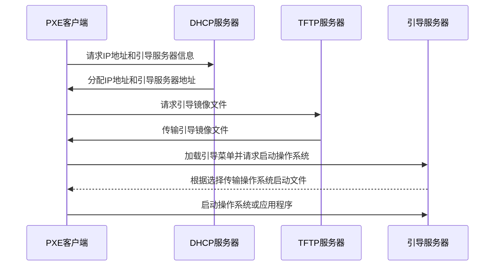

## PXE 技术概述

PXE（Preboot Execution Environment）是一种网络引导技术，允许计算机在启动 BIOS/UEFI 后通过网络接口从远程服务器下载操作系统或其他软件进行启动。这项技术主要应用于无人值守的自动化部署场景，包括系统部署、更新、维护和灾难恢复。与传统的物理介质启动相比，PXE 提供了更大的灵活性和可管理性，特别适合需要快速部署和更新大量系统的企业和机构。

### 主要应用场景

- **系统自动化部署**：实现无人值守的操作系统和应用程序批量部署。
- **故障恢复**：通过网络快速恢复故障系统。
- **远程维护**：支持远程诊断和修复问题。
- **固件更新**：批量更新设备固件。

## PXE 工作原理

### 启动流程详解



PXE 启动流程可以分为以下几个阶段：

1. **POST 自检:** 计算机启动时，会进行开机自检（POST）。
2. **获取 DHCP 信息:** 自检完成后，PXE 客户机会向 DHCP 服务器发送请求，获取 IP 地址、引导服务器地址等信息。
3. **下载引导镜像:** 客户机从 TFTP 服务器下载引导镜像，如 pxelinux.0。
4. **加载引导菜单:** 引导镜像加载后，会显示引导菜单，允许用户选择要启动的操作系统或应用程序。
5. **启动操作系统:** 根据用户选择，启动相应的操作系统或应用程序。

### 涉及的关键网络协议

PXE 工作过程中涉及以下几个关键网络协议：

- **DHCP:** 动态主机配置协议，用于为 PXE 客户机分配 IP 地址和引导服务器地址。
- **TFTP:** Trivial File Transfer Protocol，用于传输引导镜像和其他文件。
- **HTTP/HTTPS**：在 UEFI 模式下，相比 TFTP 提供更快的文件传输速度和加密支持。
- **BPD:** Boot Protocol Discovery，用于引导服务器发现 PXE 客户机。

## PXE 技术的关键组件

PXE 部署涉及的核心组件包括 DHCP 服务器、TFTP/HTTP 服务器和 PXE 引导程序。这些组件协同工作，实现了从网络启动计算机并自动加载操作系统的功能。

### DHCP 服务器

DHCP 服务器负责在网络启动过程中为客户端分配 IP 地址，并提供引导服务器（如 TFTP 或 HTTP 服务器）的位置和启动文件名。这是实现 PXE 环境的基础。

### TFTP/HTTP 服务器

- **TFTP 服务器**用于存储和传输引导文件（如 `pxelinux.0` 或 `grubx64.efi`）和操作系统映像。尽管 TFTP 是传统选择，但它的传输速度相对较慢。
- **HTTP/HTTPS 服务器**提供了一种更快、更安全的替代方案，尤其是在 UEFI 启动模式下。HTTPS 还可以加密数据传输，保护部署过程中的数据安全。

### PXE 引导程序

PXE 引导程序如 SYSLINUX 或 GRUB，负责显示启动菜单，允许用户选择不同的操作系统或工具进行加载。它们支持从 TFTP 或 HTTP 服务器加载操作系统映像。

## 无人值守安装

无人值守安装允许自动执行操作系统安装，无需人工干预。这通过使用预先定义的安装脚本或应答文件来实现，可以大幅提升大规模部署的效率和一致性。

### 实现步骤

1. **准备操作系统映像**：将操作系统安装文件存放于 TFTP 或 HTTP 服务器。
2. **创建应答文件**：例如 Kickstart（用于 Red Hat/CentOS）或 Preseed（用于 Debian/Ubuntu），定义安装过程中的所有选择，如分区、网络配置、用户账号和安装的软件包。
3. **配置 PXE 引导程序**：设置启动菜单以引导到特定的安装环境，并指定应答文件。

### 自动化脚本和工具

使用如 Ansible、Puppet 的自动化运维工具进一步自动化和优化部署流程，可以在无人值守安装基础上实现后续的配置管理和应用部署。

## PXE 环境搭建

搭建 PXE 环境需要配置服务器端（包括 DHCP、TFTP/HTTP 服务器和引导文件）和客户端（BIOS/UEFI 设置）。

### 服务器端要求

- **操作系统**：Linux 发行版，如 CentOS 或 Ubuntu。
- **软件组件：**
  - DHCP 服务器（如 ISC DHCP Server）
  - TFTP 服务器（如 tftp-hpa）或 HTTP 服务器（如 Apache 或 Nginx）
  - PXE 引导程序（如 SYSLINUX 或 GRUB）
- **网络配置**：静态 IP 地址，确保服务器与客户端在同一网络段。

### 客户端配置要求

- **BIOS/UEFI 设置**：启用网络启动选项，设置网络引导为首选启动设备。

### UEFI 支持

- **UEFI 启动**：配置 UEFI 启动模式下的特定引导文件（如 `grubx64.efi`）和 DHCP 选项，以支持更现代的硬件。

### 网络环境配置与优化

- **通信检查**：确保服务器和客户端间网络畅通。
- **使用 VLAN 隔离**：将 PXE 部署网络与生产网络隔离，增强安全性。
- **性能优化**：在支持的环境下，使用 HTTP/HTTPS 替代 TFTP 以提升文件传输速度和安全性。

## 安全性

虽然 PXE 提供了极大的便利，但也引入了新的安全风险。以下措施可以帮助提升 PXE 环境的安全性：

### 网络隔离和访问控制

通过 VLAN 或物理隔离手段将 PXE 部署网络与生产网络分离，限制对 PXE 服务器的访问，确保只有授权客户端可以启动和访问部署服务。

### 数据加密

使用 HTTPS 代替 TFTP，为数据传输过程提供加密，保护敏感信息不被窃取。

### 定期更新和补丁应用

定期更新 PXE 服务器上的软件和操作系统，应用安全补丁，减少安全漏洞。

### 强化服务器安全

为 PXE 服务器配置强密码，实施最小权限原则，使用防火墙和入侵检测系统等安全工具，增加额外的安全层。

## PXE 技术的优势与局限性

PXE（Preboot Execution Environment）技术在系统部署和维护方面带来了显著的优势，但同时也存在一些局限性。理解这些优点和缺点对于有效地利用 PXE 技术至关重要。

### 优势

| 优势       | 描述                                                         |
| ---------- | ------------------------------------------------------------ |
| 自动化部署 | 通过无人值守安装，极大提高批量部署计算机的效率，尤其适合数据中心、测试实验室等需要频繁部署大量系统的环境。 |
| 集中管理   | 启动镜像和安装脚本可以集中存储在网络服务器上，使得更新和管理更加集中和方便。 |
| 可扩展性   | 支持通过网络启动任意数量的客户端，轻松扩展以满足增长的需求，无需对每个客户端进行手动配置。 |
| 安全性提升 | 通过网络安全策略和技术保护部署过程，如网络隔离、数据加密，减少物理介质丢失或被盗的风险。 |

### 局限性

| 局限性     | 描述                                                         |
| ---------- | ------------------------------------------------------------ |
| 网络依赖性 | 完全依赖于网络环境。网络配置错误、服务器不可用或网络故障都可能导致部署失败，大规模部署时对网络带宽的需求也相应增加。 |
| 安全风险   | 错误配置的 PXE 环境可能成为安全漏洞，未经授权的设备可能尝试接入网络，攻击者可能利用环境中的漏洞发起攻击。 |
| 技术复杂性 | 设置和管理 PXE 环境比传统物理介质安装更复杂，需要专业知识配置和维护 DHCP、TFTP/HTTP 服务器以及安全措施。 |
| 兼容性问题 | 在不同硬件和操作系统之间可能会遇到兼容性问题，特别是 UEFI 启动模式下可能需要额外的配置支持。 |

## PXE 技术的应用

### 基于 RHEL/Fedora 系的详细配置指南

#### 1. 安装必要的软件包

```bash
sudo yum install dhcp-server tftp-server syslinux
```

#### 2.配置 DHCP 服务器

1. 编辑配置文件 `/etc/dhcp/dhcpd.conf`，添加以下内容：

  ```conf
  subnet 192.168.1.0 netmask 255.255.255.0 {
      range 192.168.1.100 192.168.1.200;
      option routers 192.168.1.1;
      option domain-name-servers 8.8.8.8, 8.8.4.4;
      next-server 192.168.1.2;
      filename "pxelinux.0";
  }
  ```

1. 启动并启用 DHCP 服务：

  ```bash
  sudo systemctl start dhcpd
  sudo systemctl enable dhcpd
  ```

#### 3. 配置 TFTP 服务器

1. 创建 TFTP 根目录：

  ```bash
  sudo mkdir -p /var/lib/tftpboot
  sudo chmod -R 777 /var/lib/tftpboot
  ```

1. 复制 PXE 引导文件到 TFTP 根目录：

  ```bash
  sudo cp /usr/lib/syslinux/pxelinux.0 /var/lib/tftpboot/
  ```

#### 4. 配置 PXE 引导程序

1. 将操作系统安装镜像和相关文件复制到 TFTP 服务器的目录中：

  ```bash
  sudo cp /path/to/your/os/* /var/lib/tftpboot/
  ```

1. 编辑 `/etc/sysconfig/iptables`，允许 DHCP 和 TFTP 流量：

  ```conf
  -A INPUT -p udp --dport 67:68 -j ACCEPT
  -A INPUT -p udp --dport 4011:4012 -j ACCEPT
  ```

1. 重启 iptables 服务：

  ```bash
  sudo systemctl restart iptables
  ```

#### 5.客户端配置

- 进入 BIOS 设置，启用网络启动，并设置为第一启动选项。

### 基于 Debian/Ubuntu 系的详细配置指南
