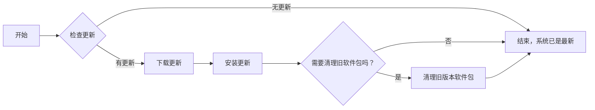

## 包管理器

Linux 系统的强大功能之一在于其庞大、多样化的软件生态。不同于 Windows 或 macOS，Linux 使用包管理器来自动化软件的安装、更新、配置和删除，极大简化了软件管理的复杂性。包管理器不仅确保软件和其依赖关系正确安装，还能保持系统的整洁和更新。

### 定义和作用

包管理器是 Linux 和 Unix-like 系统中用于自动化处理软件包任务的工具。它允许用户搜索、安装、更新、配置和删除软件包，而无需手动下载和解压缩。更重要的是，包管理器处理软件包之间的依赖关系，确保系统稳定运行，避免 " 依赖地狱 "。

### 软件包格式

Linux 软件包有多种格式，最常见的是 Debian 系的 `.deb` 和 Red Hat 系的 `.rpm`。

- **.deb**：Debian、Ubuntu 及其衍生版使用的软件包格式，通过 `dpkg` 和 `APT` 等工具进行管理。
- **.rpm**：Red Hat、Fedora、CentOS 等发行版采用的格式，由 `RPM` 包管理器以及 `YUM` 或 `DNF` 等高级工具处理。

这些格式基本上定义了如何打包软件、元数据（如版本、依赖关系）以及安装后如何布局文件。

### 软件仓库和软件源

软件仓库是托管软件包及其元数据的服务器。每个 Linux 发行版通常都会有一个或多个官方软件仓库，同时也支持添加第三方仓库。软件源（Repository Sources）是软件仓库的地址，用户可以在包管理器中配置这些地址，以便下载和安装软件包。

- **官方仓库**：提供由发行版维护团队精选和测试的软件包，确保软件的稳定性和安全性。
- **第三方仓库**：提供额外的软件包，可能包括最新的软件版本或官方仓库中未包含的软件。

用户可以根据需要添加、删除或更改软件源，以优化软件安装和更新过程。

## 常用包管理器

Linux 的包管理器是系统管理的核心组件，它简化了软件的安装、更新、配置和移除过程。下面是针对主流 Linux 发行版包管理器的详细介绍。

### Debian/Ubuntu 系

#### Dpkg

**dpkg** 是 APT 底层的工具，负责处理 `.deb` 文件（Debian 软件包格式）。dpkg 直接与软件包交互，执行如安装、移除和提供软件包信息等任务。虽然 dpkg 可以独立使用，但通常与 APT 一起使用以自动处理软件依赖。

dpkg 最早于 1993 年由 Debian 项目的创始人 Ian Murdock 开发。自此，dpkg 成为了 Debian 项目的核心组件之一，逐步发展壮大。后来，随着 Ubuntu 等基于 Debian 的发行版的出现，dpkg 的使用范围进一步扩大。

dpkg 的主要设计理念是简单、稳定、可扩展。它旨在为 Debian 及衍生系统提供一个可靠、易于使用的软件包管理基础设施。此外，**dpkg 还遵循 Unix 哲学，即“做好一件事”，专注于软件包的底层管理，而将依赖关系处理等高级功能交给上层工具。**

| 操作                 | 命令                         |
| -------------------- | ---------------------------- |
| 安装软件包           | `dpkg -i <package_file.deb>` |
| 删除软件包           | `dpkg -r <package_name>`     |
| 显示已安装软件包信息 | `dpkg -s <package_name>`     |
| 列出所有已安装软件包 | `dpkg -l`                    |
| 查询文件所属的软件包 | `dpkg -S <file_name>`        |

#### APT

**APT (Advanced Package Tool)** 是 Debian 及其衍生版（如 Ubuntu）最常用的包管理工具。APT 是一个高级接口，它能够自动下载、配置、安装和删除软件包。APT 的主要特点包括对依赖关系的自动处理、易于使用的命令行界面、软件包的稳定升级以及对多种下载协议的支持。

APT 最早在 1998 年由 Debian 开发者 Ian Murdock 和其他开发者创建。当时，Debian 社区意识到需要一个更高级的软件包管理工具来简化系统维护，因此 APT 应运而生。随着时间的推移，APT 得到了持续的改进和扩展，逐渐成为 Debian 及其衍生系统的重要组成部分。

APT 的实现主要基于 C++ 编程语言，后端库则依赖于 dpkg。**APT 与 dpkg 紧密协作，dpkg 负责底层的软件包安装、卸载和管理，而 APT 则负责处理软件仓库、依赖关系和软件包更新。**

| 操作                 | 命令                         |
| -------------------- | ---------------------------- |
| 更新软件包列表       | `apt update`                 |
| 安装软件包           | `apt install <package_name>` |
| 升级软件包           | `apt upgrade`                |
| 升级所有软件包       | `apt full-upgrade`           |
| 搜索软件包           | `apt search <package_name>`  |
| 显示软件包信息       | `apt show <package_name>`    |
| 删除软件包           | `apt remove <package_name>`  |
| 删除软件包及配置     | `apt purge <package_name>`   |
| 清理未使用的软件包   | `apt autoremove`             |
| 清理下载的软件包文件 | `apt clean`                  |

### Red Hat/CentOS 系

#### RPM

**RPM (RPM Package Manager)** 是一个包管理系统，用于安装、升级、查询、验证、卸载 RPM 软件包。RPM 是 Fedora、RHEL 及其衍生版的底层包管理工具，YUM 和 DNF 都是在 RPM 之上构建的高级工具，提供了更完整的软件包管理功能。

RPM 的发展始于 1997 年，当时由 Red Hat 的开发人员创建，用于替代当时较为简单的 Linux 软件包管理工具。随着 Linux 的发展，RPM 得到了广泛的应用，成为了许多基于 Red Hat 的发行版的标准软件包管理工具。现在，RPM 在 Fedora、RHEL、CentOS 等发行版中仍被广泛使用。

| 操作                       | 命令                          |
| -------------------------- | ----------------------------- |
| 安装 RPM 软件包              | `rpm -ivh <package_name.rpm>` |
| 升级 RPM 软件包              | `rpm -Uvh <package_name.rpm>` |
| 移除（卸载）软件包         | `rpm -e <package_name>`       |
| 查询所有已安装的软件包     | `rpm -qa`                     |
| 查询特定软件包是否已安装   | `rpm -q <package_name>`       |
| 查询已安装软件包的信息     | `rpm -qi <package_name>`      |
| 列出软件包中的文件         | `rpm -ql <package_name>`      |
| 查询某个文件属于哪个软件包 | `rpm -qf <file_name>`         |
| 显示软件包的依赖关系       | `rpm -qR <package_name>`      |
| 验证软件包                 | `rpm -V <package_name>`       |
| 查询软件包信息（未安装的） | `rpm -qpi <package_name.rpm>` |
| 查询未安装软件包中的文件   | `rpm -qpl <package_name.rpm>` |
| 查询未安装软件包的依赖关系 | `rpm -qpR <package_name.rpm>` |
| 导入 RPM GPG key            | `rpm --import /path/to/key`   |
| 检查软件包签名             | `rpm -K <package_name.rpm>`   |

#### YUM

**YUM (Yellowdog Updater, Modified)** 是基于 RPM 包管理的命令行工具，主要用于 Fedora、RHEL 及其衍生系统（如 CentOS）。YUM 使得管理 RPM 软件包变得更简单，自动处理依赖关系，提供易于使用的接口来管理软件仓库。

Yum 最初由 Seth Vidal 编写，2003 年首次在 Fedora Core 1 中引入。Yum 的设计理念是为了改进 Red Hat Linux 中的软件包管理器，使其更快、更易用和更灵活。目前，Yum 已成为 Red Hat Enterprise Linux（RHEL）和 CentOS 等 Linux 发行版中的标准软件包管理器。

| 操作               | 命令                         |
| ------------------ | ---------------------------- |
| 更新软件包列表     | `yum makecache`              |
| 安装软件包         | `yum install <package_name>` |
| 更新软件包         | `yum update <package_name>`  |
| 更新所有软件包     | `yum update`                 |
| 删除软件包         | `yum remove <package_name>`  |
| 搜索软件包         | `yum search <package_name>`  |
| 列出所有可用软件包 | `yum list available`         |

#### DNF

**DNF (Dandified YUM)** 是 YUM 的下一代版本，旨在提供更好的性能和改进的依赖关系解决算法。DNF 采用了新的解决方案架构，改进了用户界面，并支持模块化和容器化应用。

DNF 最初是由 Fedora 项目推出的 YUM 的替代品，目的是提供更好的性能、更好的内存管理和更好的依赖关系解决方案。随着时间的推移，DNF 在 Red Hat 及其衍生产品中逐渐取代了 YUM。

DNF 的实现基于 Python，使用 RPM 库进行底层软件包管理。DNF 的核心设计思想是提供更好的性能、内存管理和依赖关系解决方案，同时支持多个软件包仓库、插件和模块化架构。

| 操作           | 命令                         |
| -------------- | ---------------------------- |
| 更新软件包列表 | `dnf makecache`              |
| 安装软件包     | `dnf install <package_name>` |
| 更新软件包     | `dnf upgrade <package_name>` |
| 更新所有软件包 | `dnf upgrade`                |
| 删除软件包     | `dnf remove <package_name>`  |
| 搜索软件包     | `dnf search <package_name>`  |
| 清理缓存       | `dnf clean all`              |

### Arch Linux

**Pacman** 是 Arch Linux 的官方包管理工具，它结合了一个简单的二进制包格式和一个易于使用的构建系统。Pacman 的特点包括易于理解的命令语法、对依赖关系的自动处理以及对滚动更新的原生支持。

| 操作             | 命令                          |
| ---------------- | ----------------------------- |
| 更新软件包数据库 | `pacman -Sy`                  |
| 安装软件包       | `pacman -S <package_name>`    |
| 更新所有软件包   | `pacman -Syu`                 |
| 删除软件包       | `pacman -R <package_name>`    |
| 搜索软件包       | `pacman -Ss <search_term>`    |
| 列出已安装软件包 | `pacman -Q`                   |
| 清理未使用的包   | `pacman -Rns $(pacman -Qdtq)` |

### SUSE/openSUSE 系

**Zypper** 是 SUSE Linux 发行版的命令行包管理工具。它提供了对 RPM 软件包的全面管理，包括安装、更新、搜索和卸载软件包。Zypper 的特点是对软件仓库的高级管理能力和对依赖关系处理的强大支持。

| 操作             | 命令                            |
| ---------------- | ------------------------------- |
| 更新软件包列表   | `zypper refresh`                |
| 安装软件包       | `zypper install <package_name>` |
| 更新软件包       | `zypper update <package_name>`  |
| 更新所有软件包   | `zypper update`                 |
| 删除软件包       | `zypper remove <package_name>`  |
| 搜索软件包       | `zypper search <package_name>`  |
| 列出所有软件仓库 | `zypper repos`                  |

### Gentoo

**Portage** 是 Gentoo Linux 的包管理系统，它是基于源代码的包管理系统的一个例子。Portage 包括一个命令行界面工具（`emerge`），用户可以通过它安装、搜索、查询和维护软件包。Portage 的特点是高度可配置性，允许用户以最适合其需求的方式编译软件。

| 命令            | 操作             |
| --------------- | ---------------- |
| `emerge --sync` | 同步软件包数据库 |
| emerge <package_name> | 安装软件包 |
| emerge --update --deep --newuse @world | 更新系统 |
| emerge --deselect <package_name> | 删除软件包 |
| emerge --search <package_name> | 搜索软件包 |
| qlist -I | 列出所有安装的软件包 |
| emerge --update <package_name> | 更新软件包 |
| emerge --depclean | 检查依赖性并重新构建 |
| equery list <package_name> | 查看软件包信息 |

## 实践操作

### 更新和升级



1. **更新软件包列表**

   在安装新软件或升级现有软件之前，应该更新本地软件包列表，以确保获取到最新版本的软件包信息。可以通过以下命令来更新软件包列表：

   ```shell
   sudo apt update
   ```

2. **升级所有可升级的软件包**

   更新了软件包列表后，可以通过以下命令来升级所有已安装的软件包至最新版本：

   ```shell
   sudo apt upgrade
   ```

   此命令会根据依赖关系自动升级软件包，但它不会升级那些会引起依赖问题的软件包。

3. **全面升级系统**

   要执行一个更彻底的系统升级（可能包括删除一些旧软件包），可以使用以下命令：

   ```shell
   sudo apt full-upgrade
   ```

   这个命令会更积极地处理依赖关系，可能会安装新软件包或删除无法升级的软件包以满足其他软件包的依赖需求。

4. **清理不再需要的软件包**

   在软件升级过程中，一些旧版本的软件包或不再需要的依赖可能会保留在系统上。可以通过以下命令清理这些不再需要的软件包：

   ```shell
   sudo apt autoremove
   ```

### 管理仓库源

仓库源是指软件包管理器所用的软件仓库，用于提供软件包的下载和更新。常见的 Linux 发行版都有官方仓库源，也有一些社区提供的非官方仓库源，以及一些专门为国内用户提供的镜像源。

官方仓库源是由 Linux 发行版官方维护的软件仓库，提供的软件包通常经过严格的测试和验证，保证了软件的稳定性和安全性。用户可以通过软件包管理器直接访问官方仓库源，以获取最新的软件包和更新。

- Debian 官方源：http://deb.debian.org/
- Debian 安全源：https://security.debian.org/
- Ubuntu 官方源：http://archive.ubuntu.com

- CentOS 官方源：http://mirror.centos.org/

由于国内网络环境的特殊性，使用国外官方仓库源可能会遇到较慢的下载速度或无法连接的问题。因此，一些开源社区提供了针对国内用户的镜像仓库源，用于加速软件包下载和更新。

- 阿里云开源镜像站：http://mirrors.aliyun.com/
- 中科大开源软件镜像站：https://mirrors.ustc.edu.cn/
- 教育网联合镜像站：https://help.mirrors.cernet.edu.cn/

### 一键脚本

LinuxMirrors 是一个由 SuperManito 维护的 Linux 镜像站点列表。该项目旨在为 Linux 用户提供可靠、高速的镜像站点列表，用户可以通过该列表轻松找到离自己最近的镜像站点，以加速软件包的下载和更新。

LinuxMirrors： <https://github.com/SuperManito/LinuxMirrors>

```shell
bash <(curl -sSL https://linuxmirrors.cn/main.sh)
```

## 问题解决

在 Linux 系统的维护过程中，备份、安全性验证以及故障排除是保障系统稳定运行的重要措施。以下是这些方面的详细介绍和指导。

### 备份和恢复

备份软件包列表可以帮助你在系统重装或迁移时快速恢复之前的软件环境。

#### 1. 备份软件包列表

| 发行版              | 备份命令                                    |
| ------------------- | ------------------------------------------- |
| Debian/Ubuntu       | `dpkg --get-selections > packages_list.txt` |
| Fedora/CentOS (DNF) | `dnf list installed > packages_list.txt`    |
| Arch Linux          | `pacman -Qqe > packages_list.txt`           |

#### 2. 恢复软件包

| 发行版              | 恢复命令                                                     |
| ------------------- | ------------------------------------------------------------ |
| Debian/Ubuntu       | 1. `dpkg --set-selections < packages_list.txt`<br>2. `apt-get dselect-upgrade` |
| Fedora/CentOS (DNF) | `dnf install $(cat packages_list.txt)`                       |
| Arch Linux          | `pacman -S --needed $(< packages_list.txt)`                  |

### 安全性和验证

确保软件包的完整性和安全性对于维护 Linux 系统的安全至关重要。下面详细介绍如何操作 GPG 签名验证和校验和检查：

#### GPG 签名验证

GPG（GNU Privacy Guard）签名验证是一种确认软件包未被篡改并且确实来自发布者的方法。

**Debian/Ubuntu（使用 APT）**：

1. **导入 GPG 密钥**：如果你尝试安装一个第三方软件包，首先需要导入其 GPG 密钥，使用命令 `sudo apt-key adv --keyserver keyserver.ubuntu.com --recv-keys <KEY_ID>`。
2. **验证软件包**：APT 在下载和安装软件包时自动验证 GPG 签名。如果验证失败，APT 将停止安装过程并显示错误。

**Fedora/CentOS（使用 RPM）**：

1. **导入 GPG 密钥**：首先，导入软件包签名用的 GPG 密钥，使用命令 `sudo rpm --import /path/to/key`。
2. **检查软件包签名**：在安装 RPM 包之前，可以使用 `rpm --checksig -v <package.rpm>` 命令检查软件包的签名。

#### 校验和检查

校验和是文件的小型数字摘要，用于检测文件是否在传输过程中被篡改。使用校验和进行文件完整性检查是一个好习惯。

使用 sha256sum 检查：

1. 首先，你需要获取软件包的 SHA256 校验和，通常在软件下载页面或通过安全信道由软件发布者提供。
2. 下载完软件包后，在终端中使用命令 `sha256sum <downloaded_file>` 生成文件的 SHA256 校验和。
3. 比较计算出的校验和与发布者提供的校验和。如果两者相同，说明文件未被篡改，可以安全安装。

## 常见问题和故障排除

在软件包的安装和更新过程中，可能会遇到各种问题，如依赖关系错误、软件源不可达、包损坏等。

### 解决依赖问题

软件包依赖问题通常发生在软件包需要但未安装的其他包，或者是需要特定版本的包而系统上安装的是不兼容版本。大多数现代的包管理器都能自动处理依赖问题，但有时候可能需要手动干预。

| 操作         | Debian/Ubuntu               | Fedora/CentOS (DNF)         |
| ------------ | --------------------------- | --------------------------- |
| 自动修复依赖 | `sudo apt-get -f install`   | `sudo dnf check`            |
| 搜索软件包   | `apt search <package_name>` | `dnf search <package_name>` |

### 更新软件源

软件源或仓库是网络上或本地的软件包集合。系统通过软件源获取和安装软件包。如果软件源列表过时或软件源服务器不可达，可能会导致无法安装或更新软件包。更新软件源列表或更换到更快的镜像服务器可以解决这个问题。

| 操作           | Debian/Ubuntu                     | Fedora/CentOS (DNF)                   |
| -------------- | --------------------------------- | ------------------------------------- |
| 编辑软件源列表 | 编辑 `/etc/apt/sources.list` 文件 | 编辑 `/etc/yum.repos.d/` 目录下的文件 |
| 清理缓存       | `sudo apt clean`                  | `sudo dnf clean all`                  |

### 修复损坏的包

损坏的软件包可能会阻止软件正常安装或运行。这可能是由于下载过程中的错误、磁盘错误或其他问题导致的文件损坏。重新安装软件包通常可以解决这个问题。

| 操作           | Debian/Ubuntu                                     | Fedora/CentOS (DNF)                 |
| -------------- | ------------------------------------------------- | ----------------------------------- |
| 重新安装软件包 | `sudo apt-get install --reinstall <package_name>` | `sudo dnf reinstall <package_name>` |
| 清理缓存       | `sudo apt clean`                                  | `sudo dnf clean all`                |

## 通用包管理器

在 Linux 生态系统中，通用包管理器如 Flatpak 和 AppImage 提供了跨发行版的软件分发方案，使得应用程序的安装和运行变得更加容易和安全。这些工具各有特点，适用于不同的场景和需求。

### Flatpak

**基础知识**： Flatpak 通过提供一个沙盒环境，允许应用程序在其自己的隔离空间中运行，与系统的其他部分相互独立。这种方法不仅提高了系统的安全性，还解决了传统的依赖问题，因为每个 Flatpak 应用都包含了其运行所需的所有依赖。

首先，确保你的系统已安装 Flatpak。在大多数发行版中，可以通过包管理器来安装 Flatpak：

```shell
# Debian/Ubuntu
sudo apt install flatpak

# Fedora
sudo dnf install flatpak

# Arch Linux
sudo pacman -S flatpak
```

1. **添加 Flathub 仓库**： Flathub 是最流行的 Flatpak 应用仓库之一。通过以下命令添加 Flathub 仓库：

```shell
flatpak remote-add --if-not-exists flathub https://flathub.org/repo/flathub.flatpakrepo
```

1. **安装 Flatpak 应用**： 安装应用非常简单，只需知道应用的 ID。例如，安装 Spotify：

```shell
flatpak install flathub com.spotify.Client
```

1. **运行 Flatpak 应用**： 安装后，可以通过以下命令运行应用：

```shell
flatpak run com.spotify.Client
```

### AppImage

AppImage 提供了一种便携式软件分发方法，应用程序及其依赖被打包在单一的 AppImage 文件中。用户只需下载这个文件，无需安装，就可以运行应用程序。

**使用 AppImage**： 使用 AppImage 极其简单，只需几个步骤：

1. **下载 AppImage 文件**：首先，从应用程序的官方网站或 GitHub 发布页面下载 AppImage 文件。

2. **赋予执行权限**：下载后，需要为 AppImage 文件赋予执行权限。在文件所在的目录中打开终端，执行以下命令：

   ```shell
   chmod +x <AppImage_File>
   ```

   替换 `<AppImage_File>` 为你的 AppImage 文件名。

3. **运行 AppImage**：赋予执行权限后，直接点击文件或在终端中执行文件，即可启动应用程序：

   ```shell
   ./<AppImage_File>
   ```
