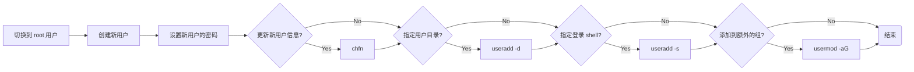

## 概述

Linux 多用户系统的历史可以追溯到 1960 年代的 Unix 系统，Unix 是一种多用户、多任务的操作系统，被广泛应用于大型计算机和服务器上。随着 Linux 的发展，它也成为了一种强大的多用户操作系统，并被广泛应用于服务器、个人电脑和移动设备等领域。

Linux 多用户系统的设计基于以下原则：

- 每个用户都有一个唯一的标识符（UID），用于标识其身份。
- 每个用户可以分配到一个或多个用户组（Group），用户组也有一个唯一的标识符（GID）。
- 每个文件和目录都有一个所有者（Owner）和一个所属用户组（Group），用于控制访问权限。
- 每个用户都有一个主目录（Home Directory），用于存储其个人文件和设置。
- 系统管理员可以创建、删除和管理用户和用户组，以及控制用户的权限和访问权限。

Linux 多用户系统的实现基于以下机制：

- 用户和用户组的信息存储在特定的配置文件中，如 /etc/passwd、/etc/shadow、/etc/group 和 /etc/gshadow。
- 用户登录时需要进行身份验证，通常使用用户名和密码进行认证。
- 系统管理员可以使用命令行工具或图形界面来创建、删除和管理用户和用户组，以及配置用户的权限和访问权限。
- Linux 系统提供了许多安全机制，如访问控制列表（ACL）、文件系统权限和 SELinux 等，用于保护系统和用户的数据安全。

目前随着云计算、容器化和虚拟化技术的发展，Linux 多用户系统的方向也在不断发展。未来的趋势包括：

- 更加丰富和灵活的权限管理机制，如更细粒度的 ACL 和更灵活的访问控制策略。
- 更加集成和自动化的用户和权限管理工具，如自动化用户创建和删除、自动化权限管理和集成用户和权限管理工具等。
- 更加安全和可靠的身份验证机制，如双因素身份验证和基于生物识别的身份验证等。
- 更加简单和易用的图形界面和命令行工具，以方便用户进行用户和权限管理操作。

Linux 多用户系统具有强大的用户和权限管理功能，可以帮助管理员有效地管理系统和保护用户数据的安全。管理员可以使用命令行工具或图形界面来创建、删除和管理用户和用户组，以及配置用户的权限和访问权限。

在使用 root 用户时，应注意系统的安全性，并使用 `sudo` 或 `su` 命令以普通用户身份执行命令。文件和目录的权限由三个组件组成，每个组件可以设置为读取、写入和执行权限，这些权限用数字表示。

在 Linux 系统中，有多个配置文件存储用户和权限信息，包括 `/etc/passwd`、`/etc/shadow`、`/etc/group`、`/etc/gshadow`、`/etc/login.defs` 和 `/etc/adduser.conf` 等文件。

## 用户

### 创建

#### Useradd

`useradd` 命令是 Linux 系统中的一个命令行工具，用于创建新用户帐户。通过 `useradd` 命令，可以指定新用户的用户名、用户 ID（UID）、主目录、默认 shell 和密码等信息。

在大多数 Linux 系统中，只有管理员用户（如 root 用户）可以创建新用户。通常情况下，管理员用户需要使用 `sudo` 命令或以 root 用户身份登录系统，才能使用 `useradd` 命令创建新用户。

```shell
# 创建一个新用户
sudo useradd john
```

| 选项                           | 描述                                                | 示例                                   |
| ------------------------------ | --------------------------------------------------- | -------------------------------------- |
| `-c, --comment COMMENT`        | 指定用户的注释字段。                                | `sudo useradd -c "John Smith" john`    |
| `-d, --home-dir HOME_DIR`      | 指定用户的家目录。                                  | `sudo useradd -d /home/john john`      |
| `-e, --expiredate EXPIRE_DATE` | 指定用户的账户过期日期。                            | `sudo useradd -e 2023-06-30 john`      |
| `-f, --inactive INACTIVE`      | 设置密码过期后的不活动期限为 INACTIVE，以禁用账户。 | `sudo useradd -f 30 john`              |
| `-g, --gid GROUP`              | 指定用户的主用户组。                                | `sudo useradd -g staff john`           |
| `-G, --groups GROUPS`          | 指定用户所属的其他用户组。                          | `sudo useradd -G staff,developer john` |
| `-m, --create-home`            | 创建用户的家目录。                                  | `sudo useradd -m john`                 |
| `-p, --password PASSWORD`      | 指定用户的加密密码。                                | `sudo useradd -p password_hash john`   |
| `-s, --shell SHELL`            | 指定用户的默认 shell。                              | `sudo useradd -s /bin/bash john`       |
| `-u, --uid UID`                | 指定用户的 UID。                                    | `sudo useradd -u 1001 john`            |

### 管理

#### Chfn

`chfn`（Change Finger）命令用于修改用户信息。该命令可以用来更改用户的全名、办公室电话、家庭电话、其他说明等信息。

```shell
# 更改当前用户信息
debian@SevenWate-PC:$ chfn
Password:
Changing the user information for debian
Enter the new value, or press ENTER for the default
        Full Name:
        Room Number []:
        Work Phone []:
        Home Phone []:
```

| 选项                | 描述                       | 示例                                           |
| ------------------- | -------------------------- | ---------------------------------------------- |
| `-f, --full-name`   | 更改用户的全名。           | `chfn --full-name "John Doe" [username]`       |
| `-h, --home-phone`  | 更改用户的家庭电话号码。   | `chfn --home-phone "123-456-7890" [username]`  |
| `-o, --other`       | 更改用户的其他说明。       | `chfn --other "这是一个测试用户" [username]`   |
| `-r, --room-number` | 更改用户的办公室电话号码。 | `chfn --room-number "555-1234" [username]`     |
| `-u, --uid`         | 更改用户的 UID。           | `chfn --uid 1001 [username]`                   |
| `-c, --comment`     | 更改用户的注释字段。       | `chfn --comment "这是一个测试用户" [username]` |

#### Chsh

`chsh` （Change Shell）命令是 Linux 系统中的一个命令行工具，用于更改用户的默认 shell。默认情况下，用户登录后会进入一个特定的 shell 环境，该环境定义了用户与系统交互的方式。`chsh` 命令可用于更改用户的默认 shell，从而改变用户与系统交互的方式。

```shell
# 查看当前系统 shell
cat /etc/shells

# 更改当前用户的默认 shell
chsh -s /bin/bash

# 更改其他用户的默认 shell
chsh -s /bin/bash john
```

#### Passwd

`passwd` （Password）命令是 Linux 系统中的一个命令行工具，用于更改用户的密码或口令。默认情况下，每个 Linux 用户都有一个口令或密码来保护其账户的安全性。`passwd` 命令可用于更改密码或口令。

```shell
# 更改当前用户的
passwd 

# 更改其他用户的密码
passwd john
```

| 选项           | 描述                                   | 示例                        |
| -------------- | -------------------------------------- | --------------------------- |
| `-l, --lock`   | 锁定用户的账户，禁止用户登录。         | `sudo passwd --lock john`   |
| `-u, --unlock` | 解锁用户的账户，允许用户登录。         | `sudo passwd --unlock john` |
| `-d, --delete` | 删除用户的密码或口令，允许无密码登录。 | `sudo passwd --delete john` |
| `-e, --expire` | 强制用户在下一次登录时更改密码或口令。 | `sudo passwd --expire john` |
| `-S, --status` | 显示用户密码或口令的状态。             | `passwd --status john`      |

#### Usermod

`usermod`（User Modify）命令是 Linux 系统中的一个命令行工具，用于修改用户的属性或配置。`usermod` 命令允许您更改现有用户的用户名、UID、主目录、默认 shell 等信息，还可以将用户添加到其他用户组中。

| 选项                           | 描述                                                | 示例                                 |
| ------------------------------ | --------------------------------------------------- | ------------------------------------ |
| `-c, --comment COMMENT`        | 指定用户的注释字段。                                | `sudo usermod -c "John Smith" john`  |
| `-d, --home HOME_DIR`          | 指定用户的家目录。                                  | `sudo usermod -d /home/newhome john` |
| `-e, --expiredate EXPIRE_DATE` | 指定用户的账户过期日期。                            | `sudo usermod -e 2023-06-30 john`    |
| `-f, --inactive INACTIVE`      | 设置密码过期后的不活动期限为 INACTIVE，以禁用账户。 | `sudo usermod -f 30 john`            |
| `-g, --gid GROUP`              | 指定用户的主用户组。                                | `sudo usermod -g staff john`         |
| `-aG, --add-subgroups`         | 将用户添加到附加组                                  | `sudo usermod -aG audio john`        |
| `-l, --login NEW_LOGIN`        | 更改用户的登录名。                                  | `sudo usermod -l newname john`       |
| `-p, --password PASSWORD`      | 指定用户的加密密码。                                | `sudo usermod -p password_hash john` |
| `-s, --shell SHELL`            | 指定用户的默认 shell。                              | `sudo usermod -s /bin/bash john`     |
| `-u, --uid UID`                | 指定用户的 UID。                                    | `sudo usermod -u 1001 john`          |

### 删除

#### Userdel

`userdel`（User Delete）命令是 Linux 系统中的一个命令行工具，用于删除现有用户帐户。默认情况下，`userdel` 命令仅删除用户的帐户，而不删除用户的主目录和邮件箱。如果需要删除用户的主目录和邮件箱，可以使用 `-r` 选项。

```shell
# 删除一个用户
sudo userdel john
```

| 选项           | 描述                                               | 示例                   |
| -------------- | -------------------------------------------------- | ---------------------- |
| `-f, --force`  | 强制删除用户，即使用户当前已登录或有未完成的进程。 | `sudo userdel -f john` |
| `-r, --remove` | 删除用户及其主目录。                               | `sudo userdel -r john` |

## 用户组

### 创建

#### Groupadd

`groupadd` 命令是 Linux 系统中的一个命令行工具，用于创建新的用户组。管理员用户（如 root 用户）可以使用 `groupadd` 命令创建新组。

```shell
# 创建一个新组
sudo groupadd newgroup
```

| 选项                  | 描述                                                         | 示例                                       |
| --------------------- | ------------------------------------------------------------ | ------------------------------------------ |
| `-g, --gid GID`       | 指定新组的 GID。如果未指定，系统会自动分配一个未使用的 GID。 | `sudo groupadd -g 1001 newgroup`           |
| `-K, --key KEY=VALUE` | 指定要应用于新组的 SELinux 标签。                            | `sudo groupadd -K "type=staff_u" newgroup` |
| `-r, --system`        | 创建一个系统组，该组的 GID 小于 1000，且不会在登录屏幕上显示。 | `sudo groupadd -r newgroup`                |

### 管理

#### Groups

`groups` 命令是 Linux 系统中的一个命令行工具，用于显示当前用户所属的用户组。如果没有指定用户名，则 `groups` 命令将显示当前用户所属的用户组。

```shell
# 显示当前用户所属的用户组
groups

# 显示指定用户所属的用户组
groups john
```

#### Gpasswd

`gpasswd` （Group Password）命令是 Linux 系统中的一个命令行工具，用于管理用户组的密码和成员列表。管理员用户（如 root 用户）可以使用 `gpasswd` 命令来添加或删除用户组的成员，或者设置或删除用户组的密码。

```shell
# 设置组密码
sudo gpasswd newgroup
```

| 选项                            | 描述                                                         | 示例                                 |
| ------------------------------- | ------------------------------------------------------------ | ------------------------------------ |
| `-a, --add USER`                | 将指定的用户添加到指定的用户组中。                           | `sudo gpasswd -a john newgroup`      |
| `-d, --delete USER`             | 从指定的用户组中删除指定的用户。                             | `sudo gpasswd -d john newgroup`      |
| `-M, --members USER1,USER2,...` | 将指定的用户列表设置为指定组的成员。                         | `sudo gpasswd -M john,jane newgroup` |
| `-r, --remove-password`         | 从指定的用户组中删除密码。                                   | `sudo gpasswd -r newgroup`           |
| `-R, --restrict`                | 启用限制模式。在此模式下，只有组的所有者和管理员才能更改组成员身份。 | `sudo gpasswd -R newgroup`           |

#### Groupmod

`groupmod` （Group Modify）命令是 Linux 系统中的一个命令行工具，用于修改已有用户组的属性，例如组 ID、组名称和组密码等。管理员用户（如 root 用户）可以使用 `groupmod` 命令来更改用户组的属性。

| 选项                       | 描述                         | 示例                                   |
| -------------------------- | ---------------------------- | -------------------------------------- |
| `-g, --gid GID`            | 将组的 GID 设置为指定的值。  | `sudo groupmod -g 1001 newgroup`       |
| `-n, --new-name NEW_GROUP` | 将组的名称更改为指定的名称。 | `sudo groupmod -n newgroup2 newgroup`  |
| `-o, --non-unique`         | 允许使用非唯一 GID 创建组。  | `sudo groupmod -o newgroup`            |
| `-p, --password PASSWORD`  | 将组密码设置为指定的密码。   | `sudo groupmod -p mypassword newgroup` |

### 删除

#### Groupdel

`groupdel` （Group Delete）是 Linux 系统中的一个命令行工具，用于删除一个用户组。删除用户组时，系统会自动将该组的所有成员从该组中删除，并将文件和目录中的组 ID 更改为其他组。

```shell
# 删除一个用户组
sudo groupdel newgroup
```

| 选项                    | 描述                               | 示例                                         |
| ----------------------- | ---------------------------------- | -------------------------------------------- |
| `-f, --force`           | 强制删除用户组，即使该组仍有成员。 | `sudo groupdel -f newgroup`                  |
| `-h, --help`            | 显示命令帮助信息。                 | `groupdel -h`                                |
| `-R, --root CHROOT_DIR` | 在指定的 chroot 环境中运行命令。   | `sudo groupdel --root /mnt/newroot newgroup` |
| `-v, --verbose`         | 显示命令详细输出。                 | `sudo groupdel -v newgroup`                  |

## Root 超级用户

在 Linux 系统中，root 是超级用户，具有完全的系统管理权限。root 用户可以执行任何命令，并访问系统中的所有文件和资源。在默认情况下，root 用户的密码是空的，因此在安全性方面需要额外注意。

### Su

`su`（Switch User）命令是 Linux 系统中的一个命令行工具，它允许您在不注销当前用户的情况下切换到其他用户帐户。默认情况下，`su` 命令切换到超级用户帐户（root）。

```shell
# 默认切换 root
su

# 切换到 debian
su debian
```

| 选项                    | 描述                                                         | 示例                    |
| ----------------------- | ------------------------------------------------------------ | ----------------------- |
| `-c, --command COMMAND` | 在切换到另一个用户后执行指定的命令或脚本。                   | `su -c "ls -l" user1`   |
| `-s, --shell SHELL`     | 指定要使用的 shell，而不是默认 shell。                       | `su -s /bin/bash user1` |
| `-l, --login`           | 在切换用户时模拟完整的登录过程，包括加载环境变量、切换工作目录等。 | `su -l user`            |

### Sudo

在 Unix 和类 Unix 系统中，`sudo` 是一个强大的工具，允许普通用户以超级用户（root）的权限来执行特定的命令或访问受限资源。`sudo` 命令的行为是由一个配置文件来定义的，这个文件通常称为 `sudoers` 文件。

`sudoers` 文件位于 `/etc/sudoers` 或 `/etc/sudoers.d` 目录中，并且只有超级用户（root）有权限进行编辑。下面是一个 `sudoers` 文件的示例内容：

```shell
# 允许 `sudo` 组的成员以任何用户身份（ALL:ALL）执行任何命令（ALL）。
%sudo   ALL=(ALL:ALL) ALL

# 允许 `admin` 组的成员以任何用户身份（ALL:ALL）执行任何命令（ALL）。
%admin  ALL=(ALL:ALL) ALL

# 允许 `root` 用户以任何用户身份（ALL:ALL）执行任何命令（ALL）。
root    ALL=(ALL:ALL) ALL

# 允许 `sudo` 组的成员以任何用户身份（ALL:ALL）执行任何命令（ALL），并且无需输入密码（NOPASSWD）。
%sudo   ALL=(ALL:ALL) NOPASSWD: ALL
```

在 `sudoers` 文件中，每个规则的一般格式如下：

```shell
user/group  hosts=(users:groups) commands
```

- `user/group`：指定用户或用户组，可以使用用户名或组名。
- `hosts`：指定可以使用 `sudo` 命令的主机列表，可以是主机名、IP 地址或特殊的通配符。
- `users:groups`：指定要执行命令的用户和组，以冒号分隔。
- `commands`：指定允许执行的命令。

`sudoers` 文件中的规则可以使用特殊符号和关键字来增加灵活性。例如：

- `ALL`：表示匹配所有主机、用户或命令。
- `ALL=(ALL:ALL)`：表示以任何用户身份在任何主机上执行任何命令。
- `NOPASSWD`：表示无需输入密码。

**需要注意的是，对 `sudoers` 文件的修改应当谨慎进行，并且建议使用 `visudo` 命令来编辑 `sudoers` 文件，以确保语法正确并避免意外的访问限制。**`visudo` 会对文件进行验证并在保存前进行检查，以防止可能导致系统故障的错误配置。

以下是创建 `sudo` 用户的步骤：

```shell
1.创建用户
sudo adduser username

2.将用户添加到 sudo 组
sudo usermod -aG sudo username

3.检查用户是否已成功添加到 sudo 组
groups username

4.确认用户可以使用 sudo 命令
sudo -l -U username
```

| 选项                    | 描述                                                         | 示例                                    |
| ----------------------- | ------------------------------------------------------------ | --------------------------------------- |
| `-u, --user USER`       | 指定要切换到的用户。                                         | `sudo -u user1 ls -l`                   |
| `-g, --group GROUP`     | 指定要切换到的组。                                           | `sudo -g group1 ls -l`                  |
| `-k, --reset-timestamp` | 重置 `sudo` 命令的时间戳。                                   | `sudo -k`                               |
| `-v, --validate`        | 验证 `sudo` 命令的权限，但不执行任何命令。                   | `sudo -v`                               |
| `-l, --list [COMMAND]`  | 显示 `sudo` 命令当前用户的授权信息，或显示指定命令的授权信息。 | `sudo -l` 或 `sudo -l /usr/bin/apt-get` |
| `-h, --help`            | 显示 `sudo` 命令的帮助信息。                                 | `sudo -h`                               |
| `-V, --version`         | 显示 `sudo` 命令的版本信息。                                 | `sudo -V`                               |

### Newusers

`newusers` 是一个 Linux 系统命令，用于批量创建新的用户账号。

该命令可以从指定的文件中读取一组用户信息，每行包括用户名、密码、用户 ID、主组 ID、全名、主目录、默认 shell 等字段。`newusers` 会自动创建这些用户账号，并设置相应的密码、主目录和 shell。

```shell
-------------------- user.txt --------------------
user1:x:1001:1001:User One:/home/user1:/bin/bash
user2:x:1002:1002:User Two:/home/user2:/bin/bash
user3:x:1003:1003:User Three:/home/user3:/bin/bash
--------------------------------------------------

# 读取 user.txt 批量创建用户
newusers user.txt
```

| 选项                   | 描述                       | 示例                                                         |
| ---------------------- | -------------------------- | ------------------------------------------------------------ |
| `-u, --uid`            | 指定起始用户 ID             | `newusers -u 1000 users.txt`                                 |
| `-g, --gid`            | 指定起始组 ID               | `newusers -g 1000 users.txt`                                 |
| `-c, --comment`        | 指定用户的注释信息         | `newusers -c "User One" users.txt`, `newusers --comment "User One" users.txt` |
| `-s, --shell`          | 指定新用户的默认 shell     | `newusers -s /bin/bash users.txt`, `newusers --shell /bin/bash users.txt` |
| `-H, --no-create-home` | 禁止创建用户主目录         | `newusers -H users.txt`, `newusers --no-create-home users.txt` |
| `-N, --no-user-group`  | 禁止创建与用户名同名的主组 | `newusers -N users.txt`, `newusers --no-user-group users.txt` |

### Chpasswd

`chpasswd` 命令用于批量修改用户的密码，可以一次性修改多个用户的密码，而不需要逐个输入密码。它可以从标准输入、文件或命令行参数中读取用户密码信息，并将其应用于指定的用户账户。

```shell
-------------------- users.txt --------------------
user1:password1
user2:password2
--------------------------------------------------

# 将 user1 的密码修改为 password1
echo 'user1:password1' | chpasswd

# 批量更新，使用 md5 加密方式
sudo chpasswd -m < users.txt
```

| 选项                 | 描述                       | 示例                                         |
| -------------------- | -------------------------- | -------------------------------------------- |
| `-e, --encrypted`    | 指定密码已加密             | `chpasswd -e < users.txt`                    |
| `-h, --help`         | 显示帮助信息并退出         | `chpasswd --help`                            |
| `-m, --md5`          | 指定密码以 MD5 格式加密    | `chpasswd -m < users.txt`                    |
| `-c, --crypt-method` | 指定密码加密方法           | `chpasswd --crypt-method SHA512 < users.txt` |
| `-R, --root`         | 以 root 权限运行命令       | `sudo chpasswd --root`                       |
| `-u, --update`       | 仅更新现有用户的密码       | `chpasswd -u < users.txt`                    |
| `-I, --inactive`     | 指定密码失效时间，单位为天 | `chpasswd --inactive 7 < users.txt`          |

### pwck、grpck

`pwck` （Password Check）和 `grpck` （Group Check）命令是 Linux 系统中用于检查 `/etc/passwd`、`/etc/shadow` 和 `/etc/group` 等文件的格式和完整性的工具。这些命令可以帮助系统管理员查找和修复这些文件中的错误，以确保系统的安全性和稳定性。

- 用户配置文件：`/etc/passwd` 文件是 Linux 系统中存储用户信息的文件之一。该文件包含每个用户的用户名、用户 ID、主目录、登录 shell 等信息。

- 用户密码配置文件：`/etc/shadow` 文件是 Linux 系统中存储用户密码信息的文件之一。该文件包含每个用户的密码哈希值、最后一次更改密码的日期等信息。

- 用户组配置文件：`/etc/group` 文件是 Linux 系统中存储用户组信息的文件之一。该文件包含每个用户组的名称、组 ID 和组成员列表等信息。

- 用户组密码配置文件：`/etc/gshadow` 文件是 Linux 系统中存储用户组密码信息的文件之一。该文件包含每个用户组的密码哈希值、管理员列表和成员列表等信息。

- 默认配置文件：`/etc/login.defs` 文件是 Linux 系统中存储默认登录选项的文件之一。该文件包含默认的密码长度、最大尝试登录次数等信息。

- 配置文件：`/etc/adduser.conf` 文件是 Linux 系统中存储新用户默认配置选项的文件之一。该文件包含新用户的默认主目录、默认 shell 等信息。

| 选项             | 描述                     | 示例                                    |
| ---------------- | ------------------------ | --------------------------------------- |
| `-r, --root DIR` | 指定要检查的根目录       | `pwck/grpck -r /mnt`                    |
| `-s, --silent`   | 安静模式，只输出错误信息 | `pwck/grpck -s /etc/passwd /etc/shadow` |
| `-q, --quiet`    | 安静模式，不输出信息     | `pwck/grpck -q /etc/passwd /etc/group`  |
| `-n, --nocheck`  | 不检查用户主目录和组文件 | `pwck/grpck -n /etc/passwd /etc/shadow` |

### pwconv、pwunconv、grpconv、grpunconv

`pwconv`（Password Conversion）、`pwunconv`（Password unConversion）、`grpconv` （Group Conversion）和 `grpunconv`（Group unConversion） 命令是 Linux 系统中的用于转换密码文件和组文件格式的工具。这些工具可以帮助系统管理员将 `/etc/passwd`、`/etc/shadow` 和 `/etc/group` 等文件的格式转换为其他格式或者将已转换的文件恢复为原始格式。

这些工具的作用如下：

- `pwconv` 命令：将 `/etc/passwd` 和 `/etc/shadow` 文件的格式从标准格式（包括用户名、密码和 UID 等信息）转换为 shadow 格式（将密码单独存储在 `/etc/shadow` 文件中）。
- `pwunconv` 命令：将 `/etc/passwd` 和 `/etc/shadow` 文件的格式从 shadow 格式转换为标准格式。
- `grpconv` 命令：将 `/etc/group` 文件的格式从标准格式（包括组名、组密码和 GID 等信息）转换为 Gshadow 格式（将组密码单独存储在 `/etc/gshadow` 文件中）。
- `grpunconv` 命令：将 `/etc/group` 文件的格式从 Gshadow 格式转换为标准格式。

这些工具的用途包括但不限于：

- 提高系统的安全性：使用 shadow 格式将用户密码单独存储在 `/etc/shadow` 文件中，可以防止未经授权的用户访问密码信息，提高系统的安全性。
- 管理用户和组的身份验证：通过转换和恢复密码和组文件格式，可以更轻松地管理用户和组的身份验证信息，例如更改密码、添加或删除用户和组等操作。

## 其他

### W

`w` 命令在 Unix 和 Unix 类操作系统中用于显示有关系统活动的信息。这个命令可以显示当前系统中登录的用户、他们所做的事情、从哪里登录、他们登录的时间以及系统负载等。

```shell
root@LinuxTest:~# w
 14:16:51 up 22:16,  2 users,  load average: 0.00, 0.00, 0.00
USER     TTY      来自           LOGIN@   IDLE   JCPU   PCPU WHAT
sevenwat tty1     -                二16   22:15m  0.16s  0.05s -bash
sevenwat pts/0    172.17.0.100     13:55    0.00s  0.51s  0.13s sshd: sevenwate [priv]
```

### Id

`id` 命令用于显示用户和用户组的标识信息。它可以用于查看当前用户或指定用户的 UID（用户标识符）、GID（组标识符）和所属用户组的名称。

```shell
sevenwate@LinuxTest:~$ id
用户id=1000(sevenwate) 组id=1000(sevenwate) 组=1000(sevenwate),24(cdrom),25(floppy),27(sudo),29(audio),30(dip),44(video),46(plugdev),108(netdev),1001(grpdemo)
```

### Whoami

`whoami` 命令用于显示当前登录用户的用户名。它是一个非常简单的命令，通常用于 shell 脚本和命令行中，以便在需要当前用户的用户名时快速获取它。

```shell
sevenwate@LinuxTest:~$ whoami
sevenwate
```

### Last

`last` 命令在 Linux 中用于显示系统的登录记录。这个命令列出了系统登录和启动的详细信息，如登录用户、登录的 IP 地址、登录时间以及登录持续的时间。

```shell
root@LinuxTest:~# last
sevenwat pts/0        172.17.0.100     Wed May 31 13:55   still logged in
sevenwat pts/1        172.17.0.100     Wed May 31 11:07 - 11:21  (00:14)
sevenwat pts/0        172.17.0.100     Wed May 31 11:07 - 13:00  (01:53)
sevenwat pts/0        172.17.0.100     Wed May 31 10:55 - 11:04  (00:09)
sevenwat pts/0        172.17.0.100     Wed May 31 10:49 - 10:51  (00:02)
sevenwat pts/0        172.17.0.100     Tue May 30 17:03 - 17:35  (00:32)
sevenwat pts/0        172.17.0.100     Tue May 30 16:03 - 16:53  (00:50)
sevenwat pts/2        172.17.0.100     Tue May 30 16:02 - 16:02  (00:00)
sevenwat pts/1        172.17.0.100     Tue May 30 16:02 - 16:02  (00:00)
sevenwat pts/0        172.17.0.100     Tue May 30 16:02 - 16:02  (00:00)
sevenwat tty1                          Tue May 30 16:01   still logged in
reboot   system boot  5.10.0-23-amd64  Tue May 30 16:00   still running

wtmp begins Tue May 30 16:00:47 2023
```

### Lastlog

`lastlog` 命令用于查看所有用户最后一次登录的时间和登录的终端。这个命令检查 `/var/log/lastlog` 文件以确定每个用户的最后一次登录信息。此命令的输出包含用户名、最后登录的端口和最后登录的时间。

```shell
root@LinuxTest:~# lastlog
用户名           端口     来自                最后登录时间
root                                       **从未登录过**
……
sevenwate        pts/0    172.17.0.100     三 5月 31 13:55:15 +0800 2023
newuser                                    **从未登录过**
```

## 实例



1. **打开终端**：快捷键 Ctrl+Alt+T 打开终端。
2. **切换到 root 用户**：使用 `su -` 命令切换到 root 用户。
3. **使用 useradd 命令创建新用户**：使用 `useradd` 命令和新用户的用户名来创建新用户。例如创建一个名为 `newuser` 的新用户：

```shell
root@LinuxTest:~# useradd newuser
```

1. **设置新用户的密码**：使用 `passwd` 命令和新用户的用户名来设置密码。

```shell
root@LinuxTest:~# passwd newuser
新的 密码：
重新输入新的 密码：
passwd：已成功更新密码
```

1. **更改新用户的信息**（可选）：可以使用 `chfn` 命令更改新用户的全名、房间号、工作电话和家庭电话。

```shell
root@LinuxTest:~# chfn newuser
正在改变 newuser 的用户信息
请输入新值，或直接敲回车键以使用默认值
        全名 []: newuser
        房间号码 []: 888
        工作电话 []: 18688888888
        家庭电话 []: 0371
        其它 []: 
```

1. **给新用户分配家目录**（可选）：默认情况下 `useradd` 命令会为新用户创建一个在 `/home` 下的家目录。`usermod` 可以使用 `-d` 选项为新用户指定一个不同的家目录。例如，指定 `newuser` 的家目录是 `/opt/newuser`：

```shell
root@LinuxTest:~# usermod -d /opt/newuser -m newuser
```

1. **指定不同的登录 shell**（可选）：`usermod` 可以使用 `-s` 选项指定一个不同的登录 shell。例如为 `newuser` 指定 `/bin/sbin/noligin` 作为登录 shell，你可以运行：

```shell
# 使用 usermod 命令
root@LinuxTest:~# usermod -s /usr/bin/nologin newuser
# 使用 chsh 命令
root@LinuxTest:~# chsh -s /bin/bash newuser
```

1. **将新用户添加到一个或多个额外的组**（可选）：可以使用 `usermod` 命令的 `-G` 选项将新用户添加到一个或多个额外的组。例如将 `newuser` 添加到 `sudo` 和 `users` 组，你可以运行：

```shell
root@LinuxTest:~# usermod -aG sudo,users newuser
root@LinuxTest:~# id newuser
用户id=1003(newuser) 组id=1003(newuser) 组=1003(newuser),27(sudo),100(users)
# 用户最终信息
root@LinuxTest:~# cat /etc/passwd | grep newuser
newuser:x:1003:1003:newuser,888-1,18688888888,0371-88888888:/opt/newuser2:/usr/bin/nologin
```
