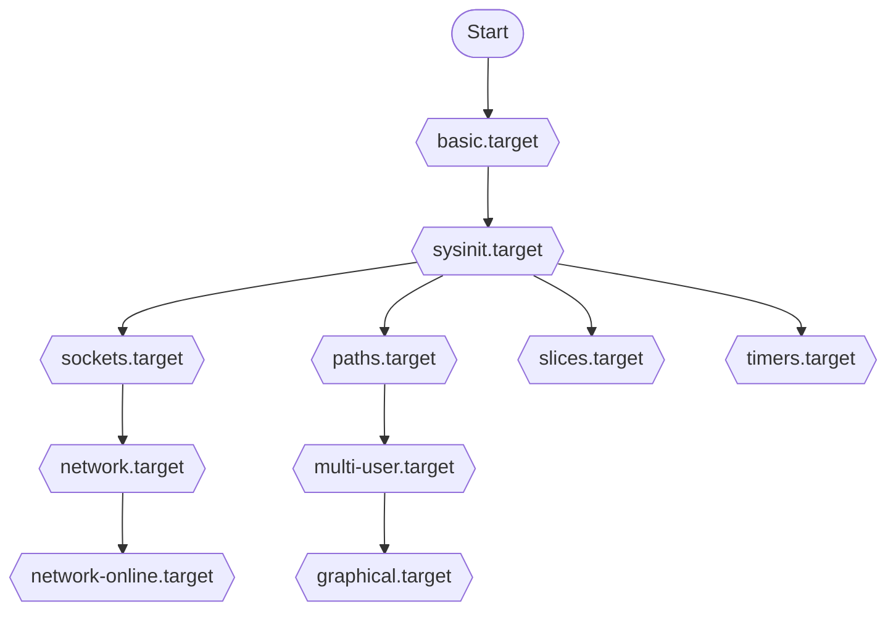
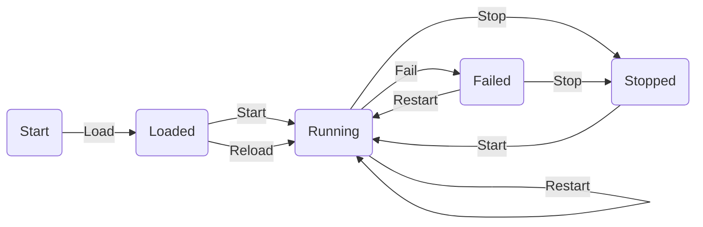

## Linux 服务概述

在现代 Linux 发行版中，系统和服务管理器是核心组件之一，负责初始化系统、管理系统进程和服务。这些管理器确保系统服务按正确的顺序启动、监控它们的运行状态，并在服务出现故障时进行恢复。传统上，这一角色由 SysV init 系统承担，但在过去几年中，更多现代化的解决方案如 systemd 和 Upstart 开始主导。

### Systemd 的设计目标和特点

systemd 是为了克服旧式 init 系统的缺陷而设计的，其主要设计目标包括提高系统启动速度和处理复杂的依赖关系。systemd 使用 socket 和 D-Bus 进行服务间通信，支持按需启动守护进程，具有更强的并发能力。此外，systemd 提供了诸如日志系统 `journal` 的集成，这是一个统一的日志管理解决方案，能够收集和管理来自内核、初始化系统以及用户空间应用的日志。

特点归纳如下：

- **单元（Units）**：systemd 将服务、挂载点、设备等管理对象抽象为单元，通过单元文件进行配置。
- **依赖性管理**：可以配置单元间的依赖关系，确保服务以合适的顺序启动。
- **并行启动**：支持服务的并行启动，显著提高系统的启动速度。
- **状态监控**：实时监控服务状态，提供重新启动失败服务的机制。

### Systemd 的历史和影响

systemd 最初由 Lennart Poettering 和 Kay Sievers 在 2010 年开发，作为一个更加强大和灵活的替代传统的 Unix-style init 系统的方案。自引入以来，systemd 已被广泛接受并成为多个主流 Linux 发行版的标准部分，包括 Fedora、Debian、Ubuntu 和 CentOS。这种广泛的采用引发了广泛的讨论和争议，**尤其是关于它的复杂性和与 Unix 哲学的一致性**。尽管有争议，systemd 的设计允许了更快的系统启动时间和更好的服务管理，对 Linux 系统管理产生了深远的影响。

### 与其他服务管理器的比较

与 SysV init 系统相比，systemd 提供了更加现代化和强大的功能集。例如，SysV init 使用脚本逐个启动服务，无法进行有效的依赖管理和并行处理。Upstart 是另一种较早的替代 init 系统，它介绍了基于事件的启动机制，尽管如此，Upstart 仍未提供像 systemd 这样的综合日志管理和系统状态监控。

**systemd 的优势在于其架构的整合性和管理能力，这使其成为了大多数主流 Linux 发行版的默认服务管理系统。**

## Systemd 架构

systemd 的架构是高度模块化的，主要由各种类型的单元（Units）构成，这些单元通过配置文件定义并由 systemd 管理器控制。单元是管理系统资源的基本方法，每种单元类型都有其特定的用途和应用场景。

### 架构图


### 单元（Units）

| 类型                       | 描述                                                       | 实际应用场景                                             |
| -------------------------- | ---------------------------------------------------------- | -------------------------------------------------------- |
| **服务（Services）**       | 代表一个后台运行的进程，可以是一次性的、持续的或间歇性的。 | 用于管理各种后台服务，如网络服务、数据库服务等。         |
| **插槽（Sockets）**        | 允许 systemd 按需启动服务，通过监听特定的端口来激活服务。  | 用于提高资源利用效率，例如，仅在有请求时启动数据库服务。 |
| **设备（Devices）**        | 表示系统中的物理或虚拟设备，由 systemd 动态管理。          | 用于设备的动态挂载和管理，如自动管理 USB 设备。          |
| **挂载（Mounts）**         | 控制文件系统的挂载点。                                     | 用于管理文件系统的挂载，确保在需要时可用。               |
| **自动挂载（Automounts）** | 在访问时自动挂载文件系统。                                 | 用于访问网络存储或其他延迟加载的资源时提高性能。         |
| **路径（Paths）**          | 监视文件系统路径的更改，并在更改时激活相应的 Units。       | 用于触发任务，如在文件下载完毕后自动启动处理脚本。       |
| **定时器（Timers）**       | 类似于 cron 作业，按计划时间执行任务。                     | 定时执行如备份、日志清理等任务。                         |

### 目标（Targets）

Targets 是特殊类型的 Unit，用于将系统带到特定的状态。例如，`graphical.target` 设置图形用户界面，`multi-user.target` 设置多用户网络服务。Targets 帮助组织和优化启动过程，通过控制哪些服务和 Units 需要启动来达到所需的操作状态。

#### 启动流程图



| 目标名称                | 描述                                                       |
| ----------------------- | ---------------------------------------------------------- |
| `basic.target`          | 启动系统基础服务。                                         |
| `sysinit.target`        | 系统初始化，包括设备和文件系统的挂载。                     |
| `sockets.target`        | 确保所有需要的套接字服务已启动，准备好通信接口。           |
| `paths.target`          | 监控文件系统路径变更，触发相应服务。                       |
| `slices.target`         | 管理系统资源分配。                                         |
| `timers.target`         | 启动所有计时器单元，处理定时任务。                         |
| `network.target`        | 表示网络功能基本就绪，为后续服务提供网络支持。             |
| `network-online.target` | 确保网络完全可用，用于需要网络连接的服务。                 |
| `multi-user.target`     | 启动多用户环境下所需的服务，准备好除图形界面外的网络服务。 |
| `graphical.target`      | 启动图形界面相关的服务，达到图形用户界面状态。             |

### 生命周期和状态转换

systemd 的生命周期管理涉及启动、停止、重启和重新加载服务及其他 Units。状态转换通过 systemd 的命令行工具 `systemctl` 实现，该工具使管理员能够控制和查询 systemd 的状态。



生命周期管理还包括处理依赖关系，确保服务按正确的顺序启动和停止。systemd 优化了这些过程，使系统管理更加高效和可预测。

## Systemd 单元文件

### 结构和语法

systemd 的单元文件是纯文本文件，用于定义如何管理和启动系统资源，如服务、进程、设备等。每个单元文件分为几个部分，主要包括：

- **[Unit]**：提供描述、依赖关系和启动顺序的信息。
- **[Service]**：特定于服务的配置，如服务类型、启动命令和重启策略。
- **[Install]**：定义如何安装（启用/禁用）这个单元，涉及默认的启动目标。

单元文件通常位于 `/etc/systemd/system` 或 `/usr/lib/systemd/system` 目录下，根据是否是系统级或用户定义的单元而有所不同。

| 目录                       | 描述                                                         |
| :------------------------- | :----------------------------------------------------------- |
| `/etc/systemd/system/`     | 使用 `systemctl enable` 命令创建的 `systemd` 单元文件，以及为扩展服务添加的单元文件。这个目录优先于带有运行时单元文件的目录。 |
| `/usr/lib/systemd/system/` | 与安装的软件包一起分发的 `systemd` 单元文件。                |
| `/run/systemd/system/`     | 在运行时创建的 `systemd` 单元文件。该目录优先于安装了的服务单元文件的目录。 |

### 自定义单元文件

创建自定义单元文件允许用户定义特定的服务或应用程序的启动和管理方式。例如，编写一个简单的服务单元文件来管理一个自定义的脚本服务可能看起来如下：

```shell
[Unit]
Description=My Custom Service
After=network.target

[Service]
Type=simple
ExecStart=/usr/bin/mycustomscript
Restart=on-failure

[Install]
WantedBy=multi-user.target
```

这个单元文件指定了服务依赖于网络服务后启动，使用 `/usr/bin/mycustomscript` 作为启动命令，如果失败则自动重启。

### 启用和禁用单元文件

通过 `systemctl` 命令管理单元文件的启用状态是标准做法。启用单元文件使得在启动时自动运行服务：

```shell
sudo systemctl enable myservice.service
```

相反，如果不希望服务在启动时运行，可以禁用该单元文件：

```shell
sudo systemctl disable myservice.service
```

启用单元只影响系统启动行为，并不启动或停止当前运行的服务。

### 条件性单元和模板单元

- **条件性单元**：systemd 允许在单元文件中设置条件，例如 `ConditionPathExists=/path/to/check`，只有当指定路径存在时，单元才会启动。
- **模板单元**：模板单元允许通过实例化来重用配置。例如，可以创建一个名为 `myservice@.service` 的模板，然后通过指定不同的实例名称启动不同配置的服务。

例如，如果有多个相似的服务需要运行，可以使用模板单元文件：

```shell
[Unit]
Description=My Service Instance %i

[Service]
ExecStart=/usr/bin/myservice --instance %i
```

然后可以通过 `systemctl start myservice@1.service` 来启动服务的一个实例。

## Systemd 命令行工具

`systemctl` 是 systemd 的主要命令行工具，用于检查和控制系统和服务管理器的状态。它提供了一套全面的功能来启动、停止、重启、重新加载服务，以及查看状态和管理系统。

### Systemctl

| 命令描述             | 示例命令                                      | 说明                                                   |
| -------------------- | --------------------------------------------- | ------------------------------------------------------ |
| 启动服务             | `sudo systemctl start apache2.service`        | 启动指定的服务，如 Apache2。                           |
| 停止服务             | `sudo systemctl stop apache2.service`         | 停止正在运行的服务。                                   |
| 重启服务             | `sudo systemctl restart apache2.service`      | 重新启动服务，常用于应用更新后的配置重新载入。         |
| 查看服务状态         | `sudo systemctl status apache2.service`       | 显示服务的当前运行状态，包括是否活跃、启动时间等信息。 |
| 启用服务自启         | `sudo systemctl enable apache2.service`       | 配置服务在系统启动时自动启动。                         |
| 禁用服务自启         | `sudo systemctl disable apache2.service`      | 取消服务的自启动设置，不在系统启动时自动启动。         |
| 重新加载服务         | `sudo systemctl reload apache2.service`       | 重新加载服务的配置文件，不中断当前运行的服务。         |
| 强制重启服务         | `sudo systemctl force-reload apache2.service` | 当普通重载无效时，使用此命令强制重启服务。             |
| 显示服务列表         | `systemctl list-units --type=service`         | 列出系统上所有服务的状态。                             |
| 检查服务是否启动失败 | `sudo systemctl is-failed apache2.service`    | 检查服务是否启动失败并返回状态。                       |

### Systemd-analyze

| 命令描述             | 示例命令                          | 说明                                               |
| -------------------- | --------------------------------- | -------------------------------------------------- |
| 分析启动时间         | `systemd-analyze`                 | 显示启动耗时的总览。                               |
| 显示启动过程详细信息 | `systemd-analyze blame`           | 列出每个服务的启动耗时，帮助识别启动过程中的瓶颈。 |
| 生成启动时间图       | `systemd-analyze plot > file.svg` | 生成系统启动过程中各服务启动时间的图表。           |
| 检查安全性           | `systemd-analyze security`        | 评估系统上服务的安全性。                           |
| 查看单位依赖         | `systemd-analyze dot              | dot -Tsvg > systemd.svg`                           |

### Hostnamectl

| 命令描述       | 示例命令                                     | 说明                             |
| -------------- | -------------------------------------------- | -------------------------------- |
| 显示当前主机名 | `hostnamectl`                                | 显示关于当前系统主机的详细信息。 |
| 设置主机名     | `sudo hostnamectl set-hostname new-hostname` | 设置或更改系统的主机名。         |

### Localectl

| 命令描述         | 示例命令                                     | 说明                       |
| ---------------- | -------------------------------------------- | -------------------------- |
| 显示当前区域设置 | `localectl`                                  | 显示当前的语言和区域设置。 |
| 设置系统语言     | `sudo localectl set-locale LANG=en_US.UTF-8` | 设置系统的语言环境。       |
| 设置键盘布局     | `sudo localectl set-keymap us`               | 设置系统的键盘布局。       |

### Timedatectl

| 命令描述           | 示例命令                                          | 说明                         |
| ------------------ | ------------------------------------------------- | ---------------------------- |
| 显示当前时间和日期 | `timedatectl`                                     | 显示当前的时间、日期和时区。 |
| 设置时区           | `sudo timedatectl set-timezone America/New_York`  | 设置系统的时区。             |
| 设置系统时间       | `sudo timedatectl set-time '2021-01-01 12:34:56'` | 手动设置系统的时间。         |

### Loginctl

| 命令描述         | 示例命令                                     | 说明                         |
| ---------------- | -------------------------------------------- | ---------------------------- |
| 列出登录会话     | `loginctl list-sessions`                     | 显示当前所有活跃的登录会话。 |
| 显示会话详细信息 | `loginctl show-session session-id`           | 显示指定会话的详细信息。     |
| 结束会话         | `sudo loginctl terminate-session session-id` | 强制结束指定的会话。         |

### Journalctl 命令

查看系统状态和服务的日志对于系统管理至关重要。`systemctl status` 命令可以显示单个服务或整个系统的状态。此外，`journalctl` 是 systemd 的日志管理工具，用于查询和显示系统日志：

- **查看所有系统日志**：`sudo journalctl`
- **按服务过滤日志**：`sudo journalctl -u apache2.service`
- **显示实时日志**：`sudo journalctl -f`

### 管理服务和挂载点

`systemctl` 允许管理员管理不仅是服务，还包括挂载点、计时器等其他资源。例如，启动或停止挂载点的命令与服务类似，如 `sudo systemctl start home.mount` 或 `sudo systemctl stop home.mount`。

### 系统启动和关机

控制系统的启动和关机是 `systemctl` 命令的基本功能：

- **重新启动系统**：`sudo systemctl reboot`
- **关闭系统**：`sudo systemctl poweroff`
- **暂停系统**：`sudo systemctl suspend`
- **休眠系统**：`sudo systemctl hibernate`

这些命令提供了对系统状态的直接控制，使管理员能够从命令行安全地管理系统的启动和关闭过程。

## Systemd 服务管理

### 服务的依赖关系和并发控制

在 systemd 中，服务之间的依赖关系是通过单元文件中的 `After`, `Before`, `Requires`, 和 `Wants` 指令定义的。这些指令确保服务以合适的顺序启动和停止，以及在必要的服务不可用时进行正确的处理。

- **`After` 和 `Before`**：确保服务按正确的顺序启动。例如，如果服务 B 在服务 A 后启动，服务 B 的单元文件将包含 `After=a.service`。
- **`Requires` 和 `Wants`**：`Requires` 会在依赖的单元失败时终止当前单元，而 `Wants` 则较为宽松，不会因依赖单元的失败而停止当前单元。

并发控制通过 `Type` 指令管理，这决定了服务是并行启动还是串行。例如，`Type=oneshot` 通常用于需要顺序执行的脚本，而 `Type=simple` 或 `Type=forking` 用于常规后台服务。

### 服务的重启策略和超时设置

systemd 允许通过单元文件中的 `Restart` 指令定义服务的重启策略，如何响应服务的意外终止：

- **`Restart=no`**：不自动重启。
- **`Restart=on-failure`**：仅在服务非正常退出时重启。
- **`Restart=always`**：无论退出状态如何都重启。

超时设置通过 `TimeoutStartSec`, `TimeoutStopSec`, 和 `TimeoutSec` 控制，这些设置定义了启动和停止服务之前的等待时间，有助于管理服务在启动或关闭时挂起的情况。

### 服务的环境变量和执行参数

通过单元文件中的 `Environment` 指令可以设置服务的环境变量。这对于需要特定环境配置的服务来说非常有用：

```shell
[Service]
Environment="VAR1=value1" "VAR2=value2"
```

执行参数通过 `ExecStart`, `ExecStop`, 和 `ExecReload` 指令定义，这些指令指定了启动、停止和重新加载服务时执行的命令。

### 服务的状态和输出处理

状态监控是通过 `systemctl status` 命令实现的，它提供了关于服务运行状态的详细信息，包括是否活跃、运行时长和最近的日志条目。

输出处理通常通过 systemd 的日志系统 `journald` 管理，它收集和管理来自系统和服务的日志。通过 `journalctl` 命令，管理员可以查询和查看服务日志：

```shell
journalctl -u myservice.service
```

这使得跟踪和调试服务问题变得更加容易。

## Systemd 目标和资源管理

### 理解 Systemd 目标

在 systemd 中，目标（Targets）相当于传统 init 系统中的运行级别，但提供了更多的灵活性和配置选项。目标用于组织和管理系统服务的集合，以达到特定的系统状态。常见的目标包括 `graphical.target`（图形界面）、`multi-user.target`（多用户环境）和 `network.target`（网络服务就绪）。通过使用 `systemctl` 命令设置目标，管理员可以控制哪些服务组在系统启动或运行时被激活：

```
sudo systemctl set-default graphical.target
```

### 资源分配和限制

systemd 提供了丰富的资源管理功能，允许系统管理员对服务进行资源限制，确保系统的稳定性和响应能力。这些设置在单元文件的 `[Service]` 部分配置，主要包括：

- **CPU 时间**：`CPUQuota=` 可以限制服务使用的 CPU 百分比。
- **内存限制**：`MemoryLimit=` 设置服务可以使用的最大内存。
- **磁盘 I/O**：`IOWeight=` 控制服务的磁盘 I/O 优先级。

例如，为一个服务设置内存和 CPU 使用限制：

```
[Service]
MemoryLimit=500M
CPUQuota=30%
```

这些限制帮助防止单个服务消耗过多资源，从而影响系统上其他服务的性能。

### 电源管理和节能设置

systemd 集成了电源管理功能，通过 `logind` 和 `systemd-sleep` 服务提供对系统休眠、待机和唤醒的控制。这些功能特别适用于希望优化能源消耗的移动和嵌入式设备。电源管理设置通常在 `/etc/systemd/logind.conf` 文件中配置，包括：

- **HandleSuspendKey**：控制当挂起键被按下时的行为。
- **HandleLidSwitch**：笔记本电脑盖关闭时的系统反应。
- **PowerKeyBehavior**：电源键被按下时的行为。

此外，systemd 提供了 `systemctl suspend`、`systemctl hibernate` 和 `systemctl hybrid-sleep` 命令，允许从命令行管理系统的电源状态。这些命令提供了对系统电源行为的即时控制，使管理员能够根据需要调整系统节能设置和电源策略。

```shell
sudo systemctl suspend
```

## Systemd 网络配置

### 网络接口和插槽的管理

systemd 提供了一个叫做 `systemd-networkd` 的守护进程，用于管理网络配置，使其成为处理网络接口和插槽的强大工具。`systemd-networkd` 管理静态和动态网络配置，包括地址分配、路由表配置和网络接口状态管理。此服务对于服务器和容器环境特别有用，其中可能需要在系统启动时自动配置网络。

### 网络配置文件的结构和语法

网络配置文件通常位于 `/etc/systemd/network` 目录中，文件扩展名为 `.network`。这些配置文件使用 INI 格式，分为几个部分，主要包括 `[Match]` 和 `[Network]`：

- **[Match]** 部分确定配置文件适用于哪些网络接口。可以按接口名称、MAC 地址等属性匹配。
- **[Network]** 部分定义了接口的网络设置，如 IP 地址、网关、DNS 等。

例如，为特定接口配置静态 IP 地址的 `.network` 文件可能看起来如下：

```
[Match]
Name=eth0

[Network]
Address=192.168.1.100/24
Gateway=192.168.1.1
DNS=192.168.1.1
```

### 动态主机配置协议（DHCP）和静态网络配置

`systemd-networkd` 支持通过 DHCP 自动配置网络接口。启用 DHCP 的配置非常简单：

```
[Match]
Name=eth0

[Network]
DHCP=yes
```

这将为指定接口启用 DHCP，自动获取 IP 地址、网关、DNS 服务器等。对于静态配置，如上所示，管理员需要手动指定这些值。

同时，systemd 还提供了高级网络特性，如桥接、绑定和虚拟局域网 (VLAN) 配置，这些都可以通过类似的 `.netdev` 和 `.network` 配置文件进行管理。

## Systemd 日志管理

### 日志记录和存储

systemd 的日志管理是通过 `systemd-journald` 服务实现的，这是一个日志守护程序，负责收集和存储日志数据，包括内核消息、系统服务消息以及其他日志源的数据。`journald` 收集的日志存储在二进制文件中，通常位于 `/var/log/journal/` 目录。这种存储方式优化了日志的读取和写入速度，并支持包括元数据在内的丰富日志信息。

### 使用 Journalctl 命令查看和分析日志

`journalctl` 是用于查询和显示从 `systemd-journald` 收集的日志的工具。这个命令提供了强大的过滤和排序功能，使得查找特定日志事件变得简单。常用的 `journalctl` 命令包括：

- **查看所有日志**：`journalctl`
- **按时间倒序查看日志**：`journalctl -r`
- **按单位查看日志**：`journalctl -u nginx.service`
- **查看指定时间段的日志**：`journalctl --since "2021-01-01" --until "2021-01-02"`
- **实时跟踪最新日志**：`journalctl -f`

这些命令提供了灵活性，以适应不同的日志查询需求。

### 日志的归档和清理

随着时间的推移，日志文件可能会变得很大，占用大量磁盘空间。`systemd-journald` 提供了自动归档和清理旧日志的功能，以保持系统的整洁和效率。管理员可以通过编辑 `/etc/systemd/journald.conf` 文件来配置日志保留策略，例如：

- **SystemMaxUse**：设置日志占用的最大磁盘空间。
- **SystemKeepFree**：设置系统应保持空闲的最小磁盘空间。
- **MaxRetentionSec**：设置日志的最大保留时间。
- **VacuumSize**：当日志大小达到指定值时自动清理旧日志。

通过这样的配置，系统可以自动管理日志文件的大小，避免磁盘空间被过度使用。

```shell
sudo journalctl --vacuum-size=1G
```

上面的命令将删除旧日志，直到日志文件的总大小减少到 1GB。

## Systemd 定时任务

### 定时器和计时器单元

在 systemd 中，定时器（Timers）是用来替代传统的 cron 作业的功能，提供了时间基的任务调度。定时器通过两部分配置实现：一个是 `.timer` 文件，另一个是与之关联的 `.service` 文件。

- **`.timer` 单元**：定义了定时器的触发时间和条件。这包括周期性触发和单次触发的配置。
- **`.service` 单元**：指定了定时器触发时要执行的任务或服务。

### 编写和配置定时任务

创建一个新的定时器涉及到编写 `.timer` 和 `.service` 文件。例如，假设我们要每天定时备份一次数据：

1. **创建 service 文件**：`backup.service`

   ```
   [Unit]
   Description=Daily Backup Job
   
   [Service]
   ExecStart=/usr/bin/backup-script
   ```

2. **创建 timer 文件**：`backup.timer`

   ```
   [Unit]
   Description=Runs backup every day
   
   [Timer]
   OnCalendar=daily
   Persistent=true
   
   [Install]
   WantedBy=timers.target
   ```

在这个例子中，`OnCalendar=daily` 触发规则设定了每天运行备份任务。`Persistent=true` 确保即使在某些情况下错过了定时时间，下次启动时也会尝试执行。

### 定时任务的依赖和执行顺序

在 systemd 中配置定时任务时，可以通过依赖关系和顺序指令来控制任务的执行顺序和条件。例如，如果一个任务需要在网络服务完全启动后执行，可以在 `.service` 文件中使用 `After=network.target` 指令。

此外，使用 `Requires=` 和 `After=` 指令确保在特定服务或任务失败时，相关的定时任务不会执行，这为任务调度提供了更高的可控性和稳定性。

### 示例：依赖网络的定时任务

1. **修改 service 文件**：增加依赖关系

   ```
   iniCopy code[Unit]
   Description=Perform network-dependent task
   After=network-online.target
   Wants=network-online.target
   
   [Service]
   ExecStart=/usr/bin/network-dependent-script
   ```

2. **配置 timer 文件**：如之前所示，定时设置保持不变。

通过这样的配置，`systemd` 确保只有在网络完全可用的情况下才执行该任务。这种方法提高了任务执行的可靠性，避免了因依赖条件未满足而导致的失败。

## 第十章：高级 Systemd 特性

### 容器和 Systemd

systemd 提供了对容器的广泛支持，特别是通过 `systemd-nspawn` 工具，它允许用户在隔离的环境中启动容器或虚拟机。`systemd-nspawn` 被用作轻量级的容器管理工具，适合于开发和测试环境。

- **使用 `systemd-nspawn`**：该命令可以启动一个基于特定文件系统目录的容器，例如：

  ```shell
  sudo systemd-nspawn -D /path/to/container/root
  ```

  这条命令启动一个容器，使用指定目录作为其根文件系统。

- **集成与管理**：`systemd` 的机制还允许通过 `.service` 单元文件管理容器，使得容器的启动和停止可以像管理常规服务一样进行。

### 系统升级和回滚

systemd 提供了机制来帮助管理系统升级和回滚，确保系统更新可以安全地应用并在需要时回滚到旧版本。通过使用 `systemd` 的快照和原子更新特性，管理员可以在应用更新前创建系统状态的快照，并在更新不成功时恢复到这个快照。

- **创建和恢复快照**：可以通过 `systemctl` 命令管理快照：

  ```
  bashCopy code
  sudo systemctl snapshot my_snapshot.service
  ```

  如有需要，可以通过类似的命令恢复到此快照状态。

- **原子更新**：`systemd` 支持在不中断当前运行服务的情况下更新软件和服务，减少系统升级带来的不便和风险。

### 远程管理和控制

`systemd` 也扩展了其功能到远程管理领域，通过 `systemd-machined` 和 `systemd-journal-remote` 等守护程序支持远程机器和日志的管理。这允许管理员从中央位置监控和控制多台机器的状态和日志。

- **设置远程日志收集**：`systemd-journal-remote` 可以配置为接收其他机器发送的日志数据，从而集中日志管理：

  ```
  sudo systemctl start systemd-journal-remote
  ```

- **远程机器管理**：使用 `systemctl` 命令远程控制系统服务，需配置适当的网络和权限设置。

## 故障排查和性能优化

### 常见的 Systemd 问题和解决方案

在使用 systemd 管理系统时，可能会遇到一些常见问题。这里列举几个典型问题及其解决方案：

- **服务无法启动**：检查服务的单元文件中的 `ExecStart` 指令指定的路径和权限。使用 `journalctl -u service-name.service` 查看服务日志以获得错误详细信息。
- **服务启动超时**：调整单元文件中的 `TimeoutStartSec` 设置，以提供更长的启动时间。
- **依赖问题**：确保所有必需的服务都已配置为在当前服务之前启动，通过 `After` 和 `Requires` 指令控制启动顺序。

### 性能监控和优化技巧

systemd 提供了多种工具和方法来监控和优化系统性能：

- **使用 `systemd-analyze` 命令**：这个工具可以帮助你分析系统启动时间，并确定哪些服务影响了启动性能。例如，`systemd-analyze blame` 显示启动过程中各服务的启动时间。
- **优化服务启动顺序和资源使用**：通过调整服务的启动顺序（使用 `After` 和 `Before`）和资源限制（如 `MemoryLimit` 和 `CPUShares`），可以显著提高系统的响应性和效率。

### 安全性和隐私考虑

安全性和隐私是系统管理中的重要组成部分，systemd 提供了多种机制来增强系统的安全性：

- **使用 `ProtectSystem`、`ProtectHome`**：这些设置可以限制服务对系统文件和用户主目录的访问，从而减少恶意软件可能利用的攻击面。
- **日志安全性**：通过配置 `systemd-journald` 的日志存储策略（如加密存储日志），增强日志数据的安全性和隐私保护。

通过定期审查安全配置和采用最佳实践，可以有效防止潜在的安全威胁，确保系统运行的安全性和稳定性。

## 实践案例和最佳实践

### 真实世界中的 Systemd 应用案例

systemd 的应用遍布现代 Linux 系统，从桌面到服务器，再到容器和云基础设施。以下是几个具体的应用案例：

- **大规模云服务管理**：许多云服务提供商使用 systemd 来管理和维护成千上万的服务实例，利用其并发控制和服务依赖管理功能来优化资源使用和响应时间。
- **IoT 设备**：在物联网设备上，systemd 用于管理设备的启动流程和服务，提高设备的启动速度和可靠性。
- **容器编排**：在容器化环境中，如使用 Podman 和 Kubernetes，systemd 常用于管理容器的生命周期，配合 `systemd-nspawn` 提供额外的隔离和管理能力。

### 遵循的最佳实践和设计模式

为了最大化 systemd 的效益，建议遵循以下最佳实践：

- **彻底利用单元文件的依赖管理**：通过正确配置 `After`、`Before`、`Wants` 和 `Requires` 等指令，确保服务按正确的顺序启动和停止。
- **使用资源限制提高系统稳定性**：在单元文件中配置 `MemoryLimit`、`CPUQuota` 等，以避免单个服务占用过多资源。
- **积极使用日志管理功能**：通过 `systemd-journald` 提供的日志管理，进行有效的故障诊断和性能监控。

### 社区资源和支持

systemd 的广泛采用也意味着有一个活跃的社区和丰富的资源可供获取支持和学习：

- **官方文档和手册**：systemd 的官方文档提供了详尽的指导和参考。
- **论坛和社区**：如 Reddit 的 Linux 社区、Stack Exchange 网站等，这些平台有大量的讨论和解决方案。
- **开发者博客和教程**：许多系统管理员和开发者在其博客上分享具体的案例和高级技巧。

通过利用这些资源，用户可以更深入地理解 systemd 的功能，解决实际问题，同时也能跟上该技术的最新发展。
