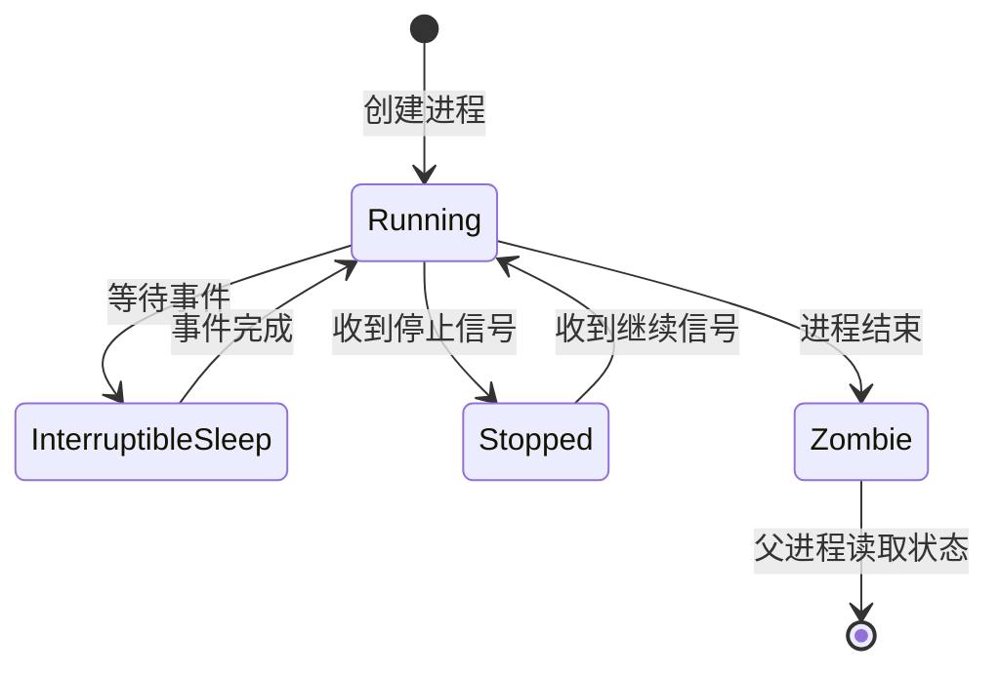

## 引言

Linux，一种自由和开源的操作系统，因其强大的定制性和稳定性，在全球各地的服务器、桌面、移动设备等领域得到了广泛应用。无论是云计算的基础设施，还是物联网设备的操作系统，Linux 都是核心的选择。然而，为了充分利用 Linux 的潜力，了解其如何启动和运行，以及如何管理运行级别，是必不可少的。

## 系统启动

**Linux 系统的启动过程是多阶段的，涉及硬件、引导加载器、内核和系统初始化等多个阶段。**


### 启动流程

1. **开机自检（POST）**：当电源开启后，BIOS 或 UEFI 固件从非易失性存储器中加载，执行一系列检查来验证系统基本硬件功能，如内存、处理器和输入/输出系统是否正常工作。
2. **设备检测**：在开机自检之后，BIOS/UEFI 将识别并配置系统中连接的所有硬件设备，包括处理器、内存、硬盘、光驱以及其他外围设备，如键盘和鼠标。
3. **选择启动设备**：BIOS/UEFI 检查其设置或启动顺序配置，决定从哪个设备启动操作系统。这可能包括硬盘、USB 设备、网络服务器或光驱。
4. **运行引导加载器**：从选定的启动设备加载引导加载器（例如 GRUB 或 Windows Boot Manager）。引导加载器提供一个界面，用户可以选择加载特定的操作系统或内核版本。
5. **内核加载**：引导加载器从启动设备中加载选定的操作系统内核到 RAM 中，并开始系统的初始化过程。此过程包括加载必要的驱动程序以及进行初步的系统设置。
6. **系统服务启动**：操作系统内核初始化完成后，systemd 或其他初始化系统作为第一个用户空间进程运行，负责启动其他系统服务和进程。这个阶段可能包括硬件探测、文件系统挂载和网络配置。
7. **执行启动脚本**：在系统服务启动之后，操作系统执行多个启动脚本，这些脚本进一步配置环境变量、网络设置、用户权限和系统服务，确保系统按预期方式运行。
8. **显示登录界面**：所有系统服务和启动脚本执行完毕后，操作系统将显示登录界面。用户现在可以输入用户名和密码进行登录，系统则为用户会话准备环境和资源。

#### 1.BIOS 阶段

当电脑开机时，会进行一种叫做电源自检（Power-On Self Test，POST）的过程。这个过程是由电脑的基本输入/输出系统（Basic Input/Output System，BIOS）或统一可扩展固件接口（Unified Extensible Firmware Interface，UEFI）来管理的。**POST 是电脑启动过程中的第一个步骤，是为了确定系统的基本硬件设备是否能够正常运行。**

基本的 POST 过程的步骤：


1.  **系统电源打开**：当你按下电源开关后，电源供应器开始为整个系统供电。

2.  **CPU 复位**：电源打开后，中央处理器（CPU）会被复位到预定义的状态。复位过程包括清空 CPU 的寄存器和缓存，设置程序计数器为预定义的地址（在许多系统中，这通常是固定的 ROM 地址）。

3.  **BIOS/UEFI 初始化**：CPU 开始执行在预定义地址上的代码，这通常是 BIOS/UEFI 的代码。BIOS/UEFI 在启动时，会进行一些基本的系统初始化，如设置中断描述符表、初始化内存控制器等。

4.  **硬件检查**：BIOS/UEFI 开始进行 POST，检查系统的基本硬件设备。这通常包括内存、硬盘驱动器、键盘、鼠标等设备。这个过程可能包括设备自我检测（如果设备支持的话），也可能包括读写测试（如对内存的读写测试）。

5.  **错误检查和报告**：如果在 POST 过程中检测到错误，BIOS/UEFI 会报告这个错误。这可能是通过屏幕上的错误消息，或者通过蜂鸣器的蜂鸣声（通常被称为 "beep codes"）。

6.  **启动引导设备**：如果 POST 成功完成，BIOS/UEFI 会开始从引导设备（如硬盘、USB 设备等）加载操作系统。

在这个阶段，有一些系统可能使用 UEFI（统一的可扩展固件接口）而不是传统的 BIOS。UEFI 是一个规范，定义了软件与操作系统和平台固件之间的软件接口。UEFI 启动过程的细节和 BIOS 有所不同，但基本思路是类似的：它**负责初始化硬件，然后加载并运行启动加载器。**

#### 2.引导加载器阶段

**启动加载程序（Bootloader）是在计算机启动过程中，BIOS 或 UEFI 完成硬件检测后，用于加载操作系统内核的一个小程序。**常见的 Linux 启动加载程序有 GRUB（GNU GRand Unified Bootloader）、LILO（Linux Loader）、SYSLINUX 等。

启动加载程序的基本步骤：


1.  **读取配置文件**：启动加载程序首先会读取其配置文件，了解哪些操作系统可供选择，每个操作系统的内核文件存放在何处，是否有特定的启动参数等信息。在 GRUB 中，这个配置文件通常是 /boot/grub/grub.cfg。

2.  **展示操作系统选择菜单**：根据配置文件，启动加载程序会在屏幕上展示一个菜单，列出所有可用的操作系统（如果有多个的话），并等待用户选择。用户可以在这个时候选择要启动的操作系统，或者修改启动参数。

3.  **加载操作系统内核**：用户选择了要启动的操作系统后，启动加载程序会找到相应的内核文件，加载到内存中。这个过程可能涉及到文件系统的操作，因为内核文件通常存放在硬盘的某个文件系统中。所以，启动加载程序需要包含一些简单的文件系统驱动程序。

4.  **传递控制权**：内核文件被加载到内存后，启动加载程序会将 CPU 的控制权传递给内核，然后操作系统开始运行。

引导加载器不仅可以加载 Linux，也可以加载许多其他类型的操作系统。例如，GRUB 支持加载 Linux、Windows、FreeBSD 等等。**这是通过多启动（multi-boot）规范实现的，它定义了一个标准的方法让引导加载器与操作系统内核交互。**

#### 3.内核阶段

**一旦启动加载程序（例如 GRUB）将操作系统内核加载到内存并将控制权移交给它，Linux 内核就开始初始化。**在内核初始化过程中，它实际上是在设定一个基本的运行环境，这样用户空间的程序才能在这个环境中运行。在这个环境中，内核提供了许多基本的服务，例如设备驱动、文件系统、网络服务、进程调度等。所有这些服务在用户空间的程序看来就像是操作系统的一部分，但它们实际上都是由内核提供的。

以下是内核阶段的一些主要步骤：


1.  **初始化 CPU 和内存管理**：首先，内核需要设置和初始化处理器和内存管理系统。它会设置页表来管理虚拟内存，检测和初始化 CPU 和其他硬件设备，以及初始化内核数据结构。

2.  **启动其他 CPU 核心**：在多核处理器系统中，内核需要唤醒和初始化其他的 CPU 核心。

3.  **设备和驱动初始化**：内核会开始探测并初始化系统中的各种硬件设备。这包括识别硬件设备，加载和初始化设备驱动，以及设置设备的相关参数。

4.  **设置中断和系统调用处理**：内核会设置中断处理程序，这是处理硬件中断（例如键盘输入、网络数据包到达等）的机制。同时，内核也会设置系统调用处理程序，这是用户空间程序与内核进行交互的主要方式。

5.  **初始化虚拟文件系统（VFS）**：Linux 内核会初始化虚拟文件系统（VFS），这是管理所有文件和目录的核心组件。

6.  **挂载根文件系统**：内核会挂载根文件系统（通常是 "/"）。这通常涉及到读取硬盘上的数据，并可能需要启动额外的驱动程序来识别文件系统（如 ext4、btrfs 等）。

7.  **启动 init 进程**：最后，内核会启动一个特殊的用户空间程序，称为 init 进程。这个进程的进程 ID（PID）是 1，它负责启动所有其他的用户空间程序和服务。

#### 4.系统初始化阶段

**在 Linux 内核完成初始化并挂载了根文件系统后，它将启动第一个用户空间程序，这个进程通常被称为 init 进程。init 进程的进程 ID（PID）是 1，它是所有其他用户空间进程的父进程。**init 进程在系统中有特殊的地位，它负责启动其他所有的系统服务和用户空间进程。

常见的 init 系统包括 Systemd、Upstart、SysV init 等，它们各自的启动流程可能会有所不同。以下是使用 Systemd 作为 init 系统的一般流程：


1.  **启动**：内核首先启动 Systemd 进程，通常是通过执行 /sbin/init 程序。这个程序通常是指向 Systemd 的一个符号链接。

2.  **读取和解析配置文件**：Systemd 首先读取和解析其配置文件，了解要启动哪些系统服务。这些配置文件通常位于 /etc/systemd/system 或 /lib/systemd/system 目录中，每个文件描述了一个服务的启动信息，如启动命令、依赖关系等。

3.  **启动系统服务**：Systemd 开始按照配置文件启动系统服务。Systemd 会处理服务之间的依赖关系，确保服务按照正确的顺序启动。这些服务通常包括网络服务、日志服务、定时任务等。

4.  **启动用户登录服务**：Systemd 会启动一个特殊的服务，用于处理用户登录。这个服务可以是一个命令行登录程序（如 getty 或 mingetty），也可以是一个图形登录界面（如 GDM 或 LightDM）。

在系统初始化阶段，init 系统会根据预设的运行级别启动一系列的系统服务和守护进程。这些运行级别是一个用来定义系统应该运行哪些服务的机制。例如，在某个运行级别，系统可能只启动最必要的服务，以便快速启动或进行故障排查。而在另一个运行级别，系统可能会启动全部的服务，包括图形界面、网络服务等。

### 运行级别的概念

运行级别是 Linux 系统中用于定义系统需要运行哪些服务和进程的方式。每个运行级别都有特定的服务和进程集合，可以根据系统的需求进行切换。Linux 系统中包含以下七个运行级别：

| 运行级别 | 描述                                                         |
| -------- | ------------------------------------------------------------ |
| 0        | 系统停机，通常用于正常关闭系统。                             |
| 1        | 单用户模式，通常用于系统维护。                               |
| 2        | 多用户模式，不包括网络服务。                                 |
| 3        | 完全的多用户模式，包括网络服务。这通常是 Linux 系统默认的运行级别。 |
| 4        | 通常不使用，用户可以自定义。                                 |
| 5        | 图形用户模式，启动 X Window 图形界面。                       |
| 6        | 系统重启。                                                   |

### 管理运行级别

Linux 系统提供了一些工具和命令，使用户能够查看和更改当前的运行级别。

- 使用 `runlevel` 命令可以查看当前的运行级别。该命令会输出两个数字，前一个代表前一个运行级别，后一个代表当前运行级别。
- 使用 `init` 命令加上运行级别的数字，可以更改当前的运行级别。例如，执行 `init 3` 会将系统转换到多用户文本模式。
- 另外，用户还可以通过编辑 `/etc/inittab` 文件来更改系统的默认运行级别。例如，`id:3:initdefault:` 就设置了系统的默认运行级别为 3。

通过理解 Linux 系统的启动流程和运行级别，可以更好地理解和管理 Linux 系统的行为和状态。这些知识对于系统管理员来说尤其重要，因为它们直接影响到系统的性能和稳定性。

## 进程管理

在操作系统中，理解并掌握进程及其管理是至关重要的，尤其是在类 Unix 的操作系统如 Linux 中，它们是系统正常运行的基础。

### 进程的概念

进程是一个运行的程序的实例。每个**运行中的程序都会生成至少一个进程**。每个进程都有一个**唯一的进程 ID**，也称为 PID，是由系统自动分配的。同时，每个进程都有其父进程。父进程是创建其他进程的进程。**在 Linux 系统中，init 进程（PID 为 1）是所有进程的祖先进程（神父进程）。**

### 进程的状态

Linux 进程有五种状态：运行（Running），等待（Interruptible Sleep），非中断等待（Uninterruptible Sleep），停止（Stopped），僵尸（Zombie）。



-   **运行状态（Running）**: 进程正在 CPU 上运行或者在运行队列中等待运行。运行状态的进程可能正在使用 CPU ，也可能正在等待 CPU 时间片。
-   **等待状态（Interruptible Sleep）**: 进程正在等待某个条件（如用户输入或者磁盘 I/O）完成。当满足其等待的条件，它就会转移到运行状态。
-   **非中断等待状态（Uninterruptible Sleep）**: 与等待状态类似，进程在等待某个条件完成。但这种状态的进程不能被其他进程或者事件唤醒和打断，只有等待的条件被满足，它才会被唤醒。
-   **停止状态（Stopped）**: 进程被暂停执行，可以由一个信号（signal）触发进入该状态。即使有可用的 CPU 时间，被停止的进程也不会执行。
-   **僵尸状态（Zombie）**: 这是进程结束（或被其他进程杀死）后的一种状态。尽管进程的主体已经终止，但它在进程表中的条目仍然存在，直到父进程读取了子进程的退出状态信息后，才会消失。

### 进程的优先级

在 Linux 系统中，处理器必须在多个并发运行的进程之间分享其时间。**为了公平和有效地管理这些进程，Linux 使用一种称为优先级的机制来确定哪个进程应该优先获取 CPU 时间。**优先级是一种衡量进程重要性和优先级的方法，优先级较高的进程将获得更多的 CPU 时间。

Linux 系统使用所谓的 Nice 值来表示进程的优先级。Nice 值的范围从 -20（最高优先级）到 19（最低优先级）。默认的 Nice 值是 0。Nice 值越低，进程的优先级就越高，也就是说，它会获得更多的 CPU 时间。反之，Nice 值越高，进程的优先级就越低，获得的 CPU 时间也就越少。

在 Linux 系统中，你可以使用 `nice` 和 `renice` 命令来设置和修改进程的优先级。以下是它们的使用方法：

```shell
# PID 是想要修改的进程的进程 ID，可以使用 ps 或 top 命令来查看进程的 PID
# 使用 nice 命令启动一个新进程，设置其 Nice 值为 10
nice -n 10 command

# 使用 nice 命令启动一个新进程，设置其 Nice 值为 -5
nice -n -5 command

# 将 PID 为 1234 的进程的 Nice 值设为 10
renice 10 -p 1234

# 将 PID 为 5678 的进程的 Nice 值设为 -5
renice -5 -p 5678
```

### 进程管理命令

| 命令      | 描述                                                         |
| --------- | ------------------------------------------------------------ |
| `ps`      | 显示当前进程的快照。                                         |
| `top`     | 动态显示进程状态，可以实时查看系统中各个进程的资源占用情况。 |
| `htop`    | 与 `top` 类似，但提供了一个更美观、更友好的界面以及额外的功能，如垂直和水平滚动。 |
| `pgrep`   | 根据条件查找进程，并列出匹配条件的进程 ID。                   |
| `pkill`   | 发送信号到匹配条件的进程，常用于终止进程。                   |
| `kill`    | 发送信号到特定的进程，最常用于终止进程。                     |
| `killall` | 根据进程的名称来终止一组进程。                               |
| `nice`    | 启动一个进程并设置其优先级。优先级较低的进程运行得较慢，从而减少对系统资源的占用。 |
| `renice`  | 修改已经运行的进程的优先级。                                 |
| `nohup`   | 运行命令使其可以在用户注销后继续运行。                       |
| `jobs`    | 显示当前会话中的所有作业及其状态。                           |
| `bg`      | 将一个在后台暂停的作业恢复执行。                             |
| `fg`      | 将一个在后台运行的作业调到前台继续运行。                     |
| `&`       | 在命令后添加 `&` 可以让命令在后台运行。                      |
| `disown`  | 将作业从当前会话的作业列表中移除，使得该作业不会在会话结束时被终止。 |

## 服务管理

### 服务的概念

在 Linux 环境中，服务（也被称为守护进程）是一个关键概念，指的是一种在后台运行的程序或一组程序，这些程序在用户的视觉范围之外，不断地提供某些特定的功能或服务。例如，web 服务器（如 Apache），数据库服务器（如 MySQL），邮件服务器，SSH，FTP 等都属于典型的服务。这些服务是操作系统正常运行的重要组成部分，负责处理各种系统任务和应用请求。

服务管理则是操作系统中的一项重要任务，其主要目标是保证服务能够稳定、高效地运行，同时，也能够便捷地进行服务的配置和维护。为了达到这个目标，人们设计了许多不同的服务管理系统，例如 SysV init，Upstart，以及现在广泛使用的 Systemd。

### 服务管理

#### Systemd

[systemd](https://systemd.io/) 是当前大多数 Linux 发行版中默认的初始化系统和服务管理器，由 Lennart Poettering 和 Kay Sievers 在 Freedesktop.org 项目中创建。它的主要任务是负责系统的引导流程，以及在系统运行期间管理和维护各种服务。

与传统的 SysV init 和 Upstart 等系统相比，systemd 提供了许多高级特性。其中一个主要特点就是并行化处理，能同时启动多个服务，大大提高了系统启动的速度。此外，systemd 还支持按需启动服务，即只有在服务被需要时才启动。这些特性加上实时系统状态查看，服务依赖管理，系统资源控制等，使得 systemd 能为用户提供现代化的、高效的、全面的解决方案。

**systemd 还提供了一种新的系统配置方法，即使用 systemd 单元（unit）文件。**这些单元文件用于定义服务、设备、挂载点、套接字等对象的属性和行为。单元文件是纯文本文件，易于编辑，支持灵活的配置选项。

除了基本的初始化服务，**systemd 还提供了进程监控、日志管理、设备管理、网络配置、用户会话管理等多项功能。**特别是通过日志管理工具 journald，实现了全面的日志管理功能。journald 可以收集各种类型的日志信息，包括内核日志、系统服务日志、用户程序日志等，然后将它们统一存储在一个中央日志库中，便于用户查阅和管理。

尽管 systemd 具有诸多优点，但由于其庞大和复杂，也引来了不少批评。一些人认为 systemd 违反了 Unix 哲学——" 做一件事，并把它做好 "，它的功能太过全面，违反了模块化设计的原则。然而，也有很多人认为，对于现代 Linux 系统来说 systemd 是必不可少的。

以下是一些 systemd 中常用的 `systemctl` 命令示例：

```shell
# 启动一个服务
systemctl start [service_name]

# 停止一个服务
systemctl stop [service_name]

# 重启一个服务
systemctl restart [service_name]

# 查看一个服务的状态
systemctl status [service_name]

# 设置一个服务在系统启动时自动启动
systemctl enable [service_name]

# 禁止一个服务在系统启动时自动启动
systemctl disable [service_name]
```

常用的选项：

| 选项                 | 说明                                           |
| -------------------- | ---------------------------------------------- |
| `--user`             | 对用户级别的服务进行操作，而不是系统级别的服务 |
| `--global`           | 对所有用户的用户级别的服务进行操作             |
| `--system`           | 对系统级别的服务进行操作，这是默认的操作级别   |
| `--all`              | 显示所有的服务，包括未启动的和不活跃的服务     |
| `--failed`           | 显示启动失败的服务                             |
| `-H [user@]hostname` | 对远程主机上的服务进行操作                     |
| `--no-pager`         | 不使用分页显示输出结果                         |

总的来说，`systemd` 是一种强大的初始化系统和服务管理器，它改变了 Linux 系统的启动方式和服务管理方式，带来了许多新的可能性和便利性。如果你正在使用的是一个现代的 Linux 发行版，那么你很可能已经在使用 `systemd` 了。

#### Upstart

Upstart 是一种为 Linux 系统设计的事件驱动的初始化系统和服务管理器，由 Canonical 公司的 Scott James Remnant 开发，最初用于 Ubuntu 发行版。它的设计初衷是用于取代传统的 SysV init 系统，并且解决其在处理现代化计算环境中的并发性和动态性时的局限性。

Upstart 的主要特点是事件驱动（Event-Driven），它可以根据系统事件（比如硬件添加或者删除，服务状态变化等）来动态地启动或停止服务。这种设计使得 Upstart 能够灵活地适应不同的系统状态，并确保相关的服务在适当的时机和顺序下启动。

此外，Upstart 还支持并行启动服务，这大大提高了系统启动的速度。它还具有服务状态跟踪功能，可以在服务异常退出时自动重启服务，从而提高系统的可靠性。

Upstart 使用的服务配置文件称为 Job 文件，这些文件定义了一个服务的启动条件、停止条件、脚本等信息。Job 文件是纯文本文件，位于 `/etc/init` 目录下，易于编辑和管理。

以下是一些 Upstart 中常用的 `initctl` 命令示例：

```shell
# 启动一个服务
initctl start [job_name]

# 停止一个服务
initctl stop [job_name]

# 重启一个服务
initctl restart [job_name]

# 查看一个服务的状态
initctl status [job_name]
```

常用的选项：

| 选项                   | 说明                                   |
| ---------------------- | -------------------------------------- |
| `list`                 | 列出所有已知的任务和服务               |
| `show-config`          | 显示指定任务或服务的所有配置信息       |
| `emit`                 | 发出一个事件，可以触发相关的任务和服务 |
| `reload-configuration` | 重新加载所有的任务和服务的配置文件     |

尽管 Upstart 在其出现时提供了一种新颖和强大的初始化和服务管理方式，但由于其开发和维护的复杂性，以及后来 systemd 的出现，Upstart 在许多 Linux 发行版中被 systemd 替代。然而，了解 Upstart 仍然是有益的，因为有些旧的系统或特定的场景可能仍然在使用它。

#### SysV Init

SysV init 是 Unix System V 中的初始化系统，长期以来在各种 Unix-like 系统中使用，包括早期的 Linux 发行版。它主要负责在系统启动时启动各种服务，以及在系统运行期间管理和维护各种服务。

SysV init 的主要特点是顺序启动服务。它依赖于在 `/etc/inittab` 文件中定义的运行级别（runlevels），并在每个运行级别中按照预定义的顺序启动或停止服务。这种设计简单可靠，但在处理现代化计算环境中的并发性和动态性时，表现出一定的局限性。

在 SysV init 系统中，服务的启动脚本通常位于 `/etc/init.d/` 目录下，而各个运行级别的服务链接则位于 `/etc/rc.d/` 或 `/etc/rc[runlevel].d/` 目录下。这种设计使得服务配置分散在多个文件和目录中，管理相对较复杂。

以下是一些 SysV init 中常用的命令示例：

```shell
# 启动一个服务
/etc/init.d/[service_name] start

# 停止一个服务
/etc/init.d/[service_name] stop

# 重启一个服务
/etc/init.d/[service_name] restart

# 查看一个服务的状态
/etc/init.d/[service_name] status

# 切换运行级别
init [runlevel]
```

常用的运行级别：

| 运行级别 | 说明                                   |
| -------- | -------------------------------------- |
| 0        | 关机                                   |
| 1        | 单用户模式                             |
| 2        | 多用户模式（没有网络服务）             |
| 3        | 多用户模式（有网络服务）               |
| 4        | 未定义，可以由用户自定义               |
| 5        | 多用户模式（有网络服务和图形用户界面） |
| 6        | 重启                                   |

尽管 `SysV init` 系统在设计上有一些局限性，但其简单和可靠的特点使得它在许多年里得到了广泛的使用。然而，随着现代 Linux 系统的发展，更多的发行版开始选择如 `Upstart` 或 `systemd` 这样的现代化的初始化系统和服务管理器。

### 未来发展

随着云计算、容器技术、微服务等新技术的发展，服务管理面临着新的挑战和机遇。在这样的环境下，服务管理不仅要考虑如何管理单个系统上的服务，还需要考虑如何在分布式环境中协调和管理多个服务。这可能需要新的管理策略和工具，或者是现有工具的深度集成和优化。

例如，随着 Kubernetes 这样的容器编排工具的普及，服务的生命周期管理和调度已经可以通过这些工具来完成。在这种情况下，传统的服务管理器可能需要与 Kubernetes 等工具进行深度整合，以便更好地在微服务环境中管理服务。

另一方面，新的服务管理工具和框架也正在不断出现，比如用 Go 语言编写的 [supervisord](http://supervisord.org/)，或者是由 Uber 开发的 [Peloton](https://eng.uber.com/peloton/)。这些工具都试图在特定环境下提供更好的服务管理能力。

总的来说，服务管理是一个重要且不断发展的领域。随着新技术的发展，我们期待看到更多的创新和进步，以帮助我们更好地管理和维护系统服务。
