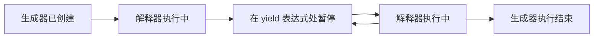
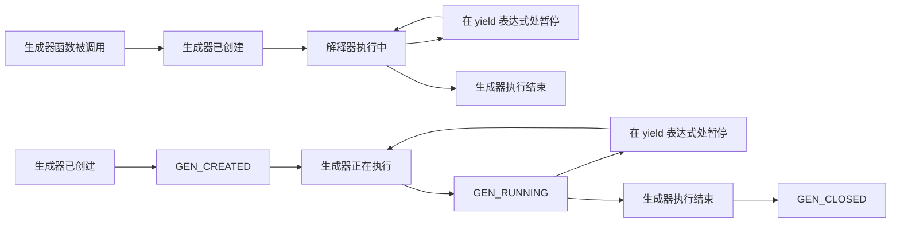

## 数值

Python 的数值数据类型是用来存储数值的。一旦创建，**数值对象的身份和类型是不可改变的**。如果你改变了数值对象的值，Python 将创建一个新的数值对象。Python 支持三种不同的数值类型：

- **整型 (int)**：被用来表示整数，包括正整数和负整数，不带小数点。在 Python 3 中，整数的长度是无限的，可以视为 Python 2 中的 Long 类型。此外，布尔类型（bool）实际上是整型的一种特殊形式，其中 True 和 False 分别被表示为 1 和 0。
- **浮点型 (float)**：用来表示实数，由整数部分和小数部分组成。浮点型还可以使用科学计数法表示。例如，2.5e2 表示的是 2.5 乘以 10 的平方，等于 250。
- **复数 (complex)**：复数由实部和虚部构成，表示形式可以是 a + bj，或者 complex(a,b)。在这里，实部 a 和虚部 b 都是浮点型。

```python
num1 = -100      # 整数
num2 = 200.01    # 浮点数
num3 = 0xA0F     # 十六进制
num4 = 0o37      # 八进制

# 引入库
import math
import random

# 数学常量 PI 和 e
pi = math.pi
e = math.e

# 绝对值
abs_val = abs(num1)

# 向上取整
ceil_val = math.ceil(num2)

# 返回最大数
max_val = max(num1, num2)

# x**y 运算后的值
pow_val = pow(num1, num2)

# 随机数
random_val = random.random()

# x弧度的正弦值。
sin_val = math.sin(pi/2)
```

## 字符串

字符串在计算机科学和编程中非常重要。在 Python 程序中，如果我们把单个或多个字符用单引号或者双引号包围起来，我们就创建了一个字符串。

### 定义

```python
# 在 Python 中，可以使用单引号（'）和双引号（"）来定义字符串，它们的使用方式完全相同。
s1 = 'hello, world!'
s2 = "hello, world!"

# 使用三个单引号（'''）或者三个双引号（"""）可以创建一个多行字符串。
s3 = """
hello, 
world!
"""

# 反斜杠（\）可以用来在字符串中插入特殊字符，这被称为转义字符。
s4 = '\n\t\141\u9a86\u660a'

# 在字符串前加上字符 r 可以阻止反斜杠的转义效果。
s5 = r'\n\\hello, world!\\\n' 

# 通过将字符串级联来创建新的字符串。
s6 = "this " "is " "string"

# 字符串是不可变的，这意味着你不能改变一个字符串的内容。
s6[2] = "c"    # 这将引发一个错误

# 字符串可以通过索引进行访问，其中 0 是第一个字符的索引，-1 是最后一个字符的索引。
s1 = 'hello, world!'
print(s1[0])  # 输出：h
print(s1[-1])  # 输出：!

# Python也支持字符串的切片操作，你可以使用这种方式来获取字符串的一部分。
s1 = 'hello, world!'
print(s1[0:5])  # 输出：hello

# ===== 字符串切片示意图 =====
| L | e | t | t | e | r | s |
|---|---|---|---|---|---|---|
| 0 | 1 | 2 | 3 | 4 | 5 | 6 |
|-7 |-6 |-5 |-4 |-3 |-2 |-1 |
```

### 转义

| 转义字符 | 描述                          | 示例                                           |
| :------- | :---------------------------- | :--------------------------------------------- |
| `\\`     | 反斜杠符号                    | `print("\\")` 输出：`\`                        |
| `\'`     | 单引号                        | `print('\'')` 输出：`'`                        |
| `\"`     | 双引号                        | `print("\"")` 输出：`"`                        |
| `\n`     | 换行                          | `print("\n")` 输出一个新行                     |
| `\r`     | 回车                          | `print("Hello\rWorld!")` 输出：`World!`        |
| `\t`     | 横向制表符（Tab）             | `print("Hello\tWorld!")` 输出：`Hello World!`  |
| `\b`     | 退格 (Backspace)               | `print("Hello \bWorld!")` 输出：`Hello World!` |
| `\f`     | 换页                          | `print("Hello \fWorld!")` 输出：`Hello World!` |
| `\a`     | 响铃                          | `print("\a")` 执行后电脑有响声                 |
| `\000`   | 空                            | `print("\000")` 输出：``                       |
| `\v`     | 纵向制表符                    | `print("Hello \vWorld!")` 输出：`Hello World!` |
| `\other` | 其他的字符以普通格式输出      |                                                |
| `\xhh`   | 二进制数，代表一个 ASCII 字符   | `print("\x48\x65\x6c\x6c\x6f")` 输出：`Hello`  |
| `\ooo`   | 八进制数，代表一个 ASCII 字符   | `print("\141\142\143")` 输出：`abc`            |
| `\uhhhh` | 16 进制数，代表一个 Unicode 字符 | `print("\u6211\u4eec")` 输出：`我们`           |

### 运算

| 运算符     | 描述                                               | 示例                                           |
| :--------- | :------------------------------------------------- | :--------------------------------------------- |
| `+`        | 连接字符串                                         | `"Hello " + "World!"` 输出：`Hello World!`     |
| `*`        | 重复字符串                                         | `"Hello " * 3` 输出：`Hello Hello Hello`       |
| `[]`       | 索引字符串                                         | `"Hello"[1]` 输出：`e`                         |
| `[:]`      | 切片字符串                                         | `"Hello"[1:4]` 输出：`ell`                     |
| `in`       | 成员运算符 - 如果字符串中包含给定的字符返回 True   | `'H' in 'Hello'` 输出：`True`                  |
| `not in`   | 成员运算符 - 如果字符串中不包含给定的字符返回 True | `'H' not in 'Hello'` 输出：`False`             |
| `%`        | 格式化字符串                                       | `"Hello, %s" % 'World!'` 输出：`Hello, World!` |
| `f-string` | 格式化字符串的新方式（Python 3.6+）                | `f"Hello, {'World!'}` 输出：`Hello, World!`    |

### `f-strings`

在 Python 3.6 及以后的版本中，格式化字符串引入了更为简洁的方式，即使用 `f` 字符作为字符串的前缀，创建所谓的格式化字符串字面值（f-string）。通过 f-string，可以在字符串中直接插入变量值或表达式，并可以通过冒号和数字来指定输出宽度等格式化选项。

```python
# {a:10} 表示将变量 a 插入到字符串中，并占用 10 个字符的宽度。不足 10 个字符，将使用空格进行填充。

a, b = 5, 10
print(f'{a:10} * {b:10} = {a * b}')
```

#### PEP 701 的更新

在 Python 3.11 版本中，f-strings 还存在一些限制，导致在某些情况下使用起来不够灵活。PEP 701 对 f-strings 进行了一些更新，解除了一些限制，使得 f-strings 可以更灵活地使用，包括以下方面的更新：

在 Python 3.12 版本中，对 f-strings 进行了更新，解除了之前的一些限制，使得 f-strings 更加灵活和强大。更新主要包括以下方面：

##### 引号重用

在 Python 3.11 中，f-string 的表达式组件使用与包含 f-string 相同的引号会导致 SyntaxError。而在 Python 3.12 中，可以重用引号，不再限制引号的使用。

```python
songs = ['Take me back to Eden', 'Alkaline', 'Ascensionism']
result1 = f"This is the playlist: {', '.join(songs)}"
print(result1)
# 输出：'This is the playlist: Take me back to Eden, Alkaline, Ascensionism'
```

##### 多行表达式和注释

在 Python 3.11 中，f-string 的表达式必须在一行内定义，即使外部表达式可以跨多行，这会使得代码可读性变差。而在 Python 3.12 中，可以定义跨多行的表达式，并且可以包含注释，提高了代码的可读性。

```python
result2 = f"This is the playlist: {', '.join([
    'Take me back to Eden',  # My, my, those eyes like fire
    'Alkaline',              # Not acid nor alkaline
    'Ascensionism'           # Take to the broken skies at last
])}"
print(result2)
# 输出：'This is the playlist: Take me back to Eden, Alkaline, Ascensionism'
```

##### 反斜杠和 Unicode 字符

在 Python 3.11 中，f-string 的表达式不能包含任何反斜杠字符，也不能包含 Unicode 转义序列。而在 Python 3.12 中，可以包含反斜杠和 Unicode 字符，使得表达式更加灵活。

```python
songs = ['Take me back to Eden', 'Alkaline', 'Ascensionism']

result3 = f"This is the playlist: {'\n'.join(songs)}"
print(result3)
# 输出：
# This is the playlist: Take me back to Eden
# Alkaline
# Ascensionism

result4 = f"This is the playlist: {'\N{BLACK HEART SUIT}'.join(songs)}"
print(result4)
# 输出：'This is the playlist: Take me back to Eden♥Alkaline♥Ascensionism'
```

以上代码展示了 Python 3.12 中 f-strings 的更新。可以看到，我们可以在 f-string 中使用引号重用，多行表达式和注释，以及包含反斜杠和 Unicode 字符的表达式，这些更新使得 f-strings 更加灵活和强大，更方便地进行字符串格式化。同时，通过使用 PEG 解析器实现的更新，使得错误消息更加准确，有助于代码调试。

### 常用方法

| 函数                        | 描述                                       | 示例                                                         |
| :-------------------------- | :----------------------------------------- | :----------------------------------------------------------- |
| len(str)                    | 返回字符串长度                             | `len('hello, world!')` 输出结果：13                          |
| str.capitalize()            | 返回首字母大写的字符串                     | `'hello, world!'.capitalize()` 输出结果：Hello, world!       |
| str.title()                 | 返回每个单词首字母大写的字符串             | `'hello, world!'.title()` 输出结果：Hello, World!            |
| str.upper()                 | 返回字符串变大写后的拷贝                   | `'hello, world!'.upper()` 输出结果：HELLO, WORLD!            |
| str.find(sub)               | 查找子串在字符串中的起始位置，未找到返回 -1 | `'hello, world!'.find('or')` 输出结果：8                     |
| str.startswith(prefix)      | 检查字符串是否以指定的前缀开头             | `'hello, world!'.startswith('He')` 输出结果：False           |
| str.endswith(suffix)        | 检查字符串是否以指定的后缀结尾             | `'hello, world!'.endswith('!')` 输出结果：True               |
| str.center(width, fillchar) | 将字符串以指定宽度居中并在两侧填充指定字符 | `'hello'.center(10, '*')` 输出结果：***hello***              |
| str.rjust(width, fillchar)  | 将字符串以指定宽度靠右并在左侧填充指定字符 | `'hello'.rjust(10, '*')` 输出结果：*****hello                |
| str.isdigit()               | 检查字符串是否由数字构成                   | `'abc123456'.isdigit()` 输出结果：False                      |
| str.isalpha()               | 检查字符串是否由字母构成                   | `'abc123456'.isalpha()` 输出结果：False                      |
| str.isalnum()               | 检查字符串是否由字母和数字构成             | `'abc123456'.isalnum()` 输出结果：True                       |
| str.strip()                 | 返回修剪左右两侧空格之后的字符串           | `' jackfrued@126.com '.strip()` 输出结果：'[jackfrued@126.com](mailto:jackfrued@126.com)' |

## 列表

列表（`list`）是一种结构化的、非标量类型，它是值的有序序列，每个值都可以通过索引进行标识，定义列表可以将列表的元素放在 `[]` 中，多个元素用 `,` 进行分隔，可以使用 `for` 循环对列表元素进行遍历，也可以使用 `[]` 或 `[:]` 运算符取出列表中的一个或多个元素。

### 定义

```python
# 列表定义
list1 = [ 'abcd', 786, 2.23, 'runoob', 70.2 ]
tinylist = [123, 'runoob']

# 输出完整列表
print(list1)  # 输出结果：['abcd', 786, 2.23, 'runoob', 70.2]

# 输出列表第一个元素
print(list1[0])  # 输出结果：'abcd'

# 从第二个开始输出到第三个元素
print(list1[1:3])  # 输出结果：[786, 2.23]

# 输出从第三个元素开始的所有元素
print(list1[2:])  # 输出结果：[2.23, 'runoob', 70.2]

# 输出两次列表
print(tinylist * 2)  # 输出结果：[123, 'runoob', 123, 'runoob']

# 连接列表
print(list1 + tinylist)  # 输出结果：['abcd', 786, 2.23, 'runoob', 70.2, 123, 'runoob']

# 通过循环用下标遍历列表元素
for index in range(len(list1)):
    print(list1[index])

# 通过for 循环遍历列表元素
for elem in list1:
    print(elem)

# 通过 enumerate 函数处理列表之后再遍历可以同时获得元素索引和值
for index, elem in enumerate(list1):
    print(index, elem)
```

### 运算

```python
# 创建列表
list1 = [1, 2, 3]
list2 = [4, 5, 6]

# 连接列表，返回一个新的列表
list3 = list1 + list2
print(list3)  # 输出：[1, 2, 3, 4, 5, 6]

# 复制列表，返回一个新的列表
list4 = list1 * 3
print(list4)  # 输出：[1, 2, 3, 1, 2, 3, 1, 2, 3]

# 计算元素个数
length = len(list1)
print(length)  # 输出：3

# 判断元素是否在列表中
result = 4 in list1
print(result)  # 输出：False

result = 2 in list1
print(result)  # 输出：True

# 访问元素，可以使用索引，索引从0开始
elem = list1[0]
print(elem)  # 输出：1

# 切片操作
list5 = list1[1:3]
print(list5)  # 输出：[2, 3]

# 切片时可以指定步长
list6 = list1[0:3:2]
print(list6)  # 输出：[1, 3]

# 切片时可以省略开始或结束索引
list7 = list1[:2]
list8 = list1[1:]
print(list7)  # 输出：[1, 2]
print(list8)  # 输出：[2, 3]

# 反向切片
list9 = list1[::-1]
print(list9)  # 输出：[3, 2, 1]

# 修改元素值
list1[0] = 100
print(list1)  # 输出：[100, 2, 3]

# 列表末尾添加元素
list1.append(4)
print(list1)  # 输出：[100, 2, 3, 4]

# 列表末尾删除元素
list1.pop()
print(list1)  # 输出：[100, 2, 3]

# 指定位置插入元素
list1.insert(1, 200)
print(list1)  # 输出：[100, 200, 2, 3]

# 删除指定位置的元素
del list1[2]
print(list1)  # 输出：[100, 200, 3]

# 清空列表
list1.clear()
print(list1)  # 输出：[]
```

### 常用方法

| 函数                                 | 描述                                                         |
| :----------------------------------- | :----------------------------------------------------------- |
| `len(list)`                          | 返回列表元素的个数。                                         |
| `list.append(x)`                     | 在列表末尾添加元素 `x`。                                     |
| `list.insert(i, x)`                  | 在指定位置 `i` 前插入元素 `x`。                              |
| `list.extend(iterable)`              | 将可迭代对象中的元素逐个添加到列表。                         |
| `list.remove(x)`                     | 删除列表中第一个值为 `x` 的元素。                            |
| `list.pop([i])`                      | 移除并返回列表中指定位置 `i` 处的元素。如果未指定索引，默认删除并返回最后一个元素。 |
| `list.clear()`                       | 清空列表中的所有元素。                                       |
| `list.index(x[, start[, end]])`      | 返回列表中第一个值为 `x` 的元素的索引。如果未找到该元素，会引发 `ValueError` 异常。 |
| `list.count(x)`                      | 返回元素 `x` 在列表中出现的次数。                            |
| `list.sort(key=None, reverse=False)` | 对列表进行排序，如果指定参数 `key` 则按照 `key` 进行排序，如果指定参数 `reverse` 则为降序。 |
| `list.reverse()`                     | 将列表中的元素倒序排列。                                     |
| `list.copy()`                        | 返回列表的浅拷贝，即创建一个新列表并复制原列表中的元素。     |

## 元组

Python 中的元组是一种容器数据类型，使用小括号 `()` 定义，类似于列表，但元组的元素不能修改，是不可变的。元组用于存储多个数据，可以包含不同类型的元素。与列表不同，元组在定义时可以省略括号，但在实际使用中建议加上括号，以增强代码的可读性。


### 定义

```python
# 定义元组
t = ('骆昊', 38, True, '四川成都')

# 定义空元组
t1 = ()

# 元组中只包含一个元素时，需要在元素后面添加逗号 `,`，否则括号会被当作运算符使用。
tup1 = (50)          # 不加逗号，类型为整型
tup1 = (50,)         # 加上逗号，类型为元组

# 遍历元组中的值
for member in t:
    print(member)

# 重新给元组赋值
# t[0] = '王大锤'  # TypeError，元组不可修改
# 变量t重新引用了新的元组，原来的元组将被垃圾回收
t = ('王大锤', 20, True, '云南昆明')

# 将元组转换成列表
person = list(t)

# 将列表转换成元组
fruits_list = ['apple', 'banana', 'orange']
fruits_tuple = tuple(fruits_list)

# 创建一个新的元组
tup1 = (12, 34.56)
tup2 = ('abc', 'xyz')
tup3 = tup1 + tup2

# 删除元组
tup = ('Google', 'Runoob', 1997, 2000)
del tup
```

### 运算

```python
# 创建元组
tup1 = (1, 2, 3)
tup2 = (4, 5, 6)

# 连接元组，返回一个新的元组
tup3 = tup1 + tup2
print(tup3)  # 输出：(1, 2, 3, 4, 5, 6)

# 复制元组，返回一个新的元组
tup4 = tup1 * 3
print(tup4)  # 输出：(1, 2, 3, 1, 2, 3, 1, 2, 3)

# 计算元素个数
length = len(tup1)
print(length)  # 输出：3

# 判断元素是否在元组中
result = 4 in tup1
print(result)  # 输出：False

result = 2 in tup1
print(result)  # 输出：True

# 访问元素，可以使用索引，索引从0开始
elem = tup1[0]
print(elem)  # 输出：1

# 切片操作
tup5 = tup1[1:3]
print(tup5)  # 输出：(2, 3)

# 切片时可以指定步长
tup6 = tup1[0:3:2]
print(tup6)  # 输出：(1, 3)

# 切片时可以省略开始或结束索引
tup7 = tup1[:2]
tup8 = tup1[1:]
print(tup7)  # 输出：(1, 2)
print(tup8)  # 输出：(2, 3)

# 反向切片
tup9 = tup1[::-1]
print(tup9)  # 输出：(3, 2, 1)
```

### 常用方法

| 函数                             | 描述                                                         |
| :------------------------------- | :----------------------------------------------------------- |
| `len(tuple)`                     | 返回元组中元素的个数。                                       |
| `tuple.count(x)`                 | 返回元组中元素 `x` 出现的次数。                              |
| `tuple.index(x[, start[, end]])` | 返回元组中第一个值为 `x` 的元素的索引。如果未找到该元素，会引发 `ValueError` 异常。 |
| `tuple + tuple`                  | 将两个元组连接成一个新的元组。                               |
| `tuple * n`                      | 将元组重复 `n` 次。                                          |
| `x in tuple`                     | 判断元素 `x` 是否在元组中，如果在返回 `True`，否则返回 `False`。 |
| `x not in tuple`                 | 判断元素 `x` 是否不在元组中，如果不在返回 `True`，否则返回 `False`。 |

## 集合

集合（set）是由不重复元素组成的无序容器。基本用法包括成员检测、消除重复元素。集合对象支持合集、交集、差集、对称差分等数学运算。

### 定义

集合可以通过花括号 `{}` 或 `set()` 函数创建。注意，创建空集合只能用 `set()`，不能用 `{}`，因为 `{}` 创建的是空字典。

```python
# 创建集合
set1 = {1, 2, 3, 4, 5}
set2 = {3, 4, 5, 6, 7}
set3 = {5, 6, 7, 8, 9}

# 判断元素是否在集合内
3 in set1       # True
10 in set1      # False

# 添加元素
set1.add(6)     # {1, 2, 3, 4, 5, 6}
set1.add(7)     # {1, 2, 3, 4, 5, 6, 7}
set1.add(3)     # {1, 2, 3, 4, 5, 6, 7}，重复的元素不会被添加

# 删除元素
set1.remove(4)  # {1, 2, 3, 5, 6, 7}
set1.discard(6) # {1, 2, 3, 5, 7}
set1.discard(8) # {1, 2, 3, 5, 7}，如果元素不存在，discard 方法不会引发异常

# 元素个数
len(set1)       # 5

# 清空集合
set1.clear()    # set()
```

### 运算

```python
set1 = {1, 2, 3, 4, 5}
set2 = {3, 4, 5, 6, 7}
set3 = {5, 6, 7, 8, 9}

# 交集
set1 & set2         # {3, 4, 5}

# 并集
set1 | set2         # {1, 2, 3, 4, 5, 6, 7}

# 差集
set1 - set2         # {1, 2}

# 对称差运算（在 set1 或 set2 中，但不会同时出现在二者中）
set1 ^ set2         # {1, 2, 6, 7}

# 判断子集和超集
set2 <= set1        # False，set2 是 set1 的子集吗？
set3 <= set1        # False，set3 是 set1 的子集吗？
set1 >= set2        # False，set1 是 set2 的超集吗？
set1 >= set3        # False，set1 是 set3 的超集吗？
```

### 常用方法

| 函数                                   | 描述                                                         |
| :------------------------------------- | :----------------------------------------------------------- |
| set.add(x)                             | 将元素 x 添加到集合中                                        |
| set.remove(x)                          | 删除集合中的元素 x，如果 x 不在集合中会引发 KeyError         |
| set.discard(x)                         | 删除集合中的元素 x，如果 x 不在集合中不会引发异常            |
| set.pop()                              | 随机删除集合中的一个元素，并返回删除的元素                   |
| set.clear()                            | 清空集合中的所有元素                                         |
| len(set)                               | 返回集合中元素的个数                                         |
| x in set                               | 判断元素 x 是否在集合中，如果在返回 True，否则返回 False     |
| set1.isdisjoint(set2)                  | 判断两个集合是否没有共同的元素，如果没有返回 True，否则返回 False |
| set1.issubset(set2)                    | 判断集合 set1 是否是集合 set2 的子集，如果是返回 True，否则返回 False |
| set1.issuperset(set2)                  | 判断集合 set1 是否是集合 set2 的超集，如果是返回 True，否则返回 False |
| set1.union(set2)                       | 返回集合 set1 和 set2 的并集                                 |
| set1.intersection(set2)                | 返回集合 set1 和 set2 的交集                                 |
| set1.difference(set2)                  | 返回集合 set1 和 set2 的差集，即在 set1 中但不在 set2 中的元素 |
| set1.symmetric_difference(set2)        | 返回集合 set1 和 set2 的对称差集，即在 set1 或 set2 中，但不会同时出现在二者中的元素 |
| set1.update(set2)                      | 将集合 set2 中的元素添加到 set1 中                           |
| set1.intersection_update(set2)         | 将集合 set1 中不在 set2 中的元素删除                         |
| set1.difference_update(set2)           | 将集合 set1 和 set2 的差集中的元素从 set1 中删除             |
| set1.symmetric_difference_update(set2) | 将集合 set1 和 set2 的对称差集中的元素添加到 set1 中         |
| set.copy()                             | 返回集合的浅拷贝                                             |
| set.pop()                              | 随机删除并返回集合中的一个元素                               |

## 字典


字典是另一种可变容器模型，且**可存储任意类型对象**。字典与列表、集合不同的是，它是一种键 - 值（key-value）对应的数据结构。每个元素都是**由一个键和一个值组成的键值对**，键和值通过冒号分开。键必须是唯一的，但值则不必。


### 定义

```python
# 使用大括号创建字典
person = {'name': 'John', 'age': 30, 'city': 'New York'}

# 使用 dict() 创建字典
empty_dict = dict()

# 访问字典中的元素
print(person['name'])  # 输出：John
print(person['age'])   # 输出：30
print(person['city'])  # 输出：New York
```

### 运算

```python
# 修改字典中的元素
person['age'] = 31
print(person)  # 输出：{'name': 'John', 'age': 31, 'city': 'New York'}

# 添加新的键值对
person['job'] = 'Engineer'
print(person)  # 输出：{'name': 'John', 'age': 31, 'city': 'New York', 'job': 'Engineer'}

# 删除字典中的元素
del person['city']
print(person)  # 输出：{'name': 'John', 'age': 31, 'job': 'Engineer'}

# 清空字典
person.clear()
print(person)  # 输出：{}

# 遍历字典的键
for key in person:
    print(key)

# 遍历字典的值
for value in person.values():
    print(value)

# 遍历字典的键值对
for key, value in person.items():
    print(key, value)

# 判断键是否存在
if 'name' in person:
    print("Name exists.")

```

### 常用方法

| 方法                     | 描述                                     |
| :----------------------- | :--------------------------------------- |
| `keys()`                 | 返回字典所有键的列表                     |
| `values()`               | 返回字典所有值的列表                     |
| `items()`                | 返回字典所有键值对的元组列表             |
| `get(key, default=None)` | 返回指定键的值，如果键不存在，返回默认值 |
| `pop(key)`               | 删除指定键的值，并返回该键对应的值       |
| `popitem()`              | 随机删除一个键值对，并返回该键值对       |
| `clear()`                | 删除字典中的所有键值对                   |
| `update(other_dict)`     | 将其他字典的键值对更新到当前字典         |
| `copy()`                 | 返回字典的浅拷贝（复制字典中的键值对）   |

## 推导式

推导式是一种强大的 Python 特性，可以快速、简洁地创建新的数据序列。它可以从一个数据序列构建另一个新的数据序列的结构体。

### 列表

列表推导式是最常用的推导式，它通过在一个可迭代对象上应用表达式来创建一个新的列表。

```python
# 语法
new_list = [out_exp_res for out_exp in input_list]
new_list = [out_exp_res for out_exp in input_list if condition]

# 示例
multiples = [i for i in range(30) if i % 3 == 0]
print(multiples)  # 输出：[0, 3, 6, 9, 12, 15, 18, 21, 24, 27]
```

### 字典

```python
# 语法
new_dict = {key_expr: value_expr for value in collection}
new_dict = {key_expr: value_expr for value in collection if condition}

# 示例
dic = {x: x**2 for x in (2, 4, 6)}
print(dic)  # 输出：{2: 4, 4: 16, 6: 36}
```

### 集合

```python
# 语法
new_set = {expression for item in sequence}
new_set = {expression for item in sequence if conditional}

# 示例
a = {x for x in 'abracadabra' if x not in 'abc'}
print(a)  # 输出：{'d', 'r'}
```

### 元组

```python
# 语法
new_tuple = (expression for item in sequence)
new_tuple = (expression for item in sequence if conditional)

# 示例
a = (x for x in range(1, 10))
print(a)          # 输出：<generator object <genexpr> at 0x7f900dfdd200>
print(tuple(a))   # 输出：(1, 2, 3, 4, 5, 6, 7, 8, 9)
```

### 其他

```python
f = [x for x in range(1, 10)]
print(f)

f = [x + y for x in 'ABCDE' for y in '1234567']
print(f)

f = [x ** 2 for x in range(1, 1000)]
print(sys.getsizeof(f))  # 查看对象占用内存的字节数
print(f)

# 生成器表达式，不占用额外内存
f = (x ** 2 for x in range(1, 1000))
print(sys.getsizeof(f))  # 相比列表生成式，生成器不占用存储数据的空间
print(f)
for val in f:
    print(val)

```

## 迭代器

可迭代对象是 Python 中的一种数据结构，例如列表、元组、字典、字符串等都是可迭代对象。迭代器是一种特殊的可迭代对象，它可以通过调用 `iter()` 函数获取，然后使用 `next()` 函数逐个访问元素。迭代器在其生命周期中，会有四个状态：`GEN_CREATED`、`GEN_RUNNING`、`GEN_SUSPENDED` 和 `GEN_CLOSED`。



- **iter()**：创建迭代器。
- **next()**：输出迭代器的下一个元素。

```python
s = 'abc'
it = iter(s)

print(it)         # 输出：<str_iterator object at 0x10c90e650>
print(next(it))   # 输出：'a'
print(next(it))   # 输出：'b'
print(next(it))   # 输出：'c'

# 抛出异常
# 迭代器用尽后会引发 StopIteration 异常
try:
    print(next(it))
except StopIteration:
    print("迭代器用尽了。")

```

## 生成器

生成器是一种特殊的迭代器，它是一个可以像迭代器一样使用 for 循环来获取元素的函数。生成器函数使用 `yield` 关键字将一个普通函数改造成生成器函数，`yield` 相当于 `return` 但有所不同，`yield` 虽然返回了值但函数并没有结束，而是暂停在 `yield` 处，下次调用 `next()` 或循环迭代时会从 `yield` 处继续执行。生成器在其生命周期中会有四个状态：`GEN_CREATED`、`GEN_RUNNING`、`GEN_SUSPENDED` 和 `GEN_CLOSED`。



生成器在其生命周期中，会有如下四个状态：

- GEN_CREATED：生成器已创建，还未被激活。
- GEN_RUNNING：解释器正在执行（只有在多线程应用中才能看到这个状态）。
- GEN_SUSPENDED：在 yield 表达式处暂停。
- GEN_CLOSED：生成器执行结束。

```python
def fibonacci(n):
    a, b, counter = 0, 1, 0
    while True:
        if counter > n:
            return
        yield a
        a, b = b, a + b
        counter += 1

for i in fibonacci(10):
    print(i, end=" ")  # 输出：0 1 1 2 3 5 8 13 21 34 55
```
