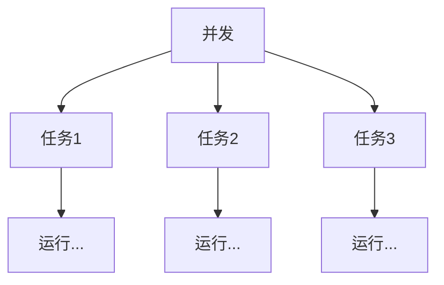
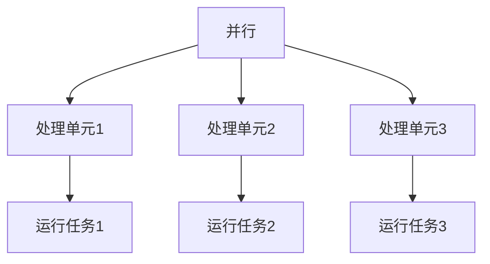
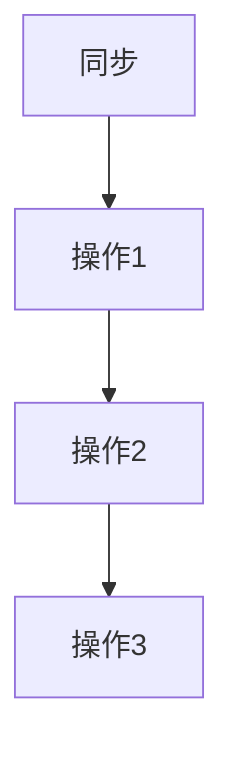
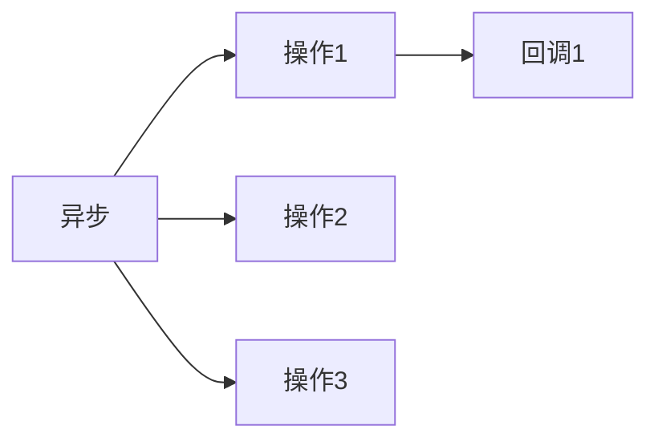
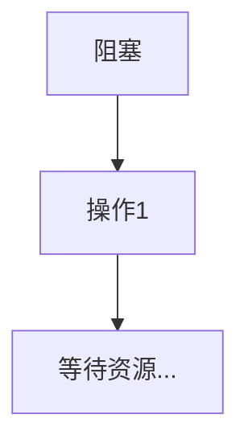
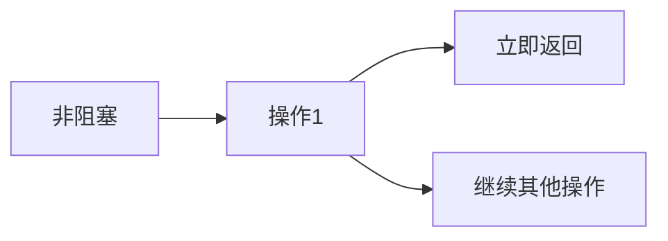

## 基础概念

### 并发与并行



**并发（Concurrency）指的是多个任务在近似同一时间内启动和运行的能力。**不同于并行，这些任务不一定在同一时间点真正地执行，但它们可能看起来似乎是同时进行的。这经常是**通过任务切换或调度来实现的**，使得每个任务都可以得到处理器的时间片，并轮流执行。

> 例子：一个银行柜台，只有一位出纳员，但有多位客户在排队等待服务。出纳员可能会处理第一个客户的部分业务，然后转向第二个客户处理其业务，之后再返回第一个客户，以此类推。
>
> 尽管在任何特定时刻只有一个客户正在得到服务，但因为切换得足够快，所有的客户可能都觉得自己几乎是在同一时间得到服务的。这就是并发。



**并行（Parallelism）指的是多个任务或多个处理单元在同一时刻真正地同时执行。**与并发不同，它不仅仅是任务准备同时运行或看似同时运行，而是真正地在同一时刻执行。这通常在具有多个处理器或多个核心的计算机系统中发生。

> 例子：一个快餐店，里面有三个员工。当三位顾客同时走进店内并分别点餐时，如果每位员工分别为每位顾客制作餐点，而且三位员工都在同一时刻开始并同时完成任务，那么这就是并行。
>
> 每位员工和他们分别服务的顾客可以看作是一个处理单元和一个任务。

### 同步与异步



**同步（Synchronous）描述的是一个操作或任务需要等待另一个操作或任务完成之后才能开始或继续执行。**它通常涉及一种线性或顺序的流程，其中一个操作完全依赖于另一个操作的完成。

> 例子：在超市结账时，如果只有一个收银员，那么顾客需要按照顺序来结账。第一个顾客必须完成结账并离开，第二个顾客才能开始结账，以此类推。
>
> 这里的每个结账过程都是同步的，因为每个顾客的结账必须在前一个顾客完成后才能开始。



**异步（Asynchronous）描述的是一个操作开始后并不需要等待其完成，可以继续执行其他操作。**一旦异步操作完成，通常通过回调、事件、通知或其他机制来获取结果或进一步处理。

> 例子：你在一家咖啡店点了一杯咖啡。而不是站在柜台等待咖啡制作完成，你可以找个座位坐下，甚至看书或工作。当咖啡制作好，店员会叫你的名字或号码，此时你前去取杯。
>
> 在这个期间，你并没有闲置，而是进行了其他活动。

### 阻塞与非阻塞



阻塞（Blocking）描述的是当一个操作或任务等待某个条件（通常是某种资源）满足时，它会进入一个暂停或等待状态。在该条件被满足之前，操作或任务不会继续执行。

> 例子：你在电话上等待客服代表。在你等待的时候，你不能使用电话进行其他通话，也不能结束当前的通话，直到客服代表接听你的电话。
>
> 在这段时间里，你的电话线路被阻塞。



**非阻塞（Non-blocking）描述的是当一个操作或任务遇到必须等待的条件（如等待某种资源）时，它不会进入暂停或等待状态，而是立即返回，让程序可以继续执行其他操作。**当原始操作可以继续进行时，它会在适当的时间继续。

> 例子：一个自助餐厅。即使前面的人在选择食物并花费很长时间，你也可以选择跳过他们，去取你想要的食物，而不必等待。
>
> 这种情况下，你的选择流程是非阻塞的

### 特性对比

| 特性   | 适用背景                                                | 优点                           | 缺点                               | 注意事项                                   |
| ------ | ------------------------------------------------------- | ------------------------------ | ---------------------------------- | ------------------------------------------ |
| 并发   | 多任务需在相近的时间内执行但不一定同时 - 单核或多核系统 | 资源高效利用、提高响应性       | 任务管理和调度可能复杂             | 需要避免任务间的资源争用                   |
| 并行   | 同时执行多任务、多核或多处理器系统                      | 性能大幅提升、任务真正同时执行 | 需要硬件支持、并行化设计可能复杂   | 要注意数据共享和并行任务之间的同步         |
| 同步   | 当一个任务需要另一个任务的结果时、线性流程              | 简单易理解、流程清晰           | 可能导致资源浪费和延迟             | 避免长时间的同步操作                       |
| 异步   | 当任务之间无直接依赖关系、同时处理多个操作时            | 提高效率、无需等待             | 需要处理任务完成的回调或通知       | 要确保正确处理回调和错误                   |
| 阻塞   | 当任务需要等待某资源或条件满足时                        | 简单的编程模型、确保条件满足   | 导致程序或线程停滞、资源可能被浪费 | 尽量避免长时间的阻塞操作                   |
| 非阻塞 | 当任务在等待某条件时仍需进行其他操作                    | 响应迅速、资源高效利用         | 程序逻辑可能变得复杂               | 需要检查操作是否真的完成或资源是否真的可用 |

## 进程和线程

### 进程

#### 进程是什么

**进程是计算机中的程序关于某数据集的一次运行活动。**它是**系统资源分配的基本单位**，并拥有独立的内存空间。进程具有自己的代码段、数据段和系统资源。

#### 为什么需要进程

- 进程使操作系统可以**多任务处理**，同时执行多个程序。每个进程在其独立的地址空间中运行，互不干扰。
- 进程提供了应用**程序执行的隔离环境**，确保一个进程的故障不会影响到其他进程。
- 进程间的隔离也**增强了系统的安全性**。

#### 进程间通信：IPC，队列，管道

- **IPC（Inter-Process Communication）**：允许进程间相互通信和同步的技术。它包括信号、消息、共享内存等方法。
- **队列**：是一个先进先出（FIFO）的数据结构，可以用于进程间发送消息。
- **管道**：是一个双向通信的方法，允许一个进程的输出成为另一个进程的输入。管道通常用于父子进程间的通信。

### 线程

#### 线程是什么

线程是进程内部的执行单位，它是 **CPU 调度和分派的基本单位。同一进程内的线程共享进程的资源**，如内存、文件句柄等。但每个线程有其自己的运行栈和程序计数器。

#### `threading` 模块

Python 的 `threading` 模块提供了低级线程 API，使我们可以轻松创建和管理线程。以下是如何使用 `threading.Thread` 创建新线程的示例：

```python
import threading

def print_numbers():
    for i in range(10):
        print(i)

thread = threading.Thread(target=print_numbers)
thread.start()
thread.join()
```

### 全局解释器锁（GIL）

#### GIL 是什么

GIL 是 Python 解释器中的一个锁，它使得任何时候只有一个线程在执行。此锁仅存在于 CPython 解释器中。

> Python 官方社区计划在 3.12 以后版本逐步移除 GIL 锁。

#### GIL 的存在原因

- GIL 的主要目的是**简化 CPython（Python 的标准解释器）的实现**。由于多线程并发访问数据可能会导致数据损坏或不一致的情况，GIL 可以防止这种情况的发生。
- CPython 的内存管理不是线程安全的，GIL 可以保证同时只有一个线程执行 Python 字节码，从而避免并发访问的问题。

#### GIL 对多线程程序的影响

- 由于 GIL 的存在，**多线程的 Python 程序不能充分利用多核心 CPU 的优势**，因为任何时候都只有一个线程在执行。这意味着在计算密集型任务上，Python 的多线程并不总是有效的。
- 对于 I/O 密集型任务，多线程仍然是有效的，因为线程在等待 I/O 操作完成时可以释放 GIL，这允许其他线程执行。
- 要真正充分利用多核心，Python 开发者通常会使用进程级的并发（如 `multiprocessing` 模块）或使用其他没有 GIL 限制的 Python 实现，例如 Jython 或 IronPython。

## Python 并发库

并发是一种技术，可以使多个任务似乎在同一时间执行。Python 提供了多种方式来实现并发，以下是其中的一些主要方式。

### `multiprocessing`：多进程

Python 由于 GIL（全局解释器锁）的存在，在多线程时并不能充分利用多核 CPU。为了避免 GIL 的限制，可以使用 `multiprocessing` 模块创建多个进程。

- **优点**：可以充分利用多核 CPU、进程间内存是隔离的，增加了安全性。

- **缺点：**进程启动和通信相对较慢。

```python
from multiprocessing import Process

def print_hello(name):
    print(f"Hello, {name}!")  # 输出：Hello, world!

p = Process(target=print_hello, args=('world',))
p.start()
p.join()
```

### `concurrent.futures`：线程池与进程池

`concurrent.futures` 提供了高层次的异步执行接口，支持线程池和进程池。

#### 线程池

线程比进程轻量，创建和切换成本较低，但受到 GIL 的限制。

```python
from concurrent.futures import ThreadPoolExecutor

# 使用线程池
with ThreadPoolExecutor(max_workers=4) as executor:
    results = list(executor.map(print_hello, ['world', 'python', 'asyncio']))
    # 输出（注意：线程执行的顺序可能是不确定的，以下只是一个可能的输出）：
    # Hello, world!
    # Hello, python!
    # Hello, asyncio!
```

#### 进程池

```python
from concurrent.futures import ProcessPoolExecutor

# 使用进程池
with ProcessPoolExecutor(max_workers=4) as executor:
    results = list(executor.map(print_hello, ['world', 'python', 'asyncio']))
    # 输出（进程的执行顺序可能是不确定的，以下只是一个可能的输出）：
    # Hello, world!
    # Hello, python!
    # Hello, asyncio!
```

### `asyncio`：异步协程

`asyncio` 是 Python 的异步编程框架，它使用事件循环驱动的协程来实现并发。

#### 事件循环

事件循环是异步编程的核心，用于调度和执行任务，确保异步任务的非阻塞执行。通过使用 `asyncio.get_event_loop()` 获取当前事件循环。

#### 协程

协程是 `asyncio` 的核心部分。使用 `async def` 定义协程，使用 `await` 在协程中等待另一个协程完成。

```python
import asyncio

async def main():
    print('Hello')  # 输出：Hello
    await asyncio.sleep(1)
    print('World')  # 输出：World

asyncio.run(main())
```

### 高级异步特性

#### 异步生成器

可以在一个异步函数中产生多个值。

```python
import asyncio

async def async_gen():
    for i in range(3):
        await asyncio.sleep(1)
        yield i

async def main_gen():
    async for value in async_gen():
        print(value)  # 输出：0 1 2

asyncio.run(main())

```

#### 异步上下文管理器

允许使用 `async with` 语句进行异步资源管理。

```python
class AsyncContextManager:
    async def __aenter__(self):
        print("Entered the async context.")  # 输出：Entered the async context.
        return self
    
    async def __aexit__(self, exc_type, exc, tb):
        print("Exited the async context.")  # 输出：Exited the async context.

async def main_context():
    async with AsyncContextManager() as acm:
        print("Inside the async context.")  # 输出：Inside the async context.

asyncio.run(main_context())
```

Python 的并发库为开发者提供了多种选择，选择哪种方式取决于具体的应用需求和场景。不管选择哪种方式，重要的是理解其背后的工作原理和限制，这样可以更好地实现并发，并提高应用的性能。

## 其他异步框架和库

### Tornado

Tornado 是一个 Python Web 服务器软件的开放源码版本。由于其非阻塞 I/O 设计，它能够处理大量的长连接，非常适用于长轮询、WebSockets 等网络协议。与传统的多线程和多进程服务器相比，Tornado 使用单线程事件循环，可以高效地管理数千甚至数百万的并发连接。

### Twisted

Twisted 是一个事件驱动的网络引擎，用于构建各种网络应用。除了支持常见的网络协议如 HTTP、SMTP、POP3、FTP 等，Twisted 还提供了其它功能如身份验证、SSL 和其他安全特性。Twisted 的设计理念是为开发者提供最大的灵活性，允许他们使用自己喜欢的工具和库。

### Quart

Quart 是一个基于 Python 的 ASGI Web 微框架。尽管它的 API 与 Flask 极为相似，但由于集成了 asyncio 的异步功能，Quart 可以提供更高的响应速度。使用 Quart，开发者可以无缝地将 Flask 代码迁移到一个异步环境中，从而充分利用现代硬件的并发性。

## 锁、信号量和同步原语

### 互斥锁 (Mutex)

**互斥锁确保特定资源或代码段在同一时间只能被一个线程访问。**例如，如果两个线程尝试同时更新一个共享的数据结构，没有适当的同步可能会导致数据损坏。互斥锁就是这样一个保护机制，确保资源的一致性和完整性。

```python
import threading

# 创建一个互斥锁
mutex = threading.Lock()

def update_data():
    # 获取锁
    mutex.acquire()
    
    try:
        # TODO: 更新共享资源
        pass
    finally:
        # 释放锁
        mutex.release()

# 启动多个线程来调用update_data
```

### 读写锁

读写锁是一种特殊的锁，针对读者 - 作者问题而设计。当资源经常被读取但很少被修改时，读写锁是很有用的。在这种情况下，多个读线程可以并发访问资源，但写线程会阻塞所有其他线程，确保在写操作期间资源的完整性。

```python
from rwlock import RWLock

rwlock = RWLock()

def read_data():
    with rwlock.r_lock():
        # TODO: 读取数据
        pass

def write_data():
    with rwlock.w_lock():
        # TODO: 修改数据
        pass
```

### 信号量 (Semaphore)

与互斥锁不同，信号量允许多个线程并发访问资源，但是数量是有限的。例如，如果你有一个包含 5 个数据库连接的连接池，你可以使用一个计数为 5 的信号量来确保任何时候最多只有 5 个线程使用这些连接。

```python
import threading

# 创建一个信号量，最多允许5个线程同时访问
semaphore = threading.Semaphore(5)

def access_resource():
    # 获取信号量
    semaphore.acquire()

    try:
        # TODO: 访问资源
        pass
    finally:
        # 释放信号量
        semaphore.release()
```

### 条件变量

条件变量是用于线程之间的同步，特别是当线程需要等待特定条件成立时。例如，一个线程可能会等待一个队列非空才开始处理。使用条件变量，这个线程可以在队列为空时进入休眠，并在其他线程向队列添加项时被唤醒。

```python
import threading

condition = threading.Condition()
queue = []

def produce_item():
    with condition:
        # TODO: 生产一个项目并添加到队列
        queue.append("item")
        # 唤醒等待队列非空的线程
        condition.notify()

def consume_item():
    with condition:
        while not queue:
            # 如果队列为空，则等待
            condition.wait()
        # TODO: 从队列中消费一个项目
        item = queue.pop()
```

## 设计模式与最佳实践

### 生产者 - 消费者模式

生产者 - 消费者模式是一个并发模式，其中一个或多个生产者线程创建项目，而一个或多个消费者线程处理这些项目。这种模式可以有效地分离数据生产和数据处理，通常使用队列来传输数据。

```python
import threading
import queue

q = queue.Queue()

def producer():
    while True:
        item = produce_item()
        q.put(item)

def consumer():
    while True:
        item = q.get()
        process_item(item)

def produce_item():
    # TODO: 生产数据
    return "item"

def process_item(item):
    # TODO: 处理数据
    pass
```

### 发布者 - 订阅者模式

发布者 - 订阅者模式是一种通知模式，其中发布者发送通知，而订阅者（可以有多个）接收通知。这种模式适用于需要广播信息的场景。

```python
class Publisher:
    def __init__(self):
        self.subscribers = set()

    def register(self, who):
        self.subscribers.add(who)

    def unregister(self, who):
        self.subscribers.discard(who)

    def dispatch(self, message):
        for subscriber in self.subscribers:
            subscriber.update(message)

class Subscriber:
    def update(self, message):
        # TODO: 处理消息
        print(message)
```

### 避免死锁、资源竞争、线程安全的设计

- **避免死锁**：确保线程按照一致的顺序请求资源，使用锁的超时功能，或使用死锁检测工具。
- **资源竞争**：使用锁、信号量等同步原语确保对共享资源的有序访问。
- **线程安全的设计**：避免修改共享数据，或确保使用适当的同步机制来保护数据。考虑使用不可变数据结构和线程局部存储。

## 实际应用与性能分析

### 选择适当的并发或并行工具

- **任务性质**：I/O 密集型任务可以从多线程中受益，而 CPU 密集型任务可能更适合多进程或异步编程。
- **共享数据**：如果需要大量共享数据，则线程可能是一个好选择；否则，多进程可能更简单。

### 性能分析工具

#### `cProfile`

`cProfile` 是 Python 的一个内置性能分析工具。它测量函数调用的频率和执行时间，对于查找瓶颈和代码优化尤为有用。

```python
import cProfile

def my_function():
    # TODO: 一些代码
    pass

cProfile.run('my_function()')
```

#### `memory_profiler`

`memory_profiler` 是一个用于监控 Python 程序内存使用的工具，它可以为你提供关于对象的内存消耗等信息。

```python
from memory_profiler import profile

@profile
def memory_test_func():
    a = [i for i in range(100000)]
    return a

memory_test_func()
```

#### `timeit`

`timeit` 是一个专门用于**测量小代码片段执行时间**的工具。它的优势在于，它会多次运行指定的代码，以获取更精确的平均运行时间。

```python
import timeit

def code_to_test():
    return sum(range(10000))

# 该方法会运行 `code_to_test` 函数 1000 次，并返回总运行时间
elapsed_time = timeit.timeit(code_to_test, number=1000)
print(elapsed_time)

```

#### `time.process_time`

这个函数返回**当前进程运行的 CPU 时间，而不是实际经过的时间**，它可以帮助我们忽略其他进程或线程对测量结果的影响。

```Python
import time

start = time.process_time()

# 要测量的代码
result = sum(range(1000000))

end = time.process_time()
print(f"Time taken: {end - start} seconds")
```

#### `time.perf_counter`

`time.perf_counter` 是一个高分辨率的计时器，适合对代码段进行基准测试，并且还会计算系统的休眠时间。

```python
import time

start = time.perf_counter()

# 要测量的代码
result = sum(range(1000000))

end = time.perf_counter()
print(f"Time taken: {end - start} seconds")
```

### 优化策略

- **减少锁的使用**：频繁使用锁可能导致线程等待，降低整体性能。尝试减少锁的持有时间或使用更细粒度的锁，以减少资源争用。
- **使用线程池和连接池**：通过预先创建和复用线程或数据库连接，可以避免频繁地创建和销毁资源，这可以显著提高性能。
- **优化数据结构和算法**：选择正确的数据结构和算法可以极大地提高代码的运行效率。定期审查代码，确保它是最优的。
- **利用缓存**：将常用的计算结果或查询结果缓存起来，可以避免重复的、消耗性能的操作。
- **延迟加载**：只有在真正需要时再加载数据，这样可以避免不必要的计算和资源使用。
