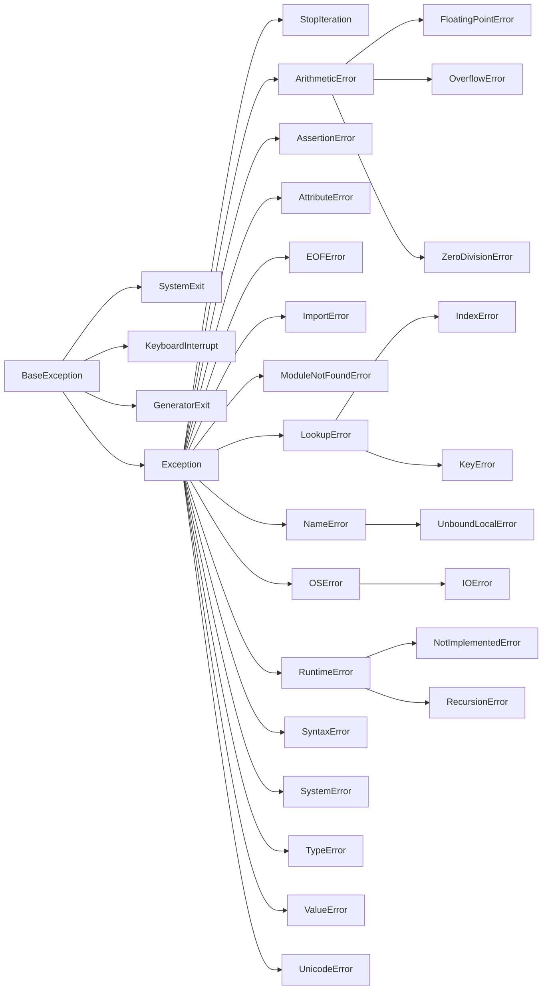

## 异常的概念

**在 Python 中，异常是程序运行时发生的错误，它中断了正常的程序流程。**Python 使用异常对象来表示错误。当程序中发生错误时，Python 会创建一个相应的异常对象。若未处理，程序将终止并显示错误信息。

异常处理是一种编程结构，用于捕获和响应程序中的异常。正确处理异常可以提高程序的健壮性和可靠性，预防中断或崩溃。

异常是一种特殊对象，包含错误的详细信息，如类型和发生时的状态。Python 内置了许多标准异常类型，例如 `ValueError`、`TypeError`、`IndexError`，每种类型对应特定错误。

我们**可以通过异常处理机制捕获异常。**处理异常允许我们决定出错时的响应方式，而非直接让程序崩溃。这对构建健壮和稳定的程序至关重要。

### 异常层次结构



**Python 的异常遵循一定的层次结构。**在这个层次结构的顶端是 `BaseException` 类，它是所有异常的基类。接着是其他一些内置异常，如 `SystemExit`、`KeyboardInterrupt` 等，这些通常用于系统退出和用户中断。

紧随其后的是 `Exception` 类，它是大多数内置可被应用程序捕获的错误的基类。从 `Exception` 类派生出更具体的异常类，如 `StopIteration`、`ArithmeticError`、`LookupError` 等，这些类又有自己的子类，分别对应特定的错误情况。

## 基本异常处理（`try`, `except`, `else`, `finally`）

Python 中处理异常的关键字有四个：`try`、`except`、`finally`、`else`。

- `try`: 将可能引发异常的代码放在 `try` 块中。
- `except`: 当 `try` 块中的代码引发异常时，执行 `except` 块中的代码。可指定要捕获的异常类型。一个 `try` 块可以跟随多个 `except` 块，以捕获不同类型的异常。
- `finally`: 不论 `try` 块是否引发异常，都会执行 `finally` 块。常用于清理操作，如关闭文件。
- `else`: 若 `try` 块中无异常发生，则执行 `else` 块。`else` 是可选的。

```Python
try:
    # 可能抛出异常的代码
    result = 10 / 0
except ZeroDivisionError:
    # 处理ZeroDivisionError异常的代码
    print("Cannot divide by zero!")
else:
    # try代码块成功执行后的代码
    print("Operation successful.")
finally:
    # 无论是否发生异常都会执行的代码
    print("This is the finally block.")
```

## Python 内置标准异常

| 异常名                | 描述                                  |
| --------------------- | ------------------------------------- |
| `BaseException`       | **所有异常的基类**                    |
| `SystemExit`          | 解释器请求退出                        |
| `KeyboardInterrupt`   | 用户中断执行 (通常是输入^C)           |
| `Exception`           | **常规错误的基类**                    |
| `StopIteration`       | 迭代器没有更多的值                    |
| `GeneratorExit`       | 生成器 (generator) 发生异常来通知退出 |
| `SystemError`         | 解释器发现内部错误                    |
| `SyntaxError`         | Python 语法错误                       |
| `IndentationError`    | 缩进错误                              |
| `TabError`            | Tab 和空格混用                        |
| `NameError`           | 未声明/初始化对象 (没有属性)          |
| `UnboundLocalError`   | 访问未初始化的本地变量                |
| `AttributeError`      | 对象没有这个属性                      |
| `TypeError`           | 对类型无效的操作                      |
| `AssertionError`      | 断言语句失败                          |
| `ImportError`         | 导入模块/对象失败                     |
| `ModuleNotFoundError` | 找不到模块                            |
| `LookupError`         | 无效数据查询的基类                    |
| `IndexError`          | 序列中没有此索引 (index)              |
| `KeyError`            | 映射中没有这个键                      |
| `ValueError`          | 传入无效的参数                        |
| `UnicodeError`        | Unicode 相关的错误                    |
| `ArithmeticError`     | 数学运算基类                          |
| `FloatingPointError`  | 浮点计算错误                          |
| `OverflowError`       | 数值运算超出最大限制                  |
| `ZeroDivisionError`   | 除 (或取模) 零 (所有数据类型)         |
| `EnvironmentError`    | 操作系统错误的基类                    |
| `IOError`             | 输入/输出操作失败                     |
| `OSError`             | 操作系统错误                          |
| `EOFError`            | 没有内建输入,到达 EOF 标记            |
| `RuntimeError`        | 一般的运行时错误                      |
| `NotImplementedError` | 尚未实现的方法                        |
| `RecursionError`      | 超过最大递归深度                      |

## 自定义异常的创建和抛出

**自定义异常通过继承 `Exception` 类来定义。**在自定义类中，可以定义所需的任何方法，但通常自定义异常很简单，只提供基本信息。

要抛出自定义异常，使用 `raise` 关键字。在 `raise` 语句后，指定异常类型和可选的错误消息。

```Python
class CustomError(Exception):
    """自定义的异常类型"""

    def __init__(self, message):
        self.message = message

try:
    raise CustomError("This is a custom error.")
except CustomError as e:
    print("Caught an exception:", e.message)
```

## 异常链（`raise from`）和异常上下文

Python 3 引入异常链允许在处理异常时引发另一个异常，保留原始异常的上下文。使用 `raise from` 实现。

```python
try:
    int('a')
except ValueError as e:
    raise RuntimeError('转换错误') from e
```

## 警告（`warnings` 模块）的实用场景

警告不中断程序，但提供有关潜在问题的信息。`warnings` 模块发出警告并处理。使用警告来通知即将废弃的功能，或提醒用户注意非关键问题。

```python
import warnings

def my_function():
    warnings.warn("这个功能即将废弃", DeprecationWarning)

my_function()
```

## 异常处理最佳实践

### 合适的异常处理策略

- **确切地知道你在捕获什么**：仅捕获能正确处理的异常。
- **避免捕获太广泛的异常**：避免使用空 `except:` 子句，以免捕获所有异常。
- **在正确的层级处理异常**：在适当的抽象级别处理异常，避免在函数内部处理应由调用者处理的异常。

### 避免常见错误

- **过度使用异常处理**：不要使用异常处理来控制正常程序流程。
- **在异常处理中隐藏错误**：捕获异常时应记录或报告错误信息。
- **错误地屏蔽异常**：避免在 `except` 块中引发新异常，覆盖原始异常。

## 异常处理示例：网络应用程序

在网络应用程序中，需要从远程服务器获取数据。这可能因多种原因失败，如网络问题或服务器错误。使用异常处理优雅地处理这些问题，并提供回退机制或错误信息。

```python
import requests

try:
    response = requests.get('https://example.com/data')
    response.raise_for_status()
except requests.exceptions.HTTPError as he:
    print(f'HTTP错误: {he}')
except requests.exceptions.ConnectionError as ce:
    print(f'连接错误: {ce}')
except requests.exceptions.Timeout as te:
    print(f'请求超时: {te}')
else:
    # 处理成功的响应
    process_data(response)
```

在这个例子中，使用 [requests HTTP 库](Tech/programming-language/Python/模块/网络处理/requests%20HTTP%20库.md) 分别处理了 HTTP 错误、连接错误和超时错误，每种类型的错误都有专门的异常类。这使得错误处理更加具体和有用。
