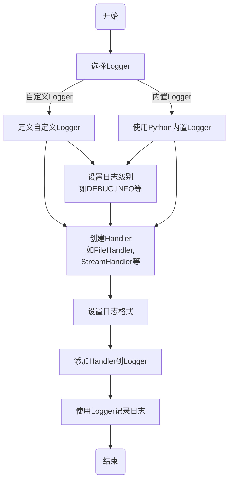

## 简介

**logging 模块是 Python 标准库里提供的日志功能组件，它是在开发过程中实现日志记录的推荐方式。**logging 模块主要包含四个组件：Logger、Handler、Filter 和 Formatter。通过它们的协作可以快速实现对日志的控制和处理。

## 组件

### Logger

**Logger 是日志模块中最基本的组件，它负责生成和分类日志。**在应用代码中，我们可以通过 getLogger 方法获取 Logger 对象，主要有两种获取方式：

```python
import logging

# 1. 不指定 Logger 名称，返回 root Logger  
logger1 = logging.getLogger()

# 2. 指定名称获取 Logger 
logger2 = logging.getLogger('test')
```

### Handler

**Handler 用于指定 Logger 生成的日志消息应发送到哪个目标输出**，常用的 Handler 有两种：

- **StreamHandler**：输出到流，如 sys.stdout、sys.stderr
- **FileHandler**：输出到文件

我们可以通过 Logger 对象的 addHandler 方法将 Handler 与 Logger 关联起来：

```python  
logger = logging.getLogger('test')

# 创建一个 Handler，用于写入日志文件
fh = logging.FileHandler('test.log')

# 给 logger 添加 Handler
logger.addHandler(fh)
```

### Filter

**Filter 用于提供复杂的日志过滤功能，可以用来过滤 INFO、DEBUG 等不同级别的日志。**根据需求，我们可以通过 logger.addFilter 将过滤器加到 logger 或者 handler 里。

```python
# 只记录 ERROR 及以上级别的日志
class ErrorFilter(logging.Filter):
    def filter(self, record):
        return record.levelno >= logging.ERROR

logger.addFilter(ErrorFilter())
```

### Formatter

**Formatter 用于控制日志信息的最终输出格式。**我们可以指定日志不同部分的显示格式，如时间、代码位置、日志消息等。

```python
# 指定日志格式
formatter = logging.Formatter('[%(levelname)s] %(asctime)s - %(message)s') 
handler.setFormatter(formatter)
```

## 基础配置

我们可以通过字典或文件的方式配置 logging 模块。

### dictConfig 配置

```python
import logging.config

config_dict = {
  'version': 1,
  'formatters': {
    'simple': {
      'format': '[%(levelname)s] %(asctime)s - %(message)s'
    }
  },
  'handlers': {
    'console': {
      'class': 'logging.StreamHandler',
      'level': 'DEBUG',
      'formatter': 'simple'
    },
    'file': {
      'class': 'logging.FileHandler',
      'filename': 'test.log',
      'formatter': 'simple'
    }
  },
  'root': {
    'level': 'DEBUG',
    'handlers': ['console', 'file']
  }
}

logging.config.dictConfig(config_dict)
```

### fileConfig 配置

将配置字典写入 json 或 yaml 文件，通过 fileConfig 函数加载：

```python
import logging.config

logging.config.fileConfig('config.yaml')
```

### 配置参数

logging 模块的配置参数较多，主要包括以下方面：

| 参数                     | 说明                                     |
| :----------------------- | :--------------------------------------- |
| version                  | 配置字典的版本，目前为 1                 |
| disable_existing_loggers | 是否禁用已存在的其他日志器，默认 False   |
| formatters               | 定义日志信息的格式化样式                 |
| filters                  | 定义过滤日志信息的过滤器                 |
| handlers                 | 定义日志的处理方法以及目标位置           |
| loggers                  | 定义具体的日志器并绑定处理器和过滤器     |
| root                     | 根日志器配置，其配置会应用到所有日志器上 |

loggers 配置参数：

| 参数      | 说明                         |
| :-------- | :--------------------------- |
| level     | 日志器接收的日志级别         |
| handlers  | 绑定的日志处理器             |
| filters   | 绑定的日志过滤器             |
| propagate | 是否传递给父日志器，默认 True |

handlers 常用参数：

| 参数      | 说明                                         |
| :-------- | :------------------------------------------- |
| class     | 指定处理器类，如 FileHandler、StreamHandler 等 |
| level     | 处理器的日志级别                             |
| formatter | 用于格式化日志的 Formatter                   |
| args      | 处理器初始化参数，如文件名等                 |

formatters 参数：

| 参数    | 说明                   |
| :------ | :--------------------- |
| format  | 指定日志输出格式的模板 |
| datefmt | 格式化时间的格式字符串 |
| style   | 输出样式，如 '{' 和 '$' 等 |

## 模块用法



### 日志级别

logging 模块总共定义了 6 个级别的日志，按照严重程度从低到高排列如下：

| 级别     | 数值 | 说明                                               |
| :------- | :--- | :------------------------------------------------- |
| DEBUG    | 10   | 最详细的调试信息                                   |
| INFO     | 20   | 确认一切运行正常                                   |
| WARNING  | 30   | 表示出现异常，但尚未影响程序运行                   |
| ERROR    | 40   | 由于更严重的问题，程序的某些功能已经不能正常运行了 |
| CRITICAL | 50   | 严重错误，程序可能无法继续运行                     |

在代码中记录日志时，我们可以根据需要的日志级别选择合适的函数，比如：

```python
import logging

logging.debug('detailed debug info')
logging.info('program running info') 
logging.warning('warning occurred')
logging.error('error occurred')
logging.critical('critical error')
```

日志级别可用于控制日志的输出粒度，通过设置级别参数可以只输出大于或等于该级别的日志。

### 日志输出

logging 模块支持通过多种 Handler 将日志输出到不同的位置，常见的有两种：

#### 输出到控制台

```python
import logging

# create logger
logger = logging.getLogger('simple_example')
logger.setLevel(logging.DEBUG)

# create console handler and set level to debug
ch = logging.StreamHandler()
ch.setLevel(logging.DEBUG)

# create formatter
formatter = logging.Formatter('%(asctime)s - %(name)s - %(levelname)s - %(message)s')

# add formatter to ch
ch.setFormatter(formatter)

# add ch to logger
logger.addHandler(ch)

# 'application' code
logger.debug('debug message')
logger.info('info message')
logger.warning('warn message')
logger.error('error message')
logger.critical('critical message')
```

#### 输出到文件

```python
import logging

# 创建 logger
logger = logging.getLogger('simple_example')
logger.setLevel(logging.DEBUG)

# 创建一个向文件输出的 handler
fh = logging.FileHandler('test.log')
fh.setLevel(logging.DEBUG)

# 创建 formatter
formatter = logging.Formatter('%(asctime)s - %(name)s - %(levelname)s - %(message)s')

# 添加 formatter 到 fh
fh.setFormatter(formatter) 

# 添加 fh 到 logger
logger.addHandler(fh)

# 日志输出
logger.debug('debug message')  
logger.info('info message')
logger.warning('warn message')
logger.error('error message')
logger.critical('critical message')
```

此外，还可以通过 SocketHandler 进行网络日志，通过 MemoryHandler 将日志输出到内存等。

### 日志格式化

logging 模块允许自定义日志的输出格式，方便阅读和分析。主要通过 Formatter 实现。

```python
# 自定义格式
# 2023-02-28 15：50：07，431 - myapp.utils - INFO - User signed in successfully [in /path/to/utils.py：456] 
formatter = logging.Formatter('%(asctime)s - %(name)s - %(levelname)s - %(message)s [in %(pathname)s：%(lineno)d]')

handler.setFormatter(formatter)
```

Formatter 使用的格式字符串类似于 C 语言的 printf 格式，可以包含以下字段：

| 字段      | 说明                                            |
| :-------- | :---------------------------------------------- |
| asctime   | 日志事件发生时间，如 2023-02-28 15：49：23，895 |
| levelname | 日志级别的文本表示，如 INFO、ERROR 等           |
| levelno   | 日志级别的数值，如 20、40 等                    |
| message   | 日志消息文本                                    |
| pathname  | 调用日志输出函数的源代码文件路径                |
| filename  | pathname 的文件名部分                           |
| module    | 文件名的模块名部分                              |
| funcName  | 调用日志输出函数的函数名                        |
| lineno    | 调用日志输出函数的源代码行号                    |
| thread    | 线程 ID                                         |
| process   | 进程 ID                                         |

### 日志高级功能

#### 日志回滚

通过 RotatingFileHandler 可以实现日志文件回滚，即当日志文件达到一定大小时自动生成新文件。

```python
handler = RotatingFileHandler('test.log', maxBytes=1024, backupCount=5)
```

#### 日志分割

它可以设置最大字节数和备份文件的数量，超过这些限制之后就会生成新的日志文件。通过 TimedRotatingFileHandler 可以实现日志文件按时间分割。

```python
handler = TimedRotatingFileHandler('test.log', when='D', interval=1) 
```

通过 when 参数可以设置按日、周、月等时间间隔进行切割，interval 参数设置时间间隔大小。

## 最佳实践

### 根据应用场景配置 Logging 模块

不同的 Python 应用场景需要不同的日志方案：

- 小型命令行程序：直接输出到 stdout
- 大型项目：输出到日志文件，同时进行错误提醒、日志分割等
- 分布式系统：实现集中式日志，结合 ELK 等日志分析系统

选择合适的 logging 功能组合。

### 与项目架构相结合

logging 模块要与项目的架构设计相结合，比如：

- 对 Django 项目进行专门的 Logging 设置
- 对 Flask 项目使用 dictsConfig 进行配置
- 对于大型项目，创建一个 log.py 统一处理日志

### 可选的日志收集工具

可以结合日志收集系统，实现可视化分析，如 ELK(ElasticSearch + Logstash + Kibana) 组合。

### 日志的性能优化

- 通过配置只记录必要的日志级别，不记录无用日志
- 将调试日志单独记录到一个文件
- 避免频繁字符串拼接，使用参数化格式
- 控制日志文件大小和滚动频率

## 实战练习

### 标准日志模块的配置示范

```python
# log_config.py

import logging
import logging.config

# 日志配置字典
config_dict = {
    
  # 版本配置
  'version': 1,

  # 配置日志格式化器
  'formatters': {
    
    # 简单日志格式
    'simple': {
      'format': '[%(asctime)s] [%(levelname)s] %(message)s'
    },
    
    # 复杂日志格式 
    'complex': {
      'format': '[%(asctime)s] [%(levelname)s] [%(name)s] [%(filename)s %(funcName)s %(lineno)d] %(message)s'
    }
  },

  # 配置日志处理器
  'handlers': {
    
    # 控制台日志
    'console': {
      'class': 'logging.StreamHandler',
      'level': 'DEBUG',
      'formatter': 'simple'
    },
    
    # 文件日志
    'file': {
      'class': 'logging.FileHandler',
      'filename': 'app.log',
      'mode': 'a',
      'formatter': 'complex'
    }
  },

  # 配置日志器
  'loggers': {
    
    # 应用日志器
    'app': {
      'handlers': ['console', 'file'],
      'level': 'DEBUG',  
    }
  }
}

if __name__ == '__main__':

  # 加载配置字典
  logging.config.dictConfig(config_dict)

  # 获取日志器并输出日志
  logger = logging.getLogger('app')
  logger.debug('This is a debug message')
```

以上实现了一个标准的日志配置，输出到控制台和文件，并使用不同的格式器，包含日志实践中的常见操作。

### 小型项目中添加日志

以一个小型的 Web 项目为例：

```python
import logging

# 创建日志器 
logger = logging.getLogger('myweb')

# 创建控制台处理器并设置级别
ch = logging.StreamHandler()
ch.setLevel(logging.INFO)

# 添加格式器  
formatter = logging.Formatter('%(asctime)s - %(name)s - %(levelname)s - %(message)s')
ch.setFormatter(formatter)

# 将处理器添加到日志器
logger.addHandler(ch)

# 记录一条日志
logger.info('Starting myweb server...') 
```

代码中创建日志器、添加处理器、设置格式后，就可以在项目代码任何地方使用 logger.info、logger.debug 等记录日志，从而方便地添加日志功能。

### 尝试优化项目日志的性能

优化日志性能的常见做法：

- 通过配置文件配置日志，不要在代码里反复配置
- 设置生产环境只记录必要的日志级别，如 WARNING 以上
- ERROR 日志单独记录到文件，便于定位问题
- DEBUG 日志可以使用内存 Handler，避免 IO 消耗
- 使用异步日志，避免影响程序性能
- 合理设置日志滚动策略，避免文件过大

## 扩展学习

### 其他日志框架的比较 (Loguru、log4j 等)

logging 模块作为标准库，用法简单，但需要自行处理诸如异步、日志分割等额外功能。一些第三方日志库如 loguru、log4j 等提供了更多实用功能的封装，可以根据需求选择。

### 分布式系统日志收集方案

在分布式系统中，可以通过将日志发送到消息队列如 Kafka，然后由 Logstash 收集存储到 ElasticSearch 中，最后结合 Kibana 进行日志分析和可视化。也可以直接使用 ELK 提供的 Filebeat 代替 Logstash 从日志文件中收集日志。
