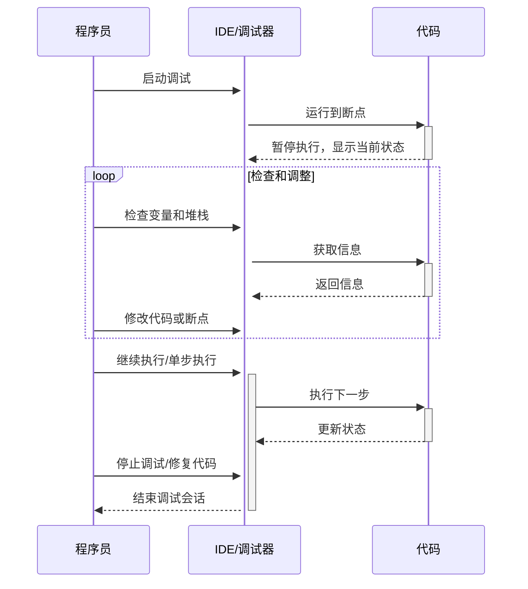

## 调试基础

### 理解调试

调试是软件开发过程中不可或缺的一部分。它涉及到识别和修复代码中的错误或缺陷，以确保程序按预期运行。有效的调试策略可以大幅减少开发时间，并提高代码质量。

### 基本调试技巧

最基础的调试方法是使用 `print` 语句输出变量的值或程序的执行状态。虽然简单，但这种方法在初步诊断问题时非常有效。

```python
def add(a, b):
    print(f"a: {a}, b: {b}")  # 输出参数值
    return a + b

result = add(5, '3')
print(f"结果: {result}")
```

在这个例子中，`print` 语句帮助我们理解错误发生的原因：尝试将整数和字符串相加。

## Python 调试器（pdb）

Python 的内置调试器 `pdb` 是一个非常强大的交互式调试工具，它允许开发者逐行执行代码，检查当前的变量状态，评估表达式，甚至在运行时修改代码。

### 基本使用

使用 `pdb` 的最简单方式是在代码中插入断点。可以通过在代码中添加 `import pdb; pdb.set_trace()` 来实现这一点。当程序执行到这一行时，它将暂停执行并进入**交互式调试模式。**

```python
import pdb

def my_function(arg1, arg2):
    # 设置断点
    pdb.set_trace()
    # breakpoint()  
    return arg1 + arg2

result = my_function(2, 3)
```

当程序运行到 `pdb.set_trace()` 时，程序将暂停，并出现一个交互式的调试环境。Python 3.8 版本以后可以使用 `breakpoint()` 替代 `import pdb;pdb.set_trace()`

### 调试命令

在 `pdb` 的调试环境中，有多种命令可用于调试程序：

| 命令           | 描述                                                         |
| -------------- | ------------------------------------------------------------ |
| `l (list)`     | 显示当前位置周围的代码。                                     |
| `n (next)`     | 执行程序的下一行代码。如果当前行调用了一个函数，不会进入该函数内部。 |
| `c (continue)` | 从当前位置继续执行程序，直到遇到下一个断点。                 |
| `b (break)`    | 在指定的行号处设置断点。例如 `b 120` 在第 120 行设置断点。     |
| `s (step)`     | 执行下一行代码，如果当前行调用了一个函数，则进入该函数内部。 |
| `p (print)`    | 打印一个表达式的值。例如 `p my_var` 打印变量 `my_var` 的值。 |
| `q (quit)`     | 退出调试器。                                                 |
| `r (return)`   | 继续执行，直到当前函数返回。                                 |
| `a (args)`     | 打印当前函数的参数列表。                                     |
| `j (jump)`     | 将当前执行位置跳转到指定的行。例如 `j 50` 跳转到第 50 行。     |
| `h (help)`     | 显示命令列表或查找特定命令的帮助信息。                       |
| `!`            | 执行任意 Python 代码。例如 `!x = 5` 会设置变量 `x` 的值为 5。 |

### 调试流程

在 `pdb` 中，通常的调试流程包括设置断点、运行程序、在断点处暂停、检查变量值或程序状态、逐步执行代码，并根据需要重复这个过程。



### 高级使用

`pdb` 还提供了一些高级功能，比如：

- **条件断点**：您可以设置一个条件断点，只有在特定条件满足时才会停止。

    ```python
    pdb.set_trace()
    # 在命令行中使用
    # b 54, x > 100
    # b 命令 54 行设置 x 大于 100 停止
    ```

- **后期调试**：如果程序崩溃，可以使用 `pdb.pm()` 来进行后期调试。

### 命令行调试

您也可以直接从命令行启动 `pdb`。这在调试脚本时非常有用。

```shell
python -m pdb my_script.py
```

在这种模式下，`pdb` 将在脚本开始执行之前启动，允许您提前设置断点。

## Python 单元测试（unittest）

`unittest` 是 Python 内置的测试框架，灵感来源于 JUnit。它支持自动化测试，共享测试设置（setup）和关闭代码（teardown），聚集多个测试用例，以及与测试框架的集成等功能。

### 基本概念

- **测试用例（TestCase）**：测试用例是 `unittest` 中的基本单元。每一个测试用例是 `unittest.TestCase` 的子类，通常包含多个**以 `test` 开头的方法**，这些方法是实际的测试脚本。
- **测试套件（TestSuite）**：测试套件是一系列的测试用例或测试套件。它用于聚合需要一起执行的测试用例。
- **测试运行器（TestRunner）**：测试运行器是用于执行和控制测试的组件。默认的运行器会将测试结果输出到标准输出。
- **测试装置（TestFixture）**：测试装置指的是执行一系列测试所需的准备工作及相关的清理操作。这通常包括 `setUp()` 和 `tearDown()` 方法。

### 基本的测试用例

使用 `unittest` 编写测试用例通常涉及创建一个继承自 `unittest.TestCase` 的类，并在其中定义一系列的测试方法。

```python
import unittest

class MyTest(unittest.TestCase):
    def setUp(self):
        # 测试前的准备工作
        pass
	
    # 类内部 test 开头的方法视为一个测试用例
    def test_something(self):
        # 实际的测试内容
        self.assertEqual(1 + 1, 2)

    def tearDown(self):
        # 测试后的清理工作
        pass

if __name__ == '__main__':
    unittest.main()
```

在这个例子中，`MyTest` 类包含了一个简单的测试方法 `test_something`，它测试了 `1 + 1` 是否等于 `2`。

### 断言方法

`unittest` 提供了一系列的断言方法来检查期望和实际结果。常用的断言方法包括：

| 方法                                         | 描述                                      |
| -------------------------------------------- | ----------------------------------------- |
| `assertEqual(a, b)`                          | 检查 `a` 是否等于 `b`                     |
| `assertNotEqual(a, b)`                       | 检查 `a` 是否不等于 `b`                   |
| `assertTrue(x)`                              | 检查 `x` 是否为 `True`                    |
| `assertFalse(x)`                             | 检查 `x` 是否为 `False`                   |
| `assertIs(a, b)`                             | 检查 `a` 是否是 `b` （`a is b`）          |
| `assertIsNot(a, b)`                          | 检查 `a` 是否不是 `b`                     |
| `assertIsNone(x)`                            | 检查 `x` 是否为 `None`                    |
| `assertIsNotNone(x)`                         | 检查 `x` 是否不是 `None`                  |
| `assertIn(a, b)`                             | 检查 `a` 是否在 `b` 中                    |
| `assertNotIn(a, b)`                          | 检查 `a` 是否不在 `b` 中                  |
| `assertIsInstance(a, b)`                     | 检查 `a` 是否是 `b` 类型的实例            |
| `assertNotIsInstance(a, b)`                  | 检查 `a` 是否不是 `b` 类型的实例          |
| `assertRaises(Error, func, *args, **kwargs)` | 检查调用 `func` 时是否抛出了 `Error` 异常 |

### 设置和清理

通过定义 `setUp` 和 `tearDown` 方法，可以在每个测试方法执行前后进行设置和清理工作。

```python
class MyTest(unittest.TestCase):
    def setUp(self):
        # 测试前的设置
        self.resource = allocate_resource()

    def tearDown(self):
        # 测试后的清理
        self.resource.release()
```

### 运行测试

通常有两种方式运行测试：

- 直接运行测试文件：如果 `unittest.main()` 被调用，当 Python 文件被直接运行时，测试将被执行。
- 使用命令行：可以使用 Python 的 `-m unittest` 命令来发现和运行测试。

```shell
python -m unittest discover
```

## 测试驱动开发（TDD）

### TDD 概念

测试驱动开发（TDD）是一种软件开发方法，它要求开发人员先编写测试用例，然后编写能够通过这些测试的代码。这种方法强调先有测试，后有实现，有助于创建更可靠、更易维护的代码。

### 实践 TDD

**在 TDD 实践中，开发过程分为三个主要步骤：编写失败的测试、编写通过测试的代码、重构代码。**

```python
# 假设我们有一个待实现的函数 add
# 首先编写测试用例
class TestAddFunction(unittest.TestCase):
    def test_add_numbers(self):
        self.assertEqual(add(1, 2), 3)

# 接着实现函数
def add(a, b):
    return a + b

# 最后运行测试，确认通过
```

通过重复这个循环，逐步构建并完善整个程序。

## 高级测试技巧

### 集成测试和系统测试

集成测试是指在单元测试的基础上，测试多个模块或组件协同工作的情况。系统测试则是测试整个应用程序的行为。

### Mocking 和 Patching

在测试过程中，我们经常需要模拟（Mock）某些对象或函数的行为，以便于在测试环境中替换掉它们。Python 的 `unittest.mock` 模块提供了强大的工具来进行 Mocking 和 Patching。

```python
from unittest.mock import MagicMock

# 假设我们要测试以下函数
def fetch_data(api_client):
    return api_client.get_data()

# 我们可以这样模拟 API 客户端
class TestFetchData(unittest.TestCase):
    def test_fetch_data(self):
        mock_client = MagicMock()
        mock_client.get_data.return_value = 'mock data'
        self.assertEqual(fetch_data(mock_client), 'mock data')
```

在这个例子中，我们使用 `MagicMock` 来模拟 API 客户端的行为。

## 测试框架和工具

### 探索其他测试框架

除了 `unittest`，Python 还有其他流行的测试框架，如 `pytest` 和 `nose`。它们提供了更简洁的语法和更丰富的功能。

### 代码覆盖率工具

代码覆盖率是衡量测试完整性的重要指标。Python 的 `coverage.py` 工具可以帮助测量代码覆盖率，确保测试覆盖了所有重要的代码路径。

## 持续集成 (CI)

### 持续集成简介

持续集成（CI）是一种软件开发实践，开发者经常将代码集成到共享仓库中。每次集成都通过自动化构建来验证，以尽早发现集成错误。

### 使用 CI 工具

CI 工具如 Jenkins、Travis CI 和 GitHub Actions 可以帮助自动化测试流程，确保代码更改不会破坏现有功能。

```yaml
# 示例：GitHub Actions 配置文件
name: Python CI

on: [push]

jobs:
  build:

    runs-on: ubuntu-latest

    steps:
    - uses: actions/checkout@v2
    - name: Set up Python
      uses: actions/setup-python@v2
      with:
        python-version: 3.8
    - name: Install dependencies
      run: |
        pip install -r requirements.txt
    - name: Run tests
      run: |
        python -m unittest
```
