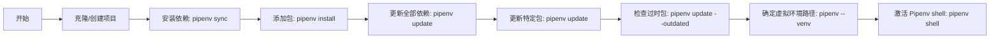

## 简介

Pipenv 是 Python 官方推荐的包管理和虚拟环境工具。它结合了 pip 和 virtualenv 的功能，提供了一种简单且高效的方式来管理项目的依赖和环境。

Pipenv 主要旨在为应用程序的用户和开发人员提供一种简单的方法来**实现一致的工作项目环境**。

### 特性

1. **自动管理虚拟环境**：Pipenv 自动创建和管理虚拟环境，简化了环境配置过程。
2. **声明式依赖文件**：Pipfile 易于阅读和编辑，更加人性化。
3. **依赖锁定**：Pipfile.lock 确保了在不同环境中依赖版本的一致性。
4. **安全性检查**：集成了安全性检查功能，可以检测依赖中的安全漏洞。
5. **环境变量隔离**：通过支持 `.env` 文件，Pipenv 提供了一种简单的环境变量管理方法。

## 安装

Pipenv 可以通过 pip 安装在不同的操作系统上，推荐使用最新版的 pip 和 Python 以确保兼容性。安装命令如下：

```shell
# 在 macOS 上
$ brew install pipenv

# 在 Windows 上
$ pip install --user pipenv

# 在 Linux 上
$ pip3 install --user pipenv
```

注意：在 Windows 系统上，可能需要将用户二进制目录添加到环境变量。在 Linux 系统上，建议使用 `pip3` 以确保 Python 3 的兼容性。

## 基本概念

### Pipfile

- `Pipfile`：声明项目所需依赖的文件，类似于 `requirements.txt`，但更易于阅读和维护。

### Pipfile.lock

- `Pipfile.lock`：锁定依赖版本，确保所有环境中的依赖一致性，防止版本冲突。

### 常用流程



``````shell
# 1.克隆或创建项目仓库
cd your_project_directory

# 2.安装依赖使用 pipenv sync 安装 Pipfile.lock 中的依赖
pipenv sync

# 3.添加包并更新依赖
pipenv install <package>

# 4.更新所有包
pipenv update

# 更新特定包
pipenv update <package>

# 检查过时的包
pipenv update --outdated

# 获取虚拟环境的路径
pipenv --venv

# 激活 Pipenv shell 虚拟环境
pipenv shell
``````

## 基本操作

### 创建虚拟环境

创建一个新的项目时，Pipenv 会自动为你创建一个虚拟环境。运行以下命令来创建一个新的项目：

```shell
mkdir myproject
cd myproject
pipenv install
```

这会创建一个 `Pipfile` 和一个空的虚拟环境。

### 安装和同步依赖

- 安装依赖：`pipenv install [package]`

```
# 例如，安装 requests
pipenv install requests
```

这会自动将 `requests` 添加到 `Pipfile` 并更新 `Pipfile.lock`。

- 同步环境：`pipenv sync`

使用 `pipenv sync` 可以快速同步项目环境，例如：

```shell
# 根据 Pipfile.lock 安装依赖
pipenv sync
```

## 常用命令

| 命令                               | 用途                                             |
| ---------------------------------- | ------------------------------------------------ |
| pipenv install                     | 安装项目所需的包                                 |
| pipenv install [package]           | 安装特定的包                                     |
| pipenv install --dev [package]     | 安装用于开发环境的包                             |
| pipenv uninstall [package]         | 卸载特定的包                                     |
| pipenv lock                        | 生成锁定文件，确保项目在不同环境中的包版本一致性 |
| pipenv sync                        | 根据 Pipfile.lock 安装所有依赖，确保与锁文件一致 |
| pipenv update                      | 更新项目中的所有包                               |
| pipenv update [package]            | 更新特定的包                                     |
| pipenv install --ignore-pipfile    | 忽略 Pipfile，根据 Pipfile.lock 安装依赖         |
| pipenv install --selective-upgrade | 升级指定的依赖并更新 Pipfile.lock 文件           |
| pipenv check                       | 检查项目中的包是否有安全漏洞                     |
| pipenv verify                      | 校验 Pipfile.lock 中的哈希是否最新               |
| pipenv graph                       | 展示项目依赖关系图                               |
| pipenv clean                       | 删除虚拟环境中无用的包                           |
| pipenv shell                       | 启动虚拟环境的 shell                             |
| pipenv run [command]               | 在虚拟环境中运行命令                             |
| pipenv --venv                      | 显示虚拟环境的位置                               |
| pipenv --py                        | 显示虚拟环境中 Python 解释器的位置               |
| pipenv --where                     | 显示项目文件的位置                               |
| pipenv --rm                        | 删除虚拟环境                                     |

## 高级操作

### 自动安装 Python

Pipenv 可以与 pyenv 结合使用，自动安装所需的 Python 版本。这在你的系统中没有安装特定版本的 Python 时非常有用。

示例代码：

```shell
# 假设你的 Pipfile 需要 Python 3.6，但系统中没有安装
# 当运行 pipenv install 时，它会提示是否使用 pyenv 安装 Python 3.6
pipenv install
```

### 自动加载 `.env` 文件

Pipenv 会自动从 `.env` 文件加载环境变量。这对于管理配置和密钥非常有用，尤其是在生产环境中。

```shell
# 假设你有一个 .env 文件包含如下内容
HELLO=WORLD

# 当运行 pipenv shell 或 pipenv run 时，它会加载这些环境变量
pipenv run python main.py
```

### 自定义虚拟环境位置

通过设置 `WORKON_HOME` 环境变量，你可以自定义 Pipenv 创建虚拟环境的位置。

```shell
# 将虚拟环境存储在特定位置
export WORKON_HOME=~/.venvs
```

### 使用 Pipenv 进行测试

Pipenv 与 Travis CI 和 tox 等测试框架结合使用，可以维护一致的测试环境。

示例 Travis CI 配置：

```yaml
language: python
python:
  - "3.6"
install:
  - pip install pipenv
  - pipenv install --dev
script:
  - pipenv run pytest
```

## Pipfile Vs setup.py

理解 Pipfile 和 setup.py 之间的区别。Pipfile 用于应用程序，而 setup.py 用于库。

示例 Pipfile：

```markdown
[[source]]
url = "https://pypi.python.org/simple"
verify_ssl = true

[packages]
requests = "*"
```

示例 setup.py：

```
from setuptools import setup

setup(
    name='your_package',
    version='0.1',
    install_requires=[
        'requests',
    ]
)
```
