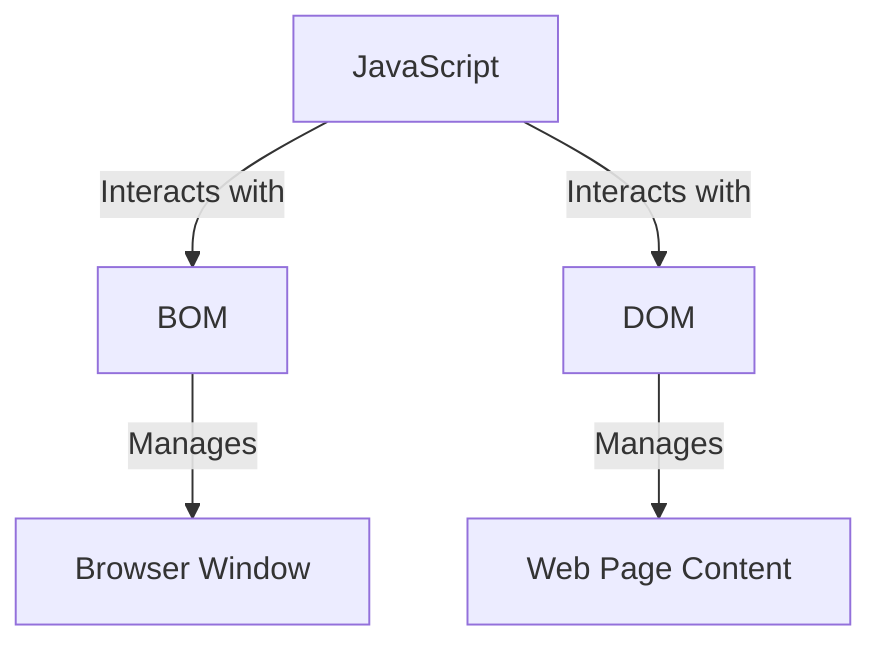
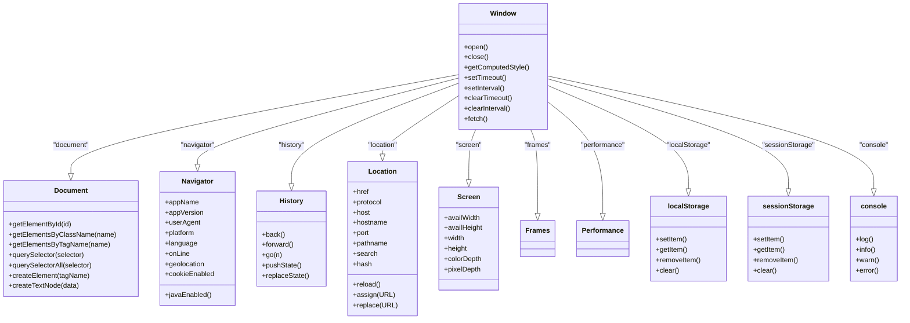
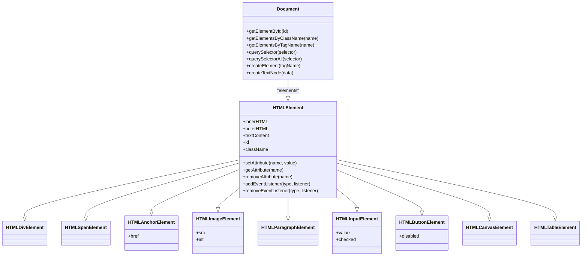

**网页的心跳，使静态的网页获得了动态的脉搏。**

## JavaScript

JavaScript 是一种动态的、解释的编程语言，广泛应用于 Web 开发中。JavaScript 通过 BOM（浏览器对象模型）和 DOM（文档对象模型）与浏览器进行交互。

BOM 提供了访问和操作浏览器窗口的能力，包括窗口大小、导航、定时器、对话框等。DOM 则是对网页内容的抽象，它将网页文档结构化为一个节点树，允许开发者查询和操作页面内容。

简单来说，JavaScript 是语言，DOM 是这个语言可以操作的对象之一（网页内容），BOM 也是这个语言可以操作的对象之一（浏览器窗口及其相关属性和方法）。



这个图展示了 JavaScript、BOM、DOM 之间的关系。**其中，JavaScript 与 BOM 和 DOM 进行交互，BOM 管理浏览器窗口，DOM 管理网页内容。**

### 基础语法

JavaScript 的基础语法相对简单,主要包含变量、数据类型、运算符、语句与注释等。

#### 变量

JavaScript 通过 `var`、`let` 和 `const` 关键词来声明变量，它们之间存在明显的区别：

- **`var` 是函数作用域的变量**，也就是说，如果你在一个函数内部声明了一个 `var` 变量，那么它只能在这个函数内部被访问。
- **`let` 和 `const` 都是块级作用域的变量**，它们只能在声明它们的代码块或者更小的作用域内被访问。

`var` 存在变量提升的特性，即在声明之前使用变量不会报错，但是值为 `undefined`。而 `let` 和 `const` 不存在变量提升，它们具有所谓的暂时性死区特性。

```js
// var 声明的变量可以重复声明,会发生变量提升
var name = 'John';
var name = 'Peter'; 

// let 声明的变量不可以重复声明,有块级作用域
let age = 25; 
let age = 30; // 报错

// const 声明的是常量,初始化后值不可修改
const pi = 3.14;
pi = 3; // 报错
```

#### 数据类型

JavaScript 中有七种数据类型:

| 数据类型  | 说明                          | 示例              |
| :-------- | :---------------------------- | :---------------- |
| Number    | 包括整数和浮点数              | 123, 3.14         |
| String    | 字符串,使用单引号或双引号包裹 | 'hello', "world"  |
| Boolean   | true 和 false                 | true, false       |
| Null      | 表示无值                      | null              |
| Undefined | 表示值未定义                  | undefined         |
| Symbol    | 表示独一无二的值              | Symbol('id')      |
| BigInt    | 可表示任意大的整数            | 9007199254740991n |

JavaScript 中还有一种复杂数据类型 Object，表示由多个键值对组成的对象。可以使用 `typeof` 来判断一个变量的类型：

```js
let n = 123; 
let s = 'Hello';
let b = true;

typeof n; // 'number'
typeof s; // 'string' 
typeof b; // 'boolean'
```

#### 运算符

JavaScript 支持多种运算符，包括：

| 运算符类型 | 运算符                  | 说明             | 示例                    |
| :--------- | :---------------------- | :--------------- | :---------------------- |
| 算术运算符 | + - * / % ++ --         | 用于执行算术运算 | x + y                   |
| 赋值运算符 | = += -= *= /= %= **=    | 用于给变量赋值   | x += 1                  |
| 比较运算符 | == === != !== > < >= <= | 用于比较两个值   | x == y                  |
| 逻辑运算符 | && \|\| !               | 用于组合条件     | x > 0 && y < 0          |
| 条件运算符 | ? :                     | 根据条件选择值   | condition ? val1 : val2 |
| 位运算符   | & \| ^ ~ << >> >>>      | 用于位运算       | x & y                   |

```js
let a = 1 + 2; // 3
let b = 'Hello' + ' ' + 'World!'; // 'Hello World!'

console.log(a == b); // false
console.log(a != b); // true

console.log(a > 0 && b.includes('Hello')); // true
```

#### 语句

JavaScript 提供了多种控制结构，包括条件语句、循环语句、分支语句和跳转语句。

##### 条件语句

使用 `if/else` 语句进行条件判断：

```js
if (condition) {
  // 条件为真时执行
} else {
  // 条件为假时执行  
}
```

`if/else` 语句可以进行多重条件判断：

```js
if (n > 0) {
  // n 大于 0
} else if (n < 0) {
  // n 小于 0
} else {
  // n 等于 0
}
```

##### 循环语句

使用 `for` 循环和 `while` 循环进行迭代操作：

```js
// for 循环
for (let i = 0; i < 5; i++) {
  console.log(i); 
}

// while 循环
let j = 0;
while (j < 5) {
  console.log(j);
  j++;
}
```

##### 分支语句

使用 `switch` 语句进行多分支判断：

```js
switch(fruit) {
  case 'apple': 
    console.log('苹果');
    break;
  case 'banana':
    console.log('香蕉');
    break;
  default:
    console.log('其他水果');
}
```

##### 跳转语句

`break` 用于退出循环，`continue` 用于跳过当前循环：

```js
for (let i = 0; i < 10; i++) {
  if (i % 2 === 0) { 
    continue; // 跳过偶数
  }
  console.log(i);
  
  if (i > 5) {
    break; // 当 i 大于 5 时退出循环
  } 
}
```

另外，JavaScript 支持使用注释来增加代码的可读性：

```js
// 这是单行注释

/*
这是多行注释，可以注释一段代码
*/
```

#### 函数

函数是 JavaScript 中组织代码的基本单元，可以封装一段可以重复执行的代码块：

```js
// 函数声明
function add(x, y) {
  return x + y; 
}

// 函数表达式
const subtract = function(x, y) {
  return x - y;
};

// 箭头函数（ES6 新增）
const multiply = (x, y) => {
  return x * y;
};
```

函数可以有参数，也可以有返回值。在 JavaScript 中，函数也是一种对象，可以被赋值给变量，也可以作为其他函数的参数或返回值。

#### 数组

数组是一种特殊的对象，用于存储一系列的值：

```js
let nums = [1, 2, 3];
let fruits = ['Apple', 'Banana', 'Orange'];

nums.push(4); // 添加元素
nums.pop(); // 删除最后一个元素
nums.includes(2); // 检查是否包含某个元素
```

在 JavaScript 中，数组是动态的，可以随时添加或删除元素。数组的长度可以通过其 `length` 属性获取。

#### 对象

对象是 JavaScript 的核心概念，它是由一组键值对构成的数据集合：

```js
let person = {
  name: 'John',
  age: 20,
  sayHi: function() {
    console.log('Hi!'); 
  }
};

console.log(person.name); // 访问属性
person.sayHi(); // 调用方法
```

**在 JavaScript 中，几乎所有的东西都是对象。**函数、数组、日期和正则表达式等都是特殊的对象。对象的属性和方法可以被动态创建和删除，非常灵活。

#### 其他特性

JavaScript 还有许多其他高级特性，例如原型和继承、闭包、异步处理和模块等。

##### 原型和继承

JavaScript 是基于原型的语言，每个对象都有一个指向它的原型（prototype）的链接。当试图访问一个对象的属性时，JavaScript 会首先在对象本身的属性中搜索，如果找不到，就会在它的原型对象中搜索。

```js
function Person(name) {
  this.name = name;
}

Person.prototype.sayName = function() {
  console.log(this.name); 
};

let person1 = new Person('John');
person1.sayName(); // 'John'
```

JavaScript 的继承机制是基于原型的。我们可以通过设置一个类型的原型为另一个类型的实例，来实现继承。

```js
function Student(name, grade) {
  Person.call(this, name); // 继承属性
  this.grade = grade;
}

Student.prototype = Object.create(Person.prototype); // 继承方法
Student.prototype.constructor = Student;

let student1 = new Student('Tom', 5);
console.log(student1.name); // Tom
console.log(student1.grade); // 5
student1.sayName(); // Tom
```

##### 闭包

闭包（closure）是 JavaScript 中一个重要的概念。在 JavaScript 中，函数可以形成闭包。闭包是指有权访问另一个函数作用域中的变量的函数。

```js
function createCounter() {
  let count = 0;
  return function() {
    return ++count;
  };
}

let counter = createCounter();
console.log(counter()); // 1
console.log(counter()); // 2
```

闭包的一个常见应用是使函数有私有变量。在上面的例子中，变量 `count` 就像 `createCounter` 函数的私有变量，外部无法访问，只能通过闭包来操作。

##### 异步处理

JavaScript 是单线程的，但是它可以通过事件和回调函数来处理异步操作。例如，我们可以使用 `setTimeout` 函数来延迟执行一段代码：

```js
console.log('Hello');
setTimeout(function() {
  console.log('World');
}, 1000);
console.log('!');
```

这段代码会首先输出 'Hello' 和 '!'，然后等待一秒钟后，再输出 'World'。虽然 `setTimeout` 函数在 '!' 之前调用，但是它不会阻塞代码的执行。

在 ES6 中，JavaScript 引入了 Promise 和 async/await，使得异步编程更加方便和强大。

##### 模块

在现代的 JavaScript 开发中，我们通常会把代码分成多个模块（module），每个模块负责一部分功能。模块可以导入（import）其他模块，也可以导出（export）自己的接口给其他模块使用。

```js
// math.js
export function add(x, y) {
  return x + y;
}

// main.js
import { add } from './math.js';
console.log(add(1, 2)); // 3
```

模块可以使我们的代码更加结构化和可维护。

### BOM 模型

**浏览器对象模型（Browser Object Model，BOM）是用于与浏览器交互的模型。**它提供了一种方式，使开发者能够通过 JavaScript 访问和操作浏览器的窗口。

BOM 主要由一系列的对象组成，这些对象提供了许多方法和属性，使得开发者能够处理浏览器窗口和文档的加载、大小、位置等各种情况，以及进行网络通信等操作。

BOM 的核心对象是 `window`，它代表了浏览器的窗口，也是 JavaScript 的全局对象。除此之外，BOM 还包括了其他一些对象，例如：

- `location` 对象：提供了当前窗口中加载的文档的 URL 信息，以及用于导航的方法。
- `navigator` 对象：提供了当前浏览器的信息，比如版本、名称等。
- `history` 对象：提供了浏览器历史的信息，以及用于导航的方法。
- `document` 对象：提供了当前加载在窗口中的 HTML 文档的访问和操作的方式。



需要注意的是，**BOM 并没有一个标准的定义，不同的浏览器可能实现了不同的 BOM。**但是，现代的浏览器已经在很大程度上实现了 BOM 的兼容性。

#### 窗口对象

窗口对象（Window Object）是 BOM 的核心对象，它代表了浏览器的窗口。所有的全局变量，函数都是它的方法和属性。例如，我们可以获取窗口的尺寸：

```javascript
let width = window.innerWidth;
let height = window.innerHeight;
```

我们也可以使用 `setTimeout` 和 `setInterval` 方法来执行定时操作：

```javascript
// 打印 "Hello, world!" 然后 2 秒后关闭窗口
window.setTimeout(function() {
    console.log("Hello, world!");
    window.close();
}, 2000);
```

以下是 `window` 对象的一些常用属性和方法的表格形式：

| 类型 | 名称                     | 描述                                                   |
| ---- | ------------------------ | ------------------------------------------------------ |
| 属性 | `window.innerWidth`      | 浏览器窗口的视口（viewport）的宽度（包括滚动条）       |
| 属性 | `window.innerHeight`     | 浏览器窗口的视口（viewport）的高度（包括滚动条）       |
| 属性 | `window.outerWidth`      | 浏览器窗口的外部宽度                                   |
| 属性 | `window.outerHeight`     | 浏览器窗口的外部高度                                   |
| 属性 | `window.location`        | 当前窗口的 `Location` 对象，包含了当前页面的 URL 信息  |
| 属性 | `window.document`        | 当前窗口加载的 `Document` 对象，即 DOM（文档对象模型） |
| 属性 | `window.history`         | 当前窗口的 `History` 对象，提供了浏览历史的访问和操作  |
| 属性 | `window.screen`          | 当前屏幕的 `Screen` 对象，提供了屏幕的信息             |
| 方法 | `window.alert()`         | 显示一个警告对话框                                     |
| 方法 | `window.prompt()`        | 显示一个提示对话框，并请求用户输入                     |
| 方法 | `window.confirm()`       | 显示一个确认对话框，并请求用户确认                     |
| 方法 | `window.open()`          | 打开一个新的浏览器窗口或标签页                         |
| 方法 | `window.close()`         | 关闭当前的浏览器窗口或标签页                           |
| 方法 | `window.setTimeout()`    | 设置一个定时器，在指定的毫秒数后执行一个函数或代码     |
| 方法 | `window.setInterval()`   | 设置一个定时器，每隔指定的毫秒数重复执行一个函数或代码 |
| 方法 | `window.clearTimeout()`  | 清除由 `setTimeout` 设置的定时器                       |
| 方法 | `window.clearInterval()` | 清除由 `setInterval` 设置的定时器                      |

#### 文档对象

文档对象（Document Object）是 HTML 文档的根节点，用于访问和操作网页内容。`document` 对象允许你访问和操作页面的内容，包括元素节点、属性节点和文本节点。

以下是 `document` 对象的一些常见属性和方法：

| 类型 | 名称                                    | 描述                                                 |
| ---- | --------------------------------------- | ---------------------------------------------------- |
| 属性 | `document.documentElement`              | 返回文档的根元素（在 HTML 中，通常是 `<html>` 元素） |
| 属性 | `document.body`                         | 返回文档的 `<body>` 元素                             |
| 属性 | `document.head`                         | 返回文档的 `<head>` 元素                             |
| 属性 | `document.title`                        | 获取或设置文档的标题                                 |
| 方法 | `document.getElementById(id)`           | 返回具有指定 ID 的元素                               |
| 方法 | `document.getElementsByClassName(name)` | 返回所有具有指定类名的元素的集合                     |
| 方法 | `document.getElementsByTagName(name)`   | 返回所有具有指定标签名的元素的集合                   |
| 方法 | `document.querySelector(selector)`      | 返回匹配指定 CSS 选择器的第一个元素                  |
| 方法 | `document.querySelectorAll(selector)`   | 返回匹配指定 CSS 选择器的所有元素的集合              |
| 方法 | `document.createElement(tagName)`       | 创建一个新的元素节点                                 |
| 方法 | `document.createTextNode(data)`         | 创建一个新的文本节点                                 |

这些只是 `document` 对象的基本属性和方法。实际上，DOM 提供了非常多的 API 来查询和操作文档，包括添加、删除和修改元素，添加事件监听器，修改 CSS 样式等等。

例如，我们可以使用 `document.getElementById()` 来获取具有特定 ID 的元素，或者使用 `document.createElement()` 来创建新的元素：

```javascript
// 获取 ID 为 "myElement" 的元素
let myElement = document.getElementById("myElement");

// 创建一个新的 <p> 元素
let newElement = document.createElement("p");
newElement.textContent = "This is a new paragraph.";
document.body.appendChild(newElement);
```

#### 导航对象

导航对象（Navigator Object）提供了关于浏览器的信息。下面是一些常见的 `navigator` 对象的属性：

| 类型 | 名称                   | 描述                                                         |
| ---- | ---------------------- | ------------------------------------------------------------ |
| 属性 | `navigator.appName`    | 返回浏览器的名称                                             |
| 属性 | `navigator.appVersion` | 返回浏览器的版本信息                                         |
| 属性 | `navigator.userAgent`  | 返回用户代理头的字符串表示（包含浏览器名称、版本、操作系统等信息） |
| 属性 | `navigator.platform`   | 返回运行浏览器的操作系统平台                                 |
| 属性 | `navigator.language`   | 返回浏览器的默认语言                                         |
| 属性 | `navigator.onLine`     | 返回浏览器的在线状态，如果浏览器在线则返回 `true`，否则返回 `false` |

另外，`navigator` 对象还包含一些用于特定功能的方法和对象，例如：

- `navigator.geolocation`：用于获取用户的地理位置信息。
- `navigator.cookieEnabled`：返回一个布尔值，表示是否启用了 cookie。
- `navigator.javaEnabled()`：返回一个布尔值，表示是否启用了 Java。

请注意，`navigator` 对象的一些属性和方法可能会因浏览器的不同而有所差异。而且，由于隐私和安全的考虑，某些信息可能需要用户的许可才能访问。

```javascript
console.log(navigator.userAgent);
```

#### 历史对象

历史对象（History Object）提供了浏览器历史记录的操作方法。然而，由于隐私原因，您不能获取到用户的浏览历史具体细节，但可以用 `history` 对象来操作当前窗口的浏览历史。

以下是 `history` 对象的一些常见方法：

| 类型 | 名称                     | 描述                                                         |
| ---- | ------------------------ | ------------------------------------------------------------ |
| 方法 | `history.back()`         | 和点击浏览器后退按钮一样，加载历史列表中的前一个 URL         |
| 方法 | `history.forward()`      | 和点击浏览器前进按钮一样，加载历史列表中的下一个 URL         |
| 方法 | `history.go(n)`          | 加载历史列表中的某个具体页面，通过参数 `n` 指定。`n` 为正数时前进，`n` 为负数时后退，`n` 为 0 时刷新当前页面 |
| 方法 | `history.pushState()`    | 在历史记录中添加一个状态，但不触发页面刷新                   |
| 方法 | `history.replaceState()` | 在历史记录中替换当前状态，但不触发页面刷新                   |

注意，`pushState()` 和 `replaceState()` 方法可以改变 URL 并添加历史记录，但并不会重新加载页面。这对于创建 AJAX 驱动的动态页面非常有用。

还有一个 `history.length` 属性，它返回当前窗口历史堆栈中的 URL 数量。由于安全和隐私原因，您无法访问堆栈中的实际 URL。

例如，我们可以使用 `history.back()` 和 `history.forward()` 方法来模拟用户点击浏览器的后退和前进按钮：

```javascript
// 后退到上一个页面
history.back();

// 前进到下一个页面
history.forward();
```

#### 位置对象

位置对象（Location Object）提供了当前窗口或标签的 URL 信息，以及一些方法来操作 URL。

以下是 `location` 对象的一些常见属性和方法：

| 类型 | 名称                    | 描述                                           |
| ---- | ----------------------- | ---------------------------------------------- |
| 属性 | `location.href`         | 获取或设置整个 URL                             |
| 属性 | `location.protocol`     | 返回 URL 的协议部分（如："http:" 或 "https:"） |
| 属性 | `location.host`         | 返回 URL 的主机名和端口（如果有的话）          |
| 属性 | `location.hostname`     | 返回 URL 的主机名                              |
| 属性 | `location.port`         | 返回 URL 的端口号                              |
| 属性 | `location.pathname`     | 返回 URL 的路径名                              |
| 属性 | `location.search`       | 返回 URL 的查询字符串（包括 "?"）              |
| 属性 | `location.hash`         | 返回 URL 的片段标识符（包括 "#"）              |
| 方法 | `location.reload()`     | 重新加载当前页面                               |
| 方法 | `location.assign(URL)`  | 加载新的页面                                   |
| 方法 | `location.replace(URL)` | 替换当前页面                                   |

这些属性和方法使我们可以从 JavaScript 中读取和操作 URL 的各个部分。例如，我们可以使用 `location.href` 来获取当前页面的 URL，或者使用 `location.assign()` 来加载一个新的页面。还要注意的是，使用 `location.replace()` 方法不会在历史记录中留下记录，所以用户不能使用 " 后退 " 按钮返回。

例如，我们可以使用 `location.href` 来获取或设置当前页面的 URL，或者使用 `location.reload()` 来重载当前页面：

```javascript
// 打印当前页面的 URL
console.log(location.href);

// 重载当前页面
location.reload();
```

#### 屏幕对象

屏幕对象（Screen Object）提供了关于用户的屏幕信息。这些信息包括屏幕的宽度、高度、颜色深度和像素深度等。以下是 `screen` 对象的一些常见属性：

| 类型 | 名称                 | 描述                                                         |
| ---- | -------------------- | ------------------------------------------------------------ |
| 属性 | `screen.availWidth`  | 返回屏幕的可用宽度，以像素为单位（减去界面特性，如 Windows 任务栏） |
| 属性 | `screen.availHeight` | 返回屏幕的可用高度，以像素为单位（减去界面特性，如 Windows 任务栏） |
| 属性 | `screen.width`       | 返回屏幕的总宽度，以像素为单位                               |
| 属性 | `screen.height`      | 返回屏幕的总高度，以像素为单位                               |
| 属性 | `screen.colorDepth`  | 返回目标设备或缓冲器上的颜色深度，以位为单位                 |
| 属性 | `screen.pixelDepth`  | 返回屏幕的像素深度                                           |

这些属性可以帮助你了解用户的屏幕信息，并据此调整网页的布局或设计。例如，你可以根据 `screen.width` 和 `screen.height` 来调整网页的大小，以最佳地适应用户的屏幕。

注意，`screen` 对象的属性是只读的，你不能修改它们的值。我们可以使用 `screen.width` 和 `screen.height` 来获取屏幕的宽度和高度：

```javascript
console.log("Screen width: " + screen.width);
console.log("Screen height: " + screen.height);
```

### DOM 模型

**文档对象模型（Document Object Model，DOM）是一种编程接口，它允许程序和脚本动态地访问和更新文档的内容、结构和样式。**DOM 将文档解析为一个由节点和对象（包括属性和方法）构成的结构集合，这样就可以使用脚本语言（如 JavaScript）来操作这些节点和对象。

在 Web 中，最常见的文档类型是 HTML 或 XML 文档。对于这种类型的文档，DOM 表示它们为一个树状结构，其中每个节点都是一个对象，代表了文档的一部分。例如，HTML 文档中的每个元素、属性和文本都会被表示为一个 DOM 节点。

一个简单的 HTML DOM 结构可能会像下面这样：

```html
<!DOCTYPE html>
<html>
  <head>
    <title>My Page</title>
  </head>
  <body>
    <h1>Welcome to My Page</h1>
    <p>Content here</p>
  </body>
</html>
```

在这个 HTML 文档中，`<html>`、`<head>`、`<title>`、`<body>`、`<h1>` 和 `<p>` 元素都是 DOM 节点。`My Page` 和 `Welcome to My Page` 以及 `Content here` 这些文本也是 DOM 节点，它们是元素节点的子节点。



开发者可以使用 DOM API 来获取、创建、修改或删除这些节点，从而实现对网页内容和结构的动态控制。这是现代网页交互性的基础。

#### 获取元素

| 方法                                    | 描述                                                         | 示例                                                         |
| :-------------------------------------- | ------------------------------------------------------------ | ------------------------------------------------------------ |
| `document.getElementById(id)`           | 通过元素 ID 获取元素。此方法返回一个对象，表示带有指定 ID 的元素。 | `document.getElementById('myId')`                            |
| `document.getElementsByClassName(name)` | 通过类名获取元素。此方法返回一个 HTMLCollection 对象，包含了文档中所有具有指定类名的元素。 | `document.getElementsByClassName('myClass')`                 |
| `document.getElementsByTagName(name)`   | 通过标签名获取元素。此方法返回一个 HTMLCollection 对象，包含了文档中所有具有指定标签名的元素。 | `document.getElementsByTagName('div')`                       |
| `document.querySelector(selector)`      | 返回文档中匹配指定 CSS 选择器的第一个元素。                  | `document.querySelector('.myClass')`                         |
| `document.querySelectorAll(selector)`   | 返回文档中匹配指定 CSS 选择器的所有元素。此方法返回一个 NodeList 对象。 | `document.querySelectorAll('.myClass')`                      |
| `document.getElementsByName(name)`      | 通过元素的 Name 属性获取元素。此方法返回一个 NodeList 对象，包含了文档中所有具有指定 Name 属性的元素。 | `document.getElementsByName('myName')`                       |
| `Element.querySelector(selector)`       | 返回元素内部匹配指定 CSS 选择器的第一个元素。                | `document.getElementById('myId').querySelector('.myClass')`  |
| `Element.querySelectorAll(selector)`    | 返回元素内部匹配指定 CSS 选择器的所有元素。此方法返回一个 NodeList 对象。 | `document.getElementById('myId').querySelectorAll('.myClass')` |

请注意，`Element.querySelector` 和 `Element.querySelectorAll` 与 `document.querySelector` 和 `document.querySelectorAll` 类似，但它们只在指定元素的后代中查找，而不是在整个文档中查找。

例如:

```js
// 获取 id 为 title 的元素
const title = document.getElementById('title'); 

// 获取所有 <p> 元素
const ps = document.getElementsByTagName('p');

// 获取所有 class 为 content 的元素 
const contents = document.getElementsByClassName('content');

// 获取第一个 class 为 content 的元素
const content = document.querySelector('.content'); 
```

#### 改变元素

| 方法                                            | 描述                                                         | 示例                                                      |
| ----------------------------------------------- | ------------------------------------------------------------ | --------------------------------------------------------- |
| `element.setAttribute(name, value)`             | 设置元素的属性。此方法会设置或更新元素的属性。               | `element.setAttribute('class', 'myClass')`                |
| `element.getAttribute(name)`                    | 获取元素的属性值。此方法返回指定属性的值，如果该属性不存在，则返回 `null`。 | `element.getAttribute('class')`                           |
| `element.removeAttribute(name)`                 | 删除元素的属性。此方法会完全移除元素的指定属性。             | `element.removeAttribute('class')`                        |
| `element.classList.add(class1, class2, ...)`    | 向元素添加一个或多个类。此方法会向元素的类列表添加一个或多个类名。如果指定的类名已存在，则不会添加。 | `element.classList.add('myClass')`                        |
| `element.classList.remove(class1, class2, ...)` | 从元素中删除一个或多个类。此方法会从元素的类列表中删除一个或多个类名。 | `element.classList.remove('myClass')`                     |
| `element.classList.toggle(class, true/false)`   | 切换元素的类。如果类名存在，则删除它；如果类名不存在，则添加它。 | `element.classList.toggle('myClass')`                     |
| `element.style.cssText`                         | 设置或返回元素的样式属性。此属性返回一个 CSSStyleDeclaration 对象，代表元素的 `style` 属性。 | `element.style.cssText = 'color: red; background: blue;'` |
| `element.style.property`                        | 设置或返回元素的指定样式属性。此属性会设置或返回元素的指定样式属性。 | `element.style.color = 'red'`                             |
| `element.innerHTML`                             | 设置或返回元素的 HTML 内容。此属性会设置或返回元素的内部 HTML。 | `element.innerHTML = '<b>Hello</b>'`                      |
| `element.outerHTML`                             | 设置或返回元素的外部 HTML。此属性会设置或返回元素的开头和结尾标签，包括元素的所有后代。 | `console.log(element.outerHTML)`                          |
| `element.textContent`                           | 设置或返回元素的文本内容。此属性会设置或返回元素的所有文本内容，包括它的所有后代。 | `element.textContent = 'Hello'`                           |

请注意，每个属性和方法可能有其适用性和局限性。在使用它们的时候，需要考虑到你的需求和它们的特性。

```js
// 改变内容
title.innerHTML = 'New title'; 

// 改变样式
title.style.color = 'red';

// 显示/隐藏
content.style.display = 'none';

// 添加类
content.classList.add('hidden'); 

// 删除类
content.classList.remove('hidden');
```

#### 创建元素

| 方法                                               | 描述                                                         | 示例                                                         |
| -------------------------------------------------- | ------------------------------------------------------------ | ------------------------------------------------------------ |
| `document.createElement(tagName)`                  | 创建一个新元素。此方法创建一个具有指定标签名的新元素。       | `let div = document.createElement('div')`                    |
| `document.createTextNode(data)`                    | 创建一个新的文本节点。此方法创建一个包含指定文本的新 Text 节点。 | `let text = document.createTextNode('Hello')`                |
| `Node.appendChild(child)`                          | 向元素添加一个新的子节点。此方法将指定的节点添加到指定节点的子节点列表的末尾。 | `div.appendChild(text)`                                      |
| `Node.insertBefore(newNode, referenceNode)`        | 在参考节点之前插入一个新节点。此方法将指定的节点插入到参考节点之前。如果参考节点为 `null`，则新节点将被添加到子节点的末尾。 | `document.body.insertBefore(div, document.body.firstChild)`  |
| `Element.insertAdjacentHTML(position, text)`       | 解析指定的文本作为 HTML 或 XML，并将生成的节点插入到 DOM 树的指定位置。此方法不会重新解析它正在使用的元素，因此它不会破坏元素内的现有元素。 | `div.insertAdjacentHTML('beforeend', '<span>Hello</span>')`  |
| `Element.insertAdjacentText(position, text)`       | 将指定的文本插入到 DOM 树的指定位置。此方法不会重新解析它正在使用的元素，因此它不会破坏元素内的现有元素。 | `div.insertAdjacentText('beforeend', 'Hello')`               |
| `Element.insertAdjacentElement(position, element)` | 将指定的元素插入到 DOM 树的指定位置。此方法不会重新解析它正在使用的元素，因此它不会破坏元素内的现有元素。 | `let span = document.createElement('span'); div.insertAdjacentElement('beforeend', span)` |
| `Node.cloneNode(deep)`                             | 创建指定节点的副本。此方法创建一个新的节点，这个节点是调用此方法的节点的副本。如果 deep 参数为 true，则复制包括整个子 DOM 树，否则只复制节点本身。 | `let divClone = div.cloneNode(true)`                         |
| `Node.replaceChild(newChild, oldChild)`            | 替换一个子节点。此方法将 oldChild 替换为 newChild。          | `div.replaceChild(newSpan, oldSpan)`                         |

这些方法为您提供了创建和操纵 DOM 元素的强大工具。在实际开发中，您可能会经常使用它们来动态地更新页面内容。

```js
// 创建新元素
const div = document.createElement('div');

// 设置属性
div.innerHTML = 'Hello World'; 
div.style.color = 'blue';

// 插入到文档中
document.body.appendChild(div);
```

#### 事件处理

| 方法                                                       | 描述                                                         | 示例                                               |
| ---------------------------------------------------------- | ------------------------------------------------------------ | -------------------------------------------------- |
| `element.addEventListener(event, function, useCapture)`    | 为元素添加事件监听器。此方法在指定元素上添加一个事件处理程序。 | `element.addEventListener('click', myFunction)`    |
| `element.removeEventListener(event, function, useCapture)` | 从元素中移除事件监听器。此方法从指定元素中移除事件处理程序。 | `element.removeEventListener('click', myFunction)` |
| `element.onclick`                                          | 为元素设置 click 事件处理程序。此属性返回当前元素的 onclick 事件处理程序代码，或设置一个新的 onclick 事件处理程序代码。 | `element.onclick = myFunction`                     |
| `event.preventDefault()`                                   | 取消事件的默认动作。此方法阻止事件的默认动作。例如，点击链接的默认动作是跳转到链接的 URL，当调用此方法后，点击链接不会跳转。 | `event.preventDefault()`                           |
| `event.stopPropagation()`                                  | 阻止事件冒泡。此方法阻止事件向上冒泡到 DOM 树。              | `event.stopPropagation()`                          |
| `event.stopImmediatePropagation()`                         | 阻止剩余的事件处理程序被执行并阻止事件冒泡到 DOM 树。        | `event.stopImmediatePropagation()`                 |
| `event.target`                                             | 返回触发事件的元素。此属性返回触发事件的元素。               | `let targetElement = event.target`                 |
| `event.type`                                               | 返回事件的名称。此属性返回表示事件名称的字符串。             | `let eventType = event.type`                       |
| `event.clientX` and `event.clientY`                        | 返回鼠标事件发生时鼠标指针的位置。这两个属性返回鼠标指针相对于浏览器窗口的水平和垂直坐标。 | `let x = event.clientX; let y = event.clientY`     |

这些都是最常用的事件处理方法和属性。实际上，还有更多的事件类型和与事件相关的方法和属性，它们可以用来处理键盘事件、触摸事件、拖放事件等等。请查阅相关文档以获取更多信息。

```js
// 点击事件
btn.addEventListener('click', () => {
  // 点击时运行的代码
});

// 加载事件
window.addEventListener('load', () => {
  // 页面加载完成后运行的代码
});
```

### 事件处理

JavaScript 可以对各种事件做出响应。

#### 鼠标事件

常见的鼠标事件:

| 事件类型               | 描述                                                     | 示例                                                  |
| ---------------------- | -------------------------------------------------------- | ----------------------------------------------------- |
| `click`                | 鼠标点击一个元素时触发。                                 | `element.addEventListener('click', myFunction)`       |
| `dblclick`             | 鼠标双击一个元素时触发。                                 | `element.addEventListener('dblclick', myFunction)`    |
| `mousedown`            | 鼠标按钮被按下时触发。                                   | `element.addEventListener('mousedown', myFunction)`   |
| `mouseup`              | 鼠标按钮被松开时触发。                                   | `element.addEventListener('mouseup', myFunction)`     |
| `mousemove`            | 鼠标被移动时触发。                                       | `element.addEventListener('mousemove', myFunction)`   |
| `mouseover`            | 鼠标指针移动到元素上时触发。                             | `element.addEventListener('mouseover', myFunction)`   |
| `mouseout`             | 鼠标指针移动出元素时触发。                               | `element.addEventListener('mouseout', myFunction)`    |
| `mouseenter`           | 鼠标指针移动到元素上时触发，不冒泡。                     | `element.addEventListener('mouseenter', myFunction)`  |
| `mouseleave`           | 鼠标指针移动出元素时触发，不冒泡。                       | `element.addEventListener('mouseleave', myFunction)`  |
| `contextmenu`          | 当尝试在元素上打开上下文菜单时（通常通过右键点击）触发。 | `element.addEventListener('contextmenu', myFunction)` |
| `mousewheel` / `wheel` | 当鼠标滚轮被滚动时触发。                                 | `element.addEventListener('wheel', myFunction)`       |

在这些事件处理程序中，你可以使用 `event` 对象来访问事件的相关信息，比如触发事件的元素 (`event.target`)，鼠标的位置 (`event.clientX` 和 `event.clientY`)，以及鼠标按钮的状态 (`event.button`) 等等。

例如:

```js
// 点击事件
btn.addEventListener('click', () => {
  console.log('Button clicked');
})

// 移动事件
window.addEventListener('mousemove', (event) => {
  console.log('鼠标坐标:' + event.clientX + ', ' + event.clientY);  
})
```

#### 键盘事件

常见的键盘事件:

| 事件类型   | 描述                             | 示例                                              |
| ---------- | -------------------------------- | ------------------------------------------------- |
| `keydown`  | 当用户按下键盘按键时触发。       | `window.addEventListener('keydown', myFunction)`  |
| `keyup`    | 当用户释放键盘按键时触发。       | `window.addEventListener('keyup', myFunction)`    |
| `keypress` | 当用户按下并释放键盘按键时触发。 | `window.addEventListener('keypress', myFunction)` |

在这些事件处理程序中，你可以使用 `event` 对象来访问事件的相关信息，例如：

| 属性             | 描述                                                         | 示例                                   |
| ---------------- | ------------------------------------------------------------ | -------------------------------------- |
| `event.key`      | 返回被按下的键的字符。                                       | `let key = event.key`                  |
| `event.code`     | 返回被按下的物理键的代码。                                   | `let code = event.code`                |
| `event.altKey`   | 如果 Alt 键被按下时返回 `true`，否则返回 `false`。           | `let altKeyPressed = event.altKey`     |
| `event.ctrlKey`  | 如果 Ctrl 键被按下时返回 `true`，否则返回 `false`。          | `let ctrlKeyPressed = event.ctrlKey`   |
| `event.shiftKey` | 如果 Shift 键被按下时返回 `true`，否则返回 `false`。         | `let shiftKeyPressed = event.shiftKey` |
| `event.metaKey`  | 如果 Meta 键（在 Windows 键盘上通常是 Windows 键，在 Apple 键盘上通常是 Command 键）被按下时返回 `true`，否则返回 `false`。 | `let metaKeyPressed = event.metaKey`   |

请注意，键盘事件通常在 `window` 对象上监听，而不是特定的元素上，因为键盘输入通常是全局的。例如:

```js
// 按下任意键时打印
document.addEventListener('keydown', (event) => {
  console.log('Pressed key: ' + event.key);
});
```

#### 其他事件

还有一些其他常用的事件:

| 事件类型       | 描述                                                         | 示例                                                  |
| -------------- | ------------------------------------------------------------ | ----------------------------------------------------- |
| `load`         | 当页面完全加载后（包括所有图像、脚本文件、CSS 文件等）触发。 | `window.addEventListener('load', myFunction)`         |
| `unload`       | 当页面即将被卸载（或关闭）时触发。                           | `window.addEventListener('unload', myFunction)`       |
| `beforeunload` | 当窗口即将卸载新的页面时触发。这个事件可以用来提示用户是否真的要离开当前页面（例如，如果有未保存的更改）。 | `window.addEventListener('beforeunload', myFunction)` |
| `resize`       | 当浏览器窗口被调整大小时触发。                               | `window.addEventListener('resize', myFunction)`       |
| `scroll`       | 当用户滚动指定的元素或页面时触发。                           | `window.addEventListener('scroll', myFunction)`       |
| `focus`        | 当元素获得焦点时触发。                                       | `element.addEventListener('focus', myFunction)`       |
| `blur`         | 当元素失去焦点时触发。                                       | `element.addEventListener('blur', myFunction)`        |
| `input`        | 当 `<input>`、`<select>` 或 `<textarea>` 元素的值改变时触发。 | `element.addEventListener('input', myFunction)`       |
| `change`       | 当用户改变 `<input>`、`<select>` 或 `<textarea>` 元素的值并且失去焦点时触发。 | `element.addEventListener('change', myFunction)`      |
| `submit`       | 当表单提交时触发。                                           | `element.addEventListener('submit', myFunction)`      |
| `touchstart`   | 当用户触摸屏幕时触发。                                       | `element.addEventListener('touchstart', myFunction)`  |
| `touchmove`    | 当用户在屏幕上移动触摸点时触发。                             | `element.addEventListener('touchmove', myFunction)`   |
| `touchend`     | 当用户停止触摸屏幕时触发。                                   | `element.addEventListener('touchend', myFunction)`    |

这只是可能发生的事件类型的一部分。实际上，HTML DOM API 定义了很多不同的事件类型，可以用来处理各种各样的用户交互和页面生命周期事件。

### ES6+ 新特性

ES6 开始 JavaScript 引入了许多新特性,极大地丰富了语言本身。

#### Let 和 Const

- let 声明的变量有块级作用域，这意味着 let 声明的变量只在其声明的块或子块中可用，而在外部不可访问。这与 var 不同，var 声明的变量是函数作用域或全局作用域。
- const 声明的是不可修改的常量，一旦声明，其值就不能改变。这并不意味着它指向的对象不可改变，例如，const 声明的对象，我们仍然可以修改其属性。

#### 箭头函数

箭头函数提供了一种更简洁的函数定义方式，它有几个特点：

- 更简洁的语法
- 不绑定自己的 this，它会捕获其所在的上下文的 this 值作为自己的 this 值
- 没有 arguments 对象，如果你需要类似的功能，可以使用 rest 参数代替
- 不能作为构造函数，也就是说，不能使用 new 命令

```js
// 传统函数
function add(a, b) {
  return a + b;
}

// 箭头函数
const add = (a, b) => a + b; 
```

#### 模板字符串

模板字符串使用反引号 (``)，可以内嵌变量和表达式，也支持多行字符串。

```js
const name = 'John';
console.log(`Hello ${name}!`) // Hello John!
```

#### 对象解构

对象解构允许我们从对象中提取属性作为变量，这使得从对象中获取数据变得非常方便。解构也可以用于数组，可以让我们更快速地获取数组中的元素。

```js  
const person = {
  name: 'John',
  age: 20
};

// 解构
const { name, age } = person; 
```

#### 模块化

ES6 引入了模块化的概念，可以使用 import 和 export 实现模块的导入和导出。这个特性使得 JavaScript 代码更加模块化，便于组织和管理。

```js
// foo.js
export const name = 'John';

// main.js
import { name } from './foo.js';
```

等等众多特性,极大地推动了 JavaScript 的发展。

### 异步编程

JavaScript 的异步编程主要基于 Promise 和 async/await。

#### Promise

Promise 是 JavaScript 中处理异步操作的一种方式，是一种代表未来将要发生事件的对象。Promise 有三种状态：pending（进行中）、fulfilled（已成功）和 rejected（已失败）。Promise 的状态一旦改变，就不会再变。

Promise 可以链式调用，这意味着我们可以在一个 Promise 完成后，返回一个新的 Promise，这使得我们可以以同步的方式编写异步代码。

```js
function fetchData() {
  return new Promise((resolve, reject) => {
    // 异步操作
    setTimeout(() => {
      const data = 'Hello World';
      resolve(data); 
    }, 3000);
  });
}

fetchData().then(data => {
  // 成功时调用
  console.log(data);
});
```

#### async/await

async/await 是基于 Promise 实现的，它是一种更人性化的处理异步的方式。它让异步代码看起来更像同步代码，大大提高了代码的可读性和可维护性。

```js
// 用 async 声明一个异步函数
async function fetchData() {
  // 使用 await 获取 Promise 的结果
  const data = await new Promise((resolve) => {
    setTimeout(() => {
      resolve('Hello World');
    }, 3000);
  });

  return data;
}

// 调用异步函数
fetchData().then(data => {
  console.log(data); 
});
```

使用 async 关键字声明的函数称为异步函数，它会隐式返回一个 Promise。await 关键字可以用于等待一个 Promise 完成并获取其结果。注意，await 关键字只能在 async 函数内部使用。

async/await 与 Promise 一样，有很好的错误处理机制。我们可以使用 try...catch 语句来捕获和处理 Promise 中发生的错误。
