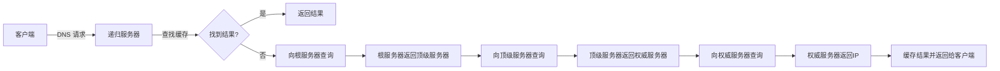

## 简介

### 定义和目的

**域名系统（Domain Name System，DNS）是一个用于将域名（如 www.example.com）转换为 IP 地址的分布式数据库。**当我们在浏览器中输入一个网站的 URL 时，DNS 系统就会被调用，将 URL 中的域名转换为对应的 IP 地址，从而使用户能够访问到正确的网站。DNS 的存在使得用户无需记住复杂的 IP 地址，只需要记住易于理解和记忆的域名就可以访问互联网，大大提升了用户的使用体验。

### 发展历程

DNS 在 1980 年代由 Paul Mockapetris 发明，以解决当时互联网上主机名和 IP 地址管理的问题。原来的主机名和 IP 地址的对应关系是存储在一个叫做 HOSTS.TXT 的文件中，随着互联网的发展，这个文件变得越来越大，难以管理。

因此，DNS 被设计出来，以提供一种可扩展的名称解析系统。DNS 提供了一种分布式的解决方案，允许主机名和IP地址的对应关系在各个服务器上进行存储和管理。

## 工作原理

当客户端发出域名解析请求时，DNS 服务器会响应这个请求，提供相应的 IP 地址。具体来说，**这个过程涉及到递归查询和迭代查询两个步骤。**

1.  用户在浏览器中输入网址。
2.  客户端（你的计算机）向 DNS 递归服务器发送请求。
3.  递归服务器首先在缓存中查找结果。
4.  如果缓存中没有结果，递归服务器会向其他 DNS 服务器查询。
5.  服务器之间进行一系列查询，最后在权威服务器上找到正确的 IP 地址。
6.  权威服务器将 IP 地址返回给递归服务器。
7.  递归服务器将 IP 地址缓存并返回给客户端。
8.  客户端通过接收到的 IP 地址访问网站。

## 域名架构

DNS 的域名架构是分层次的，每个级别的域名都由特定的实体管理。例如，.com 是顶级域，由全球的域名系统管理；example.com 是二级域，可能由一个组织或个人管理。每个层级的域名管理者负责维护其域名下的所有记录。

| 域名   | 描述                                   |
| ------ | -------------------------------------- |
| .com   | 通用顶级域名，经常用于商业网站         |
| .org   | 通用顶级域名，经常用于非营利组织       |
| .net   | 通用顶级域名，经常用于互联网服务提供商 |
| .edu   | 限制顶级域名，仅用于教育机构           |
| .gov   | 限制顶级域名，仅用于美国政府           |
| .mil   | 限制顶级域名，仅用于美国军事部门       |
| .co.uk | 英国的国家代码顶级域名                 |
| .de    | 德国的国家代码顶级域名                 |
| .ca    | 加拿大的国家代码顶级域名               |
| .cn    | 中国的国家代码顶级域名                 |

## 系统组成

DNS 系统由多种服务器和各种类型的 DNS 记录组成。

### 服务器
-   **权威服务器**：存储特定域名与其关联 IP 地址的服务器。权威服务器是 DNS 查询的最终目的地。
-   **递归服务器**：接收来自客户端的 DNS 查询，与其他服务器进行交流以解析查询。
-   **缓存服务器**：存储 DNS 查询结果，加快解析速度，减少网络延迟。
-   **根服务器**：全球仅有 13 组 IPv4 根服务器，它们知道所有顶级域的权威服务器的位置。

### 记录
DNS 记录是存储在 DNS 服务器上的数据，用于定义域名的各种属性。以下是一些常见的 DNS 记录类型：

| 记录类型     | 使用目的                                                     |
| :----------- | :----------------------------------------------------------- |
| A            | 将域名指向一个 IP 地址（外网地址）。                         |
| CNAME        | 将域名指向另一个域名，再由另一个域名提供 IP 地址（外网地址）。 |
| MX           | 设置邮箱，让邮箱能收到邮件。                                 |
| NS           | 将子域名交给其他 DNS 服务商解析。                            |
| SPF          | 将域名指向发送邮件的服务器，是一种以IP地址认证电子邮件发件人身份的技术，是非常高效的垃圾邮件解决方案。 |
| AAAA         | 将域名指向一个 IPv6 地址。                                   |
| SRV          | 用来标识某台服务器使用了某个服务，常见于微软系统的目录管理。 |
| TXT          | 对域名进行标识和说明，绝大多数的 TXT 记录是用来做 SPF 记录（反垃圾邮件）。 |
| CAA          | 授权指定 CA 机构为域名签发 SSL 证书，以防止 SSL 证书错误签发。 |
| HTTPS        | 将域名指向另一个域名指定值，再由另一个域名提供 IP 地址，就需要添加 HTTPS 记录。 |
| SVCB         | 新型服务绑定记录类型，允许服务指向多个客户端，并关联自定义参数值。 |
| 隐、显性 URL | 将一个域名指向另外一个已经存在的站点。                       |

## 安全

### 威胁

-   **欺骗和缓存污染**：攻击者可能会伪造 DNS 响应，导致用户被重定向到恶意网站。如果递归服务器收到一个伪造的 DNS 响应并将其缓存，就会导致缓存污染，影响到所有使用这个递归服务器的用户。
-   **针对基础设施的 DDoS 攻击**：通过发送大量的查询请求，可以使 DNS 服务器瘫痪，影响用户访问互联网的能力。

### 措施
-   **DNSSEC（域名系统安全扩展）**：这是一种通过在 DNS 查询结果中添加数字签名的技术，可以保证 DNS 查询结果的真实性和完整性，防止 DNS 欺骗和缓存污染。
-   **过滤和黑名单**：通过设置过滤规则和黑名单，可以阻止恶意网站的 DNS 查询，保护用户免受恶意网站的攻击。

## 管理

配置和管理 DNS 服务器也是一个重要的工作。有很多种类型的 DNS 服务器软件可以选择，例如 BIND、Microsoft DNS、PowerDNS 等。不同的软件有不同的特点和优点，需要根据实际需要来选择。DNS 服务器可以通过命令行界面或基于 Web 的界面进行管理。命令行界面更灵活，但需要一定的技术知识；基于 Web 的界面更易于使用，但可能没有命令行界面那么强大。

在管理 DNS 服务器时，保护服务器安全是非常重要的。定期更新软件，严格限制访问权限，可以有效地防止攻击。特别是在面对 DDoS 攻击时，限制查询的频率和数量是一种有效的防御手段。此外，实时监控 DNS 服务器的状态，可以及时发现和解决问题。使用一些专门的监控和故障排除工具，可以大大提高工作效率。

## 扩展

-   **DoH（DNS over HTTPS）和DoT（DNS over TLS）**：这两种新技术可以实现 DNS 查询的加密传输，从而提高用户的隐私保护。DoH 和 DoT 都可以防止 DNS 查询被窃听或篡改，保护用户的互联网使用安全。
-   **国际化域名（IDNs）**：国际化域名是一种新的域名类型，允许使用非拉丁字符的域名，如中文、阿拉伯文等。这大大扩展了域名的使用范围，使得更多的人可以方便地使用互联网。
-   **基于 DNS 的服务发现（DNS-SD）**：DNS-SD 是一种使用 DNS 协议在网络上自动发现可用服务的技术。例如，打印机、文件共享、网络摄像头等设备和服务，可以通过 DNS-SD 自动地在网络上宣告其存在，用户可以方便地发现和使用这些服务。

## 结论

**DNS 是互联网的基础设施之一，它将用户可以理解和记忆的域名转换为计算机可以理解的 IP 地址。**这个过程涉及到多个不同类型的服务器和记录，每一个部分都在整个解析过程中扮演着重要的角色。在 DNS 查询过程中，客户端发出请求，递归服务器处理这个请求，并从权威服务器获取响应，然后将响应返回给客户端。为了提高效率，这些查询结果会被缓存在各个层级的服务器上。

尽管 DNS 已经有了几十年的历史，但它仍在不断发展和创新。新的技术如 DoH 和 DoT，使得 DNS 查询可以在加密的通道中传输，提高了用户的隐私保护。国际化域名则使得更多的人可以方便地使用互联网。同时，DNS 也面临着一些挑战，如安全威胁、管理复杂性等，这需要我们不断地学习和改进，以保护互联网的安全和稳定。

