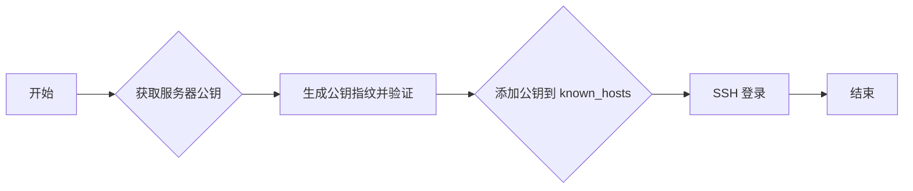

## 入门

### 下载和安装

在大多数基于 Linux 的操作系统中，OpenSSH 都已经预安装。如果没有可以使用系统的包管理器进行安装。

```shell
# 在 Ubuntu 或 Debian 上
sudo apt-get update
sudo apt-get install openssh-server

# 在 CentOS 或 Fedora 上
sudo yum install openssh-server
sudo dnf install openssh-server
```

- **MacOS 系统**：在 MacOS 上，OpenSSH 已经预安装。
- **Windows 系统**：在 Windows 10 上，你可以阅读官方文档《[安装 OpenSSH](https://learn.microsoft.com/zh-cn/windows-server/administration/openssh/openssh_install_firstuse#install-openssh-using-windows-settings)》

### 安装验证

如果 OpenSSH 已经成功安装，这个命令将输出你安装的 OpenSSH 版本。

```shell
$ ssh -V
OpenSSH_8.4p1 Debian-5+deb11u1, OpenSSL 1.1.1n  15 Mar 2022
```

## 配置

### 配置文件

OpenSSH 的配置文件在 `/etc/ssh` 目录中，以下是该目录中的部分重要文件及其功能的简述：

- **moduli**：该文件包含了用于 Diffie-Hellman 密钥交换的大素数群，它们用于在客户端和服务器之间安全地协商出一个共享的对称密钥。
- **ssh_config**：这是 SSH 客户端的全局配置文件，定义了默认的 SSH 客户端行为。每个用户可以在他们的 `~/.ssh/config` 文件中覆盖这些默认设置。
- **ssh_config.d**：这个目录包含了 ssh_config 文件的碎片，这些碎片在加载 ssh_config 时一起被读取，使得配置管理更加模块化。
- **sshd_config**：这是 SSH 服务器的全局配置文件，定义了 SSH 服务器的行为。可以在这个文件中进行多项设置，如允许的身份验证方法，是否允许 root 登录，使用的端口号等。
- **sshd_config.d**：类似于 ssh_config.d，这个目录包含了 sshd_config 文件的碎片，这些碎片在加载 sshd_config 时一起被读取。
- **ssh_host_ecdsa_key 和 ssh_host_ecdsa_key.pub**：这是服务器的 ECDSA 密钥对。私钥 `ssh_host_ecdsa_key` 代表服务器的身份证明，不应该被公开，而公钥 `ssh_host_ecdsa_key.pub` 在客户端首次连接时发送给客户端，客户端将其存储为已知的主机密钥。
- **ssh_host_ed25519_key 和 ssh_host_ed25519_key.pub**：这是服务器的 Ed25519 密钥对，其作用与 ECDSA 密钥对相似。
- **ssh_host_rsa_key 和 ssh_host_rsa_key.pub**：这是服务器的 RSA 密钥对，其作用与 ECDSA 密钥对相似。
- **ssh_import_id**：该文件用于导入其他系统中的公钥，例如，可以从 GitHub 中导入公钥。

### 常用配置

OpenSSH 的配置文件中有许多可用的选项，你可以根据自己的需要进行设置。以下是一些常用配置的详细介绍：

| 配置项                   | 描述                                                         | 示例                                                 |
| ------------------------ | ------------------------------------------------------------ | ---------------------------------------------------- |
| Port                     | 定义 OpenSSH 服务器监听的端口，通常为 22                     | `Port 2222`                                          |
| PermitRootLogin          | 控制是否允许 root 用户通过 SSH 登录                          | `PermitRootLogin no`                                 |
| PubkeyAuthentication     | 控制是否允许使用公钥认证                                     | `PubkeyAuthentication yes`                           |
| PasswordAuthentication   | 控制是否允许使用密码认证，如果已使用公钥认证，可以关闭此项增加安全性 | `PasswordAuthentication no`                          |
| AllowUsers / AllowGroups | 定义允许 SSH 登录的用户或用户组                              | `AllowUsers user1 user2` `AllowGroups group1 group2` |
| DenyUsers / DenyGroups   | 定义禁止 SSH 登录的用户或用户组，如果用户同时出现在 Allow 和 Deny 列表中，Deny 优先 | `DenyUsers user3 user4` `DenyGroups group3 group4`   |
| AuthorizedKeysFile       | 定义存储用户公钥的文件路径，用于公钥认证                     | `AuthorizedKeysFile .ssh/authorized_keys`            |

每次修改了配置文件后，你都需要手动**重启 SSH 服务来使更改生效。**

```shell
sudo systemctl restart ssh
```

### 生成 SSH 密钥

使用 `ssh-keygen` 命令可以来生成 SSH 密钥对：

```shell
$ ssh-keygen -t rsa -b 4096
Generating public/private rsa key pair.
Enter file in which to save the key (/home/sevenwate/.ssh/id_rsa):
Enter passphrase (empty for no passphrase):
Enter same passphrase again:
Your identification has been saved in /home/sevenwate/.ssh/id_rsa
Your public key has been saved in /home/sevenwate/.ssh/id_rsa.pub
The key fingerprint is:
SHA256:pgYyQB1Xcw4eZPtY/7ejynt9u5svQWkiRksKfi4diIo sevenwate@ubuntu
The key's randomart image is:
+---[RSA 4096]----+
| .....oB .       |
|.  .. + B o      |
|.    o = * .   . |
| .  . o B = . +  |
| .o..  =S+ o +   |
|E .o ..oo   . .  |
|      o.     ..o |
|     .    .  .oo+|
|           ++..BO|
+----[SHA256]-----+
```

这个命令会在 `~/.ssh/` 目录下生成两个文件：`id_rsa`（私钥）和 `id_rsa.pub`（公钥）。你可以将公钥添加到远程服务器的 `~/.ssh/authorized_keys` 文件中，然后就可以使用密钥对进行认证了。

### 防火墙配置

如果服务器启用了防火墙，需要服务器开放 SSH 端口（默认为 22）才能接受 SSH 连接。在使用 `iptables` 的系统中，可以使用以下命令：

```shell
sudo iptables -A INPUT -p tcp --dport 22 -j ACCEPT
```

## 工具

### ssh

`ssh` 是用于远程登录或者在远程主机上执行命令。

```shell
# 远程登录
$ ssh [options] [user@]hostname
# 在远程主机上执行命令
$ ssh [options] [user@]hostname [command]
```

| 选项                       | 描述                                                         |
| :------------------------- | :----------------------------------------------------------- |
| `-p <port>`                | 指定连接服务器的端口，如果 SSH 服务器没有使用默认端口 22     |
| `-i <identity_file>`       | 指定用于连接服务器的私钥文件                                 |
| `-l <user>`                | 指定登录远程主机的用户名                                     |
| `-X`                       | 启用 X11 转发，这样可以在远程主机上运行图形程序              |
| `-N`                       | 不执行远程命令，这通常与 `-L`, `-D`, `-w` 等选项一起使用     |
| `-f`                       | 后台运行 SSH                                                 |
| `-q`                       | 安静模式，不显示连接、认证的相关信息                         |
| `-v`, `-vv`, `-vvv`        | 调试模式，输出详细的调试信息                                 |
| `-L <port:host:hostport>`  | 设置本地端口转发，把本地的某个端口的流量转发到远程的某个端口 |
| `-R <port:host:hostport>`  | 设置远程端口转发，把远程的某个端口的流量转发到本地的某个端口 |
| `-D <[bind_address:]port>` | 设置动态端口转发，创建 SOCKS 代理                            |

### scp

`scp`是用于在本地主机和远程主机之间，或者两个远程主机之间复制文件的命令行工具。

```shell
# 从本地复制文件到远程主机
$ scp [options] source_file user@remote:/path/to/destination
# 从远程主机复制文件到本地
$ scp [options] user@remote:/path/to/source /path/to/local/destination
```

| 选项                 | 描述                                                         |
| :------------------- | :----------------------------------------------------------- |
| `-P <port>`          | 通过指定端口连接到远程主机                                   |
| `-p`                 | 保留原文件的修改时间和访问时间                               |
| `-r`                 | 递归复制，用于目录的复制                                     |
| `-v`                 | 详细模式，显示出处理过程                                     |
| `-q`                 | 安静模式，不显示复制过程                                     |
| `-c <cipher>`        | 指定加密算法，如 aes128-ctr, aes192-ctr, aes256-ctr, arcfour256, arcfour128, etc. |
| `-i <identity_file>` | 选择私钥文件，用于密钥认证                                   |

### sftp

`sftp` 是一个用于安全地传输文件的网络协议。可以使用 `sftp` 命令在你的计算机和远程服务器之间传输文件，就像使用 FTP 一样。

```shell
# 连接到远程服务器
$ sftp [user@]hostname
```

| 选项                | 描述                                                     |
| :------------------ | :------------------------------------------------------- |
| `-b <batchfile>`    | 指定一个批处理文件执行一系列的 sftp 命令                 |
| `-C`                | 启用压缩功能                                             |
| `-l <limit>`        | 限制使用的带宽，单位是 Kbit/s                            |
| `-o ssh_option`     | 可以指定任何 ssh 命令接受的选项                          |
| `-P <port>`         | 指定连接服务器的端口，如果 SSH 服务器没有使用默认端口 22 |
| `-R <num_requests>` | 指定并行请求的最大数量                                   |
| `-s subsystem`      | 指定要在远程主机上启动的 sftp 子系统                     |
| `-v`                | 显示详细的调试信息                                       |

在 `sftp` 命令行界面，可以使用一系列的命令来操作文件，比如 `ls`、`cd`、`get`、`put` 等。请注意，虽然这些命令和 Unix shell 中的命令相似，但它们实际上是 `sftp` 命令的一部分，可能会有一些差异。

| 命令            | 示例                                    | 描述                           |
| --------------- | --------------------------------------- | ------------------------------ |
| `ls`            | `sftp> ls`                              | 列出远程目录的文件             |
| `cd`            | `sftp> cd /path/to/remote/directory`    | 更改远程目录                   |
| `lcd`           | `sftp> lcd /path/to/local/directory`    | 更改本地目录                   |
| `pwd`           | `sftp> pwd`                             | 显示当前远程目录               |
| `get`           | `sftp> get remoteFile`                  | 下载单个文件                   |
| `mget`          | `sftp> mget remoteFile1 remoteFile2`    | 下载多个文件                   |
| `put`           | `sftp> put localFile`                   | 上传单个文件                   |
| `mput`          | `sftp> mput localFile1 localFile2`      | 上传多个文件                   |
| `mkdir`         | `sftp> mkdir /path/to/remote/directory` | 在远程服务器上创建目录         |
| `rmdir`         | `sftp> rmdir /path/to/remote/directory` | 在远程服务器上删除目录         |
| `rename`        | `sftp> rename oldname newname`          | 在远程服务器上重命名文件或目录 |
| `rm`            | `sftp> rm /path/to/remote/file`         | 在远程服务器上删除文件         |
| `bye` 、 `exit` | `sftp> bye` 、 `sftp> exit`             | 退出 `sftp` 会话               |
| `help`          | `sftp> help`                            | 显示帮助信息                   |

### ssh-keygen

`ssh-keygen` 是一个用于创建、管理和转换认证密钥的工具，ssh-keygen 是 OpenSSH 套件中的一个重要组成部分。

```shell
# 不带任何参数运行 ssh-keygen 会创建一个新的 RSA 密钥对
$ ssh-keygen
# 或者你可以明确指定生成密钥的类型和密钥长度
$ ssh-keygen -t <type> -b <bits>
```

| 选项                  | 描述                                                         |
| :-------------------- | :----------------------------------------------------------- |
| `-t <type>`           | 生成指定类型的密钥，比如 rsa、dsa、ecdsa、ed25519 等         |
| `-b <bits>`           | 指定密钥长度，对于 RSA 密钥，建议至少使用 2048 位            |
| `-f <filename>`       | 指定生成的私钥文件的名称和位置                               |
| `-C <comment>`        | 为密钥添加注释，这对于区分密钥非常有帮助                     |
| `-N <new_passphrase>` | 为生成的私钥设置一个新的密码                                 |
| `-P <old_passphrase>` | 提供现有私钥的密码，用于更改私钥的密码或者生成无密码私钥     |
| `-y`                  | 输出私钥文件对应的公钥                                       |
| `-q`                  | 安静模式，不输出多余信息                                     |
| `-p`                  | 更改现有私钥的密码                                           |
| `-l -f <filename>`    | 显示指定公钥文件的 fingerprint                               |
| `-e -f <filename>`    | 以 RFC4716 SSH 公钥文件格式或者 PEM 公钥文件格式输出公钥     |
| `-i -f <filename>`    | 读取未知类型的 SSH2 或者 PEM 公钥文件，转换为 SSH2 公钥文件格式 |

*注意，如果你想要创建一个没有密码的私钥，你可以在 `-N` 选项后面留空，或者在运行 `ssh-keygen` 命令时直接按 Enter 跳过输入密码的步骤。*

### ssh-agent

`ssh-agent` 是一个帮助管理 SSH 私钥的程序，用于保存所有私钥，并在需要进行 SSH 认证时提供这些私钥。`ssh-agent` 通过在后台运行并维护一个已解锁的私钥列表，可以让你在使用 SSH 客户端进行多个 SSH 连接或操作时避免频繁输入密码。

```
# 在后台启动 `ssh-agent`
$ ssh-agent
# 在新的 shell 中启动 `ssh-agent`
$ ssh-agent bash
# 杀死当前运行的 `ssh-agent` 进程
$ ssh-agent -k
```

### ssh-add

`ssh-add` 可以把你的私钥添加到 `ssh-agent` 的密钥列表中，这样你就可以避免频繁输入密码。一旦你的私钥被添加到 `ssh-agent` 中，你在使用 SSH 客户端进行认证时就可以直接从 `ssh-agent` 中获取私钥，无需再手动输入。

```shell
# 尝试添加默认的私钥
$ ssh-add
# 添加指定的私钥文件
$ ssh-add [options] [file ...]
```

| 选项         | 描述                                                  |
| ------------ | ----------------------------------------------------- |
| `-l`         | 列出 `ssh-agent` 中所有已加载的私钥                   |
| `-L`        | 列出 `ssh-agent` 中所有已加载的私钥，同时输出公钥部分 |
| `-d <file>` | 从 `ssh-agent` 中删除指定的私钥                       |
| `-D`        | 删除 `ssh-agent` 中的所有私钥                         |
| `-t <life>`  | 为添加的私钥设置生存期，单位是秒                      |
| `-x`        | 锁定 `ssh-agent`，需要密码才能解锁                    |
| `-X`        | 解锁 `ssh-agent`                                      |

### ssh-keyscan

`ssh-keyscan` 是一个方便的工具，它允许用户获取和管理公开的 SSH 密钥。当需要扫描和收集远程服务器的 SSH 公钥以用于以后的身份验证时，`ssh-keyscan` 是一个非常有用的工具。

```shell
ssh-keyscan [options] host [host2] [host3]...
```

| 选项           | 描述                                                         |
| :------------- | :----------------------------------------------------------- |
| `-t <type>`    | 指定要获取的密钥类型，如 `rsa`、`dsa`、`ecdsa`、`ed25519` 等 |
| `-p <port>`    | 指定连接服务器的端口，如果 SSH 服务器没有使用默认端口 22     |
| `-T <timeout>` | 设置连接超时时间，单位是秒                                   |
| `-v`           | 显示详细输出，有助于调试                                     |
| `-H`           | 将结果中的主机名哈希化，这可以防止主机名被保存在已知主机文件中 |
| `-o <file>`    | 将输出写入到指定的文件中                                     |

### ssh-copy-id

`ssh-copy-id` 是一个非常有用的命令，它可以把你的 SSH 公钥复制到远程服务器，以便实现无密码登录。这个命令会自动处理公钥的安装和权限设置。

```shell
ssh-copy-id [options] [user@]hostname
```

| 选项                 | 描述                                                         |
| :------------------- | :----------------------------------------------------------- |
| `-i <identity_file>` | 指定要复制的身份文件，如果你不使用默认的 `~/.ssh/id_rsa.pub` |
| `-p <port>`          | 指定连接服务器的端口，如果 SSH 服务器没有使用默认端口 22     |
| `-f`                 | 强制复制，即使远程主机上已经存在相同的公钥                   |
| `-n`                 | 不实际复制公钥，而是只检查和显示远程主机上的公钥             |
| `-h`                 | 显示帮助信息                                                 |

## 使用



### 1. 获取服务器公钥

你可以在连接前预先使用 `ssh-keyscan` 命令来获取服务器的公钥：

```shell
ssh-keyscan hostname >> hostname.pub
```

这将把服务器的公钥保存在 `hostname.pub` 文件中。**记住，这个步骤是可选的**，如果你选择直接 SSH 连接到服务器，SSH 客户端将会在初次连接时自动获取服务器的公钥。

### 2. 生成公钥指纹

使用 `ssh-keygen` 命令生成公钥的指纹：

```shell
ssh-keygen -lf hostname.pub
```

这将输出公钥的指纹，你需要通过一个安全的渠道（例如，通过 HTTPS 的网站或者电话等）获取服务器管理员提供的公钥指纹，然后手动**比对这两个指纹是否一致**。如果两者一致，你可以确认你将要连接的是正确的服务器。否则，**可能存在中间人攻击的风险。**

### 3. 添加公钥到 known_hosts

一旦验证了服务器的公钥指纹，你可以把公钥添加到 `~/.ssh/known_hosts` 文件中，这样在下次连接时，SSH 客户端就可以自动验证服务器的公钥了。

```shell
ssh-keyscan hostname >> ~/.ssh/known_hosts
```

### 4. SSH 登录

在公钥验证成功后，你可以通过 SSH 命令进行登录：

```shell
ssh username@example.com
```

在登录过程中，你可能需要输入用户的密码，或者如果你已经设置了 SSH 密钥对，那么可能需要输入私钥的密码。

请注意，所有这些步骤都是为了**确保你在 SSH 连接中的安全**，通过预先验证服务器的公钥，**可以有效防止中间人攻击。**然而，这并不能替代其他的安全措施，如使用强密码、定期更新密码、使用防火墙和 IDS 等。
