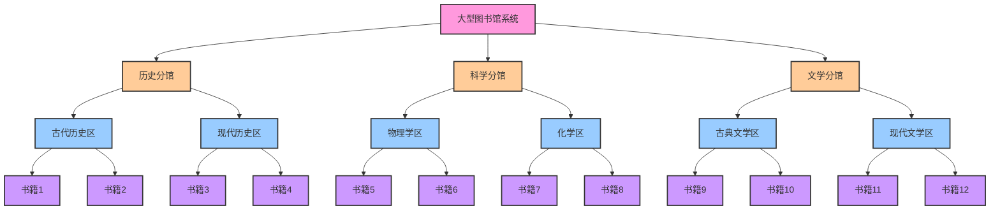
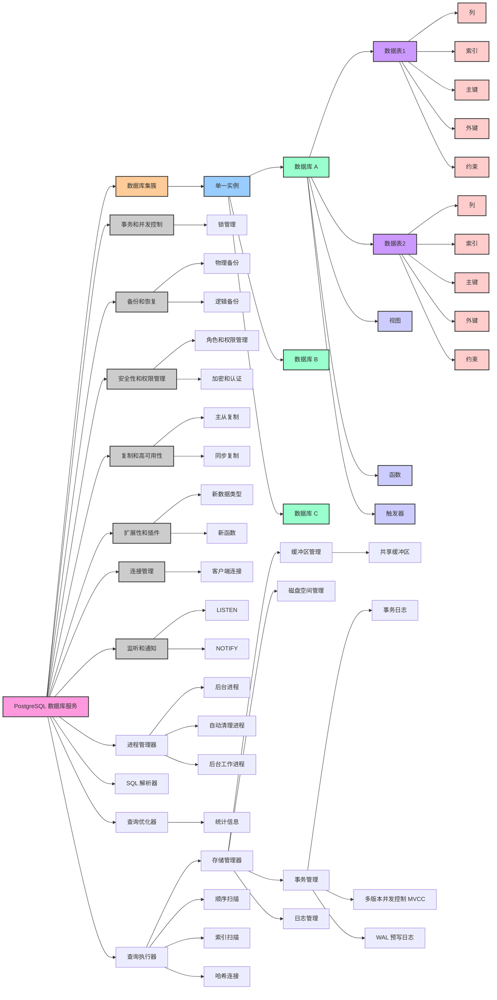
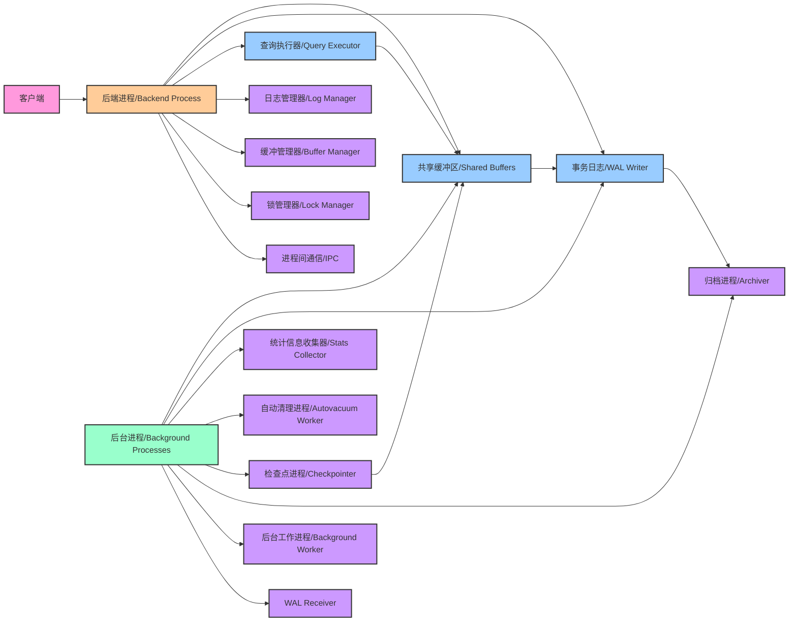
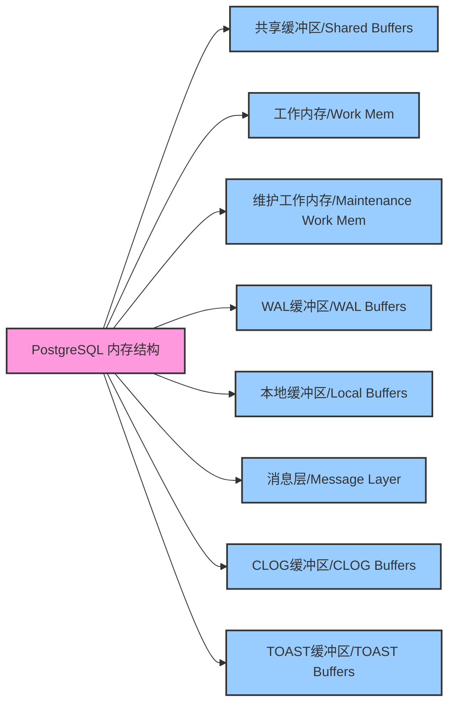
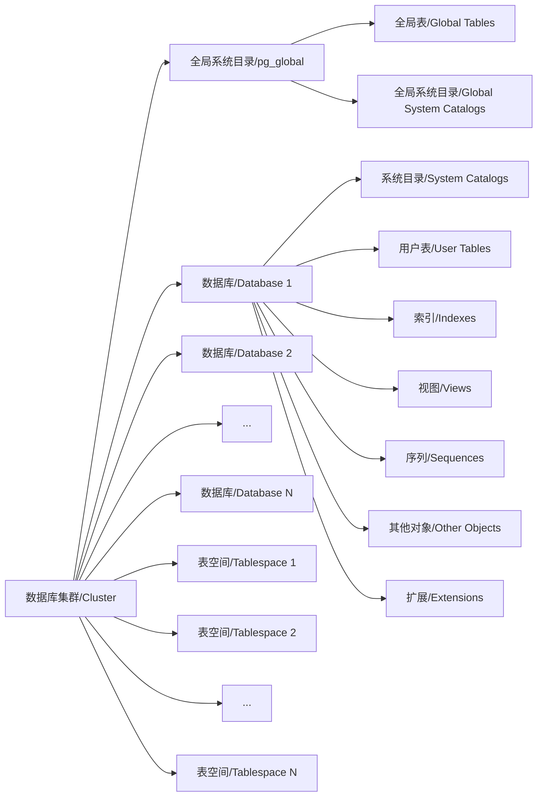
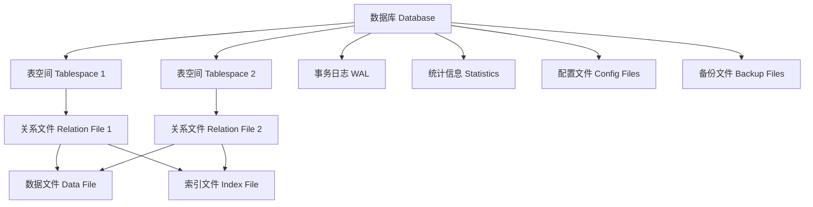
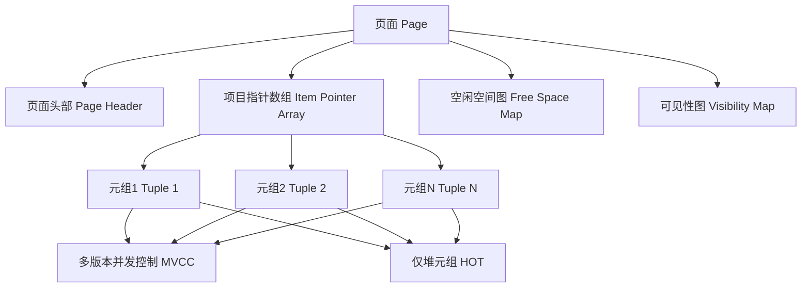
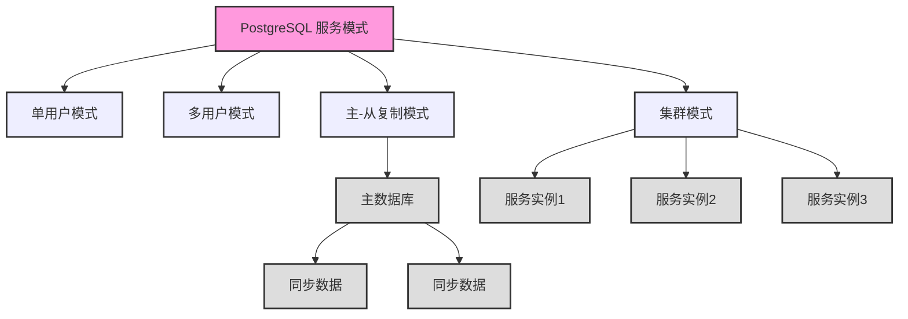

## 引言

**PostgreSQL 数据库服务可以被想象成一个大型的图书馆系统，它拥有一套完整的工具和服务来管理和查询存储在其中的数据，就像图书馆中的书籍。**这个系统不仅保证了数据的安全和完整性，还提供了高效的数据访问方式，就如同图书馆的管理员能够妥善管理所有的书籍和资料。

**在这个图书馆中，我们可以找到多个分馆，这就是所谓的数据库集簇。**每个数据库集簇就像一个分馆，拥有自己的一套书籍和资源，但都受到同一套图书馆系统的管理和维护。在 PostgreSQL 的架构中，一个数据库集簇是由多个数据库组成的，它们共享同一套 PostgreSQL 服务实例和系统资源，形成一个协调一致的系统。

**每个分馆可以被视为一个单一的实例，它是一个独立运行的 PostgreSQL 服务，管理着一个数据库集簇。**这个实例就像一个独立的图书馆分馆，拥有自己的资源和管理系统，可以为用户提供多样化的服务和资源。

**分馆中的各个专题区域，就是数据库。**在 PostgreSQL 中，一个数据库就像一个专门的区域，它聚焦于一个特定的主题或应用，存储着一系列相关的数据表和信息。就如同图书馆中有历史、科学或文学等不同的主题区域，每个区域都提供了丰富和多元的资源，满足不同用户的需求和探索。

通过这样的架构和组织方式，PostgreSQL 成为了一个高度灵活、安全和高效的数据库管理系统，能够满足现代数据管理的多样化需求。

## 组成

### 执行文件

| 文件名              | 描述                                                         |
| ------------------- | ------------------------------------------------------------ |
| `clusterdb`         | 用于重新集群数据库表的工具。                                 |
| `createdb`          | 用于创建新数据库的工具。                                     |
| `createuser`        | 用于创建新数据库用户的工具。                                 |
| `dropdb`            | 用于删除数据库的工具。                                       |
| `dropuser`          | 用于删除数据库用户的工具。                                   |
| `initdb`            | 用于初始化新数据库群集的工具。                               |
| `oid2name`          | 用于将 OID（对象标识符）转换为名称的工具。                   |
| `pg_amcheck`        | 用于验证索引的完整性和一致性的工具。                         |
| `pg_archivecleanup` | 用于清理归档日志文件的工具，通常与归档日志一起使用。         |
| `pg_basebackup`     | 用于创建 PostgreSQL 数据库的基本备份的工具。                 |
| `pgbench`           | 用于进行性能基准测试的工具。                                 |
| `pg_checksums`      | 用于管理 PostgreSQL 数据目录中的页校验和设置。               |
| `pg_config`         | 用于检索 PostgreSQL 安装的配置信息的工具。                   |
| `pg_controldata`    | 用于检索 PostgreSQL 数据目录中的控制信息的工具。             |
| `pg_ctl`            | 用于启动、停止和管理 PostgreSQL 服务器的工具。               |
| `pg_dump`           | 用于将 PostgreSQL 数据库导出为 SQL 脚本文件的工具。          |
| `pg_dumpall`        | 用于导出所有 PostgreSQL 数据库的工具。                       |
| `pg_isready`        | 用于检查 PostgreSQL 服务器是否准备好接受连接的工具。         |
| `pg_receivewal`     | 用于接收和保存流复制的 WAL（Write-Ahead Logging）数据的工具。 |
| `pg_recvlogical`    | 用于接收和保存逻辑复制的数据的工具。                         |
| `pg_resetwal`       | 用于重置 PostgreSQL 的 WAL 日志文件的工具。                  |
| `pg_restore`        | 用于从 SQL 脚本文件或自定义归档中恢复 PostgreSQL 数据库的工具。 |
| `pg_rewind`         | 用于将一个 PostgreSQL 数据库群集回滚到以前的状态的工具。     |
| `pg_test_fsync`     | 用于测试文件同步性能的工具。                                 |
| `pg_test_timing`    | 用于测试系统定时性能的工具。                                 |
| `pg_upgrade`        | 用于升级 PostgreSQL 数据库群集的工具。                       |
| `pg_verifybackup`   | 用于验证 PostgreSQL 备份的完整性的工具。                     |
| `pg_waldump`        | 用于解析和显示 WAL（Write-Ahead Logging）文件内容的工具。    |
| `postgres`          | PostgreSQL 服务器主进程的可执行文件。                        |
| `postmaster`        | 符号链接，指向 PostgreSQL 服务器主进程的可执行文件。         |
| `psql`              | 用于与 PostgreSQL 数据库进行交互的命令行客户端工具。         |
| `reindexdb`         | 用于重新创建索引的工具。                                     |
| `vacuumdb`          | 用于执行 VACUUM 操作以清理和优化 PostgreSQL 数据库的工具。   |
| `vacuumlo`          | 用于管理 PostgreSQL 大对象的工具。                           |

### 数据目录

| 文件/目录名称         | 作用                                                         |
| --------------------- | ------------------------------------------------------------ |
| base                  | 存储用户创建的数据库和表的数据文件                           |
| global                | 存储系统范围的共享表格定义和数据                             |
| pg_commit_ts          | 用于跟踪提交的事务时间戳                                     |
| pg_dynshmem           | 动态共享内存目录，用于在运行时分配共享内存段                 |
| pg_hba.conf           | 客户端身份验证规则配置文件，用于控制客户端连接的权限         |
| pg_ident.conf         | 用于标识客户端连接的规则配置文件                             |
| pg_logical            | 用于逻辑复制的相关文件和状态信息                             |
| pg_multixact          | 存储多事务共享锁的信息                                       |
| pg_notify             | 用于实现`NOTIFY`和`LISTEN`功能的通知目录                     |
| pg_replslot           | 存储逻辑复制插槽信息的目录                                   |
| pg_serial             | 存储序列的数据文件                                           |
| pg_snapshots          | 存储快照信息                                                 |
| pg_stat               | 包含统计信息的目录，用于监视数据库性能                       |
| pg_stat_tmp           | 存储临时统计信息的目录                                       |
| pg_subtrans           | 存储子事务信息                                               |
| pg_tblspc             | 存储表空间符号链接的目录，每个数据库都有一个符号链接         |
| pg_twophase           | 存储两阶段提交事务信息的目录                                 |
| PG_VERSION            | 数据库簇的版本信息文件                                       |
| pg_wal                | 存储 Write-Ahead Logging (WAL) 文件，用于事务恢复和复制      |
| pg_xact               | 存储事务状态文件                                             |
| postgresql.auto.conf  | 自动生成的配置文件，包含了数据库的自动化配置信息             |
| postgresql.conf       | 数据库的主要配置文件，包含了许多配置选项                     |
| **[postmaster.opts]** | **包含启动 PostgreSQL 时使用的最后一组选项。**               |
| **[postmaster.pid]**  | **包含运行的 PostgreSQL 主进程的 PID（进程 ID）和其他控制信息，用于防止多个服务器实例在同一数据目录上同时运行。** |

## 设计架构

### 架构图

### 进程结构

- **客户端**: 这是用户与 PostgreSQL 数据库交互的入口点。客户端可以是任何支持 PostgreSQL 的应用程序或工具，如 psql、PgAdmin 等。
- **后端进程/Backend Process**: 当客户端发起连接请求时，PostgreSQL 会为每个连接创建一个后端进程。这个进程负责处理客户端的所有请求，包括查询执行、事务管理等。
- **共享缓冲区/Shared Buffers**: 这是 PostgreSQL 的内存缓存，用于存储表数据、索引、系统目录等。后端进程和后台进程都可以访问这个缓冲区。
- **事务日志/WAL Writer**: WAL (Write-Ahead Logging) 是 PostgreSQL 的一种持久化机制。在数据被写入磁盘之前，所有的修改都会先被记录在 WAL 中。这确保了在系统崩溃的情况下数据的完整性和持久性。
- **查询执行器/Query Executor**: 负责解析、优化和执行 SQL 查询。
- **后台进程/Background Processes**: 这是一组进程，负责各种后台任务，如清理、统计信息收集、日志归档等。
- **统计信息收集器/Stats Collector**: 收集数据库的使用统计信息，如查询执行次数、表的访问频率等。
- **自动清理进程/Autovacuum Worker**: 负责清理旧的数据和空间回收。
- **检查点进程/Checkpointer**: 定期将共享缓冲区中的数据写入磁盘，并创建检查点。
- **归档进程/Archiver**: 负责将 WAL 日志文件归档到一个指定的位置，以便于备份和恢复。
- **后台工作进程/Background Worker**: 可以执行各种自定义的后台任务。
- **日志管理器/Log Manager , 缓冲管理器/Buffer Manager , 锁管理器/Lock Manager , 进程间通信/IPC**: 这些都是 PostgreSQL 内部的核心组件，负责日志记录、缓冲管理、锁定资源和进程间的通信。
- **WAL Receiver**: 在复制环境中，WAL Receiver 负责从主服务器接收 WAL 记录。

### 内存结构

- **PostgreSQL 内存结构**: 这是 PostgreSQL 数据库的总体内存结构，它包含了多个专门的缓冲区和内存区域，用于不同的任务和操作。
- **共享缓冲区/Shared Buffers**: 这是 PostgreSQL 的主要缓存区，用于存储表数据、索引和系统目录。它是所有后端进程和后台进程共享的，用于减少磁盘 I/O。
- **工作内存/Work Mem**: 用于存储排序和哈希操作的中间结果。每个后端进程都有自己的工作内存。
- **维护工作内存/Maintenance Work Mem**: 用于存储维护任务（如 VACUUM、CREATE INDEX）的中间结果。这通常比普通的工作内存大。
- **WAL缓冲区/WAL Buffers**: 用于存储即将写入 WAL（Write-Ahead Logging）的日志记录。这确保了在数据被写入磁盘之前，所有的修改都会先被记录在 WAL 中。
- **本地缓冲区/Local Buffers**: 用于存储临时表的数据。与共享缓冲区不同，本地缓冲区是每个后端进程私有的。
- **消息层/Message Layer**: 负责处理后端进程之间的消息传递，如锁通知和进程间通信。
- **CLOG缓冲区/CLOG Buffers**: CLOG (Commit Log) 用于存储事务的提交状态。每个事务都有一个对应的 CLOG 记录，指示它是已提交、未提交还是中止。
- **TOAST缓冲区/TOAST Buffers**: TOAST (The Oversized-Attribute Storage Technique) 是 PostgreSQL 用于存储大型数据的机制。当一个数据项太大而不能直接存储在常规的数据页中时，它会被“toast”到一个特殊的 TOAST 表中，并在原表中保留一个指针。TOAST 缓冲区用于缓存这些大型数据项。

### 逻辑存储结构

### 物理存储结构

### 堆表文件内部结构

## 服务模式

### 单用户模式

在单用户模式下，PostgreSQL 服务只允许一个用户（或一个应用）同时访问和操作数据库。这就像一个图书馆在特定时间只对一名读者开放，以便他/她可以独自浏览和使用图书馆的所有资源，而不会受到其他人的干扰。这种模式**通常用于数据库维护和故障排除。**在这种模式下，由于没有并发访问，管理员可以更容易地进行数据库的维护工作，如备份、恢复、重建索引等。

### 多用户模式

**多用户模式是 PostgreSQL 的常规运行模式**，它允许多个用户（或多个应用）同时访问和操作数据库。这就像一个图书馆在正常营业时间对所有读者开放，每个人都可以自由地浏览书籍和使用资源，同时图书馆的管理员会确保所有的操作都是有序和高效的。在这种模式下，数据库服务器必须处理并发访问，确保数据的完整性和一致性，并提供事务管理功能。

### 主-从复制模式

在主-从复制模式下，有一个主数据库（主图书馆）和一个或多个从数据库（分支图书馆）。**主数据库负责处理所有的写操作（如添加新书籍），而从数据库则是主数据库的只读副本，用于处理读操作（如查询书籍）。**从数据库会定期从主数据库同步数据，以保证数据的一致性。这样可以提高系统的读取性能和可用性。此外，这种模式还为数据备份和灾难恢复提供了额外的保障，因为从数据库可以作为备份数据源。

### 集群模式

**在集群模式下，多个 PostgreSQL 服务实例协同工作，共同提供数据库服务。**这就像一个图书馆网络，其中每个图书馆都可以提供完整的服务，并通过协同工作来提供更高效和更可靠的服务。这种模式可以提高系统的性能和可用性，同时也提供了更高的数据安全性。集群中的每个实例都可以处理读写请求，而数据的分布和复制是由集群管理软件自动处理的。这种模式通常用于大型、高并发的应用场景，需要高可用性和故障切换能力。
