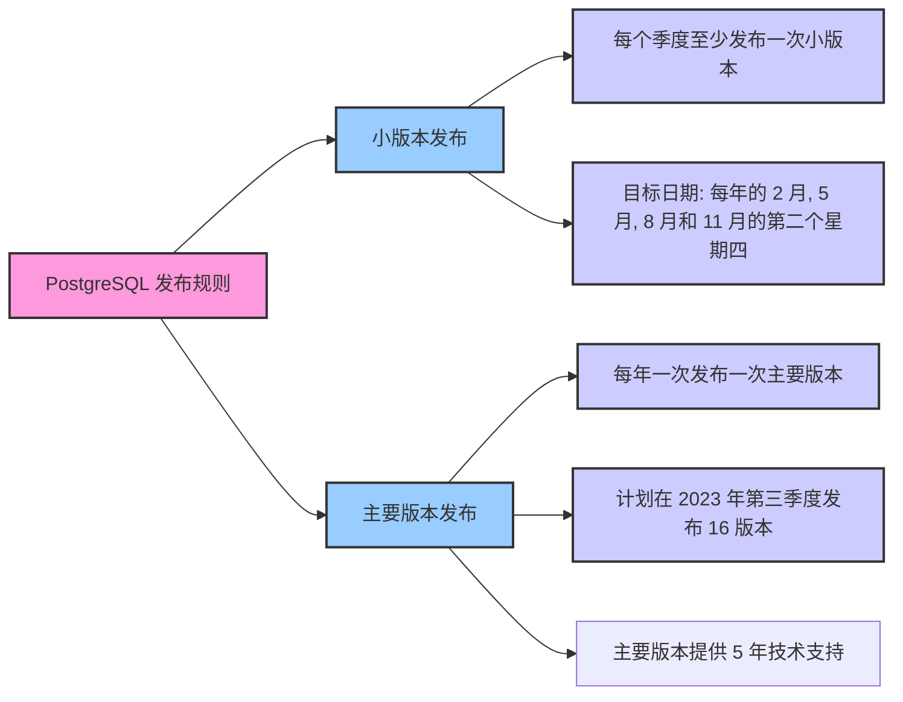

## 序言

[PostgreSQL](https://www.postgresql.org/about/)，起源于加利福尼亚大学伯克利分校的 POSTGRES 项目，始于 1986 年。该项目由计算机科学教授 Michael Stonebraker 领导，他在数据库领域的贡献也促成了其他关系数据库系统的诞生。

Michael Stonebraker 教授是 PostgreSQL 的创始人。他的愿景是设计一个既灵活又可扩展的数据库系统，能够支持多种数据模型和查询语言。与其他关系型数据库相比，PostgreSQL 的独特之处在于其开放和扩展性。它不仅支持许多标准 SQL 的特性，还允许用户自定义数据类型、操作符和函数。

## 历史

PostgreSQL 的发展历程反映了其对技术创新和社区驱动的承诺：

- **POSTGRES (1989)**：这是 PostgreSQL 的前身，其主要创新在于支持用户定义的数据类型和面向对象的特性。
- **PostgreSQL 6.x (1996)**：此时，POSTGRES 项目更名为 PostgreSQL，标志着其对 SQL 标准的更深入支持。这个版本开始，它扩展到了多种操作系统平台，并建立了一个更加活跃的开发者社区。
- **PostgreSQL 7.x (2000s)**：这个版本增强了对外部过程的支持，并引入了更加先进的查询优化器。
- **PostgreSQL 8.x (2005)**：这是 PostgreSQL 首次支持 Windows 平台的版本。它还新增了点对点复制和表空间的功能。
- **PostgreSQL 9.x (2010s)**：这个版本带来了众多创新，包括流复制、列式存储和对 JSON 数据类型的支持。
- **PostgreSQL 10.x (2017)**：这个版本开始，PostgreSQL 的版本号发生了变化，主要版本号只增加第一个数字。例如，从 9.6 直接跳到了 10。
- **PostgreSQL 11.x (2018)**：此版本进一步增强了分区表的功能，并引入了并行执行的存储过程。
- **PostgreSQL 12.x (2019)**：引入了对 SQL/JSON 路径语言的支持，提供了更好的索引和分区。
- **PostgreSQL 13.x (2020)**：增加了并行化的增量排序和聚合功能，以及对 B树索引的改进。
- **PostgreSQL 14.x (2021)**：此版本带来了对长事务的性能改进，以及对复制和分区的增强。
- **PostgreSQL 15.x (2022)**：发布于 2022 年 10 月 13 日，带来了一系列的新特性和改进。
- **PostgreSQL 16.x (2023)**：计划于 2023 年 9 月 14 日发布，目前已经发布了 RC1 版本。

与其他关系数据库相比，**PostgreSQL 一直强调其对开放性、扩展性和标准的遵循**。与 MySQL、Oracle 和 SQL Server 等数据库相比，它被视为一个功能丰富但需要一定学习投入的选择。

## 特点

作为世界上最先进的开源关系数据库，PostgreSQL 具有以下显著特点：

1. **数据类型**：支持标准及用户自定义数据类型，增强应用灵活性。
2. **扩展性**：允许添加自定义函数、数据类型和聚合函数，实现高度定制。
3. **事务性**：全面遵循 ACID 原则，确保数据完整性。
4. **并发控制**：利用 MVCC 技术，优化高并发下的读写性能。
5. **安全性**：集成 SSL、行级安全性和强大的访问控制。

尽管 PostgreSQL 有许多优势，但它也面临一些挑战：

**优势**：

1. **开源 & 免费**：功能丰富且完全免费。
2. **高度扩展性**：支持广泛的自定义功能。
3. **社区支持**：得益于活跃的全球社区。
4. **功能丰富**：支持如 JSON 存储、全文搜索等高级特性，并有众多插件。
5. **跨平台**：兼容 Linux、Windows 和 macOS。

**挑战**：

1. **性能比较**：在特定场景下，可能不及 Oracle 或 SQL Server。
2. **大型应用适应性**：大型企业应用可能需要额外优化。
3. **学习曲线**：功能丰富可能导致新手上手难度增加。

PostgreSQL 通常每年发布一次主要版本，并根据需要发布小的补丁更新。新版本的发布是基于特性完成度而不是预定的时间表，这确保了每个版本的高质量和稳定性。

## 对比

| 特点/数据库         | Oracle                      | MySQL                  | SQL Server              | PostgreSQL            |
| ------------------- | --------------------------- | ---------------------- | ----------------------- | --------------------- |
| **查询性能**        | 高，优化了 OLTP 和 OLAP     | 适中，适合 Web 应用    | 高，优化了 OLTP         | 高，特别是复杂查询    |
| **并发性能**        | 高                          | 适中到高               | 高                      | 高                    |
| **读写吞吐量**      | 高                          | 适中                   | 高                      | 高                    |
| **数据存储效率**    | 高，支持多种压缩技术        | 适中                   | 高，支持列式存储        | 高，支持列式存储      |
| **备份和恢复**      | 高，有 RMAN                 | 适中，有物理和逻辑备份 | 高，有完整的备份策略    | 高，支持 PITR         |
| **扩展性**          | 高，支持 RAC                | 适中，有集群解决方案   | 高，支持 AlwaysOn       | 高，支持分区和分片    |
| **事务处理能力**    | 高，支持多种隔离级别        | 适中，支持 MVCC        | 高                      | 高，支持 MVCC         |
| **安全性**          | 高，有完整的安全套件        | 适中                   | 高，有完整的安全策略    | 高，支持 RLS 和 TDE   |
| **可用性**          | 高，支持 Data Guard         | 适中，有复制           | 高，支持镜像和复制      | 高，支持流复制        |
| **维护和管理**      | 适中，有 Enterprise Manager | 适中，有 Workbench     | 适中，有 SSMS           | 适中，有多种工具      |
| **特性和功能**      | 高，有多种高级功能          | 适中，支持 JSON        | 高，支持 BI、ML 等      | 高，支持 JSON、GIS 等 |
| **社区和支持**      | 适中，商业支持              | 高，由 Oracle 支持     | 适中，由 Microsoft 支持 | 高，活跃的社区        |
| **成本效益**        | 高昂的许可费                | 有开源版本             | 有免费版本              | 开源免费              |
| **DB-Engines-Rank** | 1240                        | 1111                   | 902                     | 620                   |

**使用场景**：

- **PostgreSQL**：适用于需要高度可定制、高并发、复杂查询和高扩展性的应用，如大型企业应用、GIS 系统、数据仓库等。
- **Oracle**：适用于大型企业和金融机构，需要高可用性、高安全性和高性能的场景，如 ERP、CRM、银行系统等。
- **MySQL**：适用于 Web 应用、小到中型企业应用、开源项目等，需要快速部署和简单维护的场景。
- **SQL Server**：适用于 Windows 环境、需要集成 Microsoft 生态系统的应用，如 .NET 应用、BI 解决方案等。

## 文化

**PostgreSQL 拥有一个非常活跃的全球社区，由数千名开发者、用户和志愿者组成。**这个社区不仅贡献代码，还提供技术支持、文档编写和培训。

**社区坚守开放、共享和合作的原则，这些原则影响了其开发和决策过程，确保了项目的透明性和公正性。**每年，社区都会举办多次活动，如年度的 PostgreSQL 会议、地方性的聚会和线上研讨会。这些活动促进了社区成员之间的交流和合作，也为新成员提供了了解和参与社区的机会。

所有的决策，无论是关于新功能的开发、bug 修复还是其他项目管理事项，都是在邮件列表、IRC 频道或其他公开论坛上进行的。这确保了**所有的利益相关者都有机会参与和发表意见。**

**PostgreSQL 社区成功地平衡了开源精神与商业需求。**虽然 PostgreSQL 是一个开源项目，但它也与许多商业公司合作，提供商业支持和解决方案。社区也与其他数据库社区，如 MySQL 和 MariaDB，有着友好的关系，经常在技术和开发上互相学习和合作。

尽管社区非常活跃和成功，但它仍然面临一些挑战，如技术挑战、社区管理挑战等。但社区始终坚信，通过合作和创新，它们可以克服这些挑战，并继续发展。
