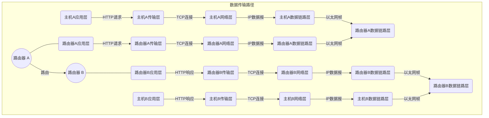

## 网络概述

互联网是一个由全球各种计算机网络相互连接而成的大型网络，可以让人们在任何时间、任何地点连接并交换信息。它是人类历史上最重要的信息革命之一，对人们的生活、工作和学习都产生了深远的影响。

互联网的发展历史可以追溯到 20 世纪 60 年代初，当时美国国防部研究项目 ARPA（高级研究计划署）为了解决军用计算机之间的信息共享问题，开发了一种名为 ARPANET 的计算机网络。在此基础上，随着互联网技术的不断发展，越来越多的计算机网络加入了互联网，并形成了现在的全球互联网。

- 20 世纪 60 年代：美国国防部高级研究计划局（ARPA）开展研究，设计出了一种分组交换网络的方案，称为ARPANET。
- 20 世纪 70 年代：ARPANET 逐渐扩展到美国各地的大学和研究机构，并且开始出现了电子邮件和文件传输等应用。
- 20 世纪 80 年代：TCP/IP 协议成为互联网的标准协议，互联网的规模进一步扩大，并且开始商业化运营。
- 20 世纪 90 年代：Web 浏览器的出现，使得互联网的应用变得更加易用和普及，互联网的用户数量开始飞速增长。
- 21 世纪以后：互联网的规模继续扩大，出现了移动互联网、云计算、大数据等新技术，互联网的应用也从简单的信息传递演变成了涵盖生活、工作、学习等方方面面的综合性平台。

互联网实现的关键在于互联网协议族（Internet Protocol Suite），通常称为 TCP/IP 协议。TCP/IP 协议提供了一种标准化的方法来在不同的计算机之间进行通信。它由两个协议组成：

- 传输控制协议（TCP）：负责将数据包分解成若干个小数据包，并在接收端重新组装。
- 互联网协议（IP）：负责将数据包从一个网络传输到另一个网络。

在互联网中，每个设备都被分配了一个唯一的IP地址，用于标识该设备在网络中的位置。当设备发送数据包时，它会将数据包传送到本地网络上的路由器，然后路由器会根据IP地址将数据包传送到目标设备所在的网络上的路由器，直到数据包到达目标设备。

## 网络基础

### 网络协议

| OSI模型层级             | 功能                                           | 协议/设备             |
| :---------------------- | ---------------------------------------------- | --------------------- |
| 应用层（Application）   | 提供高级服务，例如文件传输、电子邮件和虚拟终端 | HTTP、SMTP、FTP、SSH  |
| 表示层（Presentation）  | 将数据转换为网络标准格式                       | SSL/TLS、JPEG、ASCII  |
| 会话层（Session）       | 管理连接、交换数据                             | NetBIOS、RPC、SSH     |
| 传输层（Transport）     | 提供端到端的可靠数据传输                       | TCP、UDP              |
| 网络层（Network）       | 处理分组在网络中的传输与路由                   | IP、ICMP、OSPF、BGP   |
| 数据链路层（Data Link） | 处理帧在网络中的传输和检错                     | Ethernet、Wi-Fi、HDLC |
| 物理层（Physical）      | 处理比特流在物理媒介中的传输                   | RJ45、Fiber、802.11   |

#### 应用层协议

##### SSH

SSH (Secure Shell) 是一种加密的网络协议，用于在不安全的网络上安全地运行命令行 shell。SSH 通常用于远程登录到远程计算机或服务器，并提供文件传输和加密会话功能。

##### FTP

FTP (File Transfer Protocol) 是一种标准的文件传输协议，用于在网络上传输文件。FTP 在 TCP/IP 协议中的传输层上运行，支持两种工作模式：主动模式和被动模式。

##### SMTP

SMTP (Simple Mail Transfer Protocol) 是一种在计算机网络上发送和接收电子邮件的协议。SMTP 定义了电子邮件如何通过网络传输的标准。SMTP 服务器负责接收和发送邮件。

##### HTTP

HTTP (Hypertext Transfer Protocol) 是一种用于在计算机网络上传输超文本文档的协议。HTTP 是万维网的基础协议，支持 Web 浏览器和 Web 服务器之间的通信。

##### DNS

DNS (Domain Name System) 是一种将域名映射到IP地址的分布式命名系统。DNS 是在互联网上执行名称解析的基本协议，使用户可以使用易于记忆的域名来访问网络资源。

#### 传输层协议

##### TCP

TCP (Transmission Control Protocol) 是一种面向连接的协议，用于在网络上可靠地传输数据。TCP保证传输的数据的可靠性，使用三次握手来建立连接，四次握手来终止连接。

##### UDP

UDP (User Datagram Protocol) 是一种面向无连接的协议，用于在网络上传输数据包。UDP不保证数据的可靠性，因此常用于传输实时数据，如音频和视频。

#### 网络层协议

##### IPv4

IPv4 (Internet Protocol version 4) 是一种网络层协议，用于在网络上传输数据。IPv4定义了IP地址的格式和分配方式，并为互联网上的每个设备分配唯一的IP地址。

##### IPv6

IPv6 (Internet Protocol version 6) 是IPv4的下一代协议，用于在网络上传输数据。IPv6地址长度更长，提供更多的地址空间，并支持更多的协议选项，使网络更加灵活和可扩展。

##### ICMP

ICMP (Internet Control Message Protocol) 是一种在网络上传输控制消息的协议。ICMP用于发送诊断信息，如ping和traceroute命令所使用的信息。

#### 数据链路层与物理层协议

##### Ethernet

Ethernet 是一种常用的局域网技术，其物理层使用双绞线或光纤传输数据，数据链路层采用 CSMA/CD 技术实现多个设备共享网络资源。Ethernet 还定义了 MAC 地址格式、帧格式等标准，是 TCP/IP 协议族的重要组成部分。

##### Wi-Fi

Wi-Fi 是一种基于无线电波的局域网技术，采用无线信号传输数据，常用于家庭和公共场所的无线网络。Wi-Fi 还定义了各种标准，如 802.11b、802.11g、802.11n 等，以支持不同的无线传输速率和距离要求。

##### Bluetooth

Bluetooth 是一种短距离无线通信技术，通常用于连接手机、平板电脑、耳机、键盘等设备。Bluetooth 定义了自己的物理层和数据链路层协议，使用频段为 2.4GHz。

#### 路由协议

##### RIP

RIP（Routing Information Protocol）是一种基于距离向量的内部网关协议（IGP），用于在小型网络中选择最佳路由。RIP 协议采用 Hop Count 作为路径计算标准，当路由表中某个目的地址的距离超过 15 个跳时，该地址将被认为是不可达的。

##### OSPF

OSPF（Open Shortest Path First）是一种基于链路状态的内部网关协议（IGP），用于在大型网络中选择最佳路由。OSPF 协议将网络划分为多个区域，每个区域拥有自己的链路状态数据库（LSDB），可以实现快速收敛和路由分级。

##### BGP

BGP（Border Gateway Protocol）是一种外部网关协议（EGP），用于在不同自治系统之间交换路由信息。BGP 协议可以实现路由的动态学习和选择，支持多路径和路由策略等功能。BGP 是互联网核心路由器之间的主要协议。

##### IS-IS

IS-IS（Intermediate System to Intermediate System）是一种基于链路状态的内部网关协议（IGP），用于在大型网络中选择最佳路由。IS-IS 协议类似于 OSPF 协议，但使用的是双向链路，可以提供更高效的路由选择。IS-IS协议常用于 ISP 内部网络和数据中心网络。

#### 图例




### 网络设备


网络设备是用于组建计算机网络的硬件。它们用于确保数据在网络中的正确传输，并在不同设备之间建立连接。以下是一些常见的网络设备及其功能：

#### 路由器（Router）

路由器是用于在网络中转发数据包的设备，它根据数据包的目的地和网络的拓扑结构来决定数据包应当沿哪条路径传输。路由器连接多个网络，并在这些网络之间传输数据，从而实现网络互联。此外，路由器还可以执行网络地址转换（NAT）以及其他网络层功能，以确保数据包的安全传输。

#### 交换机（Switch）

交换机用于连接网络中的设备，并在它们之间传输数据。交换机通过存储和转发机制，将数据包发送到目标设备。与集线器相比，交换机具有更高的效率，因为它只将数据包发送到目标设备，而不是广播到所有连接的设备。

#### 无线接入点（Wireless Access Point，WAP）

无线接入点是用于将有线网络扩展到无线网络的设备。WAP在有线网络与无线网络设备之间建立一个桥接，允许无线设备通过无线信号与有线网络通信。它们通常用于扩展网络覆盖范围，提高无线设备的连接性能。

#### 网络集线器（Hub）

网络集线器是一种基本的网络设备，用于连接多台计算机或其他网络设备。集线器接收来自一个设备的数据包，然后将其广播到所有连接的设备。然而，由于这种广播方式，网络集线器在大型网络中效率较低，容易导致网络拥堵。

#### 网络防火墙（Firewall）

网络防火墙是一种用于保护网络安全的设备，它可以阻止未经授权的访问和数据包的传输。防火墙可以在硬件和软件层面实现，通过检查传入和传出的数据包，确定它们是否符合特定的安全规则。防火墙有助于保护网络中的设备免受恶意软件和攻击的侵害。

#### VPN网关（VPN Gateway）

VPN网关是一种用于实现虚拟专用网络（VPN）的设备。它允许远程用户通过加密的通道访问内部网络资源，从而提高数据安全性。VPN网关可以实现企业内部资源的安全共享，以及保护远程办公用户的数据安全。

### 网络拓扑


- 总线拓扑：所有设备都连接到一条公共总线上，每个设备可以发送和接收数据包，总线会将数据包广播给所有设备。
- 星型拓扑：所有设备都连接到一个集线器或交换机，中心设备负责转发和分配数据包。
- 环型拓扑：所有设备连接成一个环形链路，数据包沿着环形链路进行传输，每个设备负责将数据包从一个端口传递到另一个端口。
- 树型拓扑：将多个星型拓扑连接起来，形成一个树状结构，中心节点可以是一个路由器或交换机，每个子节点连接到中心节点。
- 网状拓扑：所有设备之间都可以直接相互连接，没有中心节点，数据包可以通过多条路径进行传输，具有高度的冗余和可靠性。
- 混合拓扑：不同拓扑结构的组合，如星型-总线拓扑、星型-环型拓扑等。

## 网络配置

| 发行版      | 网络配置文件路径                       | 常用网络管理工具                           |
| ----------- | -------------------------------------- | ------------------------------------------ |
| Ubuntu      | /etc/netplan/                          | NetworkManager, systemd-networkd           |
| Debian      | /etc/network/interfaces                | NetworkManager, systemd-networkd, ifupdown |
| CentOS/RHEL | /etc/sysconfig/network-scripts/ifcfg-* | NetworkManager, systemd-networkd, ifcfg    |
| Fedora      | /etc/sysconfig/network-scripts/ifcfg-* | NetworkManager, systemd-networkd, ifcfg    |
| Arch Linux  | /etc/netctl/                           | netctl                                     |
| openSUSE    | /etc/sysconfig/network/ifcfg-*         | NetworkManager, ifup                       |

- 动态主机配置协议（DHCP）：DHCP 用于自动分配 IP 地址、子网掩码、默认网关等网络参数。
- 静态地址（Static IP）：静态 IP 是预先分配给设备的固定 IP 地址。
- 地址（IP）：网络设备的唯一标识符。
- 子网掩码（NetMask）：用于划分 IP 地址的网络和主机部分。
- 网关（GetWay）：连接不同网络的设备，通常是路由器。
- 域名系统（DNS ）：将域名解析为 IP 地址的服务。

### ip

ip 命令是 Linux 系统中用于管理网络设备、地址、路由等网络设置的一个强大工具。它是 iproute2 软件包的一部分，由 Alexey N. Kuznetsov 开发，首次发布于 1999 年。ip 命令的设计目的是替代原有的 ifconfig、route 等传统网络配置工具，提供更灵活、功能强大的解决方案。

ip 命令通过 Netlink 套接字与 Linux 内核通信，实现对网络设备、地址、路由等资源的管理。Netlink 是一种用于在内核和用户空间之间传递信息的通信机制。通过 Netlink，ip 命令能够执行各种复杂的网络配置任务。

#### 命令

| 命令          | 说明                   |
| ------------- | ---------------------- |
| ip addr show  | 显示网络接口的地址信息 |
| ip addr add   | 为网络接口添加 IP 地址 |
| ip addr del   | 删除网络接口的 IP 地址 |
| ip link show  | 显示网络接口状态       |
| ip link set   | 修改网络接口属性       |
| ip route show | 显示路由表             |
| ip route add  | 添加路由               |
| ip route del  | 删除路由               |
| ip neigh show | 显示邻居表（ARP 缓存） |
| ip neigh add  | 添加邻居条目           |
| ip neigh del  | 删除邻居条目           |

#### 选项

| 选项       | 说明                                           |
| ---------- | ---------------------------------------------- |
| show       | 显示指定类型的网络对象（如地址、链接、路由等） |
| add        | 添加指定类型的网络对象                         |
| del        | 删除指定类型的网络对象                         |
| set        | 修改指定类型的网络对象的属性                   |
| list       | 列出指定类型的网络对象                         |
| flush      | 清除指定类型的网络对象                         |
| monitor    | 监控网络事件                                   |
| -4         | 仅处理 IPv4 地址和路由                         |
| -6         | 仅处理 IPv6 地址和路由                         |
| -s         | 输出简化版信息                                 |
| -brief     | 以简洁的格式输出信息                           |
| -json      | 以 JSON 格式输出信息                           |
| -details   | 输出详细信息                                   |
| -family    | 指定地址族（如 inet、inet6、link 等）          |
| -dynamic   | 设置动态属性（如动态路由等）                   |
| -permanent | 设置永久属性（如永久地址等）                   |

#### 实例

##### 1. 查看当前网络接口信息

```shell
debian@debian:~$ ip route show
192.168.101.0/24 dev ens32 proto kernel scope link src 192.168.101.177
debian@debian:~$ ip link show
1: lo: <LOOPBACK,UP,LOWER_UP> mtu 65536 qdisc noqueue state UNKNOWN mode DEFAULT group default qlen 1000
    link/loopback 00:00:00:00:00:00 brd 00:00:00:00:00:00
2: ens32: <BROADCAST,MULTICAST,UP,LOWER_UP> mtu 1500 qdisc pfifo_fast state UP mode DEFAULT group default qlen 1000
    link/ether 00:0c:29:99:2f:75 brd ff:ff:ff:ff:ff:ff
    altname enp2s0
debian@debian:~$ ip addr show
1: lo: <LOOPBACK,UP,LOWER_UP> mtu 65536 qdisc noqueue state UNKNOWN group default qlen 1000
    link/loopback 00:00:00:00:00:00 brd 00:00:00:00:00:00
    inet 127.0.0.1/8 scope host lo
       valid_lft forever preferred_lft forever
    inet6 ::1/128 scope host
       valid_lft forever preferred_lft forever
2: ens32: <BROADCAST,MULTICAST,UP,LOWER_UP> mtu 1500 qdisc pfifo_fast state UP group default qlen 1000
    link/ether 00:0c:29:99:2f:75 brd ff:ff:ff:ff:ff:ff
    altname enp2s0
    inet 192.168.101.177/24 scope global ens32
       valid_lft forever preferred_lft forever
```

##### 2. 关闭指定网络接口

```shell
root@debian:~$ ip link set dev ens32 down
```

*如果使用 ssh 注意会断开链接。*

##### 3. 配置静态 IP 地址

```shell
root@debian:~$ ip addr add 192.168.101.222/24 dev ens32
root@debian:~$ ip addr show
1: lo: <LOOPBACK,UP,LOWER_UP> mtu 65536 qdisc noqueue state UNKNOWN group default qlen 1000
    link/loopback 00:00:00:00:00:00 brd 00:00:00:00:00:00
    inet 127.0.0.1/8 scope host lo
       valid_lft forever preferred_lft forever
    inet6 ::1/128 scope host
       valid_lft forever preferred_lft forever
2: ens32: <BROADCAST,MULTICAST,UP,LOWER_UP> mtu 1500 qdisc pfifo_fast state UP group default qlen 1000
    link/ether 00:0c:29:99:2f:75 brd ff:ff:ff:ff:ff:ff
    altname enp2s0
    inet 192.168.101.177/24 scope global ens32
       valid_lft forever preferred_lft forever
    inet 192.168.101.222/24 scope global secondary ens32
       valid_lft forever preferred_lft forever
```

##### 4. 配置网关地址

```shell
root@debian:~$ ip route add default via 192.168.101.1
```

##### 5. 配置 DNS 服务器地址

```shell
root@debian:~$ echo "nameserver 114.114.114.114" > /etc/resolv.conf
```

##### 6. 启用网络接口

```shell
root@debian:~$ ip link set dev ens32 up
```

### NetworkManager

NetworkManager 是一款在 Linux 操作系统上用于管理网络连接的软件，最初由 Red Hat 公司开发。NetworkManager 的首个版本发布于 2004 年，之后迅速成为了 Linux 操作系统中最流行的网络管理工具之一。在 NetworkManager 诞生之前，Linux 中的网络管理需要手动配置网络文件，使得网络配置繁琐、困难且容易出错。随着 NetworkManager 的发展和普及，用户可以更加方便地配置和管理网络，从而提高了 Linux 操作系统的易用性。

NetworkManager 的工作原理是通过插件和 D-Bus 通信机制实现。插件用于处理特定类型的网络连接，例如 Wi-Fi、以太网、PPP 等等。当用户启动 NetworkManager 后，它会扫描系统中可用的网络连接，并调用相应的插件进行配置。在用户连接到一个新的网络时，NetworkManager 会自动识别网络类型，并根据相应的插件进行设置。

NetworkManager 的核心功能是管理网络连接和网络接口。它提供了许多命令行工具和 GUI 工具，使得用户可以轻松地添加、修改、启用和禁用网络连接。当用户添加或修改一个网络连接时，NetworkManager 会自动更新相关的配置文件，从而保证网络设置的一致性和正确性。

#### 命令

| 命令                      | 说明                            |
| ------------------------- | ------------------------------- |
| nmcli dev show            | 显示所有网络设备的信息          |
| nmcli conn show           | 显示所有网络连接的信息          |
| nmcli conn up             | 启用指定的网络连接              |
| nmcli conn down           | 禁用指定的网络连接              |
| nmcli conn add            | 添加一个新的网络连接            |
| nmcli conn modify         | 修改一个已有的网络连接          |
| nmcli conn delete         | 删除一个已有的网络连接          |
| nmcli connection edit     | 编辑一个已有的网络连接          |
| nmcli device wifi         | 显示所有 Wi-Fi 网络及其相关信息 |
| nmcli device wifi rescan  | 重新扫描 Wi-Fi 网络列表         |
| nmcli device wifi connect | 连接指定的 Wi-Fi 网络           |

#### 选项

| 选项               | 说明                                       |
| ------------------ | ------------------------------------------ |
| -f，--format       | 指定输出格式（例如 csv、json、tabular 等） |
| -t，--terse        | 指定分隔符                                 |
| -m，--mode         | 指定最大输出宽度（用于长文本的换行）       |
| -p，--set-property | 指定要修改的属性                           |
| -a，--add          | 添加新的属性                               |
| -r，--remove       | 删除一个属性                               |
| -e，--enable       | 激活一个属性                               |
| -d，--disable      | 禁用一个属性                               |
| -v，--verbose      | 输出详细信息                               |
| -i，--ignore-case  | 忽略大小写                                 |

#### 实例

##### 1. 查看当前网络接口信息

```shell
[root@rhel ~]# nmcli device show
GENERAL.DEVICE:                         ens160
GENERAL.TYPE:                           ethernet
GENERAL.HWADDR:                         00:0C:29:14:E9:70
GENERAL.MTU:                            1500
GENERAL.STATE:                          100（已连接）
GENERAL.CONNECTION:                     ens160
GENERAL.CON-PATH:                       /org/freedesktop/NetworkManager/ActiveConnection/1
WIRED-PROPERTIES.CARRIER:               开
IP4.ADDRESS[1]:                         192.168.101.109/24
IP4.GATEWAY:                            192.168.101.2
IP4.ROUTE[1]:                           dst = 0.0.0.0/0, nh = 192.168.101.2, mt = 100
IP4.ROUTE[2]:                           dst = 192.168.101.0/24, nh = 0.0.0.0, mt = 100
IP4.DNS[1]:                             192.168.101.2
IP4.DOMAIN[1]:                          localdomain
IP6.ADDRESS[1]:                         fe80::20c:29ff:fe14:e970/64
IP6.GATEWAY:                            --
IP6.ROUTE[1]:                           dst = fe80::/64, nh = ::, mt = 1024

GENERAL.DEVICE:                         lo
GENERAL.TYPE:                           loopback
GENERAL.HWADDR:                         00:00:00:00:00:00
GENERAL.MTU:                            65536
GENERAL.STATE:                          10（未托管）
GENERAL.CONNECTION:                     --
GENERAL.CON-PATH:                       --
IP4.ADDRESS[1]:                         127.0.0.1/8
IP4.GATEWAY:                            --
IP6.ADDRESS[1]:                         ::1/128
IP6.GATEWAY:                            --
IP6.ROUTE[1]:                           dst = ::1/128, nh = ::, mt = 256
```

##### 2. 配置静态IP地址

注意，如果当前已经有一个 DHCP 分配的 IP 地址，则需要首先释放该地址。可以使用以下命令释放 DHCP 分配的 IP 地址：

```shell
nmcli connection modify <connection-name> ipv4.method auto
```

```shell
[root@rhel ~]# nmcli connection modify ens160 ipv4.method auto
```

使用以下命令为指定网络接口配置静态 IP 地址：

```shell
nmcli connection modify <connection-name> ipv4.addresses <ip-address>/<subnet-mask> ipv4.gateway <gateway-address> ipv4.dns <dns-address> ipv4.method manual
```

```shell
nmcli connection modify ens160 ipv4.addresses 192.168.101.123/24 ipv4.gateway 192.168.101.1 ipv4.dns 114.114.114.114 ipv4.method manual
```

- `<connection-name>` 是要配置的网络连接的名称；
- `<ip-address>` 是要设置的 IP 地址；
- `<subnet-mask>` 是子网掩码；
- `<gateway-address>` 是网关地址；
- `<dns-address>` 是 DNS 服务器地址。

##### 3. 激活新的网络配置

```shell
nmcli connection up <connection-name>
```

```shell
nmcli connection up ens160
```

## 网络服务

### Web服务

#### Apache

[Apache](https://httpd.apache.org/)（Apache HTTP Server）是一个开源的Web服务器软件。它由 [Apache 软件基金会](https://www.apache.org/)维护，起源于 1995 年。Apache 支持多种操作系统，如 Linux、Unix、Windows 等。Apache 使用模块化的架构，可以通过安装和配置不同的模块来扩展其功能。

Apache 适用于各种规模的网站和应用；未来方向将继续优化性能，提高安全性，支持新的 Web 技术和标准。

#### Nginx

[Nginx](https://nginx.org/) 是一个轻量级的 Web 服务器、反向代理服务器和电子邮件代理服务器。起源于 2002 年，其设计目标是提供高性能、高并发和低内存占用。Nginx 在处理静态资源、负载均衡和反向代理等方面表现出色。

Nginx 适用于高并发、高流量的网站和应用，以及作为反向代理和负载均衡器。

#### IIS

[IIS](https://www.iis.net/)（Internet Information Services）是微软推出的 Web 服务器软件，起源于 1995 年。IIS 只支持 Windows 操作系统。IIS 支持 ASP.NET、PHP 等多种语言，并且可以通过模块扩展其功能。

IIS 适用于依赖于 Windows 平台和 Microsoft 技术的网站和应用。

### DHCP服务

#### ISC DHCP

[ISC DHCP](https://www.isc.org/dhcp/)（Internet Systems Consortium Dynamic Host Configuration Protocol）是一款开源的、广泛使用的DHCP 服务器软件，起源于 1999 年。它支持 IPv4 和 IPv6 地址分配，适用于各种规模的网络环境。

ISC DHCP 适用于需要稳定可靠的DHCP服务的企业和数据中心。未来将继续优化性能，提高稳定性和安全性，增加新功能。

#### dnsmasq

dnsmasq 是一个轻量级的 DHCP 和 DNS 服务软件，起源于 2000 年。它的设计目标是为小型网络提供简单易用的服务。dnsmasq 支持 IPv4 和 IPv6 地址分配，以及 DNS 缓存功能。

dnsmasq 适用于家庭、小型企业和实验室等小型网络环境。未来将继续保持轻量级特点，优化性能，增加新功能。

### DNS服务

#### BIND

[BIND](https://www.isc.org/bind/)（Berkeley Internet Name Domain）是一款开源的 DNS 服务器软件，起源于 1980 年代。它是目前最广泛使用的 DNS 服务器软件，支持各种操作系统，如 Linux、Unix、Windows 等。

BIND 适用于需要完整功能的DNS服务的企业和数据中心。

#### Unbound

[Unbound](https://nlnetlabs.nl/) 是一个开源的、专注于安全和高性能的 DNS 服务器软件，起源于 2004 年。它采用了模块化的设计，支持 DNSSEC 和其他安全相关功能。

Unbound 适用于需要高性能和安全的DNS服务的企业和数据中心。

#### PowerDNS

[PowerDNS](https://www.powerdns.com/)是一个开源的、功能强大的 DNS 服务器软件，起源于 2000 年。它支持多种后端数据库，如 MySQL、PostgreSQL、SQLite 等。PowerDNS 提供了灵活的 API，方便进行二次开发和集成。

PowerDNS 适用于需要与数据库集成、自定义开发和高度可配置的DNS服务的企业和数据中心。

### NTP服务

#### Chrony

[Chrony](https://chrony.tuxfamily.org/) 是一个开源的 NTP（Network Time Protocol）服务器和客户端软件，起源于 1997 年。它具有高度可配置的特点，可以在各种网络环境中提供精确的时间同步服务。

Chrony 适用于需要精确时间同步服务的企业、数据中心和科研机构。

#### NTPd

NTPd（Network Time Protocol daemon）是一款开源的NTP服务器和客户端软件，起源于1985年。它广泛应用于各种规模的网络环境，支持各种操作系统。

NTPd 适用于各种规模的网络环境，需要可靠的时间同步服务。

### VPN服务

#### OpenVPN

[OpenVPN](https://openvpn.net/) 是一个开源的 VPN（Virtual Private Network）软件，起源于 2001 年。它基于 SSL/TLS 协议，提供安全稳定的远程访问和站点间连接功能。

OpenVPN 适用于需要安全远程访问和站点间连接的企业和个人用户。

#### IPSec

IPSec（Internet Protocol Security）是一组用于保护 IP 数据包的协议，起源于 1990 年代。IPSec 提供了认证、完整性和加密功能，广泛应用于 VPN 场景。

IPSec 适用于需要安全通信和网络互联的企业和数据中心。

#### WireGuard

[WireGuard](https://www.wireguard.com/) 是一个简单、高性能的 VPN 软件，起源于 2016 年。它使用现代加密技术，具有易于配置和部署的特点。

WireGuard 适用于需要简单易用、高性能VPN的企业和个人用户。

### 负载均衡

#### HAProxy

[HAProxy](https://www.haproxy.org/)（High Availability Proxy）是一个开源的、高性能的负载均衡软件，起源于 2000 年。它可以用于分发 TCP 和 HTTP 流量，广泛应用于大型网站和云计算环境。

HAProxy 适用于需要高性能、高可用性负载均衡服务的大型网站和云计算环境。

#### LVS

LVS（Linux Virtual Server）是一个开源的、基于Linux内核的负载均衡软件，起源于1998年。它支持TCP和UDP协议，可以用于分发各种网络服务。

LVS 适用于需要高性能、高可用性负载均衡服务的大型网站和数据中心。

### 文件共享服务

#### Samba

[Samba](https://www.samba.org/) 是一个开源的文件共享服务软件，起源于 1992 年。它允许在不同操作系统（如 Linux、Windows 和macOS）之间共享文件和打印机。

Samba 适用于需要在不同操作系统之间共享文件和打印机的企业和家庭网络环境。

#### NFS

NFS（Network File System）是一种分布式文件系统协议，起源于 1984 年。它允许在 UNIX/Linux 系统之间共享文件。

NFS 适用于需要在UNIX/Linux系统之间共享文件的企业和数据中心。

#### SFTP

SFTP（SSH File Transfer Protocol）是一种基于SSH协议的文件传输协议，起源于1990年代。它提供安全的、加密的文件传输服务。

SFTP 适用于需要安全传输文件的企业和个人用户。

### 邮件服务

#### Postfix

[Postfix](https://www.postfix.org/) 是一个开源的邮件传输代理（MTA），起源于 1997 年。它用于接收、路由和发送电子邮件。

Postfix 适用于需要高性能、可靠的邮件传输服务的企业和数据中心。

#### Sendmail

Sendmail 是一个经典的邮件传输代理（MTA），起源于 1981 年。它用于接收、路由和发送电子邮件。

Sendmail 适用于需要灵活、可定制的邮件传输服务的企业和数据中心。

#### Dovecot

[Dovecot](https://www.dovecot.org/) 是一个开源的邮件传输代理（MTA），起源于 2002 年。它主要用于提供邮件接收和存储服务。

Dovecot 适用于需要高性能、可靠的邮件接收和存储服务的企业和数据中心。

#### Exim

[Exim](https://www.exim.org/) 是一个开源的邮件传输代理（MTA），起源于 1995 年。它用于接收、路由和发送电子邮件。

Exim 适用于需要灵活、可定制的邮件传输服务的企业和数据中心。

## 网络优化

### 网络带宽管理

网络带宽管理是一种在Linux系统上优化网络性能和响应时间的方法。它允许管理员控制和分配网络带宽，从而为不同的应用程序和服务提供最佳性能。

常用工具：

- tc (Traffic Control)：Linux内核的一部分，用于实现复杂的带宽管理和流量控制策略。
- HTB (Hierarchical Token Bucket)：一个基于tc的流量整形工具，允许管理员创建多层次的带宽限制和优先级分配策略。

### 网络质量管理（QoS）

网络质量管理（Quality of Service，QoS）是一种用于分配网络带宽的技术，确保网络资源的公平使用和最佳利用。通过QoS，管理员可以根据应用程序的需求和优先级分配网络带宽，从而优化网络性能。

常用工具：

- tc (Traffic Control)：用于实现复杂的QoS策略和流量控制。
- Wondershaper：一个基于tc的简单QoS工具，允许管理员轻松设置带宽限制和优先级策略。

### 负载均衡

负载均衡是在多个服务器之间分配负载的技术，以提高应用程序的性能和可靠性。在Linux系统上，可以使用软件负载均衡器和硬件负载均衡器来实现负载均衡。

常用工具：

- HAProxy：一个高性能、高可用性的软件负载均衡器，支持TCP和HTTP协议。
- Nginx：一个功能强大的Web服务器，也可以作为负载均衡器和反向代理服务器。
- LVS (Linux Virtual Server)：一个基于Linux内核的负载均衡解决方案，支持多种负载均衡算法。

### 数据压缩

数据压缩技术可以减少网络传输的数据量，从而提高网络带宽利用率和传输效率。Linux系统提供了多种压缩工具和库，支持不同的压缩算法。

常用工具：

- gzip：一种广泛使用的文件压缩工具，基于DEFLATE压缩算法。
- bzip2：一个基于Burrows-Wheeler算法的文件压缩工具，提供较高的压缩率。
- lz4：一种快速的无损压缩算法，适用于实时场景和大数据处理。

### 缓存服务

缓存服务用于在网络上存储和提供数据，以提高访问速度和响应时间。Linux系统上有多种缓存服务可用，包括Web缓存、DNS缓存和内容分发网络（CDN）。

常用工具：

- Squid：一个成熟的Web缓存代理服务器，可以用来缓存网站内容和优化网络访问速度。
- Unbound：一个轻量级的DNS缓存服务器，用于加速DNS解析请求和提高域名解析性能。
- Varnish：一个高性能的HTTP加速器和缓存服务器，广泛用于Web应用程序的性能优化。

### TCP/IP优化

TCP/IP优化包括调整TCP拥塞控制算法、修改最大传输单元（MTU）、调整Nagle算法等，以提高网络性能和传输速度。Linux系统提供了多种工具和设置来优化TCP/IP性能。

常用方法：

- 修改内核参数：通过调整/proc/sys/net/ipv4/目录下的内核参数，如tcp_wmem、tcp_rmem和tcp_congestion_control，以优化TCP性能。
- 调整MTU：修改网卡的MTU设置，以适应网络环境和提高传输效率。
- 禁用Nagle算法：通过设置TCP_NODELAY选项，关闭Nagle算法以减小传输延迟。

### CDN（内容分发网络）

内容分发网络（CDN）是一种用于分发静态内容的技术，通过在全球范围内部署多个数据中心，将内容缓存到离用户最近的节点，从而提高访问速度和减轻源服务器负担。CDN广泛应用于Web应用程序和大型网站，以提供优质的用户体验。

常用CDN服务商：

- Akamai：全球最大的CDN服务商，提供广泛的网络加速和安全解决方案。
- Cloudflare：一家提供CDN和网络安全服务的公司，帮助网站加速和保护其内容。
- Amazon CloudFront：亚马逊提供的全球内容分发服务，与其他AWS服务紧密集成。

## 网络安全

### 网络故障排查与诊断

Linux系统提供了一系列工具来帮助用户进行网络故障排查与诊断，包括ping、traceroute、mtr、nslookup、dig和whois等。

- ping：用于检测网络连接和延迟，通过发送ICMP数据包来检测目标主机是否可达。
- traceroute：用于显示数据包从源主机到目标主机经过的路由路径。
- mtr：结合了ping和traceroute功能的网络诊断工具，提供实时路由分析。
- nslookup：用于查询DNS服务器以获取域名解析信息。
- dig：功能强大的DNS查询工具，可以获取详细的DNS记录信息。
- whois：用于查询域名注册信息和IP地址分配信息。

### 防火墙配置

防火墙是用于保护网络安全的关键组件。Linux系统提供了多种防火墙工具，包括iptables、ufw、firewalld和nftables。

- iptables：Linux系统上的经典防火墙工具，基于Netfilter框架提供灵活的数据包过滤和转发功能。
- ufw (Uncomplicated Firewall)：一个简化的防火墙配置工具，基于iptables实现，易于使用。
- firewalld：一个动态防火墙管理工具，提供了实时配置和防火墙区域划分功能。
- nftables：Linux内核中的新一代防火墙框架，提供了更高效的数据包处理和更灵活的规则语法。

### 安全隔离

安全隔离是网络安全的重要概念，可以防止潜在的网络攻击和数据泄露。主要实现技术包括VLAN、DMZ和容器网络隔离。

- VLAN (Virtual Local Area Network)：通过在网络交换机上配置VLAN，可以将物理网络划分为多个逻辑子网，实现网络资源的安全隔离。
- DMZ (Demilitarized Zone)：一种网络安全策略，通过在内部网络和外部网络之间建立一个隔离区域，保护内部网络资源免受外部攻击。
- 容器网络隔离：通过使用容器技术（如Docker、Kubernetes）和虚拟网络（如Calico、Flannel）来实现应用程序的安全隔离。

### SSH安全配置

SSH是远程登录和管理Linux系统的常用协议。正确配置SSH可以提高系统的安全性。

- 密钥认证：使用公钥/私钥对进行身份验证，替代密码认证，提高安全性。
- 端口改变：将SSH服务端口从默认的22更改为其他端口，降低被扫描和攻击的风险。
- 禁止root登录：禁止直接通过SSH以root身份登录，减少被攻击者利用的可能性。
- 防止暴力破解：通过限制登录尝试次数、使用防火墙规则或安装防暴力破解软件（如Fail2Ban）来防止暴力破解攻击。

和攻击的风险。

- 禁止root登录：禁止直接通过SSH以root身份登录，减少被攻击者利用的可能性。
- 防止暴力破解：通过限制登录尝试次数、使用防火墙规则或安装防暴力破解软件（如Fail2Ban）来防止暴力破解攻击。

### 虚拟化网络

虚拟化网络是在物理网络基础上创建虚拟网络资源的技术，包括虚拟网卡、虚拟交换机、网桥和SDN（软件定义网络）等。

- 虚拟网卡：在虚拟机和容器中模拟的网络接口，与物理网卡类似，可用于建立虚拟网络连接。
- 虚拟交换机：在虚拟环境中实现网络连接和数据包转发的虚拟设备。
- 网桥：用于连接虚拟网络和物理网络，实现虚拟机与外部网络通信。
- SDN：一种将网络控制平面与数据平面分离的技术，允许通过软件实现网络资源的动态配置和管理。

### 网络监测和分析

网络监测和分析工具可以帮助管理员实时监控网络状况、发现异常行为和安全威胁。常用工具包括tcpdump、wireshark、netstat、nmap、sniffing、IDS和NMS等。

- tcpdump：用于捕获和分析网络数据包的命令行工具。
- wireshark：一个图形界面的网络协议分析器。
- netstat：用于显示网络连接状态和监听端口的命令行工具。
- nmap：一款强大的网络扫描和安全审计工具。

### 网络入侵检测系统（IDS）

网络入侵检测系统（Intrusion Detection System，IDS）可以检测网络中的恶意行为和攻击活动。常见的IDS工具包括Snort、Suricata、OSSEC和Bro/Zeek。

- Snort：一款开源的网络入侵检测和防御系统，基于规则匹配和异常检测来识别恶意流量。
- Suricata：一个高性能的开源IDS/IPS/NSM（网络安全监控）引擎，支持实时流量分析和威胁防御。
- OSSEC：一个开源的主机入侵检测系统，用于监控文件系统、日志文件和网络活动。
- Bro/Zeek：一款强大的网络安全监控平台，支持实时流量分析、协议解析和异常检测。

### 网络安全监控系统（NMS）

网络安全监控系统（Network Monitoring System，NMS）用于实时监控网络设备和服务的运行状况，发现性能问题和安全威胁。常见的NMS工具包括Nagios、Zabbix、Cacti、Prometheus和Grafana。

- Nagios：一款功能强大的开源网络监控系统，支持多种插件和扩展，用于监控网络设备、服务和应用程序。
- Zabbix：一种企业级的开源监控解决方案，提供分布式监控、报警和报表功能。
- Cacti：一个基于RRDtool的网络图形监控工具，用于绘制网络设备性能图表。
- Prometheus：一个开源的监控和告警系统，广泛用于监控微服务和容器化应用程序。
- Grafana：一个流行的开源监控数据可视化工具，支持多种数据源，如Prometheus、InfluxDB和Elasticsearch等。

### 网络安全审计系统

网络安全审计系统用于评估网络设备和应用程序的安全性，发现潜在的漏洞和配置问题。常见的安全审计工具包括OSSEC、Tripwire、AIDE、OpenSCAP和Lynis。

- OSSEC：一个开源的主机入侵检测系统，也可以用于安全审计和配置检查。
- Tripwire：一款用于文件完整性检查和安全审计的工具，可以检测文件的变更和潜在的安全问题。
- AIDE (Advanced Intrusion Detection Environment)：一个用于文件完整性检查和入侵检测的开源工具。
- OpenSCAP (Open Security Content Automation Protocol)：一个开源的安全配置和漏洞管理框架，基于SCAP标准实现。
- Lynis：一个开源的安全审计和硬化工具，用于检查Linux系统的配置和安全性。

### 网络加密技术

网络加密技术用于保护数据在传输过程中的隐私和完整性。主要的网络加密技术包括SSL/TLS、IPSec、SSH等。

- SSL/TLS：安全套接层（Secure Sockets Layer，SSL）和传输层安全（Transport Layer Security，TLS）是应用于网络传输层的加密技术，用于保护Web浏览、电子邮件和其他应用程序的数据安全。
- IPSec：Internet协议安全（IP Security，IPSec）是一个用于保护IP数据包传输安全的协议套件，提供加密、认证和完整性保护功能。IPSec广泛应用于VPN技术中。
- SSH：安全外壳（Secure Shell，SSH）是一种加密网络协议，用于在不安全的网络环境中实现安全的远程登录、文件传输和其他网络服务。

### 安全认证和授权

安全认证和授权技术用于验证用户身份和控制用户访问权限。主要技术包括RADIUS、TACACS+、LDAP、Kerberos等。

- RADIUS：远程认证拨号用户服务（Remote Authentication Dial-In User Service，RADIUS）是一个用于AAA（认证、授权和计费）的网络协议，广泛应用于网络接入和VPN服务中。
- TACACS+：终端访问控制器访问控制系统+（Terminal Access Controller Access-Control System+，TACACS+）是一种用于网络设备管理的AAA协议，主要应用于路由器、交换机等网络设备的远程管理。
- LDAP：轻型目录访问协议（Lightweight Directory Access Protocol，LDAP）是一种用于访问和维护分布式目录信息服务的协议，常用于企业网络的用户认证和组织结构管理。
- Kerberos：一种基于票据的网络认证协议，用于实现单点登录（Single Sign-On，SSO）和安全的跨域认证。

### 网络安全策略和最佳实践

为了提高网络安全，企业和组织需要制定和实施合适的网络安全策略，并遵循最佳实践。

- 制定并执行网络安全政策：明确网络资源的访问控制、数据保护和应急响应等方面的要求。
- 定期进行安全审计和漏洞扫描：检查网络设备和应用程序的安全配置，发现并修复潜在的安全漏洞。
- 提高员工安全意识：通过培训和教育，提高员工对网络安全的认识，防止误操作和内部威胁。
