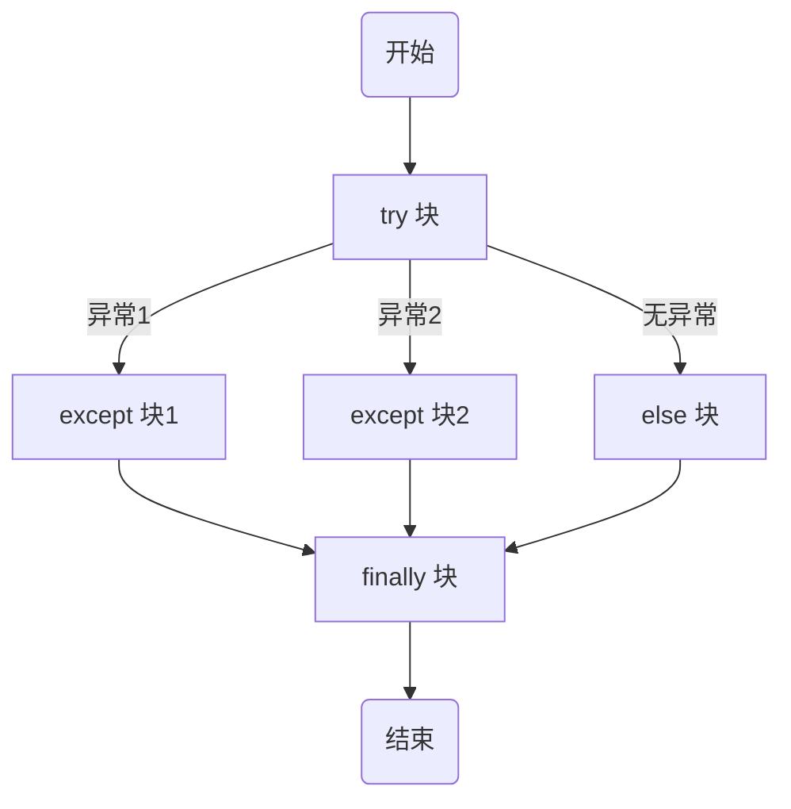

Python 中的控制语句有条件语句，循环语句，异常处理，以及其他一些特殊的控制语句。

## 条件语句

Python中的条件语句是通过一条或多条语句的执行结果（即True或False）来决定执行的代码块。

判断的值可以分为：

- 假值 ：None、空列表、空集合、空字典，空元组、空字符串、0、False 等。
- 真值 ：非空列表、非空集合、非空字典，非空元组、非空字符串、非 0 数值、True 等。

### if

在Python中，要构造分支结构可以使用`if`、`elif`和`else`关键字。`elif`和`else`都是可选的，可以根据需要进行使用。

```python
# 示例
>>> x = int(input("Please enter an integer: "))
Please enter an integer: 42
>>> if x < 0:
        x = 0
        print('Negative changed to zero')
    elif x == 0:
        print('Zero')
    elif x == 1:
        print('Single')
    else:
        print('More')
```

当然如果要构造出更多的分支，可以使用`if...elif...else...`结构或者嵌套的`if...else...`结构。

### match

Python 3.10 引入了新的`match`语句，它是模式匹配的一种形式。`match`语句接受一个表达式并将它的值与一系列的模式进行比较。 每个模式都关联到一个代码块，当模式与表达式的值匹配时，该代码块将被执行。这在某种程度上类似于其他语言中的 switch 语句。

```python
def http_error(status):
    match status:
        case 400:
            return "Bad request"
        case 404:
            return "Not found"
        case 418:
            return "I'm a teapot"
        #"变量名" `_` 被作为 通配符 并必定会匹配成功
        case _: 
            return "Something's wrong with the internet"
```

你可以使用 `|` （“ or ”）在一个模式中组合几个字面值:

```python
case 401 | 403 | 404:
    return "Not allowed"
```

*注意，`match`语句和模式匹配的概念是Python 3.10中新增的特性，可能在更早版本的Python中无法使用。*

## 循环语句

### for

Python 的 for 语句用于遍历任何序列的项目，如列表或字符串。

Python 的 for 语句与 C 或 Pascal 中的不同。**Python 的 for 语句不迭代算术递增数值**（如 Pascal），或是给予用户定义迭代步骤和暂停条件的能力（如 C），而是迭代列表或字符串等任意序列，元素的迭代顺序与在序列中出现的顺序一致。

```python
"""
用for循环实现1~100求和
"""

sum = 0
for x in range(101):
    sum += x
print(sum)
```

**内置函数 range() 表示不可变的数字序列，通常用于在 for 循环中循环指定的次数。**

在 Python 中，`range()` 是一个内置函数，用于生成一个不可变的数字序列。通常，这个函数在 for 循环中使用，用于指定循环的次数。`range(101)`可以用来生成一个包含0到100（不包含101）的整数序列。

你也可以根据需要更改`range()`函数的参数，例如：

- `range(1, 101)`：生成一个包含1到100（不包含101）的整数序列。
- `range(1, 101, 2)`：生成一个包含1到100的奇数序列，其中2是步长。
- `range(100, 0, -2)`：生成一个包含100到1的偶数序列，其中-2是步长。

### while

`while` 循环语句用于在条件满足的情况下重复执行一个代码块。条件表达式的结果为`True`时，继续循环；结果为`False`时，结束循环。

```python
"""
猜数字游戏
"""
import random

answer = random.randint(1, 100)
counter = 0
while True:
    counter += 1
    number = int(input('请输入: '))
    if number < answer:
        print('大一点')
    elif number > answer:
        print('小一点')
    else:
        print('恭喜你猜对了!')
        break
print('你总共猜了%d次' % counter)
if counter > 7:
    print('你的智商余额明显不足')
```

### break

`break` 语句可以提前退出循环。具体来说，**`break` 用于完全结束一个循环，并跳出该循环体。**

### continue

`continue` 语句用于**跳过当前循环的剩余语句，然后继续进行下一轮循环。**

### else

在 Python 中，`else` 子句可以与 `for` 循环和 `while` 循环一起使用。当循环正常完成（即没有碰到 `break` 语句）时，`else` 块的内容会被执行。这个特性在很多其他语言中都没有，因此对于初学者来说可能会感到有些不熟悉。

```python
# 使用 else 的 for 循环的示例
for i in range(5):
    if i == 10:
        break
else:
    print("循环正常完成")
```

在这个示例中，循环会正常完成，因为没有任何一个元素使得 `i == 10` 为 `True`，所以 `break` 语句不会被执行，`else` 块的内容会被打印出来。

如果我们修改 `if` 语句的条件使得 `break` 语句被执行，那么 `else` 块的内容就不会被打印出来：

```Python
for i in range(5):
    if i == 3:
        break
else:
    print("循环正常完成")
```

在这个示例中，当 `i` 等于3时，`break` 语句就会被执行，所以循环没有正常完成，`else` 块的内容不会被打印出来。

同样的，`else` 也可以与 `while` 循环一起使用，当 `while` 循环的条件变为 `False` 时，`else` 块的内容会被执行。

```python
i = 0
while i < 5:
    if i == 3:
        break
    i += 1
else:
    print("循环正常完成")
```

在这个示例中，当 `i` 等于3时，`break` 语句就会被执行，所以循环没有正常完成，`else` 块的内容不会被打印出来。

## 异常语句

### try、except、finally



1. **确定需要的异常处理结构**：在开始编写异常处理结构时，首先确定你需要 `try`, `except`, `else` 和/或 `finally` 语句块。要记住的是，`except` 和 `finally` 块至少需要一个，否则 `try` 将失去其意义。
2. **编写 `try` 语句块**：将可能抛出异常的代码放入 `try` 块。如果在 `try` 块中发生异常，Python 将停止执行 `try` 块的其余部分，并转到 `except` 块。
3. **编写 `except` 语句块**：为每种可能抛出的异常类型编写一个 `except` 块。Python 会按照它们在代码中出现的顺序来检查这些 `except` 块。如果匹配到异常，Python 将执行相应的 `except` 块并停止查找。
4. **处理多个异常**：你可以将多个异常类型放入一个元组中，然后使用一个 `except` 块来处理它们。例如：`except (TypeError, ValueError):`。
5. **处理所有异常**：如果 `except` 块后面没有指定异常类型，那么这个 `except` 块将处理所有异常。你可以通过 `logging` 或 `sys` 模块获取异常的详细信息。
6. **重新抛出异常**：如果你在 `except` 块中捕获了一个异常，然后想要再次抛出它，你可以使用 `raise` 语句而不需要附加任何参数或信息。
7. **编写 `else` 语句块**：`else` 块中的代码只有在 `try` 块没有发生任何异常时才会被执行。
8. **编写 `finally` 语句块**：无论是否发生异常，`finally` 块中的代码总是会被执行。这对于清理（例如关闭文件或网络连接）非常有用。
9. **重构代码**：考虑使用 `with` 语句或 `getattr()` 方法等内置的异常处理语句，而不是 `try/except`。此外，如果可能，尽量避免在同一个 `except` 块中捕获和抛出相同的异常。最后，除非你确定需要处理所有可能的异常，否则不应该捕获所有异常，因为这可能会隐藏严重的问题。

```python
# 示例
try:
    # 这里可能会抛出异常的代码
    do_something()
except SomeException as e:
    # 当捕获到SomeException时的处理代码
    handle_exception(e)

# 实例
def div(a, b):
    try:
        print(a / b)
    except ZeroDivisionError:
        print("错误：b 不应为 0 !!")
    except Exception as e:
        print("意外错误：{}".format(e))
    else:
        print('只有当一切正常时，才会运行 else')
    finally:
        print('始终运行 finally 块。')

# 测试
div(2, 0)
div(2, '错误的类型')
div(1, 2)


# 在一行中捕获多个异常
try:
    print(a / b)
except (ZeroDivisionError, TypeError) as e:
    print(e)


# 当存在 finally 时，except 是可选的
try:
    open(database)
finally:
    close(database)

# 捕获所有错误并记录下来
try:
    do_work()
except:    
    # 从 logging 模块获取详细信息
    logging.exception('捕获到异常!')
    
    # 从 sys.exc_info() 方法获取详细信息
    error_type, error_value, trace_back = sys.exc_info()
    print(error_value)
    raise
```

### with

Python 的 with 语句支持通过上下文管理器所定义的运行时上下文这一概念。

`with`语句是一种处理上下文管理器的语句，上下文管理器通常包含`__enter__`和`__exit__`这两个方法。在`with`语句的代码块被执行前，会首先执行`__enter__`方法，在执行完毕后，会调用`__exit__`方法。这在你需要管理资源，如文件，网络连接或锁定等情况非常有用，因为它可以**保证在任何情况下都会执行必要的清理操作。**

```python
# 在这里，文件已经被关闭，无需再次手动关闭
with open("file.txt", "r") as file:
    for line in file:
        print(line)
```

```python
# 基本思想是 with 所求值的对象必须有一个 enter() 方法，一个 exit() 方法。
# 紧跟 with 后面的语句被求值后，返回对象的 enter() 方法被调用，并将返回值赋值给 as 后面的变量。
# 当 with 的代码块全部被执行完之后，将调用前面返回对象的 exit() 方法。

class ManagedFile:
    def __init__(self, filename):
        self.filename = filename

    def __enter__(self):
        self.file = open(self.filename, 'r')
        return self.file

    def __exit__(self, exc_type, exc_val, exc_tb):
        if self.file:
            self.file.close()

# 使用自定义的上下文管理器
with ManagedFile("file.txt") as file:
    print(file.read())
```

### raise

`raise`语句用于引发特定的异常。你可以定义异常类型并附加一个错误消息：

```python
raise ValueError("这是一个无效的值！")
```

如果你在`except`块中使用`raise`语句，而不提供任何参数，它将默认重新引发最近的异常。

```python
try:
    print(5/0)
except ZeroDivisionError as e:
    print("发生了一个错误！")
    raise  # 重新引发最近的异常
```

## 其他语句

### assert

`assert` 语句用于断言某个条件为真，如果条件为假，则会抛出 `AssertionError` 异常。它常常用于调试代码，确认代码的某些方面满足预期，例如：

```python
x = 1
assert x == 1  # 条件为真，没有问题

# 条件为假，抛出 AssertionError，并附带错误信息
assert x == 2, "x should be 2 but is actually " + str(x)  
```

*注意，`assert` 语句在优化模式下（使用 `-O` 参数启动 Python 时）会被全局禁用。*

### pass

`pass` 语句是 Python 中的空语句，用于在需要语句的地方保持语法的完整性，但是**实际上不做任何事情**。通常，我们使用它作为未完成代码的占位符：

```python
def my_function():
    pass  # TODO: implement this function

class MyEmptyClass:
    pass
```

### return

`return` 语句用于从函数返回一个值。所有函数都会返回一个值：如果函数执行到结尾而没有遇到 `return` 语句，它将返回特殊值 `None`：

```python
def add(a, b):
    return a + b

print(add(1, 2))  # 输出：3
```
