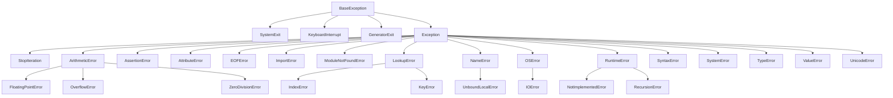

面向对象编程（Object-Oriented Programming，OOP）是一种编程范式或模型，以「对象」作为核心来设计和实现软件。这种方法主要的目标是将数据和处理数据的函数结合在一起，封装成独立的软件模块，我们称之为「对象」。面向对象编程被广泛应用于多种编程语言中，包括 Python。

## 基本概念

### 理念和用途

**面向对象编程是在更高的抽象层次上思考问题的一种方式。**面向对象编程的主要理念是，将现实世界中的对象抽象化，将对象的属性（也叫状态）和行为（也叫方法）封装在一起。面向对象编程的思考方式，更贴近我们对现实世界的认知。

面向对象编程的主要优点包括：

1. **代码复用性**：类的定义一旦完成，就可以在任何地方创建其对象，复用类的属性和方法，而无需重复编写代码。通过类之间的继承关系，子类可以继承父类的代码，从而实现代码的复用。
2. **代码的可维护性和可扩展性**：面向对象编程的封装特性，保护了对象内部的数据，使得代码更安全，更易于维护。通过类的继承和多态，可以轻松实现对现有代码的扩展。

### 特点

**面向对象编程有三个主要的特点：封装、继承、和多态。**

- **封装**：封装是指将对象的状态（数据）和行为（方法）包装在一起，隐藏对象的内部实现细节，仅对外提供必要的接口。这样可以保护对象的内部状态，提高代码的安全性，也提高了代码的可维护性。
- **继承**：继承是指子类可以继承父类的属性和方法。继承让我们可以在父类的基础上进行扩展，实现代码的复用，提高代码的可扩展性。
- **多态**：多态是指不同类的对象对同一消息会做出不同的响应。多态提供了统一的接口，使得我们可以使用一致的方式处理不同类的对象，提高了代码的灵活性。

## Python 中的类和对象

在 Python 中，我们使用`class`关键字来定义类。类是一种数据类型，它定义了一种新的对象，这种对象具有自己的属性和方法。

### 类和对象的概念

- **类(Class)**： 类是对象的蓝图或原型。你可以想象成是创建对象的模板，它定义了特定类型的对象的属性和方法。

```python
# 一个简单的 Python 类的例子
class Dog:
    pass
```

- **对象(Object)**：对象是类的实例。具体来说，当我们根据类的定义创建了一个实例后，这个实例就是一个对象。每个对象都具有类定义的属性和方法。

```python
# 创建Dog类的一个实例
my_dog = Dog()
```

我们可以通过创建类的实例，也就是对象，来使用类的属性和方法。

### 类的属性和方法

类的属性和方法是类的主要组成部分。属性用于描述类和其实例的状态，方法用于描述类和其实例可以进行的操作。

在Python中，我们可以在类中定义两种类型的属性和方法：

- **实例属性和方法**：实例属性和方法属于类的实例。每个实例都有自己的实例属性，这些属性与其他实例的属性互不影响。实例方法可以通过实例来调用，它可以访问和修改实例的属性。

```python
# 在Python类中定义实例属性和方法的例子
class Dog:
    def __init__(self, name):
        self.name = name  # 实例属性

    def bark(self):  # 实例方法
        return f"{self.name} says woof!"

```

- **类属性和方法**：类属性和方法是属于类本身的，所有的实例都会共享同一个类属性。类方法可以通过类名直接调用，也可以通过实例调用，但是它不能访问和修改实例属性。

```python
# 在Python类中定义类属性和方法的例子
class Dog:
    species = "Canis familiaris"  # 类属性

    @classmethod
    def description(cls):  # 类方法
        return "This class represents a dog."

```

### `__init__`

在Python中使用`__init__`方法来初始化类的实例。这个方法会在创建实例时自动调用，我们可以在这个方法中设置实例的初始状态，也就是定义实例的属性。

`__init__`方法的第一个参数始终是`self`，代表了实例本身。在`__init__`方法中，我们使用`self.属性名`来定义实例属性。

```python
class Dog:
    def __init__(self, name, age):
        self.name = name
        self.age = age
```

## 封装

### 概念和用途

封装，这是面向对象编程（OOP）中的基本概念之一，其目标是通过将数据（对象的状态）和对象的行为组合在一起，来**隐藏或封装对象内部的详细信息**。简单地说，封装就是把客户端代码（对象的使用者）从对象的内部细节中解耦出来。

封装的主要优势包括：

1. **提高了代码的安全性**：封装可以防止对象状态的无意义或不合适的修改。只有通过定义好的方法（有时被称为 getter 和 setter ）才能修改状态，这些方法可以控制对对象状态的更改，从而保证其正确和一致。
2. **提高了代码的可维护性**：由于客户端代码从对象的内部实现中解耦出来，我们可以自由地改变对象的内部实现，而不会影响到使用该对象的代码。

### Python 中实现封装

#### 数据封装

在 Python 中，我们可以通过使用私有属性（私有变量）实现数据封装。**Python 中的私有属性名字前面带有两个下划线（例如`__name`）。**这些属性只能在类的内部被访问，不能在类的外部直接访问，从而实现了数据的封装。

```python
class Dog:
    def __init__(self, name, age):
        # __name和__age是私有属性，我们不能在类的外部直接访问
        self.__name = name
        self.__age = age
```

#### 方法封装

Python 同样可以通过私有方法实现方法的封装。私有方法的名字也以两个下划线开始，它们只能在类的内部被调用，不能在类的外部直接调用。

```python
class Dog:
    def __init__(self, name, age):
        self.__name = name
        self.__age = age

    # __bark 是一个私有方法，我们不能在类的外部直接调用
    def __bark(self):
        return f"{self.__name} says woof!"
```

尽管私有属性和方法不能在类的外部直接访问，但是我们可以提供公共的getter和setter方法，让外部代码能够以受控的方式读写这些私有属性。这样我们就可以保证封装的安全性，同时也提供了一定的灵活性。

```python
class Dog:
    def __init__(self, name, age):
        self.__name = name
        self.__age = age

    # getter for __name
    def get_name(self):
        return self.__name

    # setter for __name
    def set_name(self, name):
        self.__name = name

    # getter for __age
    def get_age(self):
        return self.__age

    # setter for __age
    def set_age(self, age):
        self.__age = age

    # __bark 是一个私有方法，我们不能在类的外部直接调用
    def __bark(self):
        return f"{self.__name} says woof!"

    # 公共方法可以调用私有方法
    def public_bark(self):
        return self.__bark()
```

## 继承

### 继承的概念和用途

继承是面向对象编程中的核心概念之一。继承允许我们定义一个新的类（子类或派生类）来继承现有类（父类或基类）的属性（变量）和方法（函数）。这样我们就可以在新类中复用父类的代码，避免了代码的重复，同时也可以在新类中添加新的方法或对父类的方法进行重写（override）。

继承的主要优点包括：

1. **代码复用**：子类继承了父类的所有属性和方法，所以我们可以通过创建子类，来复用和扩展父类的代码，减少了代码的重复。
2. **易于维护和修改**：由于子类可以重写父类的方法，这就意味着我们可以在不改变父类的情况下，改变子类的行为。这使得代码更容易维护和修改。

### Python 中实现继承

#### 创建子类

在 Python 中，我们可以通过在类定义时的括号中写入父类的名字来创建子类。新定义的类将会继承父类的所有属性和方法。

```python
class Animal:
    def __init__(self, name):
        self.name = name

# Dog 是 Animal 的子类，它继承了 Animal 的所有属性和方法。
class Dog(Animal):
    pass
```

#### `super` 函数

在 Python 中，`super`函数是一个内置函数，它可以用来调用父类的方法。这在你需要在子类中扩展父类的方法时特别有用。

```python
class Animal:
    def __init__(self, name):
        self.name = name

# Dog 的 __init__ 方法中使用了 super().__init__(name) 来调用 Animal 的 __init__ 方法。
class Dog(Animal):
    def __init__(self, name, breed):
        super().__init__(name)  # 调用父类的构造方法
        self.breed = breed  # 新增的属性
```

## 多态

### 多态的概念和用途

在面向对象编程（OOP）中，多态性是一种允许一个实体采取多种形态的能力。更具体地说，多态是指通过同一个接口，使用不同的实例，可以产生不同的结果。这使得我们可以在运行时确定我们正在使用的对象类型，然后执行相应的操作。

多态的优势主要有两点：

1. **提高代码的灵活性**：多态能够让我们以更一般的方式编写代码，处理更广泛的数据类型，而不仅仅是特定的单一数据类型。这使得我们的代码更加灵活和可维护。
2. **提高代码的可扩展性**：如果我们想要添加新的数据类型，我们只需要确保它们遵循现有的接口规定。这使得我们的代码更易于扩展和改进，而无需修改大量现有代码。

### Python 中实现多态

Python 是一种动态类型语言，意味着我们不需要明确地声明对象的类型。这就让我们在 Python 中能够非常容易地实现多态。以下是 Python 中实现多态的一些方法：

#### 方法重写

在 Python 中，子类可以重写父类的方法。这就意味着，当我们在子类中调用一个父类的方法时，将会执行子类中定义的版本，而非父类中的原始版本。这使得我们可以改变子类中方法的行为，以符合我们的需求。

```python
class Animal:
    def sound(self):
        return "Generic animal sound"

# Dog类重写了Animal类的sound方法，所以当我们调用Dog实例的sound方法时，会返回"Woof!"，而不是"Generic animal sound"。
class Dog(Animal):
    def sound(self):
        return "Woof!"
```

#### Duck Typing

Python 支持一种编程概念叫做 duck typing，这也是实现多态的一种方法。Duck typing的核心思想是：如果一个对象能够像鸭子一样走路，像鸭子一样叫，那么我们就可以认为它是鸭子。对于Python来说，如果一个对象有我们需要的方法，我们就可以使用它，而不管它是什么类型的对象（运行时类型确定）。

```python
def animal_sound(animal):
    # 这个函数只关心对象是否有sound方法，而不关心对象的具体类型
    return animal.sound()

print(animal_sound(Dog()))  # 输出"Woof!"
print(animal_sound(Animal()))  # 输出"Generic animal sound"
```

## 特殊方法

### Python 的特殊方法

Python 的特殊方法是 Python 类中的一种特殊的方法，它们有固定的命名规则，即前后都有两个下划线（`__`）。这些方法在特定的情况下会被 Python 自动调用，因此它们有时也被称为魔术方法或者双下划线方法。特殊方法让我们可以自定义对象在特定情况下的行为，例如在进行算术运算，比较，迭代等操作时。

| 特殊方法                         | 描述                                                 |
| -------------------------------- | ---------------------------------------------------- |
| `__init__(self, ...)`            | 构造函数，在创建新实例时调用。                       |
| `__del__(self)`                  | 析构函数，在实例被销毁时调用。                       |
| `__repr__(self)`                 | 定义该类的“官方”字符串表示。通常可以被`eval()`执行。 |
| `__str__(self)`                  | 定义该类的字符串表示，例如用于`print()`。            |
| `__bytes__(self)`                | 定义`bytes()`的返回值。                              |
| `__format__(self, format_spec)`  | 定义`format()`的行为。                               |
| `__lt__(self, other)`            | 定义小于符号的行为。                                 |
| `__le__(self, other)`            | 定义小于等于符号的行为。                             |
| `__eq__(self, other)`            | 定义等于符号的行为。                                 |
| `__ne__(self, other)`            | 定义不等于符号的行为。                               |
| `__gt__(self, other)`            | 定义大于符号的行为。                                 |
| `__ge__(self, other)`            | 定义大于等于符号的行为。                             |
| `__hash__(self)`                 | 定义`hash()`的行为。                                 |
| `__bool__(self)`                 | 定义`bool()`的返回值。定义`True`和`False`的行为。    |
| `__getattr__(self, name)`        | 定义当用户试图获取一个不存在的属性时的行为。         |
| `__setattr__(self, name, value)` | 定义对实例属性的赋值行为。                           |
| `__delattr__(self, name)`        | 定义对实例属性的删除行为。                           |
| `__getattribute__(self, name)`   | 定义属性访问行为。                                   |
| `__getitem__(self, key)`         | 定义使用索引访问元素的行为。                         |
| `__setitem__(self, key, value)`  | 定义使用索引设置元素的行为。                         |
| `__delitem__(self, key)`         | 定义使用索引删除元素的行为。                         |
| `__iter__(self)`                 | 定义迭代器行为，返回一个新的迭代器对象。             |
| `__reversed__(self)`             | 定义`reversed()`返回值。定义逆序迭代的行为。         |
| `__len__(self)`                  | 定义`len()`返回值。定义对象包含元素的个数。          |
| `__add__(self, other)`           | 定义加法的行为。                                     |
| `__sub__(self, other)`           | 定义减法的行为。                                     |
| `__mul__(self, other)`           | 定义乘法的行为。                                     |
| `__truediv__(self, other)`       | 定义真除法的行为。                                   |
| `__floordiv__(self, other)`      | 定义整除法的行为。                                   |
| `__mod__(self, other)`           | 定义求模运算的行为。                                 |
| `__pow__(self, other[, modulo])` | 定义指数运算的行为。                                 |
| `__and__(self, other)`           | 定义按位与运算的行为。                               |
| `__xor__(self, other)`           | 定义按位异或运算的行为。                             |
| `__or__(self, other)`            | 定义按位或运算的行为。                               |

#### `__init__`

`__init__`方法是类的构造函数，当我们创建类的实例时，`__init__`方法会被自动调用。我们可以在`__init__`方法中初始化实例的属性。

```python
class MyClass:
    def __init__(self, value):
        self.value = value  # 初始化实例属性

# 创建实例
mc = MyClass(10)
print(mc.value)  # 输出：10
```

#### `__del__`

`__del__`方法是类的析构函数，当一个实例被销毁时（例如被垃圾回收器回收时），`__del__`方法会被自动调用。注意，我们通常不需要在`__del__`方法中做清理工作，Python的垃圾回收器会自动清理对象的资源。

```python
class MyClass:
    def __del__(self):
        print("Instance is being destroyed.")

mc = MyClass()  # 创建实例
del mc  # 销毁实例
```

#### `__repr__`

`__repr__`方法返回一个表示该对象的官方字符串，这个字符串通常可以被`eval()`执行来重新得到这个对象。如果我们没有定义`__str__`方法，那么在调用`str()`或`print()`时也会使用`__repr__`的返回值。

```python
class MyClass:
    def __repr__(self):
        return "MyClass()"

mc = MyClass()  # 创建实例
print(mc)  # 输出：MyClass()
```

#### `__str__`

`__str__`方法返回一个表示该对象的字符串，这个字符串通常用于给用户看。当我们调用`str()`或`print()`时，会使用`__str__`的返回值。

```python
class MyClass:
    def __str__(self):
        return "This is a MyClass instance."

mc = MyClass()  # 创建实例
print(mc)  # 输出：This is a MyClass instance.
```

*注意，`__repr__`和`__str__`的区别在于，**`__repr__`更侧重于开发，而`__str__`更侧重于用户。***

#### `__bytes__`

`__bytes__`方法定义了当我们调用`bytes()`时的行为。它应该返回一个字节串。

```python
class MyClass:
    def __bytes__(self):
        return b'MyClass instance'

mc = MyClass()  # 创建实例
print(bytes(mc))  # 输出：b'MyClass instance'
```

#### `__format__`

`__format__`方法定义了当我们调用`format()`或使用格式化字符串（f-string）时的行为。`format_spec`是一个格式说明符，它是在格式化字符串中`:`后面的部分。

```python
class MyClass:
    def __format__(self, format_spec):
        if format_spec == 'fancy':
            return 'This is a fancy MyClass instance.'
        return 'This is a MyClass instance.'

mc = MyClass()  # 创建实例
print(f"{mc:fancy}")  # 输出：This is a fancy MyClass instance.
```

#### `__hash__`

`__hash__`方法定义了当我们调用`hash()`时的行为。它应该返回一个整数，这个整数会被用于在字典等哈希表中快速比较键。

```python
class MyClass:
    def __init__(self, value):
        self.value = value

    def __hash__(self):
        return hash(self.value)

mc = MyClass(10)  # 创建实例
print(hash(mc))  # 输出：10
```

#### `__bool__`

`__bool__`方法定义了当我们调用`bool()`时的行为。它应该返回`True`或`False`。

```python
class MyClass:
    def __init__(self, value):
        self.value = value

    def __bool__(self):
        return bool(self.value)

print(bool(MyClass(0)))  # 输出：False
print(bool(MyClass(1)))  # 输出：True
```

#### `__getattr__`

`__getattr__`方法定义了当我们试图获取一个不存在的属性时的行为。`name`是我们试图获取的属性的名称。

```python
class MyClass:
    def __getattr__(self, name):
        return f"{name} does not exist."

mc = MyClass()  # 创建实例
print(mc.unknown_attr)  # 输出：unknown_attr does not exist.
```

#### `__setattr__`

`__setattr__`方法定义了对实例属性的赋值行为。`name`是属性的名称，`value`是我们试图赋给属性的值。

```python
class MyClass:
    def __setattr__(self, name, value):
        self.__dict__[name] = value  # 在__dict__中设置属性
        print(f"Set {name} to {value}.")

mc = MyClass()  # 创建实例
mc.attr = 10  # 输出：Set attr to 10.
```

注意，为了防止在`__setattr__`中赋值属性时再次调用`__setattr__`，导致无限递归，我们需要直接在实例的`__dict__`属性中设置属性。

#### `__delattr__`

`__delattr__`方法定义了对实例属性的删除行为。`name`是我们试图删除的属性的名称。

```python
class MyClass:
    attr = 10

    def __delattr__(self, name):
        del self.__dict__[name]  # 在__dict__中删除属性
        print(f"Deleted {name}.")

mc = MyClass()  # 创建实例
del mc.attr  # 输出：Deleted attr.
```

注意，为了防止在`__delattr__`中删除属性时再次调用`__delattr__`，导致无限递归，我们需要直接在实例的`__dict__`属性中删除属性。

#### `__getattribute__`

`__getattribute__`方法定义了属性访问行为。无论属性是否存在，只要我们试图访问属性，就会调用`__getattribute__`。

```python
class MyClass:
    def __getattribute__(self, name):
        return f"You are trying to access {name}."

mc = MyClass()  # 创建实例
print(mc.attr)  # 输出：You are trying to access attr.
```

注意，如果我们定义了`__getattribute__`方法，那么`__getattr__`就不会被调用。因为无论属性是否存在，`__getattribute__`都会被调用。

#### `__getitem__`

`__getitem__`方法定义了使用索引访问元素的行为。`key`是索引。

```python
class MyClass:
    def __getitem__(self, key):
        return f"You are trying to access key {key}."

mc = MyClass()  # 创建实例
print(mc[10])  # 输出：You are trying to access key 10.
```

#### `__setitem__`

`__setitem__`方法定义了使用索引设置元素的行为。`key`是索引，`value`是我们试图设置的值。

```python
class MyClass:
    def __setitem__(self, key, value):
        print(f"Set key {key} to {value}.")

mc = MyClass()  # 创建实例
mc[10] = "value"  # 输出：Set key 10 to value.
```

#### `__delitem__`

`__delitem__`方法定义了使用索引删除元素的行为。`key`是索引。

```python
class MyClass:
    def __delitem__(self, key):
        print(f"Deleted key {key}.")

mc = MyClass()  # 创建实例
del mc[10]  # 输出：Deleted key 10.
```

#### `__iter__`

`__iter__`方法定义了迭代器行为，它应该返回一个新的迭代器对象。

```python
class MyClass:
    def __init__(self):
        self.data = [1, 2, 3]

    def __iter__(self):
        return iter(self.data)

mc = MyClass()  # 创建实例
for i in mc:  # 输出：1 2 3
    print(i)
```

#### `__reversed__`

`__reversed__`方法定义了`reversed()`的返回值。它应该返回一个新的反向迭代器对象。

```python
class MyClass:
    def __init__(self):
        self.data = [1, 2, 3]

    def __reversed__(self):
        return reversed(self.data)

mc = MyClass()  # 创建实例
for i in reversed(mc):  # 输出：3 2 1
    print(i)
```

#### `__len__`

`__len__`方法定义了`len()`的返回值。它应该返回一个整数，表示对象包含的元素的个数。

```python
class MyClass:
    def __init__(self):
        self.data = [1, 2, 3]

    def __len__(self):
        return len(self.data)

mc = MyClass()  # 创建实例
print(len(mc))  # 输出：3
```

## 抽象类和接口

### 抽象类和接口的概念

抽象类是一种特殊的类，它不能被实例化，只能被继承。抽象类中可以定义抽象方法，这些方法在抽象类中没有实现，在子类中必须实现。

接口是一种特殊的抽象类，它只定义了一组方法的签名，没有提供任何实现。接口定义了一组行为，任何实现了这些行为的类都可以说是实现了这个接口。

### Python 的abc模块

在 Python 中，我们使用 abc 模块来创建抽象类和接口。abc 模块提供了`ABC`基类和`abstractmethod`装饰器，我们可以使用它们来定义抽象类和抽象方法。

### Python 中使用抽象类和接口

#### 创建抽象类

我们可以使用`ABC`基类和`abstractmethod`装饰器来创建抽象类。

```Python
from abc import ABC, abstractmethod

# AbstractAnimal 是一个抽象类，它有一个抽象方法 sound。
class AbstractAnimal(ABC):
    @abstractmethod
    def sound(self):
        pass
```

#### 创建接口

在 Python 中，接口的概念可以通过完全由抽象方法构成的抽象类来实现。与抽象类类似，我们使用 ABC 基类和 abstractmethod 装饰器来定义接口。

```python
from abc import ABC, abstractmethod

# AnimalBehaviour 是一个接口，它定义了两个抽象方法：eat 和 sleep。
class AnimalBehaviour(ABC):
    @abstractmethod
    def eat(self):
        pass

    @abstractmethod
    def sleep(self):
        pass

```

#### 实现接口

我们可以通过继承抽象类并实现其所有的抽象方法来实现接口。

```Python
class Dog(AbstractAnimal, AnimalBehaviour):
    def sound(self):
        return "Woof!"

    def eat(self):
        return "The dog is eating."

    def sleep(self):
        return "The dog is sleeping."
```

## 异常处理

### 异常的概念

在 Python 中，异常是程序运行期间发生的错误事件，它会中断常规程序的执行流程。当程序执行过程中遇到错误时，Python 解释器会自动引发（raise）一个异常。

异常是一种特殊的对象，它包含了有关错误的详细信息，例如错误类型和错误发生时的程序状态。Python 内置了很多标准异常类型，如`ValueError`，`TypeError`，`IndexError`等，每种类型都对应了一类特定的错误。

我们可以使用异常处理机制来捕获（catch）异常。通过处理异常，我们可以决定在出现错误时程序如何响应，而不是让程序直接崩溃。这对于构建健壮和稳定的程序至关重要。



### 异常处理关键字

Python中处理异常的关键字主要有四个：`try`，`except`，`finally`，`else`。

- `try`: 你可以把可能会引发异常的代码放在`try`块中。
- `except`: 当`try`块中的代码引发异常时，`except`块中的代码将被执行。你可以在`except`后面指定你想捕获的异常类型。一个`try`块后面可以跟随多个`except`块，用于捕获不同类型的异常。
- `finally`: 无论`try`块中的代码是否引发异常，`finally`块中的代码都将被执行。这常用于执行一些无论异常是否发生都需要执行的清理操作，如关闭文件。
- `else`: 如果`try`块中的代码没有引发异常，那么`else`块中的代码将被执行。`else`关键字是可选的。

```Python
try:
    # 这里是可能抛出异常的代码
    result = 10 / 0
except ZeroDivisionError:
    # 这里是处理ZeroDivisionError异常的代码
    print("Cannot divide by zero!")
else:
    # 这里是try代码块成功执行后的代码
    print("Operation successful.")
finally:
    # 这里是无论是否发生异常都会执行的代码
    print("This is the finally block.")
```

### Python 内置标准异常

| 异常名                | 描述                                |
| --------------------- | ----------------------------------- |
| `BaseException`       | 所有异常的基类                      |
| `SystemExit`          | 解释器请求退出                      |
| `KeyboardInterrupt`   | 用户中断执行(通常是输入^C)          |
| `Exception`           | 常规错误的基类                      |
| `StopIteration`       | 迭代器没有更多的值                  |
| `GeneratorExit`       | 生成器(generator)发生异常来通知退出 |
| `SystemError`         | 解释器发现内部错误                  |
| `SyntaxError`         | Python语法错误                      |
| `IndentationError`    | 缩进错误                            |
| `TabError`            | Tab和空格混用                       |
| `NameError`           | 未声明/初始化对象 (没有属性)        |
| `UnboundLocalError`   | 访问未初始化的本地变量              |
| `AttributeError`      | 对象没有这个属性                    |
| `TypeError`           | 对类型无效的操作                    |
| `AssertionError`      | 断言语句失败                        |
| `ImportError`         | 导入模块/对象失败                   |
| `ModuleNotFoundError` | 找不到模块                          |
| `LookupError`         | 无效数据查询的基类                  |
| `IndexError`          | 序列中没有此索引(index)             |
| `KeyError`            | 映射中没有这个键                    |
| `ValueError`          | 传入无效的参数                      |
| `UnicodeError`        | Unicode相关的错误                   |
| `ArithmeticError`     | 数学运算基类                        |
| `FloatingPointError`  | 浮点计算错误                        |
| `OverflowError`       | 数值运算超出最大限制                |
| `ZeroDivisionError`   | 除(或取模)零 (所有数据类型)         |
| `EnvironmentError`    | 操作系统错误的基类                  |
| `IOError`             | 输入/输出操作失败                   |
| `OSError`             | 操作系统错误                        |
| `EOFError`            | 没有内建输入,到达EOF标记            |
| `RuntimeError`        | 一般的运行时错误                    |
| `NotImplementedError` | 尚未实现的方法                      |
| `RecursionError`      | 超过最大递归深度                    |

### 自定义异常的创建和抛出

Python允许你创建自定义的异常类型。为了创建自定义的异常类型，你需要定义一个类，它继承自`Exception`类或者它的子类。在你的类中，你可以定义任何你需要的方法，但是通常，自定义的异常类型会非常简单，只提供一些基本的信息。

要抛出你自定义的异常，你可以使用`raise`关键字。在`raise`语句后面，你可以指定要抛出的异常类型，以及一个可选的错误消息。

```Python
class CustomError(Exception):
    """自定义的异常类型"""

    def __init__(self, message):
        self.message = message

try:
    # 抛出自定义的异常
    raise CustomError("This is a custom error.")
except CustomError as e:
    # 捕获并处理自定义的异常
    print("Caught an exception:", e.message)
```
