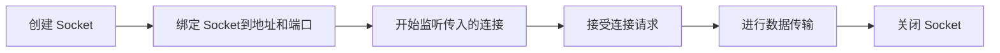
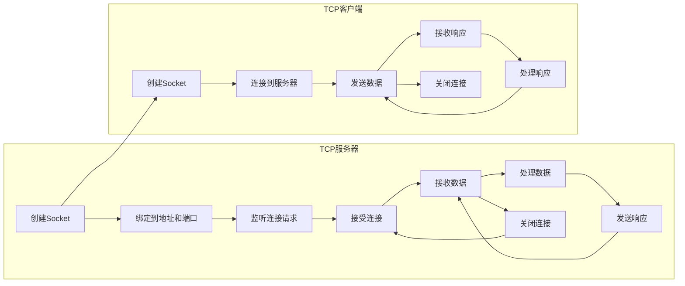
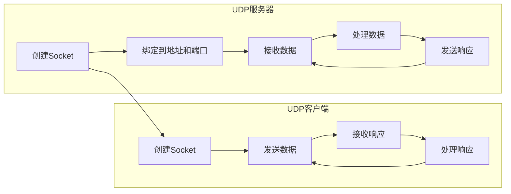

## 概述

Socket 是计算机网络中用于实现进程间通信的一种技术。简而言之，它是一个端点，用于发送或接收数据。这些数据可以在同一台计算机上的进程之间，或者在不同计算机上的进程之间进行传输。

`socket` 是 Python 中的一个标准库，它提供了低级的网络通信功能。基于该库，开发者可以实现 TCP、UDP 以及其他类型的网络协议的客户端和服务端程序。

`socket` 库的历史可以追溯到 Unix 操作系统的早期。在 Unix 中，socket 被用作进程间通信(IPC)的一种方式。随着互联网的发展，socket 逐渐被应用于网络通信。Python 的 `socket` 库提供了对这一功能的高级封装，使得开发网络应用变得更为简单。

## 工作原理

`socket`网络通信最常见的模型是客户端-服务器模型。客户端是请求服务的实体，而服务器是提供服务的实体。Socket 允许这两个实体进行通信。

- **客户端**: 创建 Socket -> 连接到服务器 -> 交换数据 -> 关闭 Socket
- **服务器**: 创建 Socket -> 绑定到特定地址和端口 -> 监听连接 -> 接受客户端连接 -> 交换数据 -> 关闭 Socket

`socket` 主要被用于：

- 创建网络服务器和客户端。
- 实现多种网络协议，如 TCP 和 UDP。
- 进行低级的网络通信，如发送原始套接字数据。

它解决了开发者在进行网络通信时的底层细节问题，如地址转换、数据传输等。

### 协议类型

- **流式 Socket (SOCK_STREAM)**: 提供了一个可靠的、面向连接的字节流。这是最常用的 Socket 类型，TCP 协议就是基于这种 Socket。
- **数据报 Socket (SOCK_DGRAM)**: 提供了一种无连接的、不可靠的数据传输方式。UDP 协议就是基于这种 Socket。
- **原始 Socket (SOCK_RAW)**: 允许直接访问底层协议，通常用于开发新的通信协议。

### 地址家族

- **AF_INET (IPv4)**: 最常用的地址家族，用于 Internet 通信。
- **AF_INET6 (IPv6)**: 下一代 Internet 地址家族。
- **AF_UNIX**: 用于同一台机器上的进程间通信。

### 生命周期



1. **创建**: 使用 `socket.socket()` 创建一个新的 Socket 对象。
2. **绑定**: 使用 `bind()` 方法将 Socket 绑定到特定的地址和端口。
3. **监听**: 使用 `listen()` 方法开始监听传入的连接。
4. **接受连接**: 使用 `accept()` 方法接受一个连接。
5. **数据传输**: 使用 `send()` 和 `recv()` 方法进行数据传输。
6. **关闭**: 使用 `close()` 方法关闭 Socket。

## 基础操作

由于 `socket` 是 Python 的标准库，无需额外安装。

### 支持协议

`socket` 库支持多种协议，用于不同的网络通信场景。

```python
# 服务器
import socket

server_socket = socket.socket(socket.AF_INET, socket.SOCK_STREAM)
server_socket.bind(('localhost', 8080))
server_socket.listen(5)

print("服务器正在监听...")
client_socket, addr = server_socket.accept()
print(f"连接来自 {addr}")

data = client_socket.recv(1024)
print(f"接收到的数据: {data.decode('utf-8')}")
client_socket.send("谢谢你!".encode('utf-8'))

client_socket.close()
server_socket.close()
```

```python
# 客户端
import socket

client_socket = socket.socket(socket.AF_INET, socket.SOCK_STREAM)
client_socket.connect(('localhost', 8080))

client_socket.send("你好，服务器!".encode('utf-8'))
data = client_socket.recv(1024)
print(f"接收到的数据: {data.decode('utf-8')}")

client_socket.close()
```

### TCP 示例



#### 服务器

```python
import socket

# 步骤1：创建 TCP Socket
server_socket = socket.socket(socket.AF_INET, socket.SOCK_STREAM)

# 步骤2：绑定 Socket 到一个特定的 IP 地址和端口
server_address = ('localhost', 12345)
server_socket.bind(server_address)

# 步骤3：监听传入的连接请求
server_socket.listen(5)

print("TCP 服务器启动，等待连接...")

while True:
    # 步骤4：接受客户端的连接请求
    client_socket, client_address = server_socket.accept()
    print(f"接受来自 {client_address} 的连接")

    # 步骤5：与客户端建立通信
    while True:
        data = client_socket.recv(1024)
        if not data:
            break

        # 步骤6：接收和发送数据
        data = data.decode('utf-8')
        print(f"接收到来自客户端的数据: {data}")
        response = f"你好，
```

#### 客户端

```python
import socket

# 步骤1：创建 TCP Socket
client_socket = socket.socket(socket.AF_INET, socket.SOCK_STREAM)

# 步骤2：连接到服务器的 IP 地址和端口
server_address = ('localhost', 12345)
client_socket.connect(server_address)

while True:
    # 步骤3：发送数据给服务器
    message = input("请输入要发送的消息 (输入 'exit' 退出): ")
    
    if message == 'exit':
        break
    
    client_socket.send(message.encode('utf-8'))
    
    # 步骤4：接收来自服务器的响应数据
    data = client_socket.recv(1024)
    
    # 步骤5：处理服务器的响应数据
    data = data.decode('utf-8')
    print(f"接收到服务器的响应: {data}")

# 步骤6：关闭与服务器的连接
client_socket.close()
```

### UDP 示例



#### 服务端

```python
import socket

# 步骤1：创建 UDP Socket
server_socket = socket.socket(socket.AF_INET, socket.SOCK_DGRAM)

# 步骤2：绑定 Socket 到一个特定的 IP 地址和端口
server_address = ('localhost', 12345)
server_socket.bind(server_address)

print("UDP 服务器启动，等待数据...")

while True:
    # 步骤3：接收客户端发送的数据
    data, client_address = server_socket.recvfrom(1024)
    
    # 步骤4：处理客户端数据
    data = data.decode('utf-8')
    print(f"接收到来自 {client_address} 的数据: {data}")
    
    # 步骤5：为客户端发送响应（如果需要）
    response = f"你好，客户端！你发送了：{data}"
    server_socket.sendto(response.encode('utf-8'), client_address)
    
# 步骤6：关闭 Socket（这里永远不会执行到）
server_socket.close()
```

#### 客户端

```python
import socket

# 步骤1：创建 UDP Socket
client_socket = socket.socket(socket.AF_INET, socket.SOCK_DGRAM)

# 服务器地址和端口
server_address = ('localhost', 12345)

while True:
    # 步骤2：发送数据给服务器
    message = input("请输入要发送的消息 (输入 'exit' 退出): ")
    
    if message == 'exit':
        break
    
    client_socket.sendto(message.encode('utf-8'), server_address)
    
    # 步骤3：接收来自服务器的响应数据
    data, server_address = client_socket.recvfrom(1024)
    
    # 步骤4：处理服务器的响应数据
    data = data.decode('utf-8')
    print(f"接收到服务器的响应: {data}")

# 步骤5：关闭 Socket
client_socket.close()
```

### 常用方法

| 方法      | 描述                 |
| --------- | -------------------- |
| socket()  | 创建一个新的 socket  |
| bind()    | 绑定到一个地址和端口 |
| listen()  | 开始监听连接         |
| accept()  | 接受一个新的连接     |
| connect() | 连接到一个服务器     |
| send()    | 发送数据             |
| recv()    | 接收数据             |
| close()   | 关闭 socket          |

## 深入探索

### 高级功能

#### 非阻塞 sockets

```python
import socket

s = socket.socket(socket.AF_INET, socket.SOCK_STREAM)
s.setblocking(False)
```

#### 套接字选项

```python
s.setsockopt(socket.SOL_SOCKET, socket.SO_REUSEADDR, 1)
```

#### 超时

```python
s.settimeout(5.0)
```
