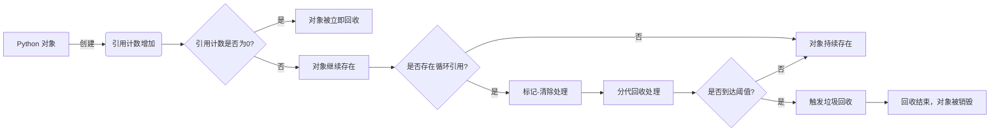
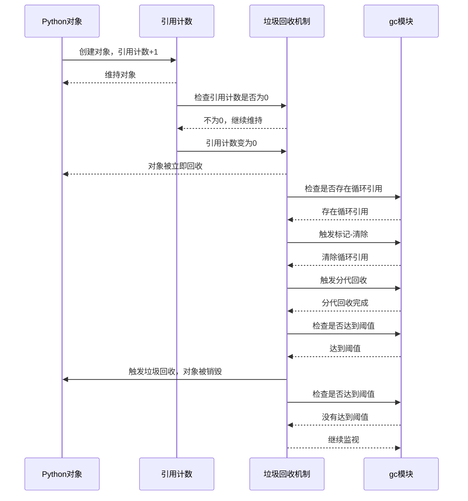

## 引用和引用计数

### Python 中的引用概念

**在 Python 中，所有的数据都是以对象的形式存在。**当我们创建一个变量并赋值时，实际上 Python 会为我们创建一个对象，然后变量会引用这个对象。这种关系，我们称之为引用。

例如：

```python
a = 1
```

这里，数字 `1` 是一个 `int` 类型的对象，变量 `a` 是对这个对象的引用。

### 引用计数的基本原理

**Python 使用一种叫做引用计数的方式来管理内存。**每一个对象都有一个引用计数，用来记录有多少个引用指向这个对象。当这个计数值变为 0 时， Python 就知道没有任何引用指向这个对象，这个对象就可以被安全地销毁了，它占用的内存就会被释放。

例如：

```python
a = 1  # 引用计数为1
b = a  # 引用计数为2
a = None  # 引用计数为1
b = None  # 引用计数为0，对象被销毁
```

### 引用计数的增减和对象的创建与销毁过程



每当我们创建一个新的引用（赋值操作），对象的引用计数就会增加 1。当我们删除一个引用（例如赋值为 `None` 或者使用 `del` 命令），对象的引用计数就会减少 1。当引用计数变为 0 时，Python 的垃圾回收器就会销毁这个对象并回收它所占用的内存。

## 循环引用和引用计数的限制

### 循环引用的概念和问题

**循环引用是指两个或更多的对象互相引用，形成一种闭环。**在这种情况下，即使没有其他引用指向这些对象，它们的引用计数也永远不会变为 0，所以它们不会被 Python 的垃圾回收器销毁，导致内存泄漏。

例如：

```python
class Node:
    def __init__(self):
        self.other = None

a = Node()
b = Node()
a.other = b  # a 引用了 b
b.other = a  # b 引用了 a，形成了循环引用
```

### 引用计数无法解决的循环引用问题

这正是引用计数法的一个主要弱点。尽管它简单易懂，但它不能处理循环引用的问题。在上面的例子中，即使我们删除了对 `a` 和 `b` 的引用，它们也不会被销毁，因为它们互相引用，它们的引用计数永远不会变为 0。

```python
del a
del b
# 现在，a 和 b 形成的循环引用对象仍然存在，但我们无法访问它们
```

### 引用计数的弱点和限制

引用计数法的另一个弱点是它的开销相对较大。每次创建或删除引用时，Python 都需要更新引用计数。这可能在大量对象创建和销毁的情况下成为性能瓶颈。

## 垃圾回收算法

### 垃圾回收算法的概述

为了解决引用计数法不能处理循环引用的问题，Python 引入了两种垃圾回收算法：**标记-清除算法和分代回收算法。这两种算法都是为了检测和回收循环引用的对象。**

### 标记-清除算法的原理和流程

标记-清除算法是一种基础的垃圾回收算法。它的**基本原理是通过标记和清除两个步骤来回收垃圾对象。**在标记步骤中，从某些根对象（例如全局变量）出发，遍历所有可达的对象，将这些对象标记为活动。剩下的未被标记的对象（即不可达的对象）就被认为是垃圾。然后在“清除”步骤中，清除所有标记为“垃圾”的对象。

在 Python 中，标记-清除算法主要用于检测和清除循环引用对象。它的工作流程是这样的：

1. 从所有的容器对象（例如列表、字典和类实例等）出发，找出所有可能形成循环引用的对象。
2. 对这些对象应用标记-清除算法，找出并清除真正的循环引用对象。

### 分代回收算法的原理和优化

分代回收是 Python 用来优化垃圾回收性能的一种方式。它的**基本思想是将所有的对象分为几代，每一代的对象有自己的生命周期和回收策略。**新创建的对象被放入第一代，当这一代的对象经历了一定次数的垃圾回收后仍然存活，就被移到下一代。每一代的垃圾回收频率都不同，通常，越年轻的代的垃圾回收频率越高。

Python 的分代回收有三代。新创建的对象被放入第一代（`generation 0`），当它经历了一次垃圾回收后仍然存活，就被移到第二代（`generation 1`）。同样，第二代的对象在经历了一次垃圾回收后仍然存活，就被移到第三代（`generation 2`）。第三代的对象在经历了一次垃圾回收后仍然存活，就留在第三代。每一代的垃圾回收频率都不同，第一代的频率最高，第三代的频率最低。

分代回收算法的优点是它可以减少垃圾回收的开销，因为经常产生垃圾的通常是生命周期短的对象（例如临时变量），而生命周期长的对象（例如全局变量）很少产生垃圾。这种方式可以让 Python 更加聚焦于可能产生垃圾的地方，从而提高垃圾回收的效率。

### Python 中的垃圾回收算法实现



Python 的垃圾回收机制是基于引用计数的，当对象的引用计数降到 0 时，该对象就会被立即回收。但是，对于循环引用的问题，Python 使用标记-清除和分代回收两种算法来解决。

首先，Python 使用标记-清除算法来检测和清除循环引用的对象。然后，为了优化垃圾回收的性能，Python 会根据对象的存活时间将它们分成三代，并分别进行回收。这样，Python 就能有效地管理内存，同时尽可能地降低垃圾回收的开销。

## gc 模块

Python 通过 `gc` 模块提供了对垃圾回收机制的直接控制。`gc` 模块提供了一些函数，让我们可以手动触发垃圾回收，查询垃圾回收的状态，或者调整垃圾回收的参数。

### 基础功能

下面是一些常用的 `gc` 函数：

| 函数                                                         | 描述                                                         |
| :----------------------------------------------------------- | :----------------------------------------------------------- |
| `gc.enable()`                                                | 启用自动垃圾回收。                                           |
| `gc.disable()`                                               | 禁用自动垃圾回收。                                           |
| `gc.isenabled()`                                             | 查看自动垃圾回收是否被启用。                                 |
| `gc.collect(generation=2)`                                   | 立即进行一次垃圾回收。可以通过 `generation` 参数指定要收集的代的编号（0代表最年轻的一代，2代表所有代）。 |
| `gc.set_threshold(threshold0, threshold1=None, threshold2=None)` | 设置垃圾回收的阈值。当某一代的垃圾数量超过对应的阈值时，就会触发垃圾回收。 |
| `gc.get_threshold()`                                         | 获取当前的垃圾回收阈值。                                     |
| `gc.get_count()`                                             | 获取当前每一代的垃圾数量。                                   |
| `gc.get_objects()`                                           | 返回一个列表，包含所有当前被监视的对象。                     |
| `gc.get_stats()`                                             | 返回一个字典，包含垃圾回收的统计信息。                       |
| `gc.set_debug(flags)`                                        | 设置垃圾回收的调试标志。                                     |
| `gc.get_debug()`                                             | 获取当前的垃圾回收调试标志。                                 |
| `gc.get_referents(*objs)`                                    | 返回一个列表，包含所有给定对象的直接引用对象。               |
| `gc.get_referrers(*objs)`                                    | 返回一个列表，包含所有直接引用给定对象的对象。               |

下面是一个简单的例子，演示了如何使用 `gc` 模块：

```python
import gc

# 手动触发垃圾回收
gc.collect()

# 获取当前的计数器值
print(gc.get_count())

# 获取当前的阈值
print(gc.get_threshold())

# 设置新的阈值
gc.set_threshold(500)

# 获取所有存在的对象
print(len(gc.get_objects()))

# 获取统计信息
print(gc.get_stats())
```

### 高级用法

除了上述的基本功能，`gc` 模块还提供了一些高级功能，例如你可以注册自己的回调函数，当垃圾回收发生时，这些回调函数就会被调用。这可以用来监控垃圾回收的过程，或者调试内存泄漏的问题。

下面是一个例子，演示了如何注册回调函数：

```python
import gc

def callback(phase, info):
    print(f"{phase}: {info}")

# 注册回调函数
gc.callbacks.append(callback)

# 触发垃圾回收
gc.collect()
```

在这个例子中，每次垃圾回收发生时，`callback` 函数都会被调用，它会打印出垃圾回收的阶段和一些信息。

## 总结

Python 的垃圾回收机制是基于引用计数的，它简单高效，但无法处理循环引用的问题。为了解决这个问题，Python 引入了标记-清除和分代回收两种垃圾回收算法。这两种算法可以有效地检测和清除循环引用的对象，同时优化垃圾回收的性能。

Python 通过 `gc` 模块提供了对垃圾回收机制的直接控制。通过 `gc` 模块，我们可以手动触发垃圾回收，查询垃圾回收的状态，或者调整垃圾回收的参数。我们甚至可以注册自己的回调函数，以便在垃圾回收发生时获取通知。
