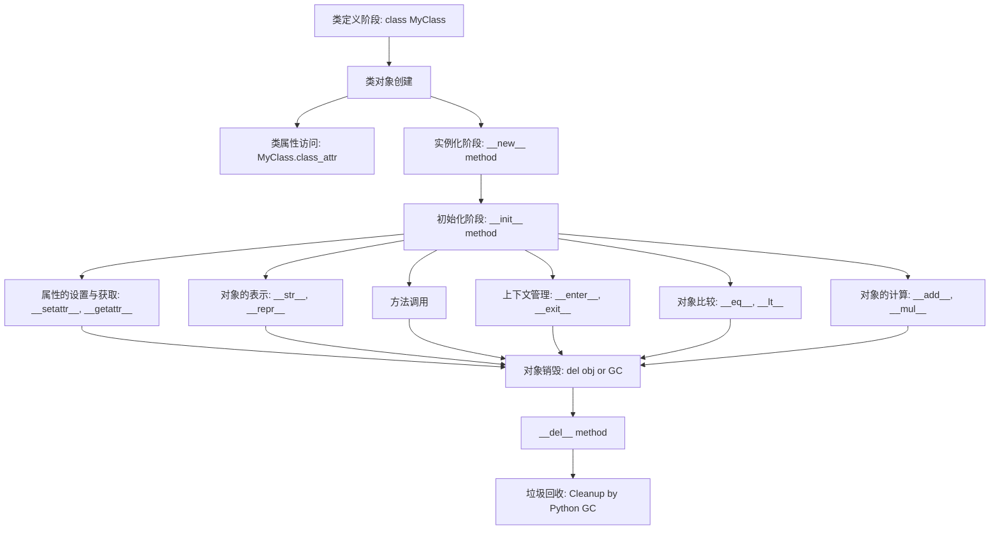

## 生命周期



1. **类定义阶段**：在这个阶段定义类的方法和属性。
2. **类对象创建**：当 Python 读取到类定义时，它会创建一个类对象。
3. **类属性访问**：在实例化之前，可以访问类的静态和类属性。
4. **实例化阶段**：使用类名创建对象时，首先调用`__new__`方法来分配内存。
5. **初始化阶段**：紧随其后，`__init__`方法会被调用，对新对象进行初始化。
6. **属性的设置与获取**：在对象的生命周期中，你可以使用`__getattr__`, `__setattr__`, `__getattribute__`等特殊方法来控制属性的访问。
7. **对象的表示**：当尝试显示对象时（例如，通过 print），`__str__`和`__repr__`方法可以被调用。
8. **方法调用**：可以调用对象的方法。
9. **上下文管理**：使用`with`语句时，对象的`__enter__`和`__exit__`方法会被调用。
10. **对象比较**：使用比较操作符时（如==或>），`__eq__`, `__lt__`, `__le__`等特殊方法会被调用。
11. **对象的计算**：如加法或乘法等运算符，会调用`__add__`, `__mul__`等特殊方法。
12. **对象销毁**：当对象的引用计数减少到零或者被明确销毁（使用`del`语句）时，`__del__`方法会被调用。
13. **垃圾回收**：Python 的垃圾回收器会识别循环引用，并在适当的时候销毁相关对象。

## 特殊方法

Python 中的类包含了许多特殊方法，它们经常被称为**魔术方法（magic methods）**或者**双下方法（dunder methods）**，因为它们的名字都是以双下划线开始和结束的。这些特殊方法为 Python 的对象提供了许多内置的功能，如算术运算、迭代和字符串表示。

魔术方法是 Python 类的特殊方法，它们定义了许多 Python 中基本的操作。例如，当你为一个对象定义了 `__add__` 方法时，这个对象就可以使用 `+` 运算符。这些方法的名称都是以两个下划线开始和结束，这也是为什么它们被称为双下方法的原因。

### 基础方法

#### `__init__`

`__init__`方法是类的构造函数，当我们创建类的实例时，`__init__`方法会被自动调用。我们可以在`__init__`方法中初始化实例的属性。

```python
class MyClass:
    def __init__(self, value):
        self.value = value  # 初始化实例属性

# 创建实例
mc = MyClass(10)
print(mc.value)  # 输出：10
```

#### `__del__`

`__del__`方法是类的析构函数，当一个实例被销毁时（例如被垃圾回收器回收时），`__del__`方法会被自动调用。注意，我们**通常不需要在`__del__`方法中做清理工作，Python的垃圾回收器会自动清理对象的资源。**

```python
class MyClass:
    def __del__(self):
        print("Instance is being destroyed.")

mc = MyClass()  # 创建实例
del mc  # 销毁实例
```

#### `__str__`

`__str__`方法返回一个表示该对象的字符串，这个字符串通常用于给用户看。当我们调用`str()`或`print()`时，会使用`__str__`的返回值。

```python
class MyClass:
    def __str__(self):
        return "This is a MyClass instance."

mc = MyClass()  # 创建实例
print(mc)  # 输出：This is a MyClass instance.
```

*注意，`__repr__`和`__str__`的区别在于，**`__repr__`更侧重于开发，而`__str__`更侧重于用户。***

#### `__repr__`

`__repr__`方法返回一个表示该对象的官方字符串，这个字符串通常可以被`eval()`执行来重新得到这个对象。如果我们没有定义`__str__`方法，那么在调用`str()`或`print()`时也会使用`__repr__`的返回值。

```python
class MyClass:
    def __repr__(self):
        return "MyClass()"

mc = MyClass()  # 创建实例
print(mc)  # 输出：MyClass()
```

#### `__format__`

`__format__`方法定义了当我们调用`format()`或使用格式化字符串（f-string）时的行为。`format_spec`是一个格式说明符，它是在格式化字符串中`:`后面的部分。

```python
class MyClass:
    def __format__(self, format_spec):
        if format_spec == 'fancy':
            return 'This is a fancy MyClass instance.'
        return 'This is a MyClass instance.'

mc = MyClass()  # 创建实例
print(f"{mc:fancy}")  # 输出：This is a fancy MyClass instance.
```

### 数学运算

比较运算的魔术方法允许类的实例之间进行比较。例如，`__eq__`定义了对象的等于操作。这些方法的使用可以使您的类实例支持标准的比较操作符，如`==`, `!=`, `+`, `-`, `%`, 和 `@`。类似地，可以为其他数学运算符定义其他魔术方法。

```python
class Book:
    def __init__(self, title, author):
        self.title = title
        self.author = author

    def __eq__(self, other):
        if isinstance(other, Book):
            return self.title == other.title and self.author == other.author
        return False

# 比较两本书是否具有相同的标题和作者
book1 = Book('1984', 'George Orwell')
book2 = Book('1984', 'George Orwell')
book3 = Book('Brave New World', 'Aldous Huxley')

print(book1 == book2)  # 输出：True
print(book1 == book3)  # 输出：False
```

```python
class Vector:
    def __init__(self, x, y):
        self.x = x
        self.y = y

    def __add__(self, other):
        if isinstance(other, Vector):
            return Vector(self.x + other.x, self.y + other.y)
        return NotImplemented

# 使用 + 操作符组合两个向量
v1 = Vector(1, 2)
v2 = Vector(2, 3)
v3 = v1 + v2

print(v3.x, v3.y)  # 输出：3 5
```

| 运算符 | 对应的魔术方法 | 描述       |
| ------ | -------------- | ---------- |
| `==`   | `__eq__`       | 等于       |
| `!=`   | `__ne__`       | 不等于     |
| `<`    | `__lt__`       | 小于       |
| `<=`   | `__le__`       | 小于或等于 |
| `>`    | `__gt__`       | 大于       |
| `>=`   | `__ge__`       | 大于或等于 |
| `+`    | `__add__`      | 加法                 |
| `-`    | `__sub__`      | 减法                 |
| `*`    | `__mul__`      | 乘法                 |
| `/`    | `__truediv__`  | 真除                 |
| `//`   | `__floordiv__` | 整除                 |
| `%`    | `__mod__`      | 取模                 |
| `**`   | `__pow__`      | 乘方                 |
| `@`    | `__matmul__`   | Python 3.5+ 矩阵乘法 |

### 容器方法

#### `__len__`

`__len__`方法定义了`len()`的返回值。它应该返回一个整数，表示对象包含的元素的个数。

```python
class MyClass:
    def __init__(self):
        self.data = [1, 2, 3]

    def __len__(self):
        return len(self.data)

mc = MyClass()  # 创建实例
print(len(mc))  # 输出：3
```

#### `__getitem__`

`__getitem__`方法定义了使用索引访问元素的行为。`key`是索引。

```python
class MyClass:
    def __getitem__(self, key):
        return f"You are trying to access key {key}."

mc = MyClass()  # 创建实例
print(mc[10])  # 输出：You are trying to access key 10.
```

#### `__setitem__`

`__setitem__`方法定义了使用索引设置元素的行为。`key`是索引，`value`是我们试图设置的值。

```python
class MyClass:
    def __setitem__(self, key, value):
        print(f"Set key {key} to {value}.")

mc = MyClass()  # 创建实例
mc[10] = "value"  # 输出：Set key 10 to value.
```

#### `__delitem__`

`__delitem__`方法定义了使用索引删除元素的行为。`key`是索引。

```python
class MyClass:
    def __delitem__(self, key):
        print(f"Deleted key {key}.")

mc = MyClass()  # 创建实例
del mc[10]  # 输出：Deleted key 10.
```

#### `__iter__`、`__next__`

迭代器协议的魔术方法允许对象支持迭代，这意味着您可以在对象上使用`for`循环。为了使一个对象可迭代，您需要定义`__iter__`和`__next__`两个魔术方法。

- `__iter__`返回对象本身，它应该返回一个实现了`__next__`的迭代器对象。

- `__next__`方法返回序列中的下一个值。如果所有项都返回了，那么它应该引发一个`StopIteration`异常来通知迭代的完成。

```python
class Counter:
    def __init__(self, start, end):
        self.current = start
        self.end = end

    def __iter__(self):
        return self

    def __next__(self):
        if self.current < self.end:
            value = self.current
            self.current += 1
            return value
        else:
            raise StopIteration

# 使用Counter迭代器
counter = Counter(1, 4)

for number in counter:
    print(number)
# 输出：
# 1
# 2
# 3
```

在上述`Counter`类中，我们定义了一个简单的迭代器，它从`start`开始，每次迭代增加1，直到`end`为止。`for`循环通过调用`__iter__`来获取迭代器对象，并在每次迭代中调用`__next__`，直到捕获`StopIteration`异常为止。

### 属性访问

#### `__dir__`

`__dir__`方法返回类中定义的属性、方法等的列表。它对内置的`dir()`函数的行为进行重载。

```python
class MyClass:
    def __dir__(self):
        return ["custom_attr1", "custom_attr2"]

mc = MyClass()
print(dir(mc))  # 输出：['custom_attr1', 'custom_attr2']
```

#### `__getattr__`

当尝试访问一个不存在的属性时，`__getattr__`方法会被调用。`name`是试图访问的属性名称。

```python
class MyClass:
    def __getattr__(self, name):
        return f"{name} does not exist."

mc = MyClass()  # 创建实例
print(mc.unknown_attr)  # 输出：unknown_attr does not exist.
```

*值得注意的是，**`__getattr__`只有在所请求的属性不存在时才会被调用。***

#### `__setattr__`

每当尝试设置一个属性值时，`__setattr__`都会被调用，不论该属性是否存在。`name`是试图设置的属性的名称，而`value`是试图赋给该属性的值。

```python
class MyClass:
    def __setattr__(self, name, value):
        self.__dict__[name] = value  # 防止无限递归, 需要在__dict__中设置属性
        print(f"Set {name} to {value}.")

mc = MyClass()  # 创建实例
mc.attr = 10  # 输出：Set attr to 10.
```

#### `__delattr__`

当试图删除一个属性时，`__delattr__`方法会被调用。`name`是试图删除的属性的名称。

```python
class MyClass:
    attr = 10

    def __delattr__(self, name):
        del self.__dict__[name]  # 防止无限递归, 需要在__dict__中删除属性
        print(f"Deleted {name}.")

mc = MyClass()  # 创建实例
del mc.attr  # 输出：Deleted attr.
```

#### `__getattribute__`

每次尝试访问一个属性时，`__getattribute__`方法都会被调用，无论该属性是否存在。

```python
class MyClass:
    def __getattribute__(self, name):
        return f"You are trying to access {name}."

mc = MyClass()  # 创建实例
print(mc.attr)  # 输出：You are trying to access attr.
```

重要的是，**如果`__getattribute__`被定义，那么`__getattr__`不会被调用，因为`__getattribute__`的优先级更高。***

### 上下文管理

#### `__enter__`、`__exit__`

当使用`with`语句进入上下文管理时，`__enter__`方法会被调用。它应该返回上下文管理器对象本身或其他与上下文相关的对象。

当`with`语句块结束时，`__exit__`方法会被调用。它接收三个参数：`exc_type`、`exc_val`和`exc_tb`，分别代表异常类型、异常值和异常回溯。如果`with`语句块中没有发生异常，这三个参数的值都为`None`。

```python
class ContextManager:
    def __enter__(self):
        print("Entering the context")
        return self

    def __exit__(self, exc_type, exc_val, exc_tb):
        if exc_type is None:
            print("Exiting the context without any exception.")
        else:
            print(f"Exiting the context with exception: {exc_val}")

    def say_hello(self):
        print("Hello from inside the context!")
       
with ContextManager() as cm:
    cm.say_hello()

# 输出：
# Entering the context
# Hello from inside the context!
# Exiting the context without any exception.
```

如果在`with`语句块中引发了异常，`__exit__`方法可以选择处理这个异常（例如记录日志）并返回`True`来阻止异常向外传播，或者返回`False`（或`None`）让异常继续向外传播。

上下文管理器是一种非常强大的工具，特别是当涉及到需要设置和清理资源的任务时，例如文件I/O、网络连接或数据库连接。

### 描述符

描述符是实现了描述符协议的对象。描述符协议由`__get__`、`__set__`和`__delete__`方法组成。描述符用于创建那些需要特殊行为的对象属性，例如类型检查或只读属性。

#### `__get__`

`__get__`方法定义了在获取属性时应执行的行为。当试图获取属性值时，这个方法会被调用。

```python
class Descriptor:
    def __get__(self, instance, owner):
        print(f"Getting value from {instance.__class__.__name__}")

class MyClass:
    attr = Descriptor()

mc = MyClass()
mc.attr
# 输出：
# Getting value from MyClass
```

#### `__set__`

`__set__`方法定义了在设置属性值时应执行的行为。当试图给属性赋值时，这个方法会被调用。

```python
class Descriptor:
    def __set__(self, instance, value):
        print(f"Setting value {value} to {instance.__class__.__name__}")

class MyClass:
    attr = Descriptor()

mc = MyClass()
mc.attr = 10
# 输出：
# Setting value 10 to MyClass
```

#### `__delete__`

`__delete__`方法定义了当删除属性时应执行的行为。当试图删除属性时，这个方法会被调用。

```python
class Descriptor:
    def __delete__(self, instance):
        print(f"Deleting value from {instance.__class__.__name__}")

class MyClass:
    attr = Descriptor()

del mc.attr
# 输出：
# Deleting value from MyClass
```

### 使对象可调用

**在 Python 中，函数是一类对象，可以调用它们。**但是，您知道您也可以使自己的对象表现得像函数一样吗？通过定义`__call__`魔术方法，您可以使类的实例表现得像函数，从而允许对它们进行调用。

#### `__call__`

当实例作为函数被“调用”时，`__call__`方法就会被执行。这提供了一种优雅的方式来使用对象，同时保持其对象性质。通过这种方式，您的对象不仅可以表示数据，还可以表现得像函数，这增加了编码的灵活性和创造性。

```python
class Greeter:
    def __init__(self, greeting="Hello"):
        self.greeting = greeting

    def __call__(self, name):
        return f"{self.greeting}, {name}!"

# 创建一个Greeter实例
hello_greeter = Greeter("Hello")
print(hello_greeter("John"))  # 输出：Hello, John!

bonjour_greeter = Greeter("Bonjour")
print(bonjour_greeter("Pierre"))  # 输出：Bonjour, Pierre!
```

### 值比较

#### `__hash__`

`__hash__`方法返回对象的哈希值。哈希值通常用于字典的键值和其他需要快速查找的数据结构中。如果一个对象是可变的，通常最好不要实现此方法。如果对象定义了`__eq__`方法并且是不可变的，则通常也应定义此方法。

```python
class MyClass:
    def __init__(self, value):
        self.value = value

    def __eq__(self, other):
        if isinstance(other, MyClass):
            return self.value == other.value
        return NotImplemented

    def __hash__(self):
        return hash(self.value)

obj1 = MyClass(5)
obj2 = MyClass(5)
my_dict = {obj1: "a"}
print(my_dict[obj2])  # 输出：a
```

#### `__bool__`

`__bool__`方法用于实现`bool()`内置函数的调用。当我们调用`bool()`函数或使用对象在条件语句（例如`if obj:`）中作为条件时，会调用此方法。如果`__bool__`没有被定义，`__len__`会被调用（如果已定义）。如果两者都未定义，所有实例都默认为`True`。

```python
class MyClass:
    def __init__(self, value):
        self.value = value

    def __bool__(self):
        return bool(self.value)

obj1 = MyClass(0)
obj2 = MyClass(5)
print(bool(obj1))  # 输出：False
print(bool(obj2))  # 输出：True
```

### 类型转换

#### `__int__`

`__int__`方法允许将一个对象转换为整数。当使用`int()`内置函数时，如果对象实现了此方法，会被调用。

```python
class MyClass:
    def __int__(self):
        return 42

obj = MyClass()
print(int(obj))  # 输出：42
```

#### `__float__`

`__float__`方法允许将一个对象转换为浮点数。当使用`float()`内置函数时，如果对象实现了此方法，会被调用。

```python
class MyClass:
    def __float__(self):
        return 42.0

obj = MyClass()
print(float(obj))  # 输出：42.0
```

#### `__complex__`

`__complex__`方法允许将一个对象转换为复数。当使用`complex()`内置函数时，如果对象实现了此方法，会被调用。

```python
class MyClass:
    def __complex__(self):
        return 3 + 4j

obj = MyClass()
print(complex(obj))  # 输出：(3+4j)
```

#### `__bytes__`

`__bytes__`方法定义了当我们调用`bytes()`时的行为。它应该返回一个字节串。

```python
class MyClass:
    def __bytes__(self):
        return b'MyClass instance'

mc = MyClass()  # 创建实例
print(bytes(mc))  # 输出：b'MyClass instance'
```

## 类和静态方法

在 Python 中，类是一个创建对象的蓝图。对象则是基于类定义的实例。默认情况下，在类内部定义的方法是实例方法。

### 实例方法

实例方法的第一个参数是 `self`，代表类的实例对象。它可以访问和修改与实例相关的属性和方法。实例方法**只能由其实例对象调用**。

```python
class Example:
    def instance_method(self):
        return "This is an instance method", self

e = Example()
print(e.instance_method()) 
# 输出 ('This is an instance method', <__main__.Example object at 0x7f49af98f610>)
```

### 类方法

类方法使用 `@classmethod` 装饰器定义。其第一个参数是`cls`，代表类本身。类方法既可以由类直接调用，也可以被其实例调用。

```python
class Example:
    class_var = "Class Variable"

    @classmethod
    def class_method(cls):
        return "This is a class method accessing:", cls.class_var

print(Example.class_method()) 
# 输出 ('This is a class method accessing:', 'Class Variable')
```

### 静态方法

静态方法使用 `@staticmethod` 装饰器定义。它不需要传递`self`或`cls`参数。**静态方法不能访问或修改类或实例的属性和方法。它仅仅与它所在的类相关**，但不需要访问类的特性。

```python
class Example:
    @staticmethod
    def static_method():
        return "This is a static method"

print(Example.static_method())
# 输出 This is a static method
```

### 类方法 vs 静态方法

| 类型         | 用途                                                  | 优点                          | 缺点                         |
| ------------ | ----------------------------------------------------- | ----------------------------- | ---------------------------- |
| **类方法**   | 访问/修改类属性，方法继承于子类                       | 可访问/修改类属性，适用于继承 | 不能访问实例特有的属性       |
| **静态方法** | 不需访问实例/类数据的操作，与类相关但不需访问类或实例 | 无需实例化，代码组织清晰      | 不能访问类和实例的属性或方法 |

在面向对象编程中，合理地使用实例方法、类方法和静态方法可以使代码更有组织性，更易于维护。

## 属性

### `@property` 装饰器

在 Python 中，`@property` 装饰器使我们能够将类中的方法用作属性，从而实现对属性的控制。它可以用于确保属性的读取和设置遵循某种特定的逻辑。

```python
class Example:
    def __init__(self, number):
        self._number = number

    @property
    def number(self):
        return self._number

e = Example(5)
print(e.number)
# 输出 5
```

### 使用 setter 和 getter 方法

Setter 和 Getter 在 Python 中用于控制属性的访问和赋值。

#### `@<property_name>.setter`

在定义了属性的 getter 方法后，我们可以使用 `@<property_name>.setter` 装饰器定义相应的 setter 方法，以控制该属性的赋值逻辑。

```python
class Example:
    def __init__(self, number):
        self._number = number

    @property
    def number(self):
        return self._number

    @number.setter
    def number(self, value):
        self._number = value

e = Example(5)
e.number = 10
print(e.number)
# 输出 10
```

#### `@<property_name>.deleter`

除了设置和获取属性，我们还可以定义如何删除属性。

```python
class Example:
    def __init__(self, number):
        self._number = number

    @property
    def number(self):
        return self._number

    @number.deleter
    def number(self):
        print("Deleting number")
        del self._number

e = Example(5)
del e.number
```

### 属性保护

在Python中，我们通常**使用下划线来表示属性应该是私有的或受保护的。**

- **受保护的属性**: 通常使用单下划线前缀`_`来定义，例如`_name`。这只是一个约定，表示这个属性是为类内部使用的，但外部仍然可以访问。
- **私有属性**: 使用双下划线前缀`__`来定义，例如`__name`。Python会对其进行名称修饰，使得在类的外部更难直接访问。

```python
class Example:
    def __init__(self):
        self.__private_attr = "I am private"
        self._protected_attr = "I am protected"

    def reveal(self):
        print(self.__private_attr)

e = Example()
print(e._protected_attr)
# print(e.__private_attr)  # 将会抛出错误异常
e.reveal()  # 正常工作
```

#### `__slots__` 限制动态属性的添加

为了提高性能和内存效率，Python允许在类定义中使用`__slots__`来限制可以添加到对象的属性。这通常在需要创建大量对象时很有用。

```python
class Example:
    __slots__ = ['name', 'age']

e = Example()
e.name = "ChatGPT"
# e.salary = 10000  # 将会抛出错误异常
```
